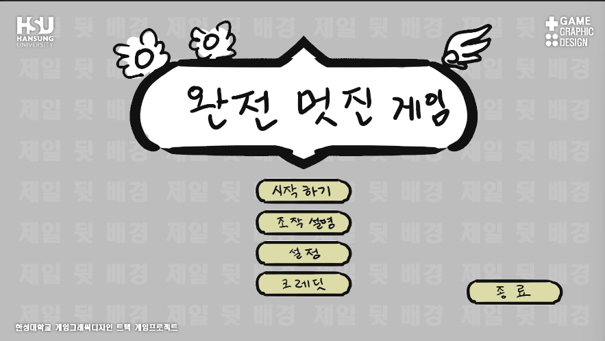
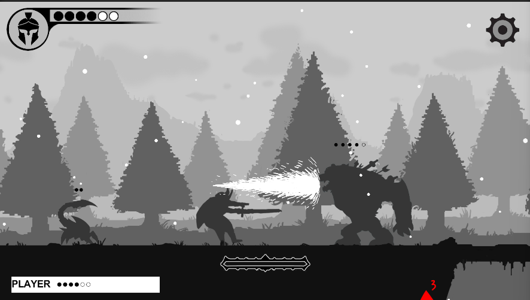
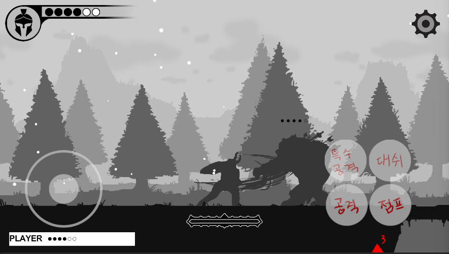

# 00. 수업 개요

이 수업에서 만드는 게임입니다. 게임을 켜면 타이틀 화면이 뜨고,



시작하면 스테이지에서 몬스터와 싸우게 됩니다.



같은 프로젝트로 **모바일(Android) 빌드**도 만듭니다. 모바일에서는 화면에 **터치 조작 UI가 자동으로** 나타납니다 - 따로 만드는 게 아니라 같은 게임이 기기에 맞춰 달라지는 것입니다.



> 위 화면들의 타이틀 로고·버튼·캐릭터·몬스터·배경은 **지금 프로젝트에 들어 있는 임시 그림**입니다. **15주 뒤에는 이 자리가 전부 여러분이 그린 그림으로 바뀝니다.** 게임의 구조와 동작은 그대로이고, 그림과 사운드만 각자 완전히 달라집니다.

## 이 수업의 목표

이 수업은 완성된 2D 사이드 스크롤 액션게임 템플릿에 학생 각자의 그래픽 리소스를 적용해서, **각자 다른 그림체의 완성된 게임**을 만드는 것을 목표로 합니다. 프로그래밍보다 아래 항목들을 실제로 경험하는 데 초점을 둡니다.

- 실무 관점에서 게임 리소스를 **제작·관리·적용**해보는 경험
- Unity, GitHub 등 게임/그래픽 실무에서 실제로 쓰이는 프로그램을 다뤄보는 경험
- 2D 액션 게임이 실제로 어떻게 만들어지는지 이해하고, 그 작업을 직접 체험
- **직접 실행되는 게임**을 처음부터 끝까지 완성해보는 경험
- 최종 완성된 결과물, 즉 **빌드 파일**을 직접 만들어보는 경험
- 여기서 익힌 구조를 바탕으로 **더 확장된 게임을 만들 수 있다는 가능성**을 체험
- 이후 게임 그래픽/인디 게임 개발자로서의 진로를 그려볼 수 있는 계기

## 수업 대상

- 그래픽 전공 2학년, **그래픽 툴 사용 가능한** 학생
- **2D 사이드 스크롤 액션 게임**에 대한 기본적인 이해가 있는 학생
- **게임 제작 툴과 파이프라인**을 경험하고 싶은 학생 (Unity / GitHub)
- **"내가 작업한 결과물이 실제로 작동되는 게임이 된다"** 는 것을 경험하고 싶은 학생

→ 그래서 이 문서들은 **Unity/GitHub를 처음 쓰는 사람 기준**으로 쓰여 있습니다. Unity·GitHub 설치와 첫 실행은 [01-① Unity 설치](01_시작하기1_유니티설치.md)부터 순서대로 시작하세요 (①~④ 4부작).

## 이 프로젝트의 기본 조건

- PC(Windows) + 모바일(Android), 해상도 1920x1080 기준
- 2D 사이드 스크롤 액션 게임
- 스테이지 1개, 약 3분 플레이 분량
- 패럴렉스(원근감 있는 여러 겹) 배경
- 주인공 1명, 몬스터 3종

## 확정된 게임 흐름

```
타이틀 화면 → 인트로 컷신 → 스테이지(전투) → 스테이지 클리어 화면 → 엔딩 컷신 → 타이틀로 복귀
                                    ↓
                              (사망 시) 사망 화면
```

기본으로 갖춰진 시스템:

- 플레이어 체력(HP) 표시, 스페셜 게이지
- 일시정지 메뉴 (설정/조작설명 포함)
- 사망 화면
- 스테이지 시작 배너 / 스테이지 클리어 화면
- HP 회복 아이템 박스
- 모바일 터치 컨트롤 - 같은 프로젝트로 Android 빌드까지 만듭니다 (11주차에 직접 다룹니다)

학생은 이 흐름과 시스템을 그대로 둔 채, **그래픽/사운드 리소스만 교체**해서 자신만의 게임을 완성합니다. 코드는 건드리지 않습니다.

## 최종 결과물

- Windows 실행 빌드 (게임 파일)
- 모바일 실행 빌드 (안드로이드 APK 파일)
- Unity 프로젝트 (GitHub 저장소)
- 플레이 영상 1개
- 최종발표용 PPT

자세한 제출 항목/방법은 [05_제출_가이드](05_제출_가이드.md)를 참고하세요.

## 더 해보고 싶다면 (심화)

**스테이지2와 스테이지3은 이미 완성된 채로 프로젝트에 들어 있습니다.** 기본 과제에서는 스테이지1만 쓰지만, 원하면 **설정 두 군데만 바꿔서 3스테이지 게임으로** 이어붙일 수 있습니다 - 그림을 새로 그릴 필요가 없습니다.

스테이지4 이상을 직접 만드는 것도 가능합니다 (몬스터 3종의 행동은 재사용하고 그림·사운드만 새로 만드는 방식).

둘 다 [W15 최종발표·심화](../주차별수업/W15_최종발표_심화.md)의 **파트 B**에서 다룹니다. **최종 제출을 마친 뒤에 하세요.**
