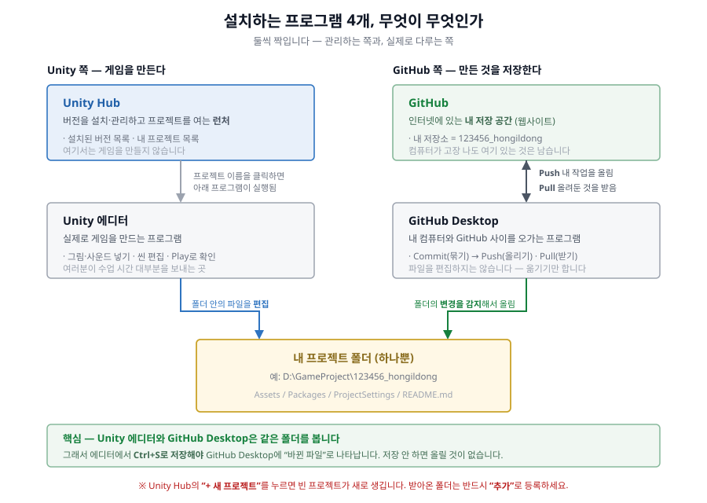
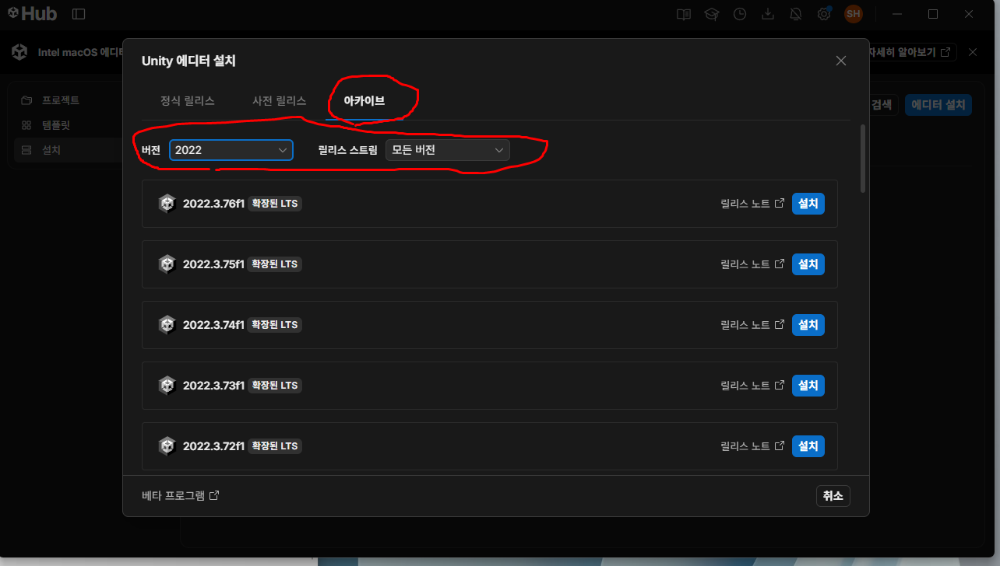
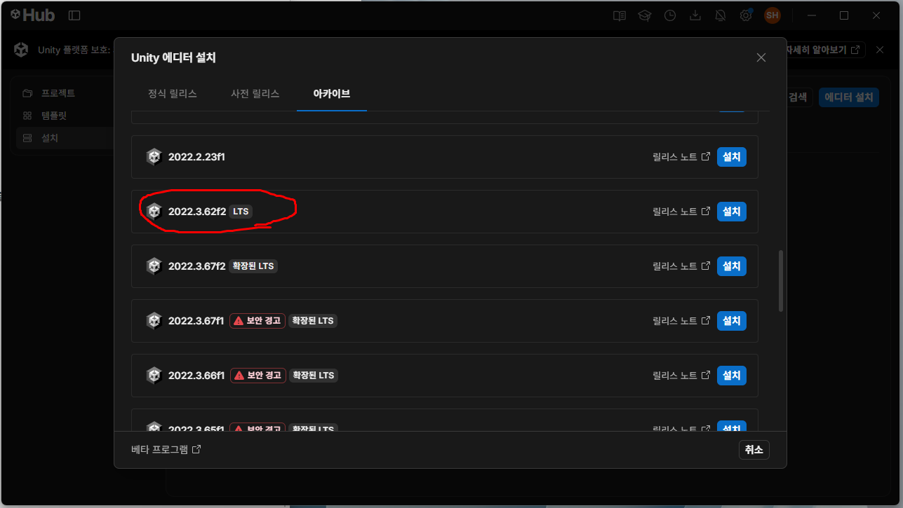
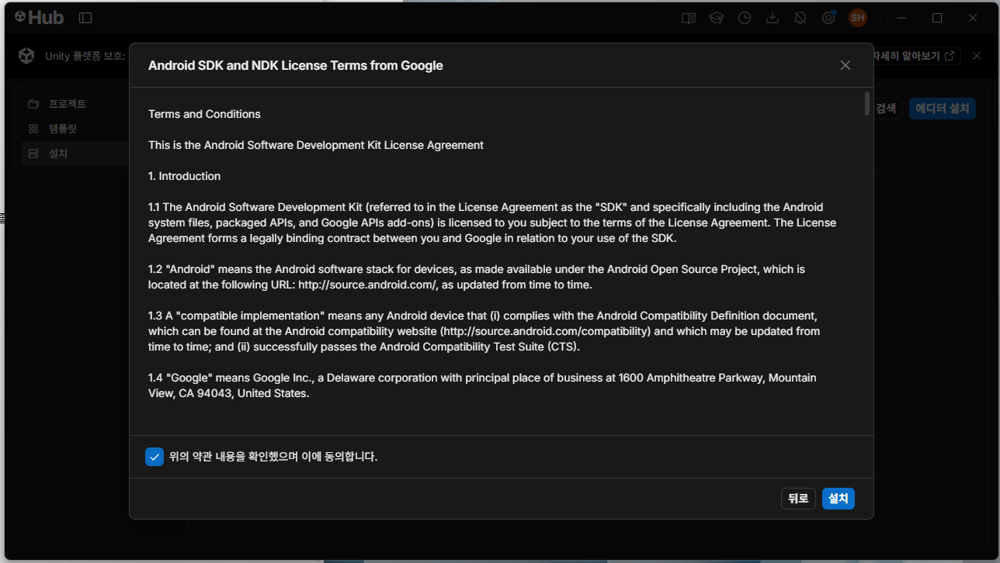
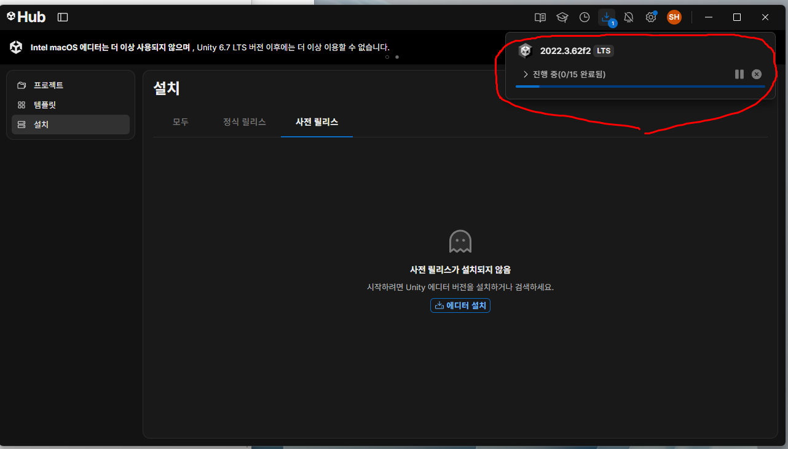
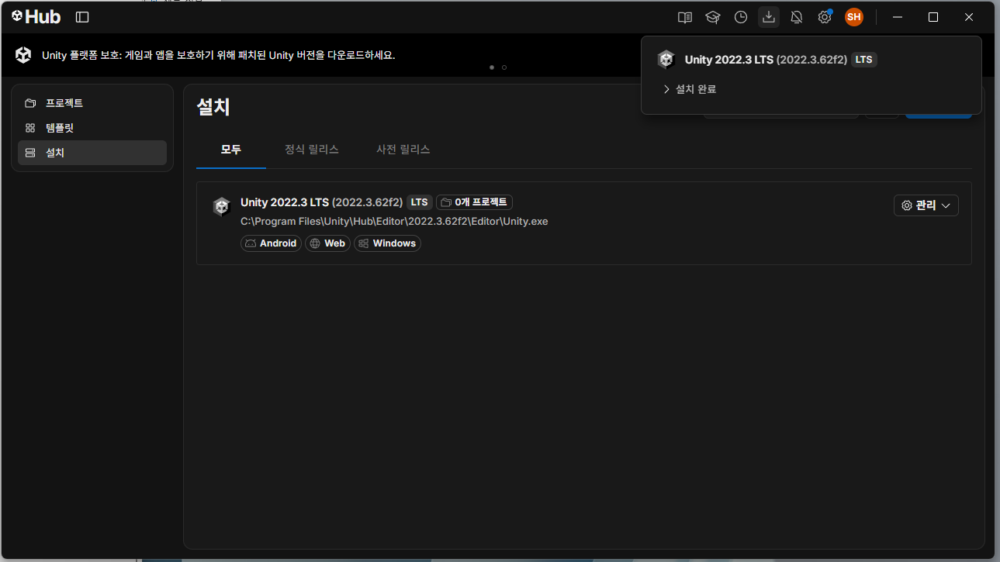

# 01-①. Unity 설치

> **시작하기 (4부작)** — **① Unity 설치** · [② GitHub 계정](01_시작하기2_깃허브계정.md) · [③ GitHub Desktop](01_시작하기3_깃허브데스크탑.md) · [④ 프로젝트 열기](01_시작하기4_프로젝트열기.md)

이 수업에서는 **Unity**(게임을 만들고 실행해보는 프로그램)와 **GitHub**(내 작업을 저장·관리하는 곳)를 처음 써봅니다. 둘 다 처음이어도 괜찮습니다 - 네 개의 문서를 **순서대로** 따라오시면 됩니다.

## 1. 설치할 프로그램

| 프로그램 | 용도 |
|---|---|
| **Unity Hub** | Unity 에디터 버전을 설치/관리하는 런처 프로그램 |
| **Unity 2022.3.62f2** (2022 LTS) | 실제로 게임을 편집하는 에디터 본체 - Unity Hub 안에서 설치 |
| **GitHub 계정** | 내 프로젝트를 올려둘 온라인 저장 공간 (무료) |
| **GitHub Desktop** | GitHub 저장소를 내 컴퓨터로 받고, 작업을 다시 올리는 프로그램 (터미널/명령어 없이 버튼으로 조작) |

이름이 비슷해서 처음에는 헷갈립니다. **둘씩 짝**이라고 생각하면 쉽습니다 - 관리하는 쪽과, 실제로 다루는 쪽.



### Unity Hub + Unity 설치

**1) Unity Hub 내려받기**

[unity.com/download](https://unity.com/download) 에서 Unity Hub를 내려받아 설치합니다. Hub는 Unity 본체가 아니라 **버전을 관리하는 런처**입니다.

**2) `아카이브` 탭 열기**

Unity Hub → 왼쪽 **`설치`** → 오른쪽 위 파란 **`에디터 설치`** 버튼 → **`아카이브`** 탭을 고르고, 아래 `버전`을 **`2022`**, `릴리스 스트림`을 **`모든 버전`** 으로 바꿉니다.



> `정식 릴리스` 탭에는 우리가 쓸 버전이 없습니다. **`사전 릴리스` 탭은 절대 쓰지 마세요** - 정식 출시 전 시험판(알파/베타)만 들어 있습니다.

**3) 목록에서 `2022.3.62f2` 찾아 `설치`**



> ⚠️ **반드시 끝이 `f2`** 인지 확인하세요. 숫자가 같은 **`62f1`은 [보안 문제가 있는 버전](https://unity.com/kr/security/sept-2025-01)** 입니다.
>
> 위 그림에서 보이듯 목록에는 **빨간 `보안 경고`** 표시가 붙은 버전들이 섞여 있습니다. 그 표시가 붙은 것은 고르면 안 됩니다. **우리가 쓸 `2022.3.62f2`에는 그 표시가 없습니다.**
>
> 목록에서 못 찾겠으면, 아래 주소를 브라우저 주소창에 붙여넣어도 바로 설치가 시작됩니다.
>
> ```
> unityhub://2022.3.62f2/7670c08855a9
> ```

**4) 모듈(추가 기능) 선택 - 아래 항목을 반드시 체크**


| 항목 | 왜 필요한가 |
|---|---|
| **Microsoft Visual Studio Community** | 코드를 열어볼 때 (기본 체크 유지) |
| **Windows Build Support (IL2CPP)** | 10주차 PC 빌드 - 목록을 아래로 내리면 있습니다 |
| **Android Build Support** | 11주차 모바일 |
| ↳ **OpenJDK** | Android 빌드에 필요 |
| ↳ **Android SDK & NDK Tools** | Android 빌드에 필요 |

> `Android Build Support` 왼쪽의 화살표를 펼쳐서 **하위 두 항목까지 같이 체크**해야 합니다. 이걸 빠뜨리면 나중에 모바일 빌드가 안 됩니다.
>
> `iOS` / `tvOS` / `visionOS` / `Linux`는 이 수업에서 쓰지 않습니다. 체크하지 마세요.

> ### 집 컴퓨터가 Mac인 경우
>
> **수업 진행에는 아무 문제가 없습니다.** Unity도, 이 프로젝트도, **PC용 빌드와 Android 빌드까지 Mac에서 그대로 됩니다.** 다만 체크할 항목 이름이 하나 다릅니다.
>
> | 항목 | Mac에서는 |
> |---|---|
> | Windows Build Support | 위 표의 **`(IL2CPP)`는 Mac 목록에 아예 없습니다.** 대신 **`Windows Build Support (Mono)`** 가 있으니 **그것을 체크**하세요. Mac에서 PC용 빌드를 만드는 항목은 이것 하나뿐입니다 |
> | Android Build Support | **같습니다.** 하위 두 항목까지 그대로 체크 |
> | Visual Studio | Mac에서는 이름이 다르거나 목록에 없을 수 있습니다. **코드를 열어보는 용도라 없어도 수업 진행에는 지장이 없습니다** |
>
> **iOS 빌드는 Mac이 있어도 이 수업에서 하지 않습니다.** 애플 개발자 등록(연 $99)이 따로 필요해서입니다 ([05. 제출 가이드](05_제출_가이드.md) 참고).
>
> ⚠️ **한 가지만 미리 알아두세요.** 만든 **PC 빌드를 Mac에서는 실행해볼 수 없습니다.** 제출 전에 Windows 컴퓨터에서 한 번 확인해야 하는데, 자세한 것은 [05. 제출 가이드](05_제출_가이드.md)에 적어두었습니다.

**5) Android 약관 동의**



Android 도구는 Google 약관 동의가 필요합니다. 맨 아래 체크박스를 켜고 **`설치`** 를 누르면 시작됩니다.

**6) 설치는 오래 걸립니다**



용량이 12GB가 넘습니다. **진행 상황은 오른쪽 위 다운로드 아이콘**에서 볼 수 있고, `0/15 완료됨` 처럼 표시됩니다.

- **15개 항목이 전부 끝나야 완료**입니다.
- 설치가 끝나기 전에는 `설치` 목록에 버전이 안 보이거나, 일부 기능만 붙은 채로 보입니다. **정상이니 기다리세요.**

**7) 완료 확인**



`설치` 목록에 **`Unity 2022.3 LTS (2022.3.62f2)`** 가 뜨고, 그 아래에 **`Android`, `Windows`** 배지가 붙어 있고, **`보안 경고` 표시가 없으면** 제대로 설치된 것입니다.


---

설치가 끝났으면 **[② GitHub 계정 만들고 프로젝트 받기](01_시작하기2_깃허브계정.md)** 로 넘어가세요.
