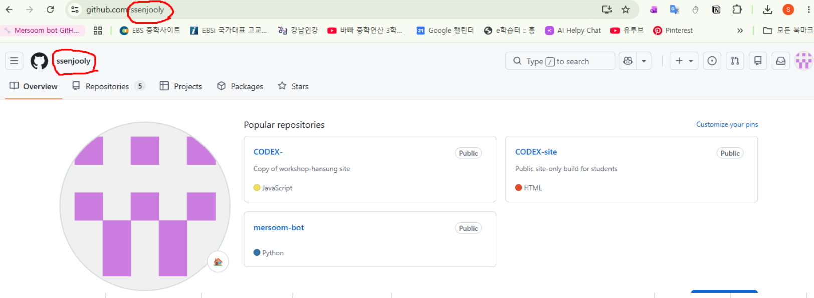
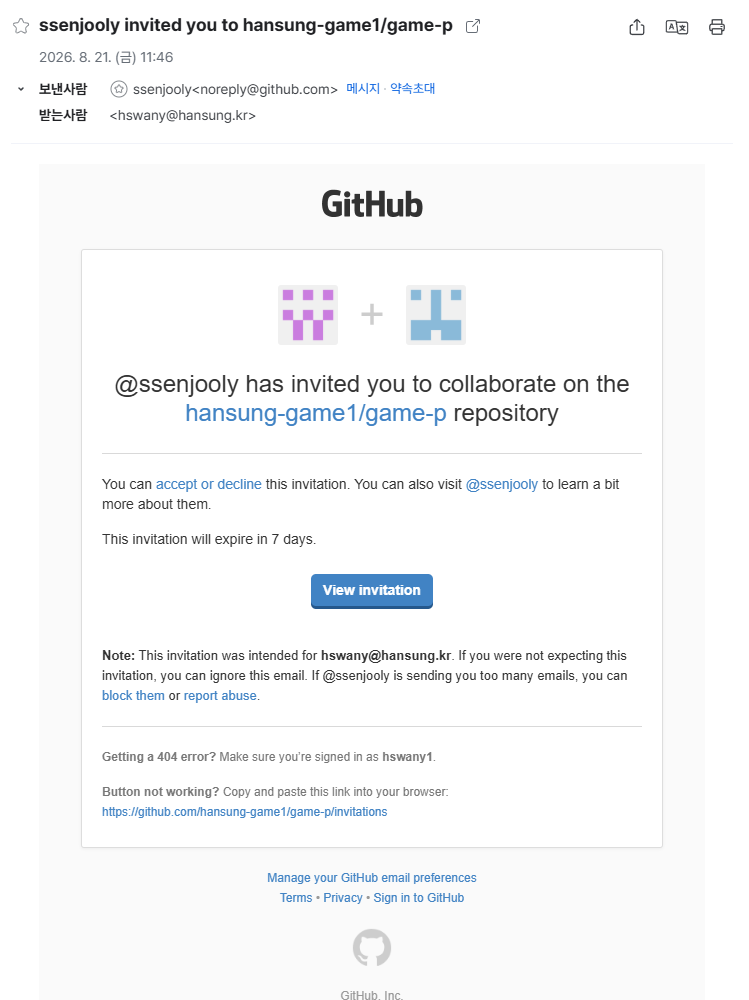
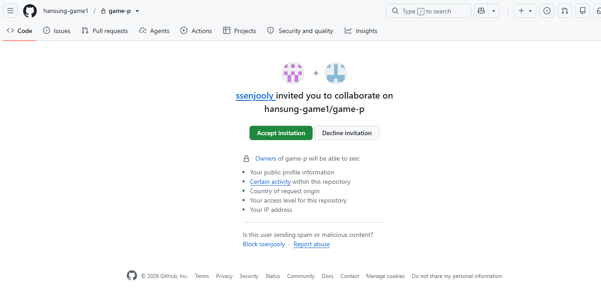
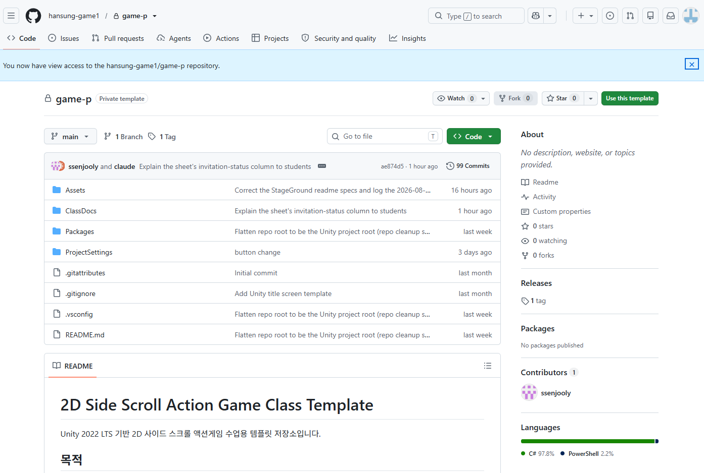
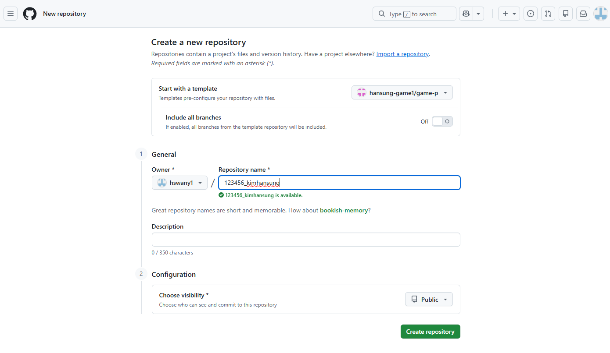
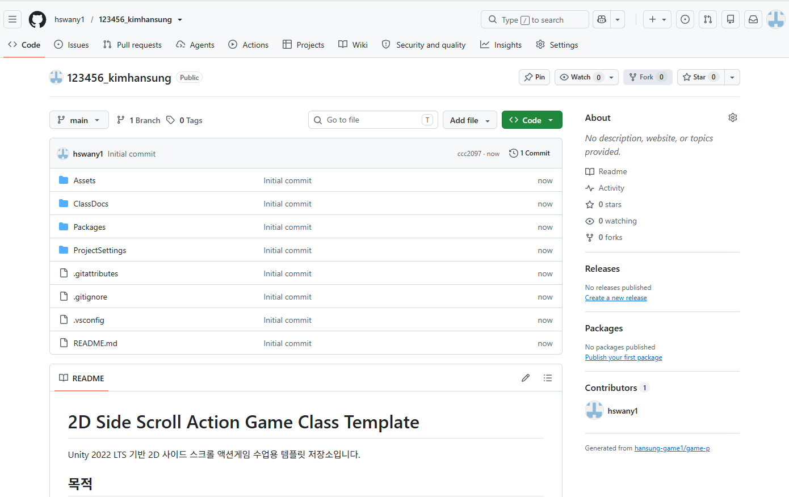
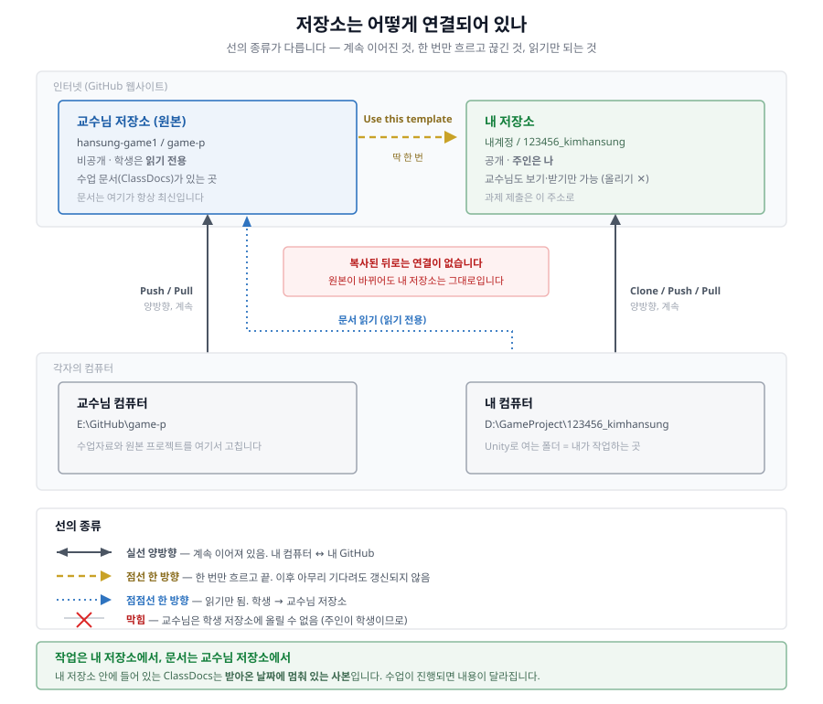

# 01-②. GitHub 계정 · 교수님 프로젝트 받기

> **시작하기 (4부작)** — [① Unity 설치](01_시작하기1_유니티설치.md) · **② GitHub 계정** · [③ GitHub Desktop](01_시작하기3_깃허브데스크탑.md) · [④ 프로젝트 열기](01_시작하기4_프로젝트열기.md)

**GitHub 계정을 만들고, 교수님 원본 저장소에 접근 권한을 받아, 내 저장소를 만드는 데까지** 다룹니다. 여기까지는 전부 **인터넷(웹사이트)에서** 일어나는 일입니다 - 내 컴퓨터로 파일을 받는 것은 다음 문서(③)입니다.

## 1. GitHub 계정 만들기

[github.com](https://github.com) 에서 계정을 만듭니다 (이미 있으면 생략).

## 2. 교수님 저장소에 접근 권한 받기 (계정 연동)

수업에서 사용하는 원본 프로젝트 저장소는 **비공개(Private)** 입니다. 주소를 알아도 **권한이 있는 계정으로 로그인한 상태**여야만 열립니다. 그래서 설치가 끝나면 먼저 **내 GitHub 계정을 교수님께 알려주고 초대를 받는 과정**이 필요합니다.

전체 흐름은 이렇습니다. **학생이 하는 일과 교수님이 하는 일이 번갈아 일어나고, 중간에 기다리는 구간이 있습니다.**


**1) 내 GitHub 계정 이름 확인하기**

교수님께 알려드려야 하는 것은 **계정 이름(username)** 입니다. 이메일 주소나 화면에 보이는 표시 이름이 아닙니다.

- [github.com](https://github.com) 로그인 → 오른쪽 위 **프로필 아이콘 클릭** → **Your profile**
- 그때 주소창에 뜨는 `https://github.com/`**`내계정이름`** 에서 뒷부분이 계정 이름입니다.



**두 군데에 같은 이름이 보입니다.** 위 그림에서는 `ssenjooly` 입니다 - 주소창의 `github.com/` **뒤**, 그리고 화면 **왼쪽 위**. 둘 중 아무 곳에서나 확인하면 됩니다.

> ⚠️ **화면에 크게 보이는 이름이 계정 이름이 아닐 수 있습니다.** 프로필에 별명(표시 이름)을 따로 지정한 사람은 그 별명이 위에 뜨고, 계정 이름은 그 아래 회색 글씨로 나옵니다. **주소창 쪽이 항상 정확합니다.**

**2) 구글 시트에 내 정보 적기**

아래 시트를 열어서 **표 맨 아래 빈 줄에 본인 정보를 한 줄** 적어주세요. 로그인이나 신청 없이 링크만 있으면 바로 작성할 수 있습니다.

### ▶ 시트 주소는 **LMS 수업 페이지**에 있습니다

> 이 문서는 **누구나 볼 수 있는 공개 문서**라, 여러분의 학번·이름이 들어가는 시트 주소는 여기에 적지 않습니다. **LMS(학교 수업 페이지)의 1주차 자료**에 링크가 있으니 그것을 이용하세요.

적는 형식 (예시):

| 수업과목명 | 학번 | 이름 | 깃허브 계정 |
|---|---|---|---|
| 2D게임제작 | 123456 | 김한성 | hanseong-kim |

> - 계정 이름을 잘못 적으면 초대가 엉뚱한 사람에게 가거나 아예 오지 않습니다. **주소창에서 눈으로 확인한 그대로** 대소문자까지 정확히 적어주세요.
> - 시트는 **모두가 같이 쓰는 문서**입니다. 본인 줄만 작성하고, **다른 사람이 적은 줄은 지우거나 고치지 마세요.**
> - 맨 오른쪽 **`깃허브 계정 초대 확인`** 칸은 **교수님이 적는 칸**입니다. 학생은 비워두세요. 대신 **내 줄의 그 칸에 표시가 생겼다면 초대가 나갔다는 뜻**이니, 그때 메일함(과 GitHub 알림)을 확인하면 됩니다.

**3) 초대 수락하기**

교수님이 초대를 보내면 **가입할 때 쓴 이메일로 초대 메일**이 옵니다.



- 메일 안의 **`View invitation`** 버튼을 누릅니다.
- 메일이 안 보이면(스팸함 포함) [github.com](https://github.com) 로그인 상태에서 **오른쪽 위 종 모양 알림 아이콘**을 확인하거나, **[교수님 저장소](https://github.com/hansung-game1/game-p)** 로 직접 들어가면 화면 위쪽에 수락 버튼이 뜹니다.

> ⏰ **초대는 7일 뒤에 만료됩니다.** 메일을 받으면 미루지 말고 바로 수락하세요. 만료되면 교수님께 다시 요청해야 합니다.

버튼을 누르면 이 화면이 나옵니다. **`Accept invitation`** 을 누르면 끝입니다.



> ⚠️ **수락하기 전에 저장소 주소로 들어가면 `404 - Page not found` 가 뜹니다.** 주소가 틀린 게 아니라 아직 볼 권한이 없다는 뜻입니다. 초대를 수락한 다음 다시 들어가면 정상적으로 보입니다.

**4) 확인**

수락하면 바로 저장소 페이지로 들어갑니다. 화면 위에 **"You now have view access…"** 안내가 뜨고 파일 목록이 보이면 성공입니다.



오른쪽 위의 초록색 **`Use this template`** 버튼이 다음 단계에서 쓸 버튼입니다. 이제 아래 2번으로 진행하세요.

> 이 권한은 **읽기 전용(Read)** 입니다. 원본 저장소에는 아무것도 올릴 수 없고, 실수로 원본을 건드릴 걱정도 없습니다. 여러분이 실제로 작업할 저장소는 다음 단계에서 **내 계정 아래에 따로** 만들게 됩니다.

## 3. 프로젝트 받아오기 (인터넷 안에서 내 저장소 만들기)

**"받아온다"는 말이 두 번 나옵니다.** 먼저 인터넷 안에서 내 저장소를 만들고(①), 그 다음에 그것을 내 컴퓨터로 내려받습니다(②). 이 둘을 헷갈리면 "받았는데 폴더가 어디 있죠?"가 됩니다.


아래 **교수님 원본 저장소**로 접속해서 진행합니다.

### ▶ [https://github.com/hansung-game1/game-p](https://github.com/hansung-game1/game-p)

> **위 2번의 초대를 수락한 뒤에만 열립니다.** 아직 수락 전이라면 `404 - Page not found`가 뜨는데, 주소가 틀린 게 아니라 **볼 권한이 아직 없다는 뜻**입니다.

1. 저장소 페이지에서 초록색 **"Use this template"** 버튼 클릭 → **"Create a new repository"** 선택.
2. 저장소 이름을 **`학번_영문이름`** 형식으로 짓고, 공개 설정을 **`Public`으로 선택**한 뒤 내 계정 아래에 새 저장소를 만듭니다.
   - 예: **`123456_kimhansung`**
   - ⚠️ **이름에 한글을 쓰지 마세요.** 영문·숫자·`_`·`-` 만 사용합니다. 저장소 이름이 **그대로 내 컴퓨터의 폴더 이름**이 되는데, 경로에 한글이 들어가면 Unity가 파일을 제대로 못 읽는 문제가 생길 수 있습니다.
   - 이렇게 만들어진 저장소는 교수님 원본과 별개인 **내 것**입니다. 이후 내가 무엇을 바꾸든 원본에는 영향이 없습니다.
   - **`Public`을 꼭 확인하세요.** 원본이 비공개라서 처음엔 `Private`가 선택되어 있습니다. `Private`로 만들면 나중에 제출한 링크를 교수님이 열 수 없습니다.
   - `Public`은 **누구나 볼 수 있다**는 뜻이지 누구나 고칠 수 있다는 뜻이 아닙니다. 수정 권한은 **소유자인 나에게만** 있습니다.
   - 잘못 만들었어도 나중에 바꿀 수 있습니다: 내 저장소 → **Settings** → 맨 아래 **Danger Zone** → **Change visibility**.



아래처럼 만들어지면 성공입니다. 저장소 이름 옆에 **`Public`** 표시가 있고, 오른쪽 아래에 **`Generated from ...`** 문구가 보입니다. 폴더 4개(`Assets`, `ClassDocs`, `Packages`, `ProjectSettings`)가 다 들어와 있는지 확인하세요.



> 인터넷에 공개되는 공간이라는 점만 기억하세요. **개인정보**(실명 외 연락처·주소 등)나 **출처가 불분명한 남의 그림·폰트·음원**은 넣지 마세요.
3. 이제 이것을 **내 컴퓨터로 내려받습니다.** 아래 "내 컴퓨터로 내려받기(Clone)"를 따라 하세요.

**내 컴퓨터로 내려받는 과정은 [③ GitHub Desktop](01_시작하기3_깃허브데스크탑.md) 문서에서 이어집니다.**

### ★ 중요 - 작업은 내 저장소에서, 문서는 교수님 저장소에서

여기서 만들어진 내 저장소는 **교수님 원본을 "그 순간 복사해온 것"** 입니다. USB로 파일을 복사해 받은 것과 같아서, **이후 교수님이 원본을 고쳐도 내 저장소는 그대로입니다.** 서로 연결되어 있지 않습니다.



그래서 **내 저장소 안에 들어 있는 `ClassDocs` 폴더의 문서는 받아온 날짜에 멈춰 있는 사본**입니다. 수업이 진행되면서 문서에는 설명이 추가되고 잘못된 부분이 수정됩니다.

| | 어디를 보나 |
|---|---|
| **작업** (그림·사운드 넣고 Unity에서 확인) | **내 저장소** (내 컴퓨터의 프로젝트 폴더) |
| **수업 문서 읽기** | **[교수님 저장소](https://github.com/hansung-game1/game-p)** — 항상 여기가 최신입니다 |

> 내 폴더 안의 문서를 보고 "설명이 수업 때랑 다른데요?" 하는 일이 매년 나옵니다. **문서는 아래 주소를 즐겨찾기 해두고 거기서 보세요.**
>
> ```
> https://github.com/hansung-game1/game-p
> ```
>
> 학기 중에 교수님이 코드나 도구를 고치는 경우도 있습니다. 그때는 "이 파일을 받아서 덮어쓰세요"라고 따로 안내하니, 그때만 그 파일을 내려받아 같은 위치에 덮어쓰면 됩니다. 프로젝트를 통째로 다시 받을 필요는 없습니다.


---

이제 **[③ GitHub Desktop으로 내 컴퓨터에 받기](01_시작하기3_깃허브데스크탑.md)** 로 넘어가세요.
