# 01-③. GitHub Desktop - 내 컴퓨터로 받기 · 작업 올리기

> **시작하기 (4부작)** — [① Unity 설치](01_시작하기1_유니티설치.md) · [② GitHub 계정](01_시작하기2_깃허브계정.md) · **③ GitHub Desktop** · [④ 프로젝트 열기](01_시작하기4_프로젝트열기.md)

**GitHub Desktop을 설치하고, ②에서 만든 내 저장소를 실제로 내 컴퓨터에 내려받고, 앞으로 매주 반복할 저장(Commit·Push)까지** 다룹니다. 학기 내내 가장 자주 쓰게 될 내용입니다.

## 1. GitHub Desktop 설치

[desktop.github.com](https://desktop.github.com) 에서 GitHub Desktop을 내려받아 설치하고, **②에서 만든 내 GitHub 계정으로 로그인**합니다.

## 2. 내 컴퓨터로 내려받기 (Clone)

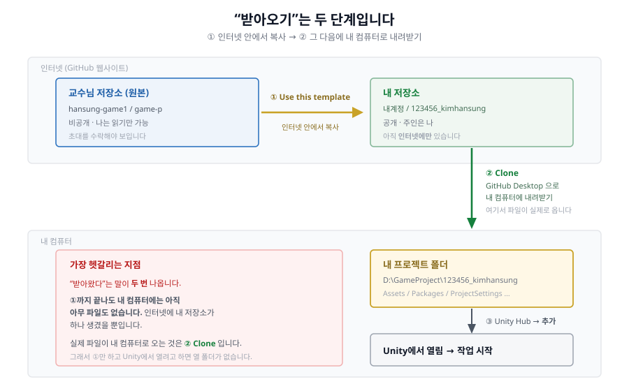


여기까지는 **인터넷에만** 내 저장소가 생긴 상태입니다. **내 컴퓨터에는 아직 아무 파일도 없습니다.** GitHub Desktop으로 실제 파일을 가져옵니다.

> ⚠️ **저장소 페이지의 초록색 `Code` 버튼 → `Download ZIP`으로 받지 마세요.** ZIP에는 GitHub와의 연결 정보(`.git`)가 빠져 있어서, 그렇게 받은 폴더는 **Commit도 Push도 Pull도 할 수 없습니다.**
>
> 문제는 **Unity로는 멀쩡히 열린다**는 것입니다. 받는 순간에는 성공한 것처럼 보이고, 몇 주 뒤 제출할 때가 되어서야 알게 됩니다. **그동안 백업이 하나도 없는 상태**가 됩니다. 반드시 아래 `Clone`으로 받으세요.

**1) GitHub Desktop을 켭니다**

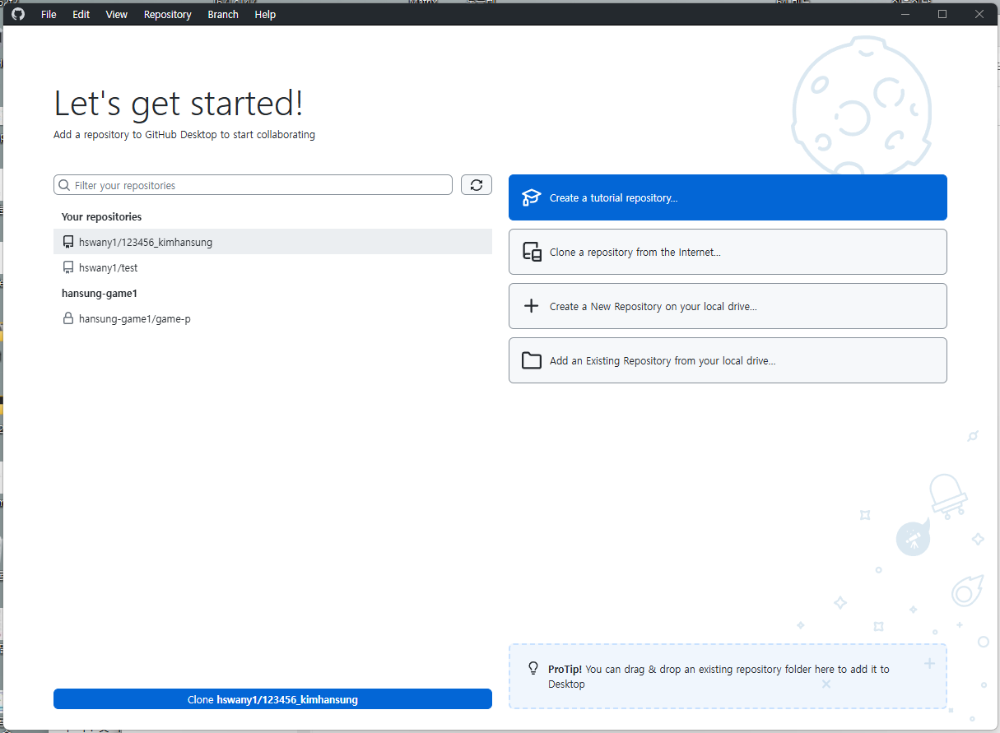

로그인만 되어 있으면 **왼쪽에 내 저장소 목록이 이미 나와 있습니다.**

**2) 왼쪽 목록에서 내 저장소를 고르고, 아래 파란 버튼을 누릅니다**

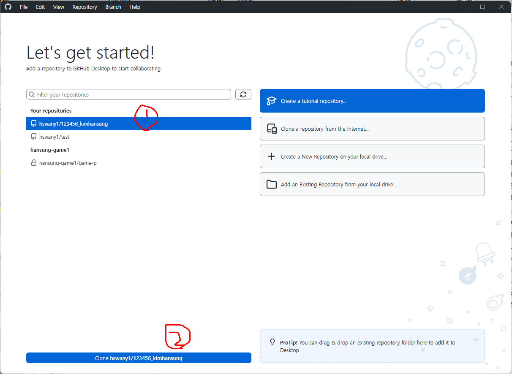

- ① `Your repositories` 아래에서 **내 저장소**(`학번_영문이름`)를 클릭
- ② 맨 아래 파란 **`Clone 내계정/저장소이름`** 버튼 클릭

> ⚠️ **목록에는 교수님 원본(`hansung-game1/game-p`)도 같이 보입니다.** 위 그림처럼 **`hansung-game1` 이라는 제목 아래에 자물쇠(🔒) 표시와 함께** 따로 묶여 나옵니다. 그건 읽기 전용이라 내려받아도 나중에 내 작업을 올릴 수 없습니다. **반드시 위쪽 `Your repositories` 아래의 내 저장소**를 고르세요.
>
> 잘못 고르면 나중에 Push할 때 `Do you want to fork this repository?` 창이 뜹니다.

**3) 저장할 위치(`Local path`)를 정합니다 - 여기가 제일 중요합니다**

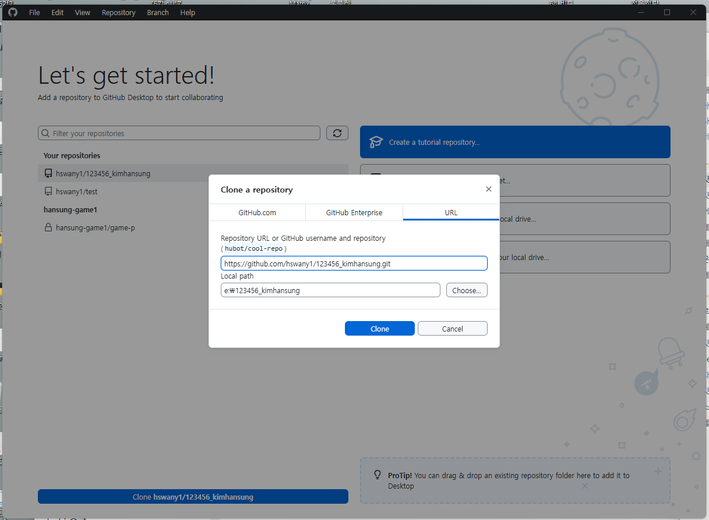

주소는 자동으로 채워져 있습니다. **`Local path`(내 컴퓨터의 어느 폴더에 받을지)** 만 정하면 됩니다.

- **한글이 들어간 경로는 피하세요** (Unity가 파일을 못 읽는 문제가 생길 수 있습니다)
- **OneDrive / 구글드라이브 동기화 폴더, 바탕화면도 피하세요** - Unity가 파일을 쓰는 도중 동기화가 끼어들어 프로젝트가 깨집니다
- `E:\123456_kimhansung` 처럼 **짧고 영문인 경로**를 권장합니다. 없는 폴더면 알아서 만들어 줍니다

**4) `Clone`을 누르면 내려받기가 시작됩니다**

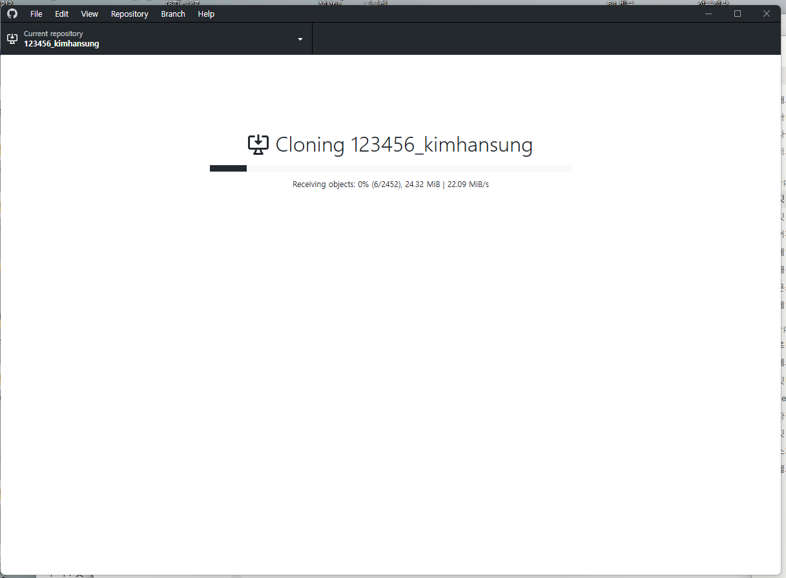

프로젝트가 크기 때문에 **몇 분 걸릴 수 있습니다.** 끝날 때까지 기다리세요.

**5) 완료 - 이제 내 컴퓨터에 있습니다**

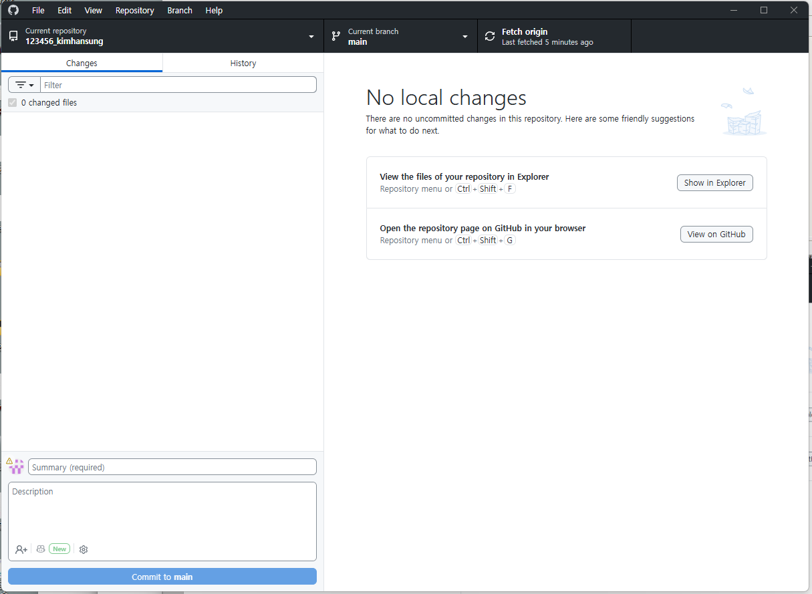

왼쪽 위 **`Current repository`** 에 내 저장소 이름이 잡히면 성공입니다.

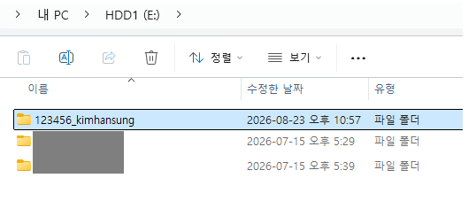

**지정한 위치에 실제로 폴더가 만들어져 있습니다.** 이 폴더가 앞으로 계속 작업할 나의 프로젝트 폴더입니다. **폴더 이름이나 안쪽 구조를 임의로 바꾸지 마세요.**

### 참고 - 저장소를 고르는 다른 방법들

위 방법이 가장 간단하지만, 화면이 다르게 보이거나 목록에 안 뜰 때를 위해 알아두면 좋습니다. **셋 다 같은 `Clone a repository` 창으로 갑니다.**

**방법 2 - 오른쪽 메뉴에서**

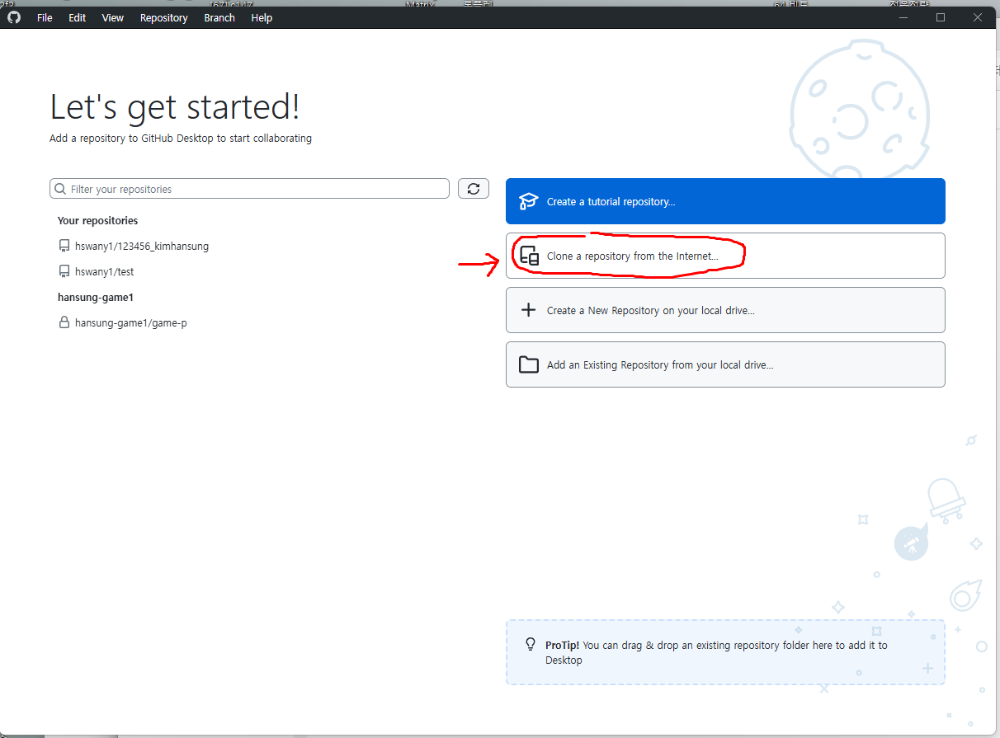

오른쪽 **`Clone a repository from the Internet...`** 을 눌러도 됩니다. 이미 저장소를 하나 열어둔 상태라면 상단 메뉴 **`File → Clone repository`** 도 같습니다.

**방법 3 - `GitHub.com` 탭에서 고르기**

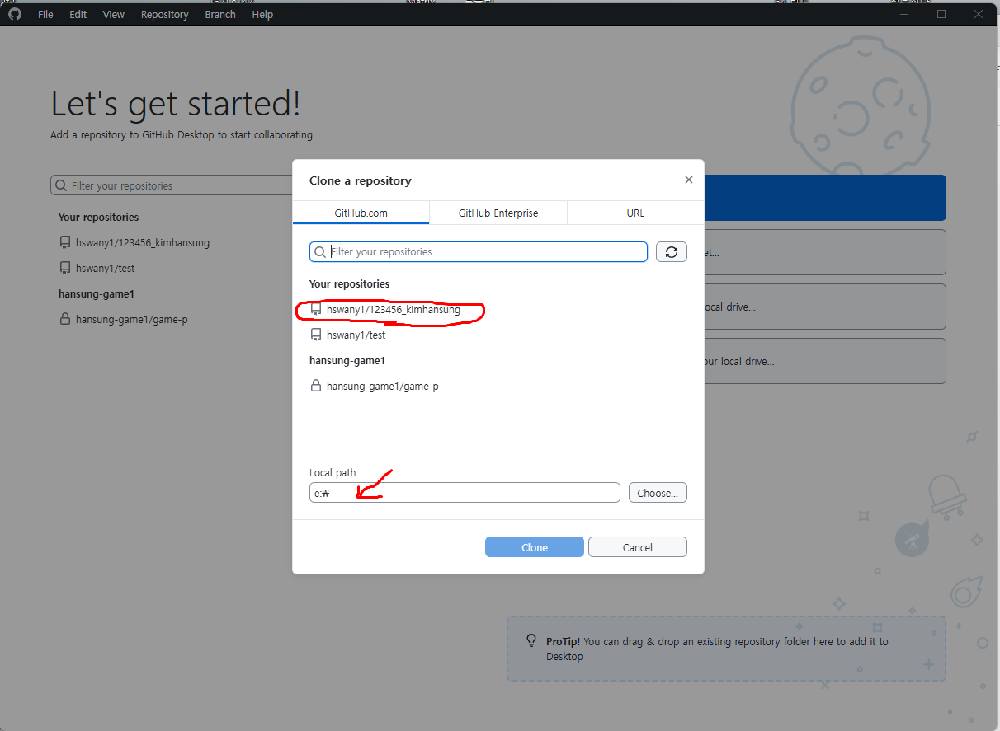

`Clone a repository` 창의 **`GitHub.com`** 탭에도 내 저장소 목록이 나옵니다. 여기서 골라도 됩니다.

**방법 4 - 주소를 직접 입력 (`URL` 탭)**

목록에 안 뜰 때 쓰는 방법입니다. 내 저장소 주소는 **브라우저 주소창**에서 그대로 확인할 수 있습니다.

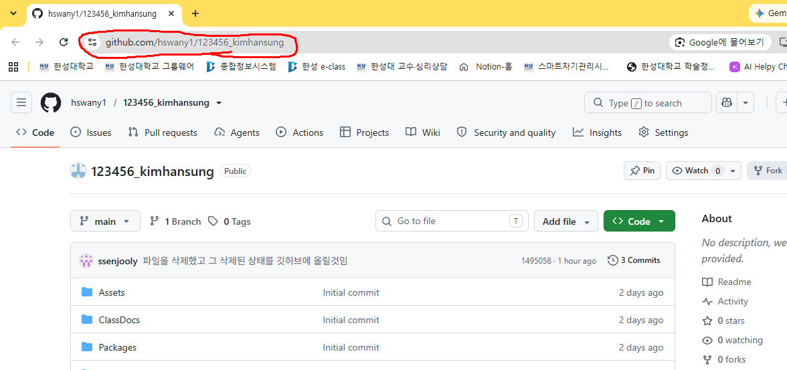

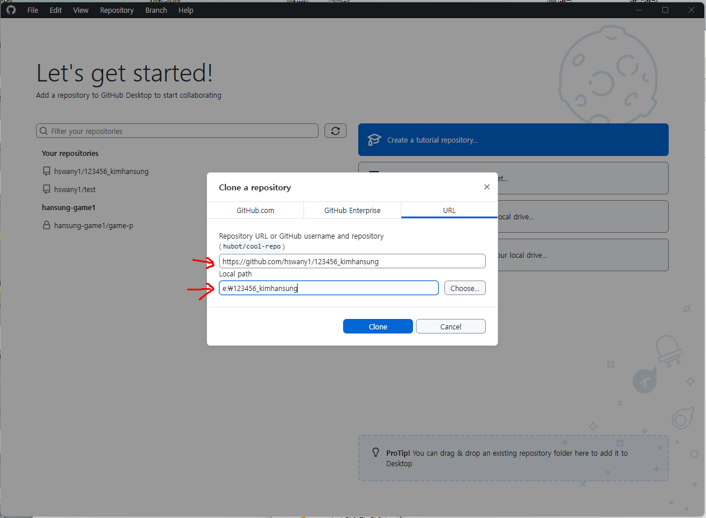

`URL` 탭에 그 주소를 넣고, 똑같이 `Local path`를 정한 뒤 `Clone`.

> **왼쪽 목록에 내 저장소가 안 보인다면** 로그인한 계정이 다른 것일 수 있습니다. **`File → Options → Accounts`** 에서 내 계정으로 로그인되어 있는지 확인하세요.

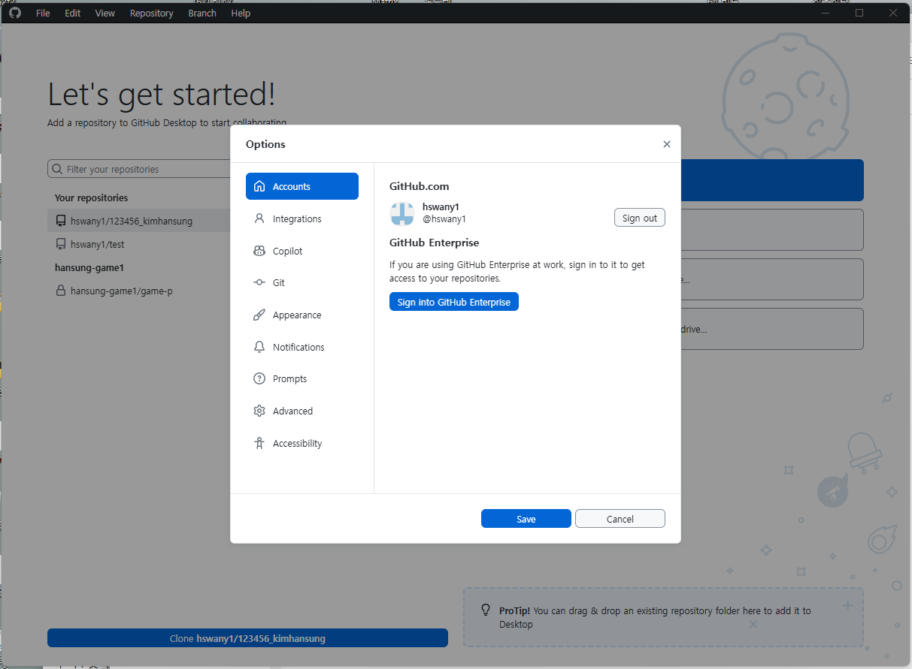

---

### ⚠️ 이미 받아둔 폴더가 있다면 - Clone이 아니라 `Add`

**한 번 받아둔 뒤에 GitHub Desktop 목록에서 사라진 경우**가 있습니다. 목록에서 지웠거나, 로그아웃했다가 다시 로그인했거나, GitHub Desktop을 다시 설치한 경우입니다.

**이때 다시 Clone하면 이런 빨간 글씨가 뜹니다.**

```
This folder contains files. Git can only clone to empty folders.
(이 폴더에 파일이 들어 있습니다. Clone은 빈 폴더에만 됩니다.)
```

**고장이 아닙니다. Clone을 할 필요가 없다는 뜻입니다.**

내 컴퓨터의 그 폴더는 **이미 완전한 저장소**입니다. GitHub와의 연결 정보(`.git`)도 그대로 들어 있습니다. **목록에서 사라진 것은 GitHub Desktop이 기억하던 바로가기뿐**입니다.

**다시 등록만 하면 됩니다.**

```
File → Add local repository...  →  그 폴더 선택  →  Add repository
```

> 탐색기에서 **그 폴더를 GitHub Desktop 창에 끌어다 놓아도** 바로 등록됩니다.

| | `Clone` | `Add local repository` |
|---|---|---|
| 하는 일 | 인터넷에서 **새로 내려받아** 폴더를 만듦 | **이미 있는 폴더**를 목록에 등록만 함 |
| 빈 폴더가 필요한가 | **필요** (그래서 위 에러가 납니다) | 불필요 |
| 언제 | **처음 한 번** | 목록에서 사라졌을 때 |

> ⚠️ **다른 이름의 새 폴더를 만들어 Clone하지 마세요.** 되기는 하지만 **같은 프로젝트가 컴퓨터에 두 벌** 생깁니다. 어느 쪽에서 작업했는지 헷갈리고, 한쪽에만 작업하다가 다른 쪽을 올리는 사고가 납니다.


## 3. 앞으로 작업 저장하는 법 - 저장 → Commit → Push

**이 부분이 처음에는 제일 헷갈립니다.** Commit도 있고 Summary도 있고 Push도 있는데, 하나만 빠뜨려도 "올린 줄 알았는데 안 올라간" 상태가 됩니다. 먼저 전체 그림부터 보세요.

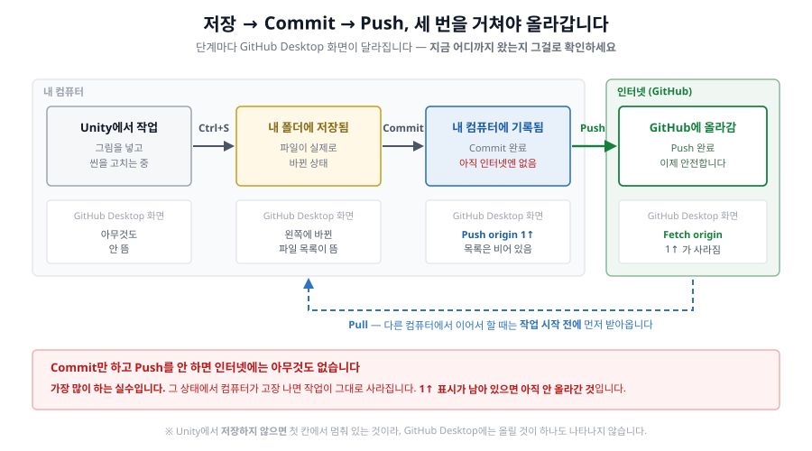

핵심은 **내 작업이 세 번을 거쳐야 인터넷에 도달한다**는 것입니다.

| 단계 | 무엇을 하나 | 안 하면 |
|---|---|---|
| **저장** (`Ctrl+S`) | Unity에서 파일로 저장 | GitHub Desktop에 **아무것도 안 뜹니다** |
| **Commit** | 바뀐 파일들을 한 묶음으로 기록 | 올릴 것이 만들어지지 않습니다 |
| **Push** | 그 기록을 GitHub로 올림 | **내 컴퓨터에만 있습니다** |

### Summary · Commit · Push - 각각 무슨 뜻인가

말이 셋이나 나와서 헷갈리는데, **GitHub Desktop에게 시키는 말**이라고 생각하면 쉽습니다.

| 용어 | 쉽게 말하면 | 조금 더 정확히 |
|---|---|---|
| **Summary** (필수) | **"이번에 뭘 했는지 한 줄로 적기"** | 파일에 변동이 생겼을 때 적습니다 - 새로 만들었거나, 고쳤거나, 지웠거나. **비워두면 다음 단계로 못 넘어갑니다** |
| **Commit** | **"이런 게 바뀌었으니 올릴 준비를 해줘"** | 바뀐 것들을 **하나의 묶음으로 내 컴퓨터에 기록**합니다. 나중에 되돌릴 때 **이 묶음 단위로** 돌아갑니다 |
| **Push** | **"이제 진짜로 GitHub 웹에 올려줘"** | 기록해둔 묶음을 인터넷의 내 저장소로 보냅니다. **여기까지 해야 올라갑니다** |

> **Summary를 잘 적어야 하는 이유**: 나중에 "언제 것으로 되돌릴까"를 고를 때 이 한 줄만 보고 판단합니다. `수정`, `1` 처럼 적어두면 나중에 본인도 못 알아봅니다. **`몬스터A 걷기 프레임 교체`** 처럼 적으세요.

---

## 4. 실습 - 파일 하나로 왕복해보기

**글로 읽는 것보다 한 번 해보는 게 빠릅니다.** 테스트 파일 `test.txt`를 하나 만들어 올렸다가, 다시 지우는 것까지 해봅니다. **올릴 때와 지울 때의 순서가 완전히 똑같다**는 것을 확인하는 것이 이 실습의 목적입니다.

### 먼저 - 세 곳이 각각 무슨 역할인가

이것만 잡고 가면 나머지는 따라옵니다.

| 곳 | 은행에 비유하면 | 여기서 하는 일 |
|---|---|---|
| **내 컴퓨터** (프로젝트 폴더) | 내 책상 | **파일을 만들고 · 고치고 · 지웁니다.** 실제 작업은 전부 여기서만 |
| **GitHub Desktop** | 은행 직원 | 책상에서 뭐가 바뀌었는지 **금고에 전달합니다** |
| **GitHub 사이트** | 은행 금고 | 보관된 결과를 **눈으로 확인만** 합니다 |

### 시작 - 아무것도 안 바꾼 상태

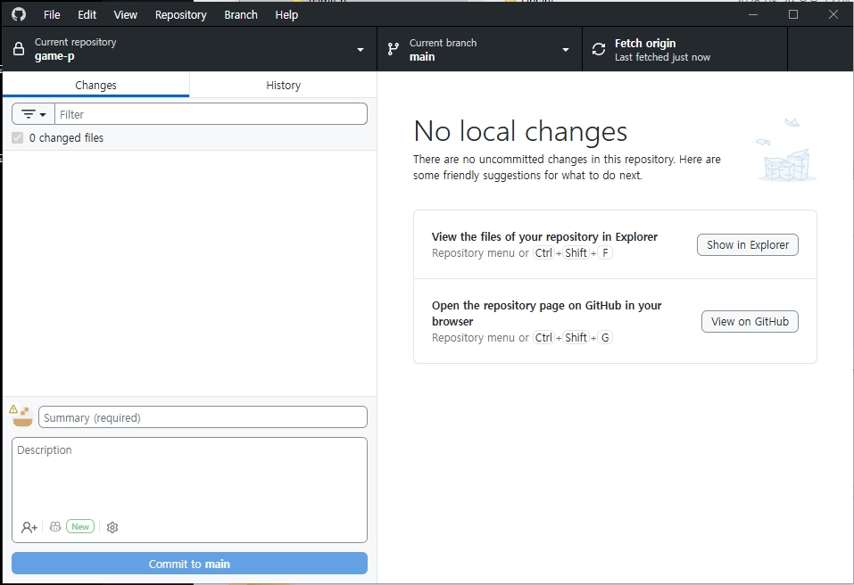

`No local changes`, `0 changed files` = **올릴 것이 없다**는 뜻입니다. 왼쪽 위 **`Current repository`가 내 저장소인지** 항상 먼저 확인하세요.

---

### 가는 길 - 파일을 만들어서 올린다

#### ① 내 컴퓨터 - 프로젝트 폴더에 `test.txt`를 만든다

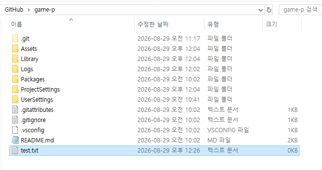

메모장으로 **빈 파일 하나면 됩니다.** 테스트니까 속은 비어 있어도 상관없습니다(그림에서도 크기가 `0KB`입니다). 위치는 프로젝트 폴더(`game-p`) 안이면 됩니다.

#### ② GitHub Desktop - 바뀐 것을 확인하고 Summary를 적는다

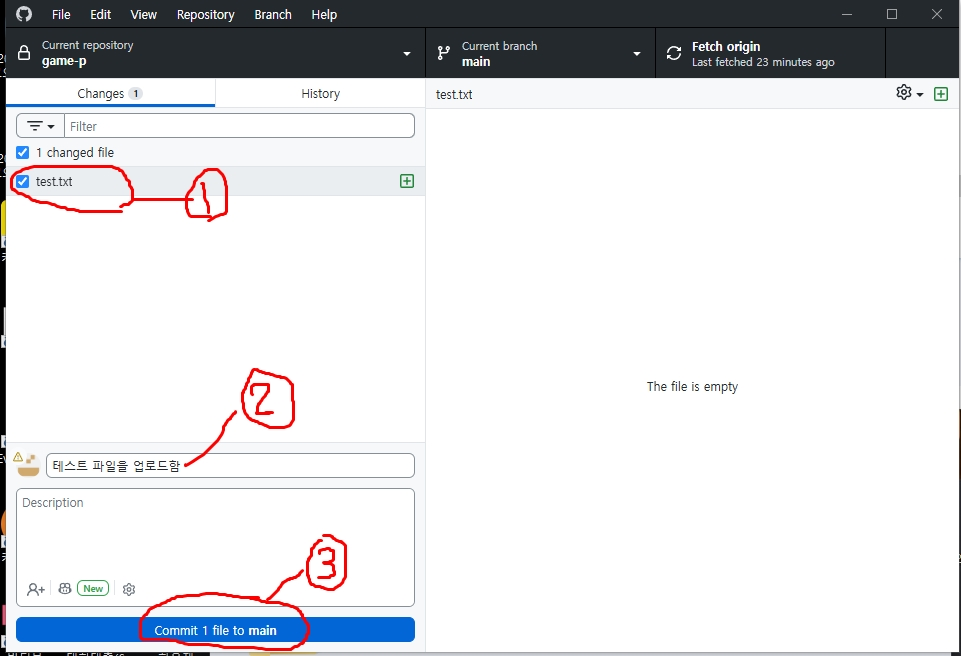

**①** 왼쪽에 **`1 changed file`** 과 `test.txt`가 뜹니다. 초록색 **`+`** 는 **새로 생긴 파일**이라는 표시입니다. 내가 파일을 만들었을 뿐인데 GitHub Desktop이 알아서 알아챈 것입니다.

**②** **`Summary`** 칸에 이번에 뭘 했는지 한 줄 적습니다. 그림에서는 `테스트 파일을 업로드함`.

> **왜 적어야 하나요?** 나중에 "언제 것으로 되돌릴까"를 고를 때 **이 한 줄만 보고 판단**합니다. `수정`, `1` 처럼 적으면 나중에 본인도 못 알아봅니다. **비워두면 아래 버튼이 아예 안 눌립니다.**

**③** **`Commit 1 file to main`** 을 누릅니다.

> **커밋이 뭔가요?** 바뀐 것들을 **하나의 묶음으로 내 컴퓨터에 기록**하는 것입니다. **아직 인터넷에는 안 올라갑니다.** 되돌릴 때는 이 묶음 단위로 돌아갑니다.

#### ③ GitHub Desktop - 커밋되면 올릴 준비가 된다

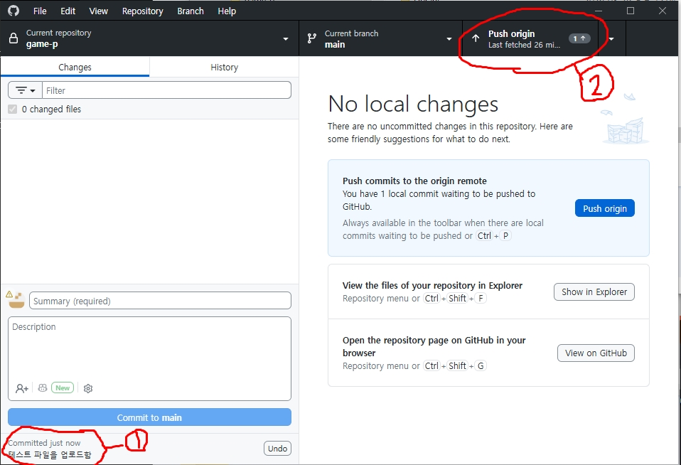

**①** 왼쪽 아래에 **`Committed just now`** 와 방금 적은 Summary가 보입니다. 변경 목록은 **`0 changed files`** 로 비었습니다.

**②** 위쪽이 **`Push origin`** 으로 바뀌고 **`1↑`** 가 붙습니다. **올릴 커밋이 1개 기다리고 있다**는 뜻입니다.

> ⚠️ **여기가 함정입니다.** 이 상태는 아직 **내 컴퓨터에만** 있습니다. 지금 컴퓨터가 고장 나면 그대로 사라집니다.
>
> 잘못 커밋했다면 오른쪽 아래 **`Undo`** — 커밋만 취소되고 **파일 내용은 그대로 남습니다.**

> **푸시가 뭔가요?** 기록해둔 묶음을 **인터넷의 내 저장소로 실제로 보내는 것**입니다. **여기까지 해야 올라갑니다.**

#### ④ GitHub Desktop - `Push origin`을 누르면 화면이 깨끗해진다


**`1↑`가 사라지고 `Fetch origin`으로 돌아왔으면 성공입니다.** 바뀐 파일도 없고 올릴 것도 없는 이 화면이 **"다 올라간 상태"** 입니다. 맨 처음 화면과 같아 보이는 게 정상입니다.

#### ⑤ GitHub 사이트 - 진짜 올라갔는지 눈으로 확인

오른쪽의 **`View on GitHub`**(또는 `Ctrl` + `Shift` + `G`)를 누르면 브라우저로 내 저장소가 열립니다.

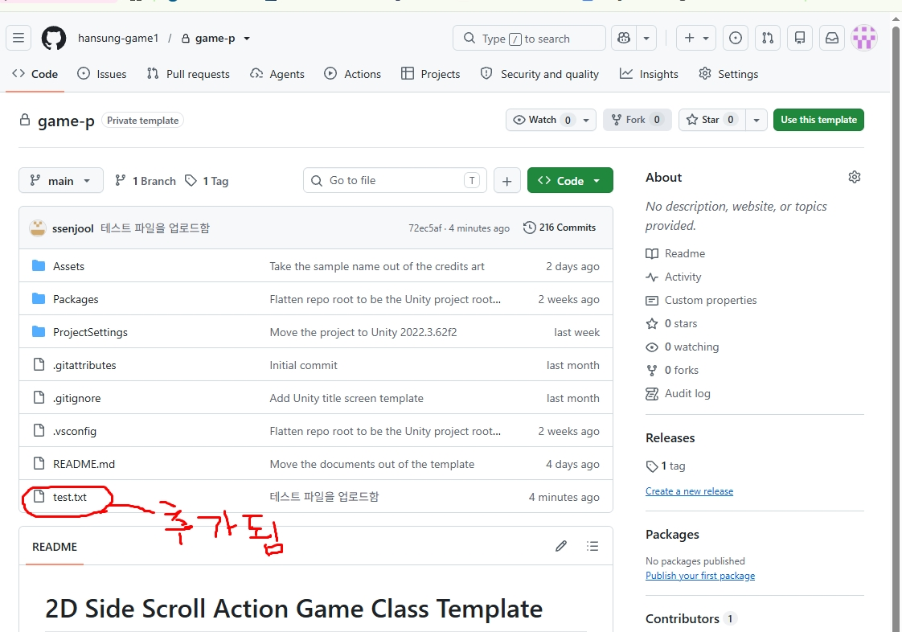

**`test.txt`가 목록에 보이고, 옆에 방금 적은 Summary가 그대로 나오면 성공입니다.** 여기까지 왔으면 내 컴퓨터와 GitHub가 같은 상태입니다.

---

### 오는 길 - 파일을 지운다 (순서가 똑같습니다)

#### ① 내 컴퓨터 - `test.txt`를 지운다

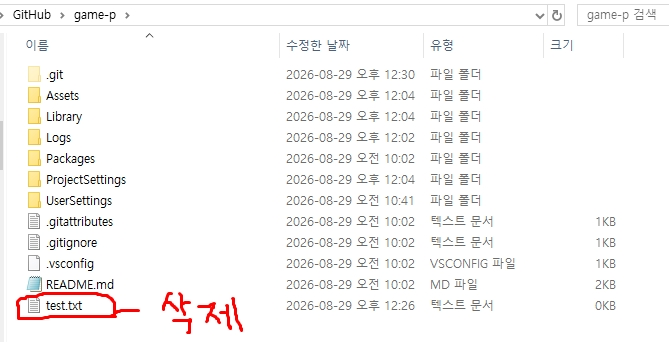

내 폴더에서 그 파일을 지웁니다. **지웠다고 GitHub에서도 자동으로 없어지지 않습니다.**

#### ② GitHub Desktop - 삭제도 똑같이 "바뀐 것"으로 잡힌다

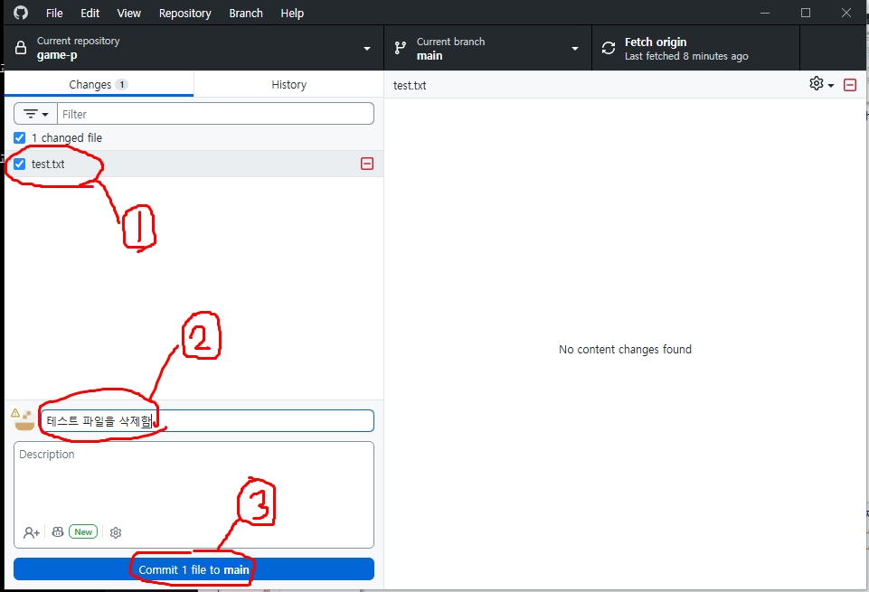

**①** 지운 파일이 **변경 목록에 뜨는 것은 정상입니다.** GitHub Desktop이 *"전에는 있었는데 다시 보니 이게 지워졌군요"* 하고 알아챈 것입니다. 빨간 **`-`** 는 **지워진 파일**이라는 표시입니다(새로 만든 파일은 초록 `+`).

**②** Summary를 적습니다. 그림에서는 `테스트 파일을 삭제함`.

**③** **`Commit 1 file to main`**.

> **목록에 떴다고 그 파일을 올리는 게 아닙니다.** 실제로 없는 파일이니 올릴 것도 없습니다.
>
> 올라가는 것은 **"이 파일을 지웠다"는 사실**입니다. *"내 컴퓨터에서 `test.txt`를 지웠어 → 그러니까 GitHub 사이트에서도 지워줘"* 라고 알려주는 것이고, **이 과정을 거쳐야 실제로 사이트에서도 지워집니다.**

#### ③ GitHub Desktop - 커밋되면 올릴 준비가 된다

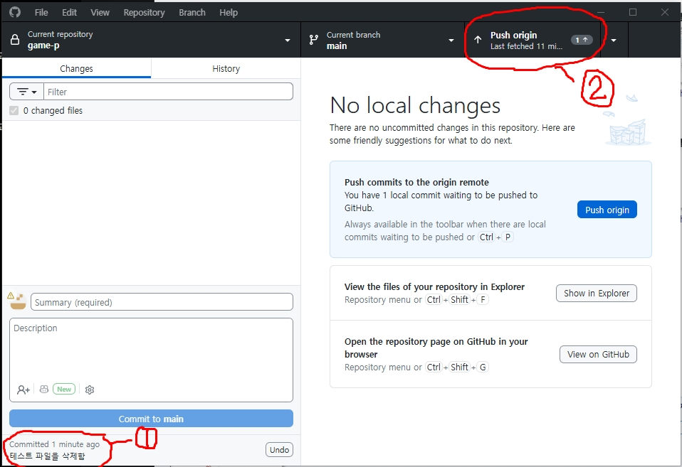

올릴 때와 똑같습니다 — **①** `Committed 1 minute ago`, **②** `Push origin`에 `1↑`.

#### ④ GitHub Desktop - `Push origin`을 누르면 화면이 깨끗해진다

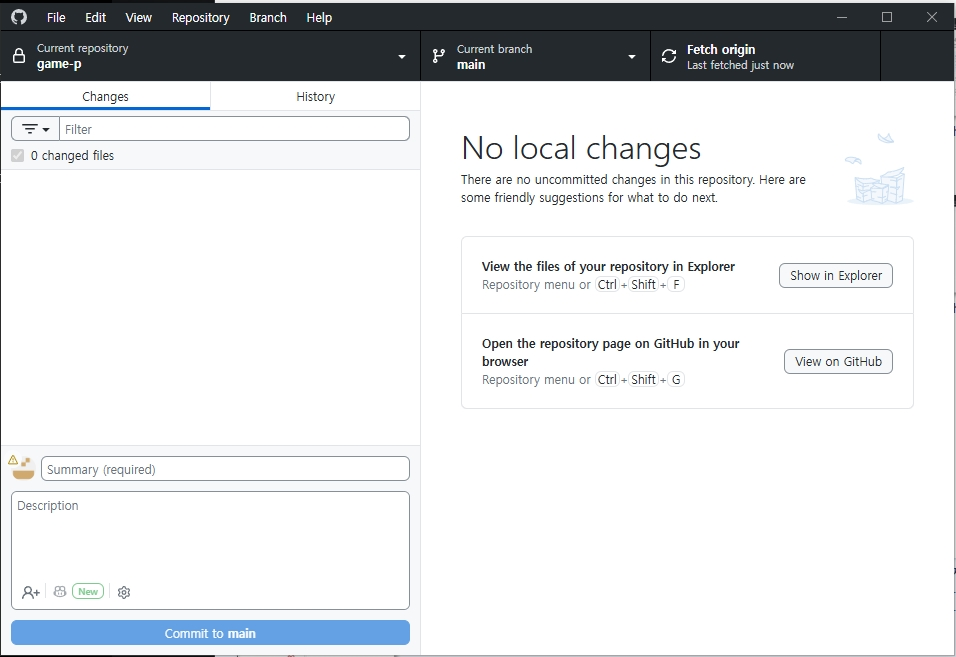

#### ⑤ GitHub 사이트 - 진짜 지워졌는지 눈으로 확인

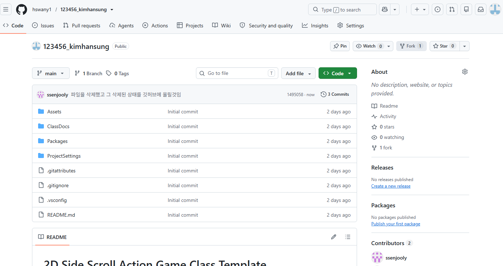

**목록에서 `test.txt`가 안 보이면 성공입니다.** 이제 내 컴퓨터와 GitHub가 다시 같은 상태입니다.

---

### ⚠️ 꼭 지킬 것 네 가지

이 네 가지만 지키면 학기 내내 꼬이지 않습니다.

**1. GitHub 사이트에서 파일을 직접 만들거나 지우지 마세요.**
**은행 금고에 본인이 직접 손을 넣는 것과 같습니다.** 사이트에 `Add file` 같은 버튼이 보여도 우리 수업에서는 쓰지 않습니다. 웹에서 직접 고치면 내 컴퓨터와 상태가 어긋나서 나중에 반드시 꼬입니다.

**2. 파일을 만들고 · 고치고 · 지우는 것은 오직 내 컴퓨터에서 합니다.**
프로젝트가 설치된 그 폴더가 유일한 작업 장소입니다.

**3. 그 사실을 금고에 알리는 것은 오직 GitHub Desktop을 통해서 합니다.**
알리는 행위가 바로 **Summary 작성 → Commit → Push** 세 단계입니다. 은행 직원을 거치지 않고 금고가 알아서 아는 일은 없습니다.

**4. Commit · Push 했으면 반드시 사이트에서 확인하세요.**
추가든 수정이든 삭제든, **눈으로 보기 전까지는 끝난 것이 아닙니다.** 이 확인 습관 하나가 "올린 줄 알았는데 안 올라간" 사고를 전부 막아줍니다.

> 저장소를 만들거나 `Settings`에서 공개 설정을 바꾸는 것은 **파일 편집이 아니니** 웹에서 하는 게 맞습니다. 1번이 막는 것은 **파일을 건드리는 일**입니다.

### 정리

- **추가 · 수정 · 삭제 전부 똑같습니다.** 무엇을 하든 **Summary → `Commit` → `Push`** 를 거쳐야 GitHub에 반영됩니다.
- **`1↑` 표시가 남아 있으면 아직 안 올라간 것입니다.**
- 다른 컴퓨터에서 이어서 작업한다면, 시작하기 전에 **`Pull origin` 먼저** (아래 5번).
- 이 과정을 자주 해두면, 컴퓨터가 고장 나거나 파일을 망가뜨려도 이전 상태로 되돌릴 수 있습니다.

> ⚠️ **`Do you want to fork this repository?` 라는 창이 뜬다면** 내 저장소가 아닌 것(주로 교수님 원본)을 클론한 것입니다. **`Cancel`을 누르고**, `Use this template`으로 만든 **내 저장소**를 다시 클론하세요.
---

## 5. 학교와 집, 두 컴퓨터에서 작업하기 (Pull)

학교에서 하던 작업을 집에서 이어서 하는 경우입니다. **매년 사고가 제일 많이 나는 지점이라 따로 떼어 설명합니다.**

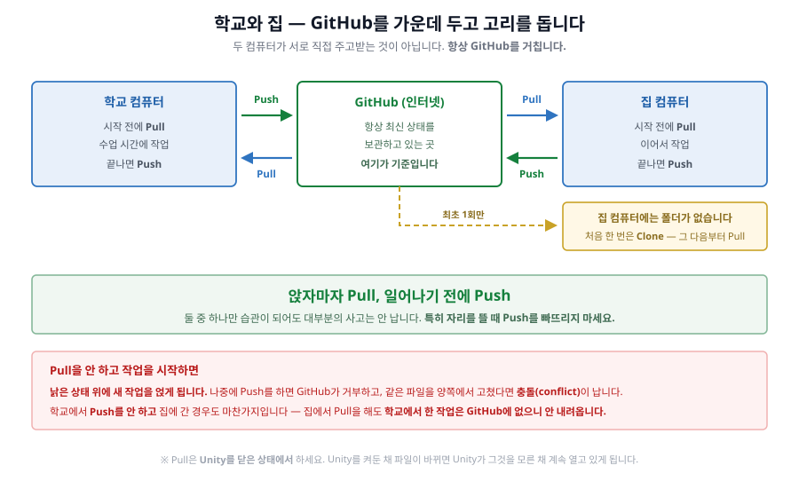

두 컴퓨터가 서로 직접 파일을 주고받는 것이 아닙니다. **학교 → GitHub → 집** 순서로 한 바퀴 돕니다. 그래서 지켜야 할 것은 두 마디뿐입니다.

**앉자마자 `Pull`, 일어나기 전에 `Push`.**

### 집 컴퓨터에서 처음 한 번 - Clone

집 컴퓨터에는 아직 프로젝트 폴더 자체가 없습니다. 위의 **2번 「내 컴퓨터로 내려받기」** 를 그 컴퓨터에서 한 번 더 하면 됩니다.

1. 집 컴퓨터에 GitHub Desktop 설치
2. **학교에서 쓴 것과 같은 GitHub 계정**으로 로그인 (계정이 다르면 내 저장소가 목록에 안 보입니다)
3. 목록에서 내 저장소(`학번_영문이름`)를 골라 Clone

저장 폴더 위치는 학교와 달라도 상관없습니다. 다만 **한글이 없는 짧은 경로**라는 조건은 여기서도 똑같습니다.

> ⚠️ **USB로 폴더를 복사해오지 마세요.** 프로젝트 폴더 안에는 `.git`이라는 **숨김 폴더**가 있고, GitHub와의 연결 정보가 전부 여기에 들어 있습니다. 복사하다가 이게 빠지면 **GitHub와 연결이 끊긴 폴더**가 되어 Commit도 Push도 할 수 없습니다. Clone이 훨씬 빠르고 확실합니다. **웹의 `Download ZIP`도 같은 이유로 안 됩니다**(2번의 경고 참고).

> 집에서 **처음 Unity로 열 때도** 학교에서처럼 **몇 분~십수 분** 걸립니다. Unity가 만드는 `Library` 폴더는 GitHub에 올라가지 않고 컴퓨터마다 새로 만들어지기 때문입니다. 고장이 아니니 기다리세요.

### 두 번째부터 - 시작하기 전에 Pull

Clone은 처음 한 번뿐입니다. 그 다음부터는 **GitHub Desktop을 열고 `Pull origin`을 누르는 것**으로 하루를 시작합니다. **Unity는 닫아둔 채로** 하세요.

**① 받아올 것이 있으면 화면이 이렇게 됩니다**

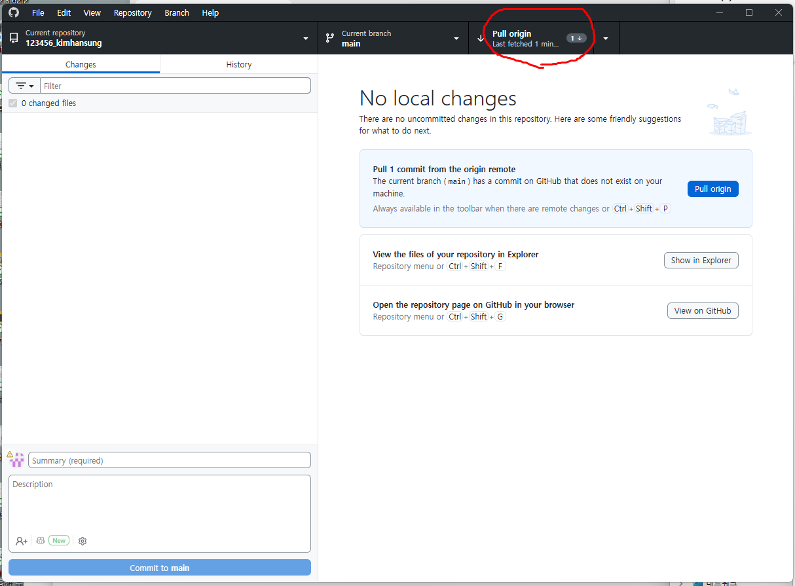

위쪽 버튼이 **`Pull origin`** 으로 바뀌고 옆에 **`1↓`**(내려받을 커밋 1개)가 붙습니다. 가운데에도 같은 안내가 나오니 **둘 중 아무 쪽을 눌러도 됩니다.**

> **`1↓`는 "내려받을 것", `1↑`는 "올릴 것"입니다.** 화살표 방향으로 구분하세요. 둘 다 떠 있다면 **`Pull`을 먼저** 하고 그 다음에 Push합니다.

**② 누르면 몇 초 만에 끝납니다**


버튼이 **`Fetch origin`** 으로 돌아오고 숫자가 사라졌습니다. **이제 이 컴퓨터가 최신 상태입니다.** 여기서 Unity를 열면 됩니다.

> 버튼이 처음부터 `Fetch origin`이면 **받을 게 없다는 뜻**입니다. 다만 GitHub Desktop이 수시로 확인해주는 것은 아니라서, **일단 `Fetch origin`을 한 번 눌러보세요.** 받을 것이 있으면 그때 `Pull origin`으로 바뀝니다.

**③ 무엇이 내려왔는지 확인 - `History` 탭**

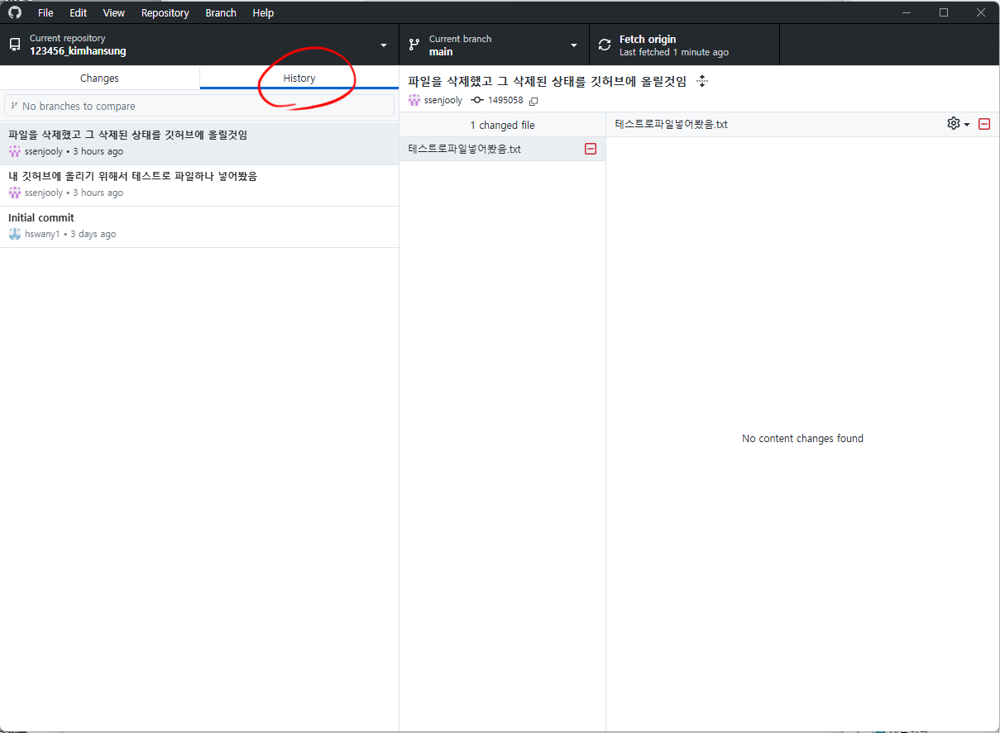

`Changes` 옆의 **`History`** 탭에는 **지금까지의 작업 기록이 최신순으로** 쌓여 있습니다. 하나를 고르면 오른쪽에 **그때 어떤 파일이 바뀌었는지**가 나옵니다.

**Summary에 적은 한 줄이 여기 그대로 보입니다.** 나중에 "언제 것으로 되돌릴까"를 이 목록만 보고 고르게 되니, Summary를 제대로 적어야 하는 이유가 이것입니다. 맨 아래 `Initial commit`은 저장소를 처음 만든 시점입니다.

### 하루 작업의 순서

| 언제 | 할 일 |
|---|---|
| **앉자마자** | GitHub Desktop → `Pull origin` (안 떠 있으면 `Fetch origin` 눌러 확인) |
| 그 다음 | Unity를 열고 작업 |
| 작업 중 | 수시로 `Ctrl+S` |
| **일어나기 전에** | Commit → Push → **`1↑`가 사라진 것까지 확인** |

### Pull을 빠뜨리면 무슨 일이 생기나

- **Push가 거부됩니다.** GitHub가 "네가 가진 것이 낡았다"며 받아주지 않습니다. 그 자리에서 `Pull`을 하면 대개 그대로 해결됩니다.
- **같은 파일을 양쪽에서 고쳤다면 충돌(conflict)이 납니다.** 이때는 GitHub Desktop이 어느 쪽을 남길지 물어봅니다.
  - **그림·사운드 파일**이면 어느 쪽을 살릴지 고르면 끝입니다.
  - **씬(`.unity`)이나 프리팹(`.prefab`)이 충돌했다면 직접 손대지 말고 교수님께 가져오세요.** 잘못 건드리면 씬이 깨집니다.

> 💡 **가장 확실한 예방책은 "일어나기 전에 Push"입니다.** 충돌은 **양쪽 모두에 안 올린 작업이 있을 때** 생깁니다. 자리를 뜰 때마다 Push해두면 애초에 생기지 않습니다.

> ⚠️ **학교에서 Push를 안 하고 집에 갔다면, 집에서 Pull을 해도 그 작업은 안 내려옵니다.** GitHub에 올라간 적이 없기 때문입니다. Pull이 만능인 게 아니라 **Push가 먼저**입니다.

### Unity는 닫고 Pull 하세요

Unity를 켜둔 채로 Pull을 하면, 파일은 바뀌었는데 **Unity는 그것을 모른 채 옛 내용을 계속 열고 있게 됩니다.** 그 상태에서 저장하면 방금 받아온 것을 도로 덮어씁니다.

**Unity 닫기 → Pull → Unity 열기.** 이 순서를 지키세요.

---

마지막으로 **[④ Unity에서 프로젝트 열기](01_시작하기4_프로젝트열기.md)** 로 넘어가세요.
