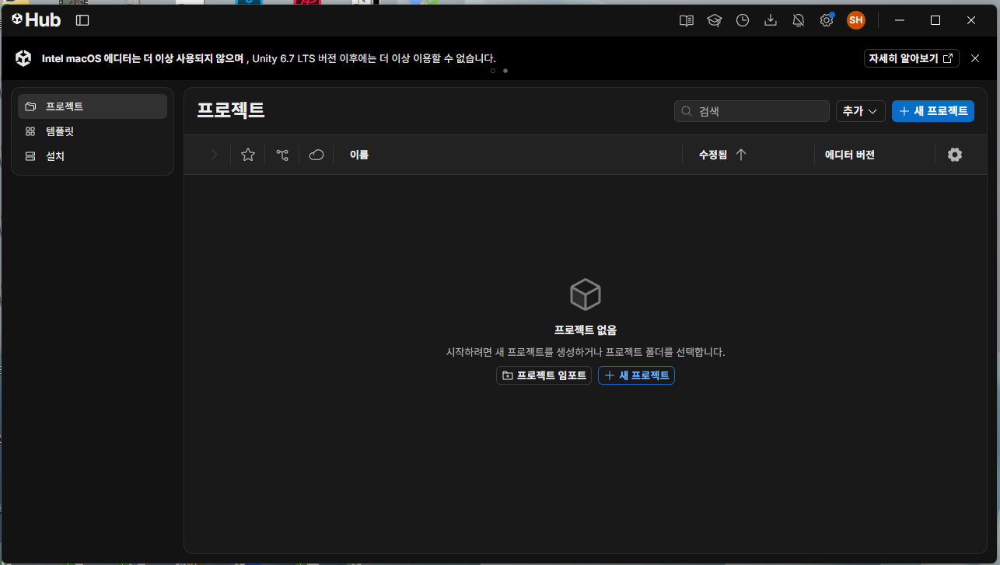
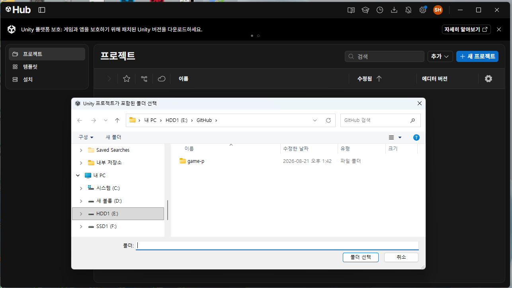
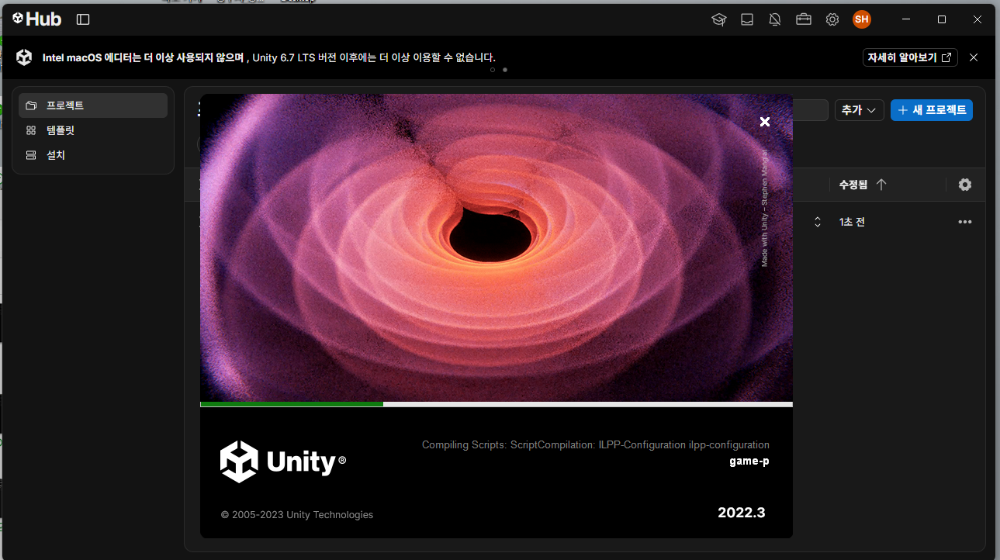

# 01-④. Unity에서 프로젝트 열기

> **시작하기 (4부작)** — [① Unity 설치](01_시작하기1_유니티설치.md) · [② GitHub 계정](01_시작하기2_깃허브계정.md) · [③ GitHub Desktop](01_시작하기3_깃허브데스크탑.md) · **④ 프로젝트 열기**

③에서 내 컴퓨터에 받아온 폴더를 **Unity로 여는 것**까지 하면 준비가 끝납니다.

## 1. Unity에서 프로젝트 열기

Unity Hub는 "프로젝트를 만드는" 곳이 아니라 **이미 있는 프로젝트 폴더를 등록해서 여는** 곳입니다. 우리는 이미 GitHub에서 프로젝트를 통째로 받아왔으니, **새로 만들지 말고 받아온 폴더를 등록**하면 됩니다.

> ⚠️ **`+ 새 프로젝트`(New project) 버튼을 누르지 마세요.** 빈 프로젝트가 새로 만들어질 뿐, 받아온 게임은 열리지 않습니다.

**1) Unity Hub → 왼쪽 `프로젝트` 탭 → 오른쪽 위 `추가`(Add) 클릭**



아직 등록한 프로젝트가 없으면 "프로젝트 없음"이라고 나옵니다. 정상입니다.

**2) 클론한 폴더를 선택 → `폴더 선택`**



> 위 그림의 `E:\GitHub\...`는 **예시 경로**입니다. 여러분은 **GitHub Desktop에서 Clone할 때 지정한 본인의 폴더**를 찾아가세요. 어디에 저장했는지 기억이 안 나면 GitHub Desktop에서 **Repository → Show in Explorer**를 누르면 그 폴더가 열립니다.
>
> **어느 폴더를 골라야 하나**: 안에 **`Assets`, `Packages`, `ProjectSettings`가 바로 보이는** 폴더입니다. 한 단계 위나 아래를 고르면 Unity가 프로젝트로 인식하지 못합니다.

**3) 목록에 추가된 것을 확인하고 이름을 클릭해서 열기**


이름 아래에 **내 폴더 경로**가, 오른쪽에 **에디터 버전 `2022.3.62f2`** 가 표시되면 제대로 등록된 것입니다. 프로젝트 이름을 클릭하면 Unity가 실행됩니다.

> `플랫폼` 칸에 무엇이 적혀 있든(위 그림은 `Android`) 상관없습니다. 나중에 빌드할 때 바꾸게 됩니다.
>
> ⚠️ **에디터 버전 옆에 빨간 경고 삼각형이 보이면** 보안 패치가 안 된 `2022.3.62f1`을 설치한 것입니다. 위 **1번 3)** 으로 돌아가 `f2` 버전을 설치한 뒤, 버전 칸 옆의 위아래 화살표(⌃⌄)를 눌러 `2022.3.62f2`로 바꿔서 여세요.

**4) 첫 실행은 오래 걸립니다 - 기다리세요**



처음 여는 프로젝트는 Unity가 그림·사운드·씬을 전부 자기 형식으로 정리(Import)합니다. **컴퓨터에 따라 몇 분에서 십수 분까지 걸립니다.**

- 진행 바가 멈춘 것처럼 보여도 **정상입니다. 끄지 마세요.**
- 중간에 강제 종료하면 프로젝트가 깨져서 처음부터 다시 해야 할 수 있습니다.
- 이 대기는 **처음 한 번만**입니다. 다음부터는 훨씬 빨리 열립니다.

**5) 이런 화면이 나오면 성공입니다**


화면이 여러 칸으로 나뉘어 있고 게임 화면이 보이면 준비 완료입니다. 각 칸이 무엇인지는 바로 아래 4번에서 설명합니다.

## 2. Unity 에디터 화면 기본 구성

처음 열면 화면 여러 곳에 창(패널)이 나뉘어 있습니다. 이 수업에서 자주 볼 것들만 먼저 익히면 됩니다.

| 패널 | 역할 |
|---|---|
| **Scene** | 지금 열린 씬(장면)을 자유롭게 둘러보고 오브젝트를 옮기는 "작업대" 화면. 여기서 하는 조작은 편집 중일 뿐, 실제 플레이 화면과는 다릅니다. |
| **Game** | 실제로 플레이했을 때 플레이어가 보는 화면 그대로. 위쪽 **Play(▶) 버튼**을 누르면 이 화면에서 게임이 실행됩니다. |
| **Hierarchy** | 지금 열린 씬 안에 어떤 오브젝트들이 있는지 나열된 목록(왼쪽). 오브젝트를 클릭하면 Inspector에 그 정보가 뜹니다. |
| **Project** | 프로젝트 폴더 안의 모든 파일(스크립트, 이미지, 씬, 프리팹 등)을 탐색하는 창(하단) - 앞으로 학생 리소스 파일을 넣을 때 여기서 폴더를 찾아 들어갑니다. |
| **Inspector** | Hierarchy나 Project에서 무언가를 선택했을 때, 그 오브젝트/파일의 세부 설정이 나오는 창(오른쪽). |
| **Console** | 에러/경고/로그 메시지가 나오는 창 - 뭔가 이상하게 동작하면 제일 먼저 여기를 확인합니다. **빨간 것만 문제이고, 노란색·흰색은 정상입니다**(아래 참고). |

**Play 버튼은 항상 켰다 끄는 토글입니다** - 다시 누르면 플레이가 멈추고 편집 화면으로 돌아옵니다. Play 중에 만진 값(오브젝트 위치 등)은 Play를 끄는 순간 전부 원래대로 되돌아간다는 점을 기억해두세요 (편집은 항상 Play를 끈 상태에서 합니다).

### 첫 실행 확인

1. `Project` 창에서 `Assets/_Project/00_Scenes/Flow/Title.unity` 를 더블클릭해서 엽니다.
2. 위쪽 **Play(▶)** 버튼을 눌러봅니다. 타이틀 화면이 뜨면 정상입니다.
3. 다시 Play 버튼을 눌러 플레이를 끕니다.

### ★ Console에 뜨는 메시지 - 색으로 구분하세요

프로젝트를 처음 열면 `Console` 창에 **메시지가 몇 개 이미 쌓여 있습니다.** 고장이 아닙니다.

| 색 | 뜻 | 어떻게 하나 |
|---|---|---|
| **빨강** (Error) | 진짜 문제 | **이것만 신경 쓰면 됩니다** |
| 노랑 (Warning) | 참고용 알림 | 그냥 두세요 |
| 흰색 (Log) | 프로그램이 남기는 기록 | 그냥 두세요 |

**처음 열면 아래 같은 노란/흰 메시지가 보이는데, 전부 정상입니다.** 템플릿에 들어 있는 임시 컷신 영상(`cutscene04.mp4`)을 Unity가 읽으면서 남기는 것입니다.

```
Color primaries 0 is unknown or unsupported by WindowsMediaFoundation...
Unexpected timestamp values detected. This can occur in H.264 videos...
```

> **빨간 에러가 하나도 없으면 성공입니다.** 창 오른쪽 위에 숫자 세 개가 나란히 있는데, 그중 **빨간 아이콘 옆 숫자가 `0`** 인지만 확인하세요.
>
> 빨간 에러가 있다면 [W01의 "자주 나오는 문제"](../주차별수업/W01_수업개요_환경설정.md)를 보고, 그래도 모르겠으면 **Console 화면을 캡처해서 질문**하세요.

여기까지 되면 준비 끝입니다. 다음은 [00_수업개요](00_수업개요.md)에서 이 수업으로 무엇을 만드는지 확인하고, [02_Unity_프로젝트_구조](02_Unity_프로젝트_구조.md)에서 이 프로젝트 폴더 안이 어떻게 구성되어 있는지 살펴봅니다.

