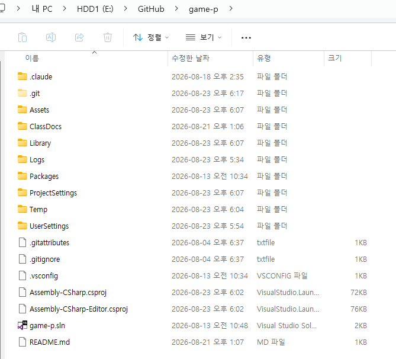
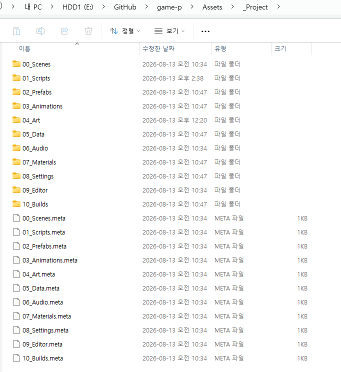

# 02. Unity 프로젝트 구조

## 프로젝트 위치

**클론한 저장소 폴더 자체가 곧 Unity 프로젝트입니다.** 따로 안쪽에 프로젝트 폴더가 하나 더 있는 구조가 아니라, 클론한 폴더를 열면 바로 `Assets`, `Packages`, `ProjectSettings`가 보입니다 - Unity Hub에서 그 폴더를 그대로 열면 됩니다 ([01-④ 프로젝트 열기](01_시작하기4_프로젝트열기.md) 참고).

## 저장소 최상위 구성

```text
(내 저장소 폴더)
 ├─ Assets            ← Unity 프로젝트 실제 내용물 (아래에서 자세히)
 ├─ Packages          ← Unity 패키지 설정 (건드리지 않음)
 ├─ ProjectSettings   ← Unity 프로젝트 설정 (건드리지 않음)
 ├─ ClassDocs         ← 지금 읽고 있는 수업 문서들
 └─ README.md
```

실제 탐색기로 열어보면 위 목록보다 훨씬 많은 것이 보입니다.



**나머지는 전부 Unity와 Git이 자동으로 만드는 것들이라 신경 쓰지 않아도 됩니다.**

| 보이는 것 | 정체 |
|---|---|
| `Library`, `Temp`, `Logs`, `UserSettings` | **Unity가 자동 생성**하는 작업용 폴더. 용량이 크고, 지워도 다음에 프로젝트를 열면 다시 만들어집니다. GitHub에는 올라가지 않습니다 |
| `.git` | **Git이 쓰는 폴더. 절대 지우지 마세요** - 지우면 GitHub와의 연결이 끊어져서 Commit/Push가 안 됩니다 |
| `Assembly-CSharp.csproj`, `game-p.sln` | Visual Studio용 파일. 자동 생성이라 그대로 두면 됩니다 |
| `.gitattributes`, `.gitignore`, `.vsconfig` | 프로젝트 설정 파일. 건드리지 않습니다 |

> **클론 직후에는 이 중 일부가 아직 없습니다.** `Library`, `Temp` 등은 **Unity로 프로젝트를 한 번 연 뒤에** 생깁니다. 갑자기 폴더가 늘어나도 정상입니다.

## Assets/_Project 폴더 구성

Unity 프로젝트의 실제 내용은 전부 `Assets/_Project` 아래, 앞자리 숫자 순서로 정리되어 있습니다.



```text
Assets/_Project
 ├─ 00_Scenes      씬(장면) 파일들
 │   ├─ Flow         Title / IntroCutscene / EndingCutscene
 │   └─ Stages       BackgroundTest(=스테이지1), ActionTest(동작 시험용 씬), Stage2/3_BackgroundTest(심화 - 이미 완성되어 있음) 등
 ├─ 01_Scripts     게임 동작 코드 - 학생이 수정하지 않음
 ├─ 02_Prefabs     프리팹(재사용 가능한 오브젝트 묶음) - 대부분 도구가 자동으로 관리
 ├─ 03_Animations  애니메이션 데이터 - 도구가 자동 생성
 ├─ 04_Art         그래픽 리소스
 │   ├─ StudentReplace   ★ 학생이 실제로 작업하는 곳
 │   └─ System            학교/트랙 로고 워터마크 등 - 학생이 손대지 않음
 ├─ 05_Data        게임 밸런스 등 데이터 - 학생이 수정하지 않음
 ├─ 06_Audio       사운드 리소스
 │   ├─ BGM               ★ 배경음악 - 학생이 실제로 파일을 넣는 곳
 │   └─ SFX               ★ 효과음 - 학생이 실제로 파일을 넣는 곳
 ├─ 07_Materials   렌더링용 머티리얼 - 건드리지 않음
 ├─ 08_Settings    프로젝트 설정 자산 - 건드리지 않음
 ├─ 09_Editor      `Tools > Class Template` 메뉴 도구들의 코드 - 건드리지 않음
 └─ 10_Builds      실행 빌드가 저장되는 곳 (Windows 폴더 등)
```

> 폴더 옆에 하나씩 붙어 있는 **`.meta` 파일**은 Unity가 폴더·파일마다 자동으로 만드는 관리 파일입니다. 지우거나 이름을 바꾸면 연결이 끊어지니 그냥 두세요 ([03_학생_리소스_제작규격](03_학생_리소스_제작규격.md)에서도 같은 안내가 나옵니다).

## 학생이 실제로 작업하는 곳은 딱 두 군데

1. **`Assets/_Project/04_Art/StudentReplace/`** - 캐릭터/몬스터/배경/이펙트/UI 등 모든 그래픽 리소스를 넣는 곳. 안에 이미 폴더가 용도별로 다 나뉘어 있고, **폴더마다 정확한 파일명·픽셀 규격을 적은 `readme.txt`** 가 들어 있습니다. 자세한 목록은 [03_학생_리소스_제작규격](03_학생_리소스_제작규격.md) 참고.
2. **`Assets/_Project/06_Audio/BGM/`, `.../SFX/`** - 배경음악·효과음 파일을 넣는 곳. 씬/캐릭터별로 폴더가 미리 나뉘어 있습니다 (예: `SFX/MonsterA`, `BGM/Title`).

이 두 곳 바깥의 폴더·파일은 원칙적으로 손대지 않습니다. 이름을 바꾸거나 위치를 옮기면 게임이 해당 리소스를 못 찾게 되어 조용히 깨질 수 있습니다.

## 리소스를 넣은 다음엔?

파일만 넣는다고 게임에 바로 반영되지 않습니다 - `Tools > Class Template` 메뉴의 도구를 실행해서 "이 파일들을 실제로 씬/프리팹에 연결"하는 과정이 한 번 더 필요합니다. 이 과정은 [04_Unity_적용_가이드](04_Unity_적용_가이드.md)에서 다룹니다.
