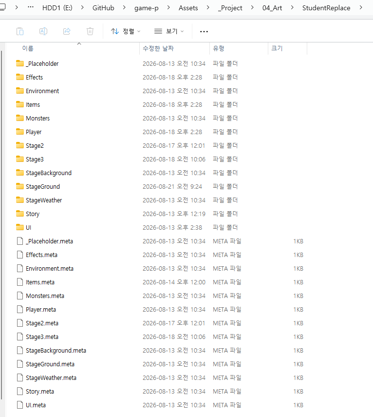
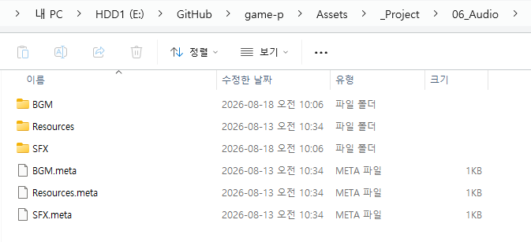
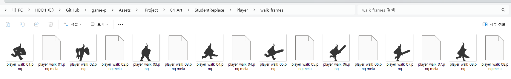

# 03. 학생 리소스 제작 규격

모든 리소스는 `Assets/_Project/04_Art/StudentReplace/`(그림) 와 `Assets/_Project/06_Audio/`(사운드) 아래, 용도별로 이미 나뉜 폴더에 넣습니다. **폴더마다 그 자리에 `readme.txt`가 있고, 정확한 파일명·픽셀 규격·주의사항이 적혀 있습니다** - 이 문서는 전체 폴더가 뭐가 있는지 한눈에 보는 지도이고, 실제 작업할 땐 각 폴더의 `readme.txt`를 펼쳐서 그대로 따라가면 됩니다.

그림을 넣는 곳 - `04_Art/StudentReplace`:

사운드를 넣는 곳 - `06_Audio`:

> 폴더 목록 사이사이에 보이는 **`.meta` 파일들은 Unity가 자동으로 만드는 관리 파일**입니다. 열어볼 필요도, 지울 필요도 없습니다. **다만 지우거나 이름을 바꾸면 연결이 끊어지니 그냥 두세요.** (탐색기 설정에 따라 안 보일 수도 있는데, 안 보이는 것도 정상입니다.)

## 공통 규칙 (모든 그림 리소스)

- 파일 형식: **PNG**
- 배경: 알파 채널로 **투명 처리** (전체 화면 배경 그림 등 일부만 예외 - 해당 폴더 readme에 명시)
- 파일명: **영문 소문자 + 숫자 + 언더바**, readme.txt에 적힌 이름과 대소문자까지 정확히 맞출 것 (다르면 게임이 그 파일을 못 찾습니다)
- 프레임 여러 장인 애니메이션은 `이름_01.png`, `이름_02.png` 처럼 **두 자리 번호**로 순서를 맞춤
- 정해진 픽셀 크기가 있는 경우, 크기가 달라졌으면 Unity에서 해당 Image의 **"Set Native Size"** 버튼으로 원래 크기 복구 가능 (위치는 안 바뀜)

실제로 들어간 모습입니다. 플레이어의 걷기 동작 8장이 `player_walk_01` ~ `player_walk_08` 로 번호가 이어져 있습니다.

> **번호는 반드시 두 자리(`01`, `02` …)로.** `1`, `2` 처럼 한 자리로 쓰면 10번 이후에 `1, 10, 2, 3…` 순서로 정렬되어 애니메이션이 뒤죽박죽이 됩니다.
>
> **번호는 중간에 비면 안 됩니다.** `01, 02, 04`처럼 건너뛰면 그 동작이 제대로 재생되지 않습니다.

## 캐릭터 (사람이 움직이는 그림)

| 폴더 | 내용 |
|---|---|
| `Player` | 주인공 애니메이션 12종 (대기/이동/점프/공격/대시/필살기/피격/사망 등) |
| `Monsters/MonsterA` | 몬스터A - 근접/단순형 (5종) |
| `Monsters/MonsterB` | 몬스터B - 근접/2단 공격형 (8종, 공격 이펙트 포함) |
| `Monsters/MonsterC` | 몬스터C - 비행/원거리형 (7종 + 투사체) |

캐릭터 그림 공통: 캔버스 500x500px 정사각형, 캐릭터는 **캔버스 아래쪽 가운데** 기준으로 배치 (바닥에 서는 기준점). 좌우 반전은 자동 처리되므로 오른쪽을 보는 방향 하나만 그리면 됩니다.

## 이펙트 / 아이템

| 폴더 | 내용 |
|---|---|
| `Effects` | 플레이어 공격/필살기에 같이 나오는 이펙트 6종 (검격, 폭발, 레이저 등) |
| `Items` | HP 회복 상자 애니메이션 + 상자에서 나오는 아이템 아이콘 |

이펙트류는 캐릭터와 달리 캔버스 크기가 자유이며, **정가운데 기준**으로 그립니다.

## 스테이지 환경

| 폴더 | 내용 |
|---|---|
| `StageGround` | 바닥/플랫폼 (좌우로 이어붙는 타일) |
| `StageBackground` | 배경 (패럴렉스 레이어) |
| `StageWeather` | 날씨 파티클 효과 (눈/비 등) |
| `Environment/LevelClearObject` | 스테이지 클리어를 발동시키는, 씬 안에 실제로 놓이는 오브젝트 |

## UI (화면 인터페이스)

| 폴더 | 내용 |
|---|---|
| `UI/Title` | 타이틀 화면 (메인 버튼 5종, 팝업 3종, 배경 애니메이션 등) |
| `UI/HUD` | 플레이 중 HP/스페셜 게이지 |
| `UI/PauseMenu` | 일시정지 메뉴 (톱니 버튼 + 메뉴 버튼 6종) |
| `UI/DeathScreen` | 사망 화면 |
| `UI/StageStart` | 스테이지 시작 배너 |
| `UI/StageClear` | 스테이지 클리어 배너 |
| `UI/MobileControls` | 모바일(Android) 터치 버튼 - PC 빌드엔 안 보임 (11주차 정규 과제) |

## 스토리 (컷신)

| 폴더 | 내용 |
|---|---|
| `Story/IntroCutscene` | 인트로 컷신 슬라이드 (정지 이미지 또는 동영상) |
| `Story/EndingCutscene` | 엔딩 컷신 슬라이드 (정지 이미지 또는 동영상) |

## 사운드 (BGM / SFX)

그림과 폴더 구조가 분리되어 있습니다 - `Assets/_Project/06_Audio/BGM/`(장면별), `Assets/_Project/06_Audio/SFX/`(캐릭터별) 아래 이미 폴더가 나뉘어 있으니, 씬/캐릭터에 맞는 폴더에 파일을 넣으면 됩니다. 파일 형식은 **MP3 / WAV / OGG** 모두 가능합니다. **폴더마다 `readme.txt`에 정확한 파일명이 적혀 있으니 그대로 맞추세요** - 사운드는 이름이 한 글자만 달라도 조용히 인식되지 않습니다.

## 건드리지 않는 폴더

- `04_Art/System` - 학교/트랙 로고 워터마크 (학생이 만드는 리소스 아님)
- `04_Art/StudentReplace/_Placeholder` - Unity가 자동으로 만드는 임시 그림, 학생이 직접 넣거나 지우는 대상 아님

## 심화용 폴더 (기본 과제에서는 안 씁니다)

| 폴더 | 내용 |
|---|---|
| `Stage2`, `Stage3` | **이미 완성되어 들어 있는 확장 스테이지**의 그림. 기본 과제는 스테이지1만 다룹니다 |

스테이지2·3을 게임에 이어붙이거나 그림을 바꾸는 방법은 [W15 심화](../주차별수업/W15_최종발표_심화.md) 참고.

## 다음 단계

리소스를 폴더에 넣었다면, [04_Unity_적용_가이드](04_Unity_적용_가이드.md)에서 실제로 게임에 반영하는 방법을 확인하세요.
