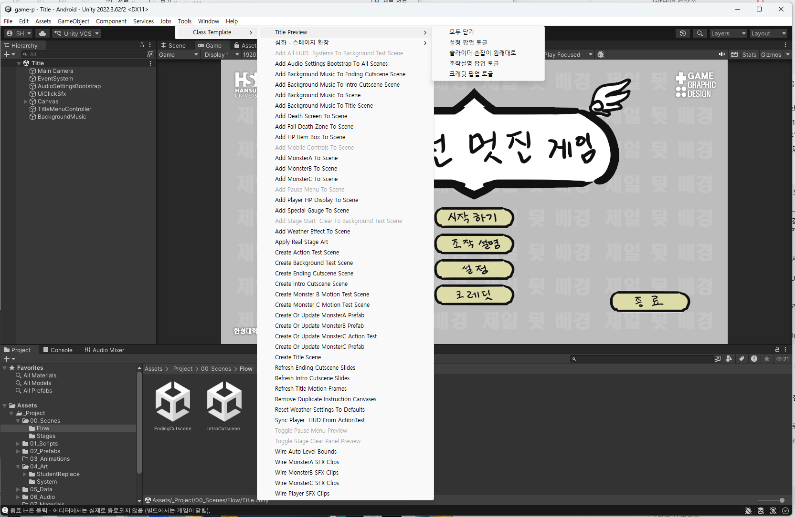
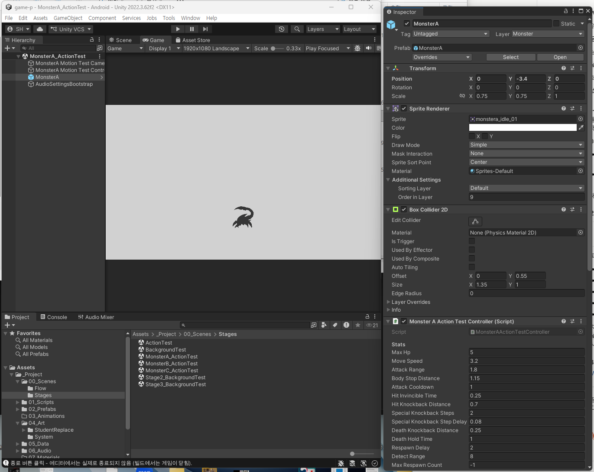
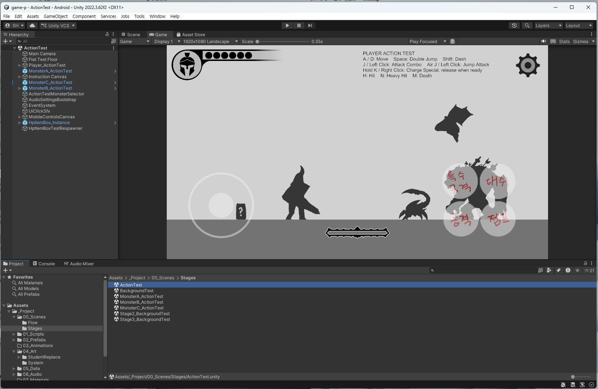
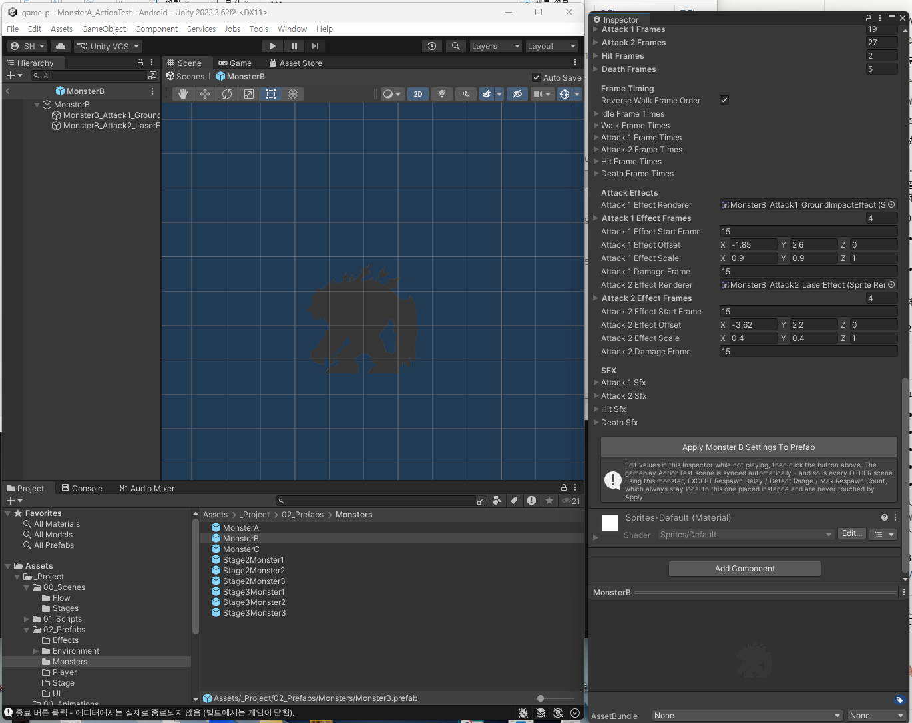
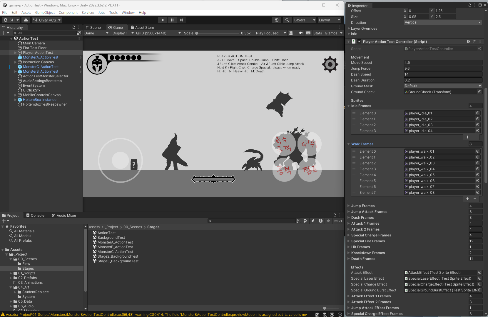
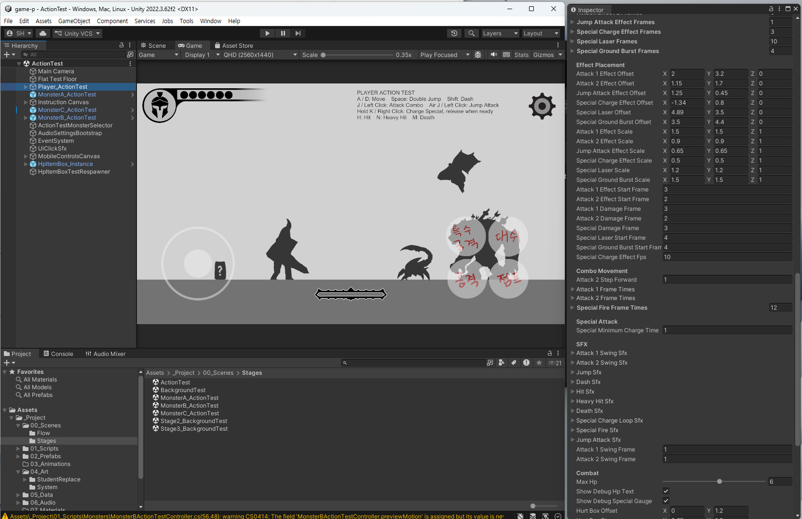
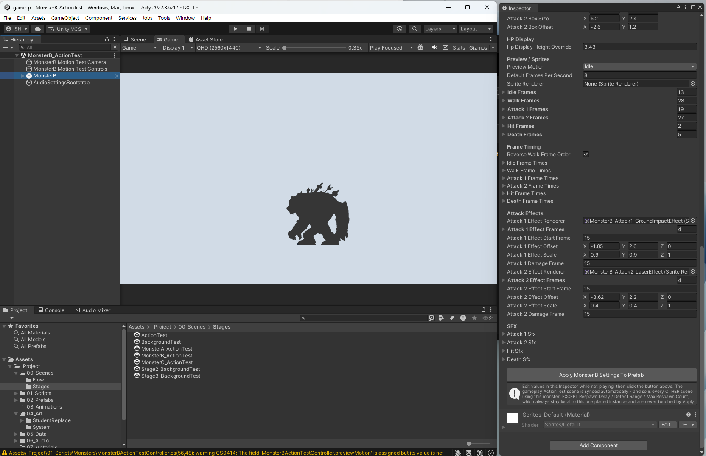
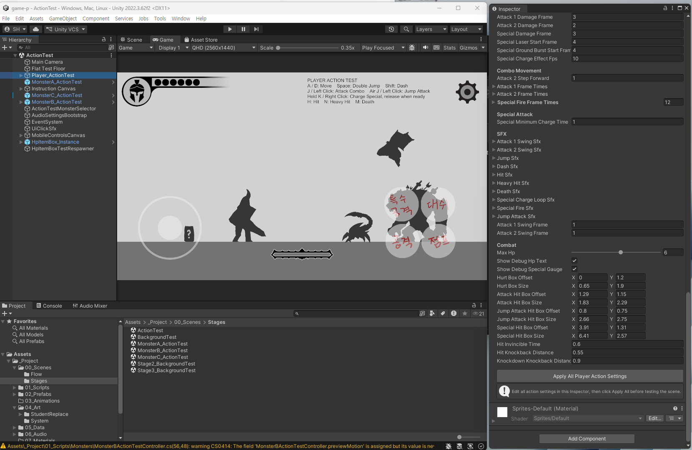
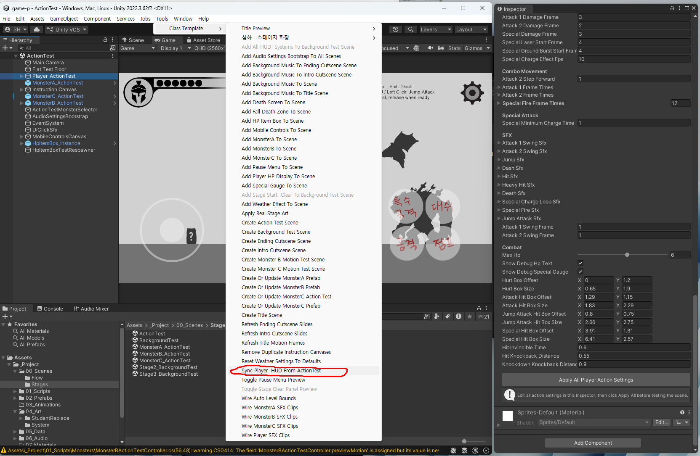

# 04. Unity 적용 가이드

[03_학생_리소스_제작규격](03_학생_리소스_제작규격.md)대로 폴더에 그림/사운드를 넣은 다음, **실제로 게임에 반영**시키는 방법을 다룹니다. 코드는 건드리지 않고, 전부 `Tools > Class Template` 메뉴의 도구와 Unity Inspector 조작만으로 진행합니다.

## 먼저 알아둘 것 - 핵심 개념 4가지

### 1) `Tools > Class Template` 메뉴 vs 인스펙터

이 프로젝트의 커스텀 기능은 딱 두 곳에 있고, 역할이 다릅니다.

- **`Tools > Class Template` (위쪽 메뉴 바)** - 씬 전체/프로젝트 전체에 걸친 작업. "폴더를 다시 스캔해서 반영", "씬에 무언가를 추가", "여러 씬에 한꺼번에 반영" 같은, 특정 오브젝트를 선택하지 않고도 실행하는 명령들.
- **인스펙터 (오브젝트를 선택했을 때 오른쪽 창)** - 지금 선택한 그 오브젝트 하나에만 해당하는 작업. 예: 몬스터를 클릭하면 나오는 "Apply Monster A Settings To Prefab" 버튼.

**`Tools > Class Template` 메뉴** - 이 안에 있는 명령들입니다. 이름만 봐도 "무엇을 씬에 추가한다", "무엇을 다시 읽어들인다" 식이라는 것을 알 수 있습니다.



**인스펙터** - 오브젝트를 클릭했을 때 오른쪽에 나오는 창입니다. 아래는 몬스터A를 선택한 모습으로, 이 몬스터 하나의 스탯·스프라이트·판정 값이 전부 여기 있습니다.



**헷갈리면 이 기준으로 판단하세요**: 지금 선택한 오브젝트 하나에 대한 이야기면 인스펙터, 씬 전체나 여러 씬에 걸친 이야기면 Tools 메뉴.

> 회색으로 흐리게 표시된 메뉴 항목은 **지금 열려 있는 씬에서는 쓸 수 없다**는 뜻입니다. 해당하는 씬을 열면 활성화됩니다.

### 2) 프리팹으로 만들어진 것 vs 씬에만 있는 것

**Hierarchy 창에서 구분할 수 있습니다.** 이름이 **파란색이고 앞에 파란 상자 아이콘**이 붙어 있으면 프리팹입니다.



위 그림에서 `MonsterA/B/C_ActionTest`와 `HpItemBox_Instance`는 파랗고(프리팹), **`Player_ActionTest`는 파랗지 않습니다**(프리팹 아님). 이 차이가 아래 설명의 이유입니다.

- **몬스터(A/B/C)는 프리팹**입니다 - 하나의 원본(.prefab 파일)을 여러 씬이 공유해서 가져다 쓰는 구조. 몬스터를 튜닝한 뒤 "Apply ... Settings To Prefab" 버튼을 누르면 그 원본에 반영되고, 이 원본을 쓰는 모든 씬이 같이 업데이트됩니다.
- **플레이어는 프리팹이 없습니다** (의도된 구조) - 각 씬(ActionTest, BackgroundTest, ...)마다 따로따로 존재합니다. 그래서 플레이어를 한 곳에서 튜닝한 뒤 다른 씬에도 반영하려면 `Sync Player & HUD From ActionTest`라는 별도 명령을 실행해야 합니다 (아래에서 자세히).
- **바닥/배경 오브젝트의 씬 안 배치(위치, 개수)는 프리팹이 아니라 순수하게 그 씬 파일 안에만 존재하는 정보**입니다. 그래서 `Create Background Test Scene` 같은 "씬을 통째로 새로 만드는" 도구를 실행하면, 프리팹에 저장된 것(몬스터 스탯 등)은 그대로 남지만, 씬에만 있던 배치 정보(바닥을 몇 개 어디에 놓았는지 등)는 전부 사라집니다.

프리팹 원본은 `Assets/_Project/02_Prefabs/Monsters/` 안에 파일로 들어 있습니다. 아래가 그 원본(`MonsterB.prefab`)을 연 모습입니다 - **여러 씬이 이 파일 하나를 같이 씁니다.**



> ⚠️ **이 폴더의 프리팹 파일을 더블클릭하지 마세요.** 원본이 여기 있다는 것만 알아두면 됩니다.
>
> 더블클릭하면 **프리팹 편집 모드**로 들어가서 `Hierarchy`가 씬 대신 프리팹 내부로 바뀝니다. 값은 똑같이 고쳐지는 것처럼 보이지만, **그 상태에서 `Play`를 누르면 `Game` 탭에 엉뚱한 화면이 나옵니다** - `Game` 탭은 프리팹이 아니라 **열려 있는 씬**을 그리기 때문입니다. "고쳤는데 왜 안 바뀌지?"의 흔한 원인입니다. (나가려면 `Hierarchy` 왼쪽 위 **`<`** 화살표)
>
> **작업은 항상 씬을 열고 `Hierarchy`에서 오브젝트를 골라서** 하세요. 원본은 **`Apply ~ To Prefab` 버튼이 대신 고쳐줍니다.**

**➜ 그래서 `Create Action Test Scene` / `Create Background Test Scene`처럼 이름이 "Create ... Scene"인 도구는 되도록 실행하지 마세요.** 이미 다 만들어진 씬을 처음부터 다시 만드는 파괴적인 도구라, 실행하면 지금까지 손으로 배치/조정한 내용이 사라집니다 (실행 시 확인창이 한 번 뜨긴 합니다). 이 문서에서 설명하는 나머지 도구들은 전부 안전하게 반복 실행 가능합니다.

### 3) 에디터에서 되는 것 ≠ 실제 빌드에서 되는 것

Unity 에디터 안에서 Play를 눌러 테스트하는 것과, 최종적으로 만드는 실행 파일(빌드)은 완전히 같지 않습니다. 대표적으로 다른 점 두 가지:

- **`09_Editor` 폴더 안의 스크립트(=Tools 메뉴 도구들)는 실제 빌드에는 아예 포함되지 않습니다.** 개발/편집용 도구이기 때문에, 빌드된 게임을 실행한 사람은 이 메뉴를 볼 수도 없고 볼 필요도 없습니다.


- **Build Settings의 씬 목록**(`File > Build Settings`, 위 그림)은 "실제 빌드에 어떤 씬을 포함시킬지" 정하는 목록입니다 - 에디터에서 Play로 테스트할 땐 이 목록과 무관하게 항상 잘 됩니다 (그래서 목록에 없는 씬도 에디터에선 테스트가 되는 것처럼 보일 수 있음). 반대로, 실제 빌드에서 어떤 씬으로 못 넘어간다면 제일 먼저 이 목록에 그 씬이 들어있는지 확인하세요. 목록 순서 자체는 "0번 = 게임을 켰을 때 처음 뜨는 씬"이라는 의미 말고는 실제 진행 순서와 상관없습니다 - 씬과 씬이 실제로 어떻게 이어지는지는 각 화면의 컨트롤러(예: 스테이지 클리어의 `nextSceneName`)가 따로 정합니다.

### 4) 플레이스홀더(placeholder) 그림

바닥/배경 등 아직 학생이 그림을 안 넣은 곳은 Unity가 자동으로 밋밋한 색 블록(4x4픽셀 흰 정사각형을 색만 입힌 것)을 채워 넣어 자리를 보여줍니다 - 아무도 손으로 그린 게 아니라 도구가 자동 생성하는 "임시 대타" 그림입니다. 학생이 실제 그림을 넣고 관련 도구를 실행하면 자동으로 교체되어 사라지므로, 신경 쓰거나 지울 필요 없습니다.

---

## 그래픽 리소스 반영하기 - 캐릭터/이펙트/아이템

### 이미 있는 파일을 새 그림으로 덮어쓰는 경우 (제일 흔한 경우)

파일명과 개수를 그대로 두고 그림 내용만 바꾸는 거라면, **파일을 덮어쓰기만 하면 끝입니다.** Unity가 자동으로 다시 읽어들이고, 이미 연결되어 있던 모든 곳(여러 씬)에 자동으로 반영됩니다. 별도로 메뉴를 실행할 필요가 없습니다.

### 프레임 개수를 바꾸는 경우 (추가/삭제)

애니메이션 프레임을 늘리거나 줄이려면, Inspector에서 직접 배열 크기를 조절합니다.



`Idle Frames`, `Walk Frames` 처럼 동작마다 배열이 있고, 오른쪽 숫자가 프레임 개수입니다. 삼각형을 펼치면 `Element 0`, `Element 1` … 로 실제 파일이 순서대로 들어가 있는 것이 보이고, 목록 아래 **`+` / `-` 버튼**으로 칸을 늘리거나 줄일 수 있습니다.

1. `ActionTest` 씬을 엽니다 (`Assets/_Project/00_Scenes/Stages/ActionTest.unity`) - 튜닝은 항상 이 씬을 기준으로 합니다.
2. 캐릭터(Player_ActionTest 또는 MonsterA/B/C_ActionTest)를 클릭 → Inspector에서 해당 동작의 Sprite 배열(예: `Idle Frames`)을 찾습니다.
3. 배열 이름 **오른쪽 끝의 숫자**를 새 프레임 개수로 바꿉니다 (또는 목록 아래 `+` / `-` 버튼으로 한 칸씩).
4. 새로 생긴 빈 칸에 Project 창에서 새 프레임 파일을 순서대로 드래그해 채웁니다.
5. **"몇 번째 프레임에서 판정이 발동하는가" 같은 숫자 필드가 짝지어 있는 경우, 그 값도 반드시 같이 확인하세요** (예: `Attack1 Damage Frame`, `Attack1 Swing Frame`, `Attack1 Effect Start Frame`, 몬스터C의 `Attack1 Projectile Frame` 등). 프레임 개수만 바꾸고 이 숫자를 안 맞추면 **에러 없이 조용히 판정이 안 나가거나 엉뚱한 타이밍에 나갑니다** - Unity가 자동으로 맞춰주지 않으니 꼭 눈으로 다시 확인하세요.

같은 인스펙터를 아래로 내리면 그 숫자들이 모여 있습니다. `Attack 1 Damage Frame`, `Attack 2 Damage Frame`, `Special Damage Frame`, `... Start Frame`, `... Swing Frame` 이 전부 **"몇 번째 프레임에서 발동하는가"** 를 가리키는 값입니다.



> 예를 들어 공격 프레임을 4장에서 3장으로 줄였는데 `Attack 1 Damage Frame`이 그대로 `4`라면, **있지도 않은 4번째 프레임에서 판정을 내라는 뜻**이 되어 공격이 나가지 않습니다.

### 몬스터: Apply 버튼으로 확정 짓기

몬스터의 스프라이트/설정을 바꿨다면, 그 몬스터를 선택한 채 Inspector 맨 아래 **"Apply Monster A/B/C Settings To Prefab"** 버튼을 클릭하세요.



- 지금 선택한 인스턴스의 **모든 값을 한 번에** 공유 프리팹에 반영합니다 (필드별 선택 적용 아님 - 전부 아니면 전부).
- 이 몬스터를 쓰는 다른 씬(`ActionTest` 포함)도 자동으로 같이 맞춰집니다.
- 예외적으로 `Max Hp`/`Detect Range`/`Max Respawn Count`/`Respawn Delay` 이 4개 밸런스 값만은 **절대 같이 반영되지 않습니다** (의도된 설계) - 같은 몬스터를 씬마다 다른 난이도로 배치해두고 싶을 때를 위한 장치이니, 이 4개는 **놓인 몬스터 하나하나 따로 조절해도 안전**합니다.

### 플레이어: Sync Player & HUD From ActionTest

플레이어는 프리팹이 없어서 위의 Apply 버튼이 없는 대신, **두 단계**를 거칩니다.

**1) `ActionTest` 씬에서 편집을 마친 뒤, Inspector 맨 아래 `Apply All Player Action Settings` 버튼**으로 지금 씬에 먼저 저장합니다.



**2) 그 다음 메뉴에서 `Sync Player & HUD From ActionTest`를 실행합니다.**



```
Tools > Class Template > Sync Player & HUD From ActionTest
```

를 실행하면 `ActionTest`의 플레이어 설정(스탯, 애니메이션 프레임 배열, 이펙트 연결 등 거의 전부)이 **존재하는 모든 스테이지 씬**(BackgroundTest 등)의 플레이어에 한 번에 복사됩니다. 같은 명령이 HUD(HP표시/게이지)와 톱니 버튼, 모바일 컨트롤 UI의 위치도 함께 맞춰줍니다 - 즉 플레이어와 관련된 건 이 버튼 하나로 다 끝난다고 생각하면 됩니다.

---

## 스테이지 환경 반영하기 - 바닥/배경/날씨

1. `StudentReplace/StageGround`, `StageBackground`, `StageWeather` 폴더에 그림을 넣습니다 (각 폴더 readme.txt 참고).
2. `BackgroundTest` 씬을 엽니다.
3. 메뉴에서 `Tools > Class Template > Apply Real Stage Art` 실행 - 세 폴더의 그림을 한 번에 읽어들여 반영합니다. **안전하게 반복 실행 가능**합니다.

### 바닥/배경 패턴을 기본 개수보다 더 추가하고 싶다면

기본으로 놓여 있는 개수(바닥 `ground1~7`, 배경 `bg1~5`)를 넘는 패턴은 파일만 넣고 `Apply Real Stage Art`를 실행하면 **프리팹까지는 자동 생성**되지만, **씬에 실제로 배치하는 것은 항상 수동**입니다 - Project 창에서 새로 생긴 프리팹(예: `Ground5`)을 찾아 Scene 뷰로 직접 드래그해서 놓아주세요.

### 바닥에 구덩이(빠지는 지점) 만들기

이것도 자동 도구가 없는, 의도적으로 수동인 작업입니다: 바닥 프리팹의 `Collision` 자식 오브젝트를 복제한 뒤 위치를 옮겨서 구멍을 냅니다. 참고로 바닥 그림 자체는 울퉁불퉁해도 상관없습니다 - 실제 충돌 판정은 그림과 별개인 박스(`Collision`)로 처리되기 때문입니다.

### 날씨 효과 (눈/비 등 파티클)

```
Tools > Class Template > Add Weather Effect To Scene
```

로 씬에 날씨 오브젝트를 추가합니다 (안전하게 반복 실행 가능, `Apply Real Stage Art`가 `StageWeather` 폴더의 프레임도 같이 반영해줍니다). 씬에 있는 `Main Camera` 밑 `WeatherAnchor` 오브젝트의 체크를 끄면 날씨 효과를 끌 수 있습니다. 파티클 시스템(Particle System) 컴포넌트의 각 모듈이 하는 역할:

| 모듈 | 역할 |
|---|---|
| Main - Start Color | 흰색으로 유지할 것 (다른 색을 넣으면 그림에 색이 덧입혀짐) |
| Emission - Rate over Time | 파티클이 얼마나 자주 생기는지 - 많이 올릴 땐 `Max Particles`도 같이 올려야 함 (안 올리면 조용히 상한에 걸림) |
| Shape | 파티클이 생기는 영역 (Box = 화면 위쪽 넓은 영역) |
| Velocity over Lifetime | Y값이 떨어지는 속도, X값이 좌우로 흔들리는 정도 (실제로 "떨어지게" 만드는 건 Start Speed가 아니라 이 값) |
| Texture Sheet Animation | 넣은 프레임들을 파티클 하나가 살아있는 동안 순서대로 반복 재생(Cycles) |

너무 많이 만져서 이상해졌다면 `Tools > Class Template > Reset Weather Settings To Defaults`로 원래 값으로 되돌릴 수 있습니다 (그림/프레임은 그대로 두고 수치만 초기화).

---

## HUD/시스템 한 번에 추가하기

HP표시, 스페셜 게이지, 사망 화면, 일시정지 메뉴, 모바일 컨트롤, 스테이지 시작 배너+클리어 화면 - 이 6가지를 하나하나 따로 추가할 필요 없이, `BackgroundTest` 씬을 연 상태에서:

```
Tools > Class Template > Add All HUD & Systems To Background Test Scene
```

한 번이면 전부 추가/갱신됩니다. 그림을 각 폴더에 넣기 전에 먼저 실행해도 되고(자리만 잡히고 그림은 나중에 채워짐), 그림을 다 넣은 뒤 다시 실행해도 안전합니다.

---

## 사운드 연결하기

- **BGM(배경음악)**: `06_Audio/BGM/`의 해당 씬/장면 폴더에 파일을 넣고, `Tools > Class Template > Add Background Music To Scene`(또는 Title/Intro/Ending은 각각 전용 명령) 실행. 이미 배경음악 오브젝트가 있어도 클립이 비어있으면 다시 채워주는 방식이라 **안전하게 반복 실행 가능**합니다.
- **SFX(효과음)**: `06_Audio/SFX/`의 해당 캐릭터 폴더에 파일을 넣고, `Tools > Class Template > Wire Player/MonsterA/B/C SFX Clips` 실행. 이 명령은 **파일 경로(이름)가 새로 생기거나 바뀔 때만** 다시 실행하면 됩니다 - 기존 파일을 같은 이름으로 그냥 덮어쓰는 거라면 다시 실행할 필요 없이 자동 반영됩니다.

---

## 컷신/타이틀 슬라이드 갱신

`Story/IntroCutscene`, `Story/EndingCutscene`, `UI/Title`의 애니메이션 프레임(타이틀 배경 모션)처럼 **개수 자체가 자유로운** 리소스는, 파일을 넣거나 뺀 뒤 해당하는 새로고침 명령을 실행해야 합니다:

- `Tools > Class Template > Refresh Intro Cutscene Slides`
- `Tools > Class Template > Refresh Ending Cutscene Slides`
- `Tools > Class Template > Refresh Title Motion Frames`

셋 다 안전하게 반복 실행 가능합니다.

---

## Tools 메뉴 요약표 (기본 커리큘럼에서 실제로 쓰는 것)

| 메뉴 항목 | 언제 실행 | 반복 실행 |
|---|---|---|
| Apply Monster A/B/C Settings To Prefab *(인스펙터)* | 몬스터 튜닝을 마쳤을 때 | 안전 |
| Apply All Player Action Settings *(인스펙터)* | 플레이어 튜닝을 마쳤을 때 (ActionTest에서) | 안전 |
| Sync Player & HUD From ActionTest | 플레이어/HUD를 다른 모든 씬에도 반영하고 싶을 때 | 안전 |
| Apply Real Stage Art | 바닥/배경/날씨 그림을 넣거나 바꿨을 때 | 안전 |
| Add Weather Effect To Scene | 날씨 효과를 처음 추가할 때 | 안전 |
| Reset Weather Settings To Defaults | 날씨 수치를 만지다 꼬였을 때 | 안전 |
| Add All HUD & Systems To Background Test Scene | HUD/시스템 6종을 추가/갱신할 때 | 안전 |
| Add Background Music To Scene (또는 Title/Intro/Ending 전용) | BGM 파일을 넣었을 때 | 안전 |
| Wire Player/MonsterA/B/C SFX Clips | 효과음 파일의 이름/경로가 바뀌었을 때 | 안전 |
| Refresh Intro/Ending Cutscene Slides, Refresh Title Motion Frames | 슬라이드/모션 프레임 개수를 바꿨을 때 | 안전 |
| **Create Action Test Scene / Create Background Test Scene** | **되도록 실행하지 않기** | ⚠️ 파괴적 (씬을 통째로 새로 만듦) |

---

## 마지막에 확인할 것

1. `ActionTest` 씬에서 Play를 눌러 캐릭터/몬스터 애니메이션과 판정이 정상인지 먼저 확인
2. `BackgroundTest` 씬을 열고 Sync/Apply 도구들이 잘 반영됐는지 다시 한번 Play로 확인
3. Ctrl+S로 저장 (씬을 여러 개 만졌다면 각각 저장)

여기까지 됐다면 [05_제출_가이드](05_제출_가이드.md)에서 실제 빌드를 만드는 방법을 확인하세요.
