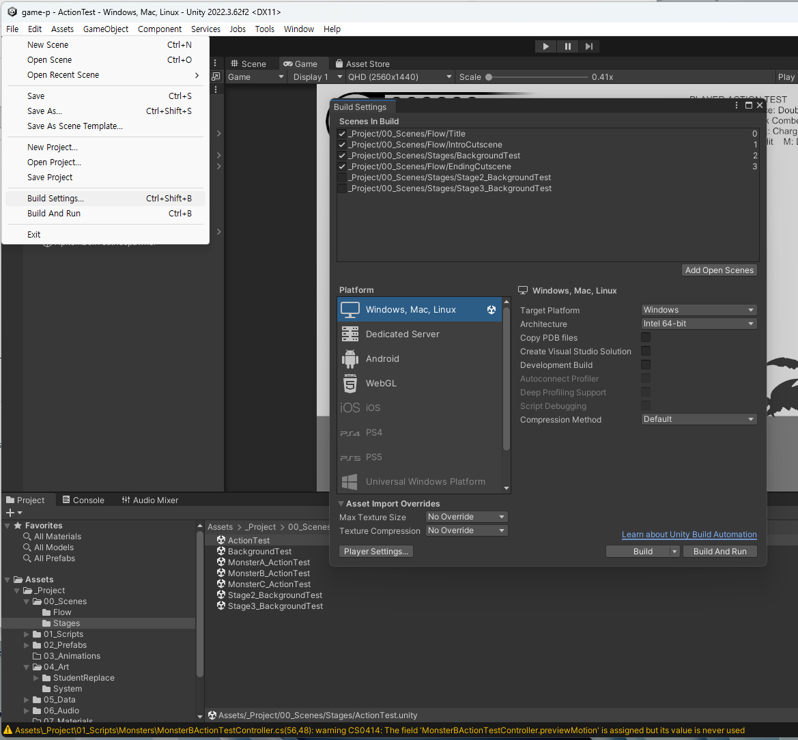
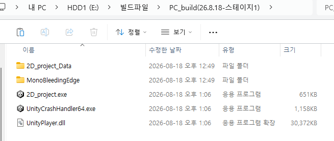
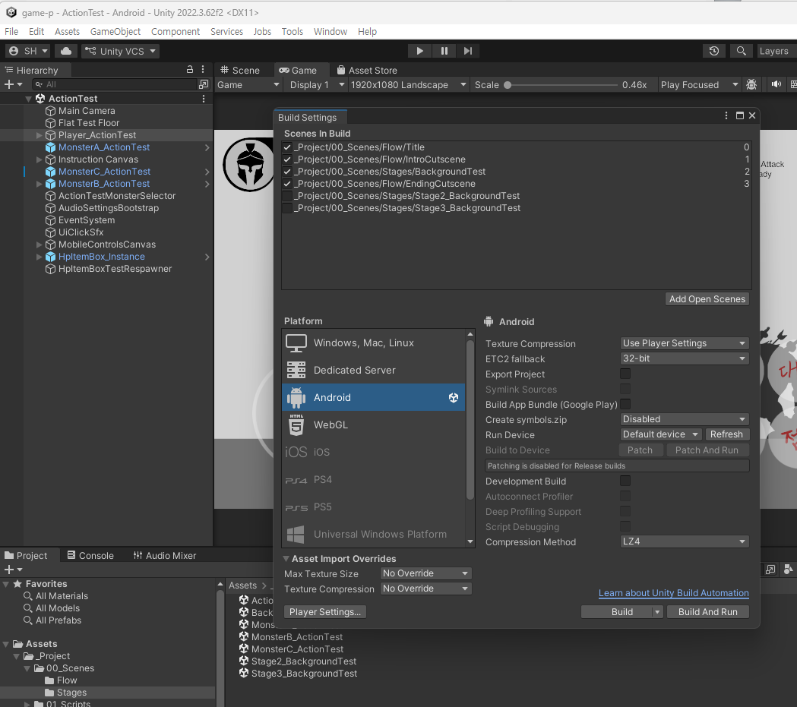
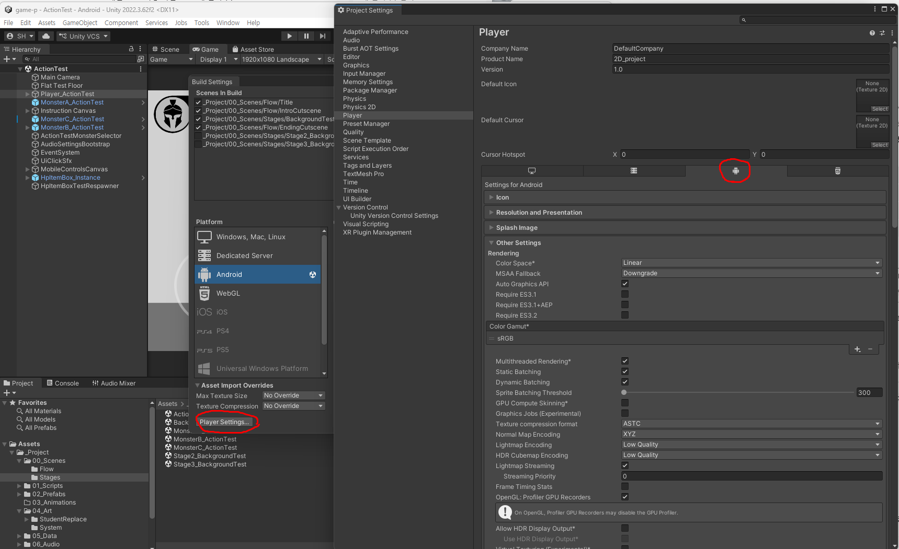
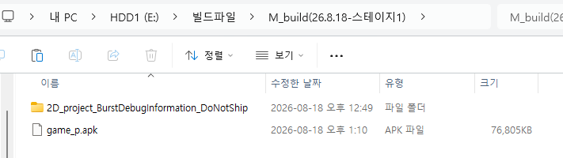

# 05. 제출 가이드

## 필수 제출물

- **Windows 빌드 파일** (압축, 파일명 `PC_최종빌드_123456김한성`)
- **모바일 빌드 파일** (안드로이드 `.apk`, 압축, 파일명 `M_최종빌드_123456김한성`)
- **GitHub 저장소 링크** (Unity 프로젝트 전체, [01-② GitHub 계정](01_시작하기2_깃허브계정.md)에서 만든 나만의 저장소)
- **플레이 영상 1개** (**1~2분 내외**, 화면 녹화)
- **종합결과 보고 PPT** (컨셉, 작업 이미지, 소감 등)

> 제출 시점과 주차별 세부 일정은 [14주차 문서](../주차별수업/W14_최종빌드_발표준비.md)를 확인하세요.

## 제출 방법

빌드 파일은 용량이 커서 카페에 직접 올리기 어렵습니다. **각자의 구글 드라이브에 올리고 링크로 제출**합니다.

1. 빌드 결과를 압축하고, 위 파일명 규칙대로 이름을 짓습니다.
   - PC는 **폴더를 통째로** 압축 (`.exe` 하나만 보내면 실행되지 않습니다)
   - 모바일은 **`.apk` 파일 하나만** 압축
2. 구글 드라이브에 업로드합니다.
3. 파일 우클릭 → **공유** → **"링크가 있는 모든 사용자"** → 링크 복사.
4. ⚠️ **제출 전에 시크릿 모드(로그아웃 상태)로 그 링크를 열어 실제로 다운로드가 되는지 확인하세요.**

> **매년 가장 많이 나오는 사고가 공유 권한을 안 바꿔서 파일을 받을 수 없는 것입니다.** 본인 계정에서는 잘 열리기 때문에 스스로는 알아채지 못합니다. 반드시 시크릿 창으로 확인하세요.

## Windows 빌드 만들기

1. 상단 메뉴 **File > Build Settings** 클릭.
2. **Scenes In Build** 목록에 다음 4개가 체크되어 있는지 확인 (기본으로 이미 되어 있음):
   - `Title`, `IntroCutscene`, `BackgroundTest`, `EndingCutscene`
   - (`Stage2_BackgroundTest`, `Stage3_BackgroundTest`는 **체크가 꺼진 채로 목록에만** 있습니다. 기본 과제에서는 그대로 두세요 - 심화로 스테이지를 이어붙일 때만 켭니다)
3. Platform 목록에서 **Windows, Mac, Linux** 선택 → **Switch Platform** (이미 선택되어 있다면 생략).
4. 오른쪽 아래 두 버튼 중 **"Build"** 를 클릭합니다. **("Build And Run"은 누르지 마세요** - 빌드 후 곧바로 실행까지 시도하는데, 지금 화면 그대로도 충분하고, 대신 저장 위치를 물어볼 때 헷갈릴 수 있습니다.)
5. 저장 위치로 `Assets/_Project/10_Builds/Windows` 폴더(또는 그 안에 원하는 이름의 하위 폴더)를 지정하고 빌드합니다. 시간이 좀 걸릴 수 있습니다.
6. 빌드가 끝나면 생성된 `.exe` 파일을 직접 더블클릭해서 실행해보고, 타이틀부터 끝까지 정상 동작하는지 확인합니다.

빌드가 끝나면 지정한 폴더 안이 이렇게 생깁니다.

> ⚠️ **`.exe` 파일 하나만 보내면 실행되지 않습니다.** `2D_project_Data` 폴더와 `UnityPlayer.dll` 등이 **같은 자리에 함께 있어야** 게임이 돌아갑니다. 제출할 때는 **이 폴더를 통째로 압축**하세요.
>
> 매년 나오는 사고입니다. 본인 컴퓨터에서는 원래 자리에 다 있으니 잘 실행되고, 받는 쪽에서만 안 켜집니다.

## 모바일(Android) 빌드 만들기

**Android Build Support 모듈이 설치되어 있어야 합니다** ([01-① Unity 설치](01_시작하기1_유니티설치.md)의 모듈 항목 참고). 안 되어 있다면 Unity Hub에서 먼저 추가하세요 - 설치에만 30분 이상 걸립니다.

1. **File > Build Settings** → Platform에서 **Android** 선택 → **Switch Platform**

   

   - ⏰ **플랫폼 전환은 10~40분 걸립니다.** 모든 텍스처를 Android용으로 다시 압축하기 때문입니다. 중간에 끄지 마세요.
   - 전환이 끝나면 Android 아이콘 옆에 Unity 표시가 붙고, 오른쪽 설정이 Android용으로 바뀝니다.
2. 왼쪽 아래 **Player Settings...** 버튼 → 위쪽 탭에서 **안드로이드 아이콘 탭**을 고르고 값을 확인합니다 (이 프로젝트는 이미 설정되어 있습니다. 값이 맞는지 보기만 하세요)

   

   | 항목 | 값 |
   |---|---|
   | Package Name | `com.gamep.actionclass` |
   | Minimum API Level | **22** (Android 5.1) |
   | Scripting Backend | **IL2CPP** |
   | Target Architectures | **ARM64** |

3. **Build** 클릭 → `Assets/_Project/10_Builds/Android` 에 `M_최종빌드_123456김한성.apk` 로 저장
4. 빌드 완료를 기다립니다 (**20~60분**. IL2CPP 변환 때문에 PC보다 훨씬 깁니다)
5. 만들어진 `.apk`를 안드로이드 기기로 옮겨 설치하고 실행을 확인합니다
   - 옮기는 방법은 편한 대로 (USB 케이블, 카카오톡 "나에게 보내기", 구글 드라이브 등)
   - 설치할 때 **"출처를 알 수 없는 앱 허용"** 을 켜야 합니다

> **apk를 기기에 넣고 설치하는 방법은 여기서 길게 설명하지 않습니다.** 처음이라 낯설 뿐 어려운 작업이 아니고, 인터넷에 설명이 아주 많습니다. `안드로이드 apk 설치` 로 검색하면 기종별 화면까지 나옵니다.
>
> 참고할 만한 글: [안드로이드 APK 설치 방법 (외부 블로그)](https://blog.naver.com/bluepath/223796150736)
>
> ⚠️ **외부 사이트라 화면이나 설명이 지금과 다를 수 있고, 글이 사라져 있을 수도 있습니다.** 안 맞으면 그냥 검색해서 다른 설명을 보세요. 기종과 안드로이드 버전에 따라 메뉴 이름이 조금씩 다릅니다.

빌드가 끝나면 지정한 폴더 안이 이렇게 생깁니다.

> **필요한 것은 `.apk` 파일 하나뿐입니다.** PC 빌드와 달리 apk 안에 모든 것이 들어 있습니다.
>
> 옆에 같이 생기는 **`..._BurstDebugInformation_DoNotShip` 폴더는 제출하지 마세요.** 이름 그대로 배포용이 아닌 디버그 정보입니다.

> **PC로 다시 빌드할 일이 생기면 Platform을 Windows로 되돌려야 합니다.** 전환에 또 시간이 걸리니, **PC 빌드를 먼저 끝내고 마지막에 Android로** 넘어가는 순서를 권합니다.

### 아이폰(iOS) 빌드는 왜 안 하나요?

**수업에서 다루지 않습니다.** 기술적으로 못 하는 것이 아니라, 수업에서 전원에게 요구할 수 없는 조건이 붙기 때문입니다.

- **맥(Mac)이 반드시 필요합니다.** Unity는 iOS용 결과물을 바로 만들지 못하고 Xcode 프로젝트까지만 만들어줍니다. 그 다음 단계는 **macOS의 Xcode**에서만 가능합니다. Windows 컴퓨터로는 어떤 방법으로도 끝까지 갈 수 없습니다.
- **애플 개발자 계정이 필요합니다.** 무료 계정으로 자기 기기에 설치하는 방법이 있긴 하지만 **7일이 지나면 앱이 실행되지 않아** 다시 설치해야 합니다. 제대로 하려면 연 $99짜리 유료 등록이 필요합니다.

안드로이드는 **apk 파일 하나만 있으면 어느 기기에서든 바로 설치**되기 때문에, "내 폰에서 내 게임이 돌아간다"는 경험을 하기에는 안드로이드가 훨씬 적합합니다.

> **아이폰만 있는 학생도 걱정하지 마세요.**
>
> - 확인해보고 싶다면 **가족이나 친구의 안드로이드 기기**에 잠깐 설치해보면 됩니다. 설치하고 지우는 데 몇 분이면 됩니다.
> - 사정이 있어 **본인이 직접 확인하지 못했더라도, 제출한 `.apk`는 교수님이 직접 확인할 수 있습니다.** 그러니 확인을 못 했다는 이유로 제출을 미루지 마세요.
> - PC 빌드가 정상적으로 동작한다면 **그 점을 감안해서 봅니다.** 안드로이드 기기가 없다는 사정 때문에 불이익을 받지 않습니다.

## 제출 전 확인 체크리스트

### 게임

- [ ] 빌드된 `.exe`가 실제로 실행되는가? (에디터가 아니라 빌드 파일 자체로 확인)
- [ ] `.apk`가 안드로이드 기기에 설치되고 실행되는가?
- [ ] **모바일에서 터치 컨트롤(조이스틱/버튼)이 화면에 나오는가?** (PC 빌드에는 안 나오고 모바일에서만 나옵니다)
- [ ] 타이틀 → 인트로 컷신 → 스테이지 → (클리어 또는 사망) → 엔딩까지 흐름이 끊기지 않는가?
- [ ] 캐릭터/몬스터 애니메이션이 전부 정상 재생되는가? (판정 프레임이 안 맞아 공격이 안 나가는 경우는 없는지 - [04_Unity_적용_가이드](04_Unity_적용_가이드.md)의 프레임 인덱스 항목 참고)
- [ ] 배경/UI 그림이 깨지거나(투명 배경이 흰 배경으로 나오는 등) 잘려 보이지 않는가?
- [ ] HP 표시, 스페셜 게이지, 일시정지 메뉴가 정상 동작하는가?
- [ ] BGM/효과음이 다 들리는가? (특정 화면에서만 소리가 안 나온다면 해당 화면의 BGM/SFX 연결을 다시 확인)

### 제출물

- [ ] 빌드 압축 파일 2개의 **파일명이 규칙대로**인가? (`PC_최종빌드_...`, `M_최종빌드_...`)
- [ ] **PC 압축본에 폴더 전체(`_Data` 폴더, `UnityPlayer.dll` 포함)가 들어 있는가?** (`.exe`만 있으면 상대방 컴퓨터에서 실행되지 않습니다)
- [ ] 구글 드라이브 링크가 **시크릿 창에서 다운로드까지 되는가?**
- [ ] 플레이 영상이 **1~2분 내외**인가?
- [ ] PPT에 컨셉·작업 이미지·소감이 들어 있는가?
- [ ] GitHub 저장소에 최신 작업이 Push까지 되어 있는가? ([01-③ GitHub Desktop](01_시작하기3_깃허브데스크탑.md) 참고)
- [ ] 제출할 저장소 링크가 **`Public`** 인가? (확인법: 브라우저 시크릿 창에 링크를 붙여넣어 로그인 없이 열리면 정상. 안 열리면 저장소 → **Settings** → **Danger Zone** → **Change visibility**로 변경)

> **빌드 결과물(`10_Builds` 폴더의 `.exe`, `.apk`)은 GitHub에 올리지 마세요.** 용량이 매우 크고, 소스로부터 언제든 다시 만들 수 있는 파일입니다. 빌드 파일은 구글 드라이브로 제출합니다.

## 참고 - 컷신 영상(선택)

인트로/엔딩 컷신에 정지 이미지 대신 동영상을 쓴 경우, 내보내기(export) 규격은 **H.264 코덱, 1920x1080**을 권장합니다 (이 규격이 아니어도 재생은 되고 화면 비율에 맞춰 자동으로 레터박스 처리되지만, 화질을 위해 권장). 영상 자체에 소리가 없으면 무음으로 재생되니, 필요하면 별도로 BGM 파일을 추가하세요.

## 참고 - 플레이 영상 찍기

빌드된 실행 파일을 화면 녹화 프로그램(OBS 등)으로 녹화합니다. 타이틀부터 스테이지 클리어(또는 사망)까지 게임의 흐름이 보이도록 담되, **1~2분 내외로** 편집하세요. 전투 장면과 완성한 그림이 잘 드러나는 구간을 위주로 고르면 됩니다.
