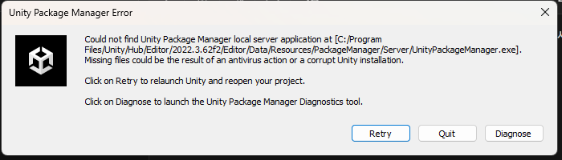

# 08. 자주 나오는 문제 (FAQ)

> **질문·답변 시트에 올라온 것 중 여러 사람에게 해당되는 것**을 정리해두는 문서입니다.
> 시트 주소는 **E-class 공지**에 있습니다. 여기 없는 문제는 시트에 적어주세요.

**증상으로 찾으세요.** 원인이 뭔지는 몰라도 됩니다. "화면이 이렇게 나온다"만 알면 됩니다.

| 증상 | 어디로 |
|---|---|
| Unity가 안 열리고 오류창이 반복된다 | [1번](#1-unity가-안-열리고-unity-package-manager-error가-반복됩니다) |
| 공격했는데 몬스터가 너무 일찍/안 맞는다 | [2번](#2-공격-모션-장수를-늘렸더니-몬스터가-너무-일찍-맞습니다) |
| Play를 눌렀는데 파란 화면만 나온다 | [3번](#3-play를-눌렀는데-파란-화면만-나오고-게임이-없습니다) |
| Console에 노란 경고가 잔뜩 뜬다 | [01-④ 프로젝트 열기](01_시작하기4_프로젝트열기.md)의 "Console에 뜨는 메시지" |

---

## 1. Unity가 안 열리고 `Unity Package Manager Error`가 반복됩니다



```
Could not find Unity Package Manager local server application at
[C:\Program Files\Unity\Hub\Editor\2022.3.62f2\Editor\Data\Resources\
 PackageManager\Server\UnityPackageManager.exe]
Missing files could be the result of an antivirus action or a corrupt
Unity installation.
```

### 원인 - 백신이 Unity 파일을 지운 것입니다

**여러분 잘못이 아니고 프로젝트가 깨진 것도 아닙니다.** 백신 프로그램이 Unity의 정상 파일 하나(`UnityPackageManager.exe`, 약 41MB)를 바이러스로 **잘못 보고 지우거나 격리**한 것입니다. 오류창 자신이 그렇게 말하고 있습니다 - `could be the result of an antivirus action`.

**GitHub 쪽과는 무관합니다.** 저장소를 만들고 내려받는 것까지 끝냈다면 그 부분은 정상입니다.

### 해결 순서

**① 파일이 있는지 먼저 확인**

탐색기(내 PC)를 열고 위쪽 **주소창에 아래를 그대로 붙여넣고** Enter:

```
C:\Program Files\Unity\Hub\Editor\2022.3.62f2\Editor\Data\Resources\PackageManager\Server
```

이 폴더에 `UnityPackageManager.exe`가 있는지 봅니다.

| | |
|---|---|
| **파일이 없다** | 백신이 지운 것입니다 → ② |
| **파일이 있다** | 백신이 실행을 막는 것입니다 → ②의 **예외 등록만** |

**② 백신에서 복원하고 예외로 등록**

> ⚠️ **순서가 중요합니다.** 예외 등록을 먼저 하지 않으면 파일을 되살려도 **또 지워집니다.**
>
> ⚠️ **백신 자체를 끄지 마세요.** 예외 폴더만 지정하면 됩니다.

**Windows 보안을 쓰는 경우**

1. 시작 버튼 → `Windows 보안` 검색해서 실행
2. `바이러스 및 위협 방지`
3. `보호 기록` → 목록에서 Unity 관련 항목 → `작업` → **`허용`**
4. 다시 `바이러스 및 위협 방지` → `설정 관리` → 아래로 내려 `제외` → `제외 추가 또는 제거` → `제외 추가` → `폴더` → **`C:\Program Files\Unity`**

**알약 · V3 등을 쓰는 경우**

1. 프로그램의 `격리소`(또는 치료 내역)에서 Unity 관련 항목을 찾아 **복원**
2. 설정의 `검사 제외` 또는 `예외 폴더`에 **`C:\Program Files\Unity`** 추가

**③ Unity 다시 실행**

Unity Hub에서 프로젝트를 다시 엽니다. 같은 오류창이 뜨면 **`Retry`** 를 한 번 눌러보세요.

**④ 그래도 안 되면 - Unity 다시 설치**

파일이 완전히 지워져 복원이 안 되는 경우입니다.

Unity Hub → 왼쪽 `설치` → `2022.3.62f2` 오른쪽 톱니바퀴 → `제거` → 다시 `에디터 설치`로 `2022.3.62f2` 설치 (**모듈은 처음과 똑같이** 체크 - [01-① Unity 설치](01_시작하기1_유니티설치.md))

**30분 이상 걸리니 시간 여유가 있을 때 하세요.** 설치 전에 ②의 예외 등록을 먼저 해두면 같은 일이 반복되지 않습니다.

### 「학교에서 그랬는데 집 컴퓨터에서도 그럴까요?」

**아닙니다. 별개입니다.** 지운 것은 **그 컴퓨터에 깔린 백신**이라, 다른 컴퓨터는 아무 상관이 없습니다.

다만 **집 백신도 같은 오인을 할 수는 있습니다.** 걱정되면 설치하기 전에 ②의 **예외 등록만 미리** 해두세요. 1분이면 됩니다.

---

## 2. 공격 모션 장수를 늘렸더니 몬스터가 너무 일찍 맞습니다

> **증상 예** - 공격 모션을 10장으로 바꾼 뒤, **칼을 높이 들어올리고 아직 휘두르지도 않았는데** 그 순간 몬스터가 맞습니다.
>
> **반대 증상도 같은 원인입니다** - 장수를 줄였더니 **아무리 때려도 몬스터가 안 맞습니다.** 그런데 **에러는 하나도 안 뜹니다.**

### 원인 - 판정 프레임 번호가 그림 장수와 안 맞습니다

**"몇 번째 그림에서 몬스터가 맞는가"를 사람이 숫자로 지정하게 되어 있습니다.** Unity가 자동으로 맞춰주지 않습니다.

기본값은 **`Attack 1 Damage Frame` = 3**, 즉 **4장짜리 공격의 3번째 그림**입니다. 칼을 거의 다 휘두른 지점이죠.

**그런데 그림을 10장으로 늘리면, 그 `3`은 10장 중 3번째가 됩니다.** 아직 칼을 들어올리는 중인 그림입니다. **숫자는 그대로인데 뜻이 달라진 것입니다.**

### 해결

1. `ActionTest` 씬에서 `Hierarchy`의 **`Player_ActionTest`** 클릭
2. 오른쪽 `Inspector`에서 **`Player Action Test Controller`** 를 찾아 아래로 스크롤
3. **`Attack 1 Damage Frame`** 을 실제로 맞는 것처럼 보이는 그림 번호로 바꿉니다
4. `Play`를 눌러 확인합니다

> **이 숫자는 1부터 셉니다.** 위쪽 `Attack 1 Frames`의 `Element`는 0부터 시작하는데 여기는 1부터입니다. **`Element 3`(네 번째 그림)에서 맞게 하려면 `4`를 넣습니다.**

**2타와 필살기도 각각 따로 있습니다** - `Attack 2 Damage Frame`, `Special Damage Frame`. 그 동작의 장수를 바꿨다면 같이 확인하세요.

### 더 자세히

**[W02 플레이어 캐릭터 Inspector](<../주차별수업/W02_플레이어_캐릭터2(인스팩터).md>)의 `4-2. 판정 프레임`** 에 관련 숫자가 전부 표로 정리되어 있습니다. **이 게임에서 사고가 가장 자주 나는 곳**이니 장수를 바꿨다면 한 번 훑어보세요.

이펙트가 나오는 시점(`Attack 1 Effect Start Frame`)과 칼 휘두르는 소리 시점(`Attack 1 Swing Frame`)도 **같은 성격의 숫자**라 함께 어긋납니다.

---

## 3. Play를 눌렀는데 파란 화면만 나오고 게임이 없습니다

> **증상 예** - Unity는 정상적으로 열렸고 빨간 에러도 없는데, **`Play(▶)`를 누르면 파란 화면(또는 짙은 회색 한 가지 색)만** 보입니다. 캐릭터도 배경도 없습니다.

### 원인 - 씬(Scene)을 아직 안 열었습니다

**고장이 아닙니다. 게임 화면은 제대로 떠 있습니다.** 다만 **그 안이 비어 있는 것**입니다.

Unity를 처음 열면 **아무것도 없는 빈 화면**이 하나 열려 있습니다. 프로젝트 폴더 안에 게임이 다 들어 있어도, **어느 장면을 열지는 여러분이 직접 골라야 합니다.** 빈 화면에는 카메라 하나뿐이라, 재생하면 **카메라의 배경색만** 보입니다. 그 색이 파란색입니다.

### 내 경우가 맞는지 - 두 군데만 보세요

| 어디를 | 이렇게 보이면 씬을 안 연 것입니다 |
|---|---|
| **창 맨 위 제목줄** | 프로젝트 이름 뒤에 **`- Untitled -`** 라고 적혀 있습니다. `Untitled`는 **"이름 없는 빈 화면"** 이라는 뜻입니다 |
| **왼쪽 `Hierarchy` 창** | 맨 위가 `Untitled`이고, 그 아래 **`Main Camera` 딱 하나뿐**입니다 |

**씬을 제대로 열면 제목줄의 `Untitled`가 `Title`처럼 바뀌고, `Hierarchy`에 오브젝트가 여러 개 나옵니다.**

### 해결 - 씬 파일을 더블클릭하세요

1. 아래쪽 **`Project`** 창에서 **`Assets`** → **`_Project`** → **`00_Scenes`** → **`Flow`** 폴더로 들어갑니다
2. **`Title.unity`** 를 **더블클릭**합니다 ← **이 단계가 빠진 것입니다**
3. 위쪽 **`Play(▶)`** 버튼을 누릅니다

**타이틀 화면이 뜨면 정상입니다.** [01-④ 프로젝트 열기](01_시작하기4_프로젝트열기.md)의 **「첫 실행 확인」** 과 같은 내용입니다.

> **이 수업에서 씬은 여러 개입니다.** `00_Scenes` 안이 **`Flow`**(타이틀·컷신)와 **`Stages`**(액션 테스트·배경 테스트)로 나뉘어 있고, **주차별 과제마다 열어야 할 씬이 다릅니다.** 각 주차 문서 앞부분에 어느 씬을 여는지 적혀 있습니다.
>
> **씬을 바꿀 때는 `Play`를 먼저 끄세요.** 재생 중에 만진 값은 `Play`를 끄는 순간 전부 원래대로 돌아갑니다.

### 같이 나오는 오해 - 「프로젝트 이름이 `game-p`가 아닌데요?」

**정상입니다.** Unity Hub는 **폴더 이름**을 프로젝트 이름으로 보여줍니다.

`game-p`는 **원본 템플릿**의 이름입니다. 여러분은 그것을 복사해서 **본인 저장소**를 만들었으니, 내려받은 폴더도 Unity Hub에 뜨는 이름도 **본인 저장소 이름**입니다. **이게 맞게 된 것입니다.**

**확인할 것은 이름이 아니라 안쪽입니다.** `Project` 창에 **`Assets` → `_Project`** 가 있고 그 아래 **`00_Scenes`부터 `10_Builds`까지** 폴더가 나열되어 있으면 제대로 받아진 것입니다.

---

## 여기 없는 문제는

**질문·답변 시트에 적어주세요.** 주소는 **E-class 공지**에 있습니다.

- 어느 씬에서, 무엇을 한 다음에 그랬는지를 구체적으로
- 에러는 스크린샷을 함께
- **다른 사람 질문도 읽어보세요.** 같은 문제를 이미 누군가 물어봤을 수 있습니다

여러 사람에게 해당되는 답은 이 문서에 정리해서 올립니다.
