# 08. 자주 나오는 문제 (FAQ)

> **질문·답변 시트에 올라온 것 중 여러 사람에게 해당되는 것**을 정리해두는 문서입니다.
> 시트 주소는 **E-class 공지**에 있습니다. 여기 없는 문제는 시트에 적어주세요.

**증상으로 찾으세요.** 원인이 뭔지는 몰라도 됩니다. "화면이 이렇게 나온다"만 알면 됩니다.

| 증상 | 어디로 |
|---|---|
| Unity가 안 열리고 오류창이 반복된다 | [1번](#1-unity가-안-열리고-unity-package-manager-error가-반복됩니다) |
| 공격했는데 몬스터가 너무 일찍/안 맞는다 | [2번](#2-공격-모션-장수를-늘렸더니-몬스터가-너무-일찍-맞습니다) |
| Play를 눌렀는데 파란 화면만 나온다 | [3번](#3-play를-눌렀는데-파란-화면만-나오고-게임이-없습니다) |
| 판정 상자(충돌 범위)가 안 보인다 | [4번](#4-판정-상자충돌-범위가-화면에-안-보입니다---다시-받아도-그대로입니다) |
| 필살기 차징 그림을 어디에 그리는지 모르겠다 | [5번](#5-special_charge_frames-폴더-그림이-게임에-안-나옵니다---필살기-차징은-어디에-그리나요) |
| 그림을 바꿨더니 캐릭터·몬스터가 바닥 아래로 떨어져서 나온다 | [6번](#6-그림을-바꿨더니-바닥-아래로-떨어져서-나옵니다---그림의-기준점pivot이-틀어졌습니다) |
| 점프 그림을 늘렸는데 3장만 나온다 | [7번](#7-점프-그림을-늘렸는데-3장만-나옵니다---점프는-순서대로-재생하지-않습니다) |
| 공격할 때 캐릭터가 위쪽에 하나 더 크게 나온다 | [8번](#8-공격할-때-캐릭터가-위쪽에-하나-더-크게-나옵니다---몸-그림과-이펙트는-기준이-다릅니다) |
| GitHub에 올릴 때 씬 충돌(merge conflict) 오류가 난다 | [9번](#9-github에-올릴-때-씬-파일-충돌merge-conflict-오류가-납니다) |
| 올리는 버튼이 `Push` 가 아니라 `Publish` 로 뜬다 | [10번](#10-push-가-아니라-publish-로-뜹니다---내-저장소와-연결이-끊긴-폴더입니다) |
| 공격을 두 번 눌러도 1타만 나가고 콤보가 안 된다 | [11번](#11-공격1만-나오고-공격2콤보가-안-나옵니다---공격1이-너무-짧습니다) |
| Console에 노란 경고가 잔뜩 뜬다 | [01-④ 프로젝트 열기](01_시작하기4_프로젝트열기.md)의 "Console에 뜨는 메시지" |

---

## 1. Unity가 안 열리고 `Unity Package Manager Error`가 반복됩니다


```
Could not find Unity Package Manager local server application at
[C:\Program Files\Unity\Hub\Editor\2022.3.62f2\Editor\Data\Resources\
 PackageManager\Server\UnityPackageManager.exe]
Missing files could be the result of an antivirus action or a corrupt
Unity installation.
```

### 원인 - 백신이 Unity 파일을 지운 것입니다

**여러분 잘못이 아니고 프로젝트가 깨진 것도 아닙니다.** 백신 프로그램이 Unity의 정상 파일 하나(`UnityPackageManager.exe`, 약 41MB)를 바이러스로 **잘못 보고 지우거나 격리**한 것입니다. 오류창 자신이 그렇게 말하고 있습니다 - `could be the result of an antivirus action`.

**GitHub 쪽과는 무관합니다.** 저장소를 만들고 내려받는 것까지 끝냈다면 그 부분은 정상입니다.

### 해결 순서

**① 파일이 있는지 먼저 확인**

탐색기(내 PC)를 열고 위쪽 **주소창에 아래를 그대로 붙여넣고** Enter:

```
C:\Program Files\Unity\Hub\Editor\2022.3.62f2\Editor\Data\Resources\PackageManager\Server
```

이 폴더에 `UnityPackageManager.exe`가 있는지 봅니다.

| | |
|---|---|
| **파일이 없다** | 백신이 지운 것입니다 → ② |
| **파일이 있다** | 백신이 실행을 막는 것입니다 → ②의 **예외 등록만** |

**② 백신에서 복원하고 예외로 등록**

> ⚠️ **순서가 중요합니다.** 예외 등록을 먼저 하지 않으면 파일을 되살려도 **또 지워집니다.**
>
> ⚠️ **백신 자체를 끄지 마세요.** 예외 폴더만 지정하면 됩니다.

**Windows 보안을 쓰는 경우**

1. 시작 버튼 → `Windows 보안` 검색해서 실행
2. `바이러스 및 위협 방지`
3. `보호 기록` → 목록에서 Unity 관련 항목 → `작업` → **`허용`**
4. 다시 `바이러스 및 위협 방지` → `설정 관리` → 아래로 내려 `제외` → `제외 추가 또는 제거` → `제외 추가` → `폴더` → **`C:\Program Files\Unity`**

**알약 · V3 등을 쓰는 경우**

1. 프로그램의 `격리소`(또는 치료 내역)에서 Unity 관련 항목을 찾아 **복원**
2. 설정의 `검사 제외` 또는 `예외 폴더`에 **`C:\Program Files\Unity`** 추가

**③ Unity 다시 실행**

Unity Hub에서 프로젝트를 다시 엽니다. 같은 오류창이 뜨면 **`Retry`** 를 한 번 눌러보세요.

**④ 그래도 안 되면 - Unity 다시 설치**

파일이 완전히 지워져 복원이 안 되는 경우입니다.

Unity Hub → 왼쪽 `설치` → `2022.3.62f2` 오른쪽 톱니바퀴 → `제거` → 다시 `에디터 설치`로 `2022.3.62f2` 설치 (**모듈은 처음과 똑같이** 체크 - [01-① Unity 설치](01_시작하기1_유니티설치.md))

**30분 이상 걸리니 시간 여유가 있을 때 하세요.** 설치 전에 ②의 예외 등록을 먼저 해두면 같은 일이 반복되지 않습니다.

### 「학교에서 그랬는데 집 컴퓨터에서도 그럴까요?」

**아닙니다. 별개입니다.** 지운 것은 **그 컴퓨터에 깔린 백신**이라, 다른 컴퓨터는 아무 상관이 없습니다.

다만 **집 백신도 같은 오인을 할 수는 있습니다.** 걱정되면 설치하기 전에 ②의 **예외 등록만 미리** 해두세요. 1분이면 됩니다.

---

## 2. 공격 모션 장수를 늘렸더니 몬스터가 너무 일찍 맞습니다

> **증상 예** - 공격 모션을 10장으로 바꾼 뒤, **칼을 높이 들어올리고 아직 휘두르지도 않았는데** 그 순간 몬스터가 맞습니다.
>
> **반대 증상도 같은 원인입니다** - 장수를 줄였더니 **칼을 다 휘두르고 동작이 끝날 때쯤에야 몬스터가 맞습니다.** 판정 번호가 장수보다 크면 **마지막 그림으로 밀리기** 때문입니다. 그런데 **에러는 하나도 안 뜹니다.**

### 원인 - 판정 프레임 번호가 그림 장수와 안 맞습니다

**"몇 번째 그림에서 몬스터가 맞는가"를 사람이 숫자로 지정하게 되어 있습니다.** Unity가 자동으로 맞춰주지 않습니다.

기본값은 **`Attack 1 Damage Frame` = 3**, 즉 **4장짜리 공격의 3번째 그림**입니다. 칼을 거의 다 휘두른 지점이죠.

**그런데 그림을 10장으로 늘리면, 그 `3`은 10장 중 3번째가 됩니다.** 아직 칼을 들어올리는 중인 그림입니다. **숫자는 그대로인데 뜻이 달라진 것입니다.**

### 해결

1. `ActionTest` 씬에서 `Hierarchy`의 **`Player_ActionTest`** 클릭
2. 오른쪽 `Inspector`에서 **`Player Action Test Controller`** 를 찾아 아래로 스크롤
3. **`Attack 1 Damage Frame`** 을 실제로 맞는 것처럼 보이는 그림 번호로 바꿉니다
4. `Play`를 눌러 확인합니다

> **이 숫자는 1부터 셉니다.** 위쪽 `Attack 1 Frames`의 `Element`는 0부터 시작하는데 여기는 1부터입니다. **`Element 3`(네 번째 그림)에서 맞게 하려면 `4`를 넣습니다.**

**2타와 필살기도 각각 따로 있습니다** - `Attack 2 Damage Frame`, `Special Damage Frame`. 그 동작의 장수를 바꿨다면 같이 확인하세요.

### 더 자세히

**[W02 플레이어 캐릭터 Inspector](<../주차별수업/W02_플레이어_캐릭터2(인스팩터).md>)의 `4-2. 판정 프레임`** 에 관련 숫자가 전부 표로 정리되어 있습니다. **이 게임에서 사고가 가장 자주 나는 곳**이니 장수를 바꿨다면 한 번 훑어보세요.

이펙트가 나오는 시점(`Attack 1 Effect Start Frame`)과 칼 휘두르는 소리 시점(`Attack 1 Swing Frame`)도 **같은 성격의 숫자**라 함께 어긋납니다.

---

## 3. Play를 눌렀는데 파란 화면만 나오고 게임이 없습니다

> **증상 예** - Unity는 정상적으로 열렸고 빨간 에러도 없는데, **`Play(▶)`를 누르면 파란 화면(또는 짙은 회색 한 가지 색)만** 보입니다. 캐릭터도 배경도 없습니다.

### 원인 - 씬(Scene)을 아직 안 열었습니다

**고장이 아닙니다. 게임 화면은 제대로 떠 있습니다.** 다만 **그 안이 비어 있는 것**입니다.

Unity를 처음 열면 **아무것도 없는 빈 화면**이 하나 열려 있습니다. 프로젝트 폴더 안에 게임이 다 들어 있어도, **어느 장면을 열지는 여러분이 직접 골라야 합니다.** 빈 화면에는 카메라 하나뿐이라, 재생하면 **카메라의 배경색만** 보입니다. 그 색이 파란색입니다.

### 내 경우가 맞는지 - 두 군데만 보세요

| 어디를 | 이렇게 보이면 씬을 안 연 것입니다 |
|---|---|
| **창 맨 위 제목줄** | 프로젝트 이름 뒤에 **`- Untitled -`** 라고 적혀 있습니다. `Untitled`는 **"이름 없는 빈 화면"** 이라는 뜻입니다 |
| **왼쪽 `Hierarchy` 창** | 맨 위가 `Untitled`이고, 그 아래 **`Main Camera` 딱 하나뿐**입니다 |

**씬을 제대로 열면 제목줄의 `Untitled`가 `Title`처럼 바뀌고, `Hierarchy`에 오브젝트가 여러 개 나옵니다.**

### 해결 - 씬 파일을 더블클릭하세요

1. 아래쪽 **`Project`** 창에서 **`Assets`** → **`_Project`** → **`00_Scenes`** → **`Flow`** 폴더로 들어갑니다
2. **`Title.unity`** 를 **더블클릭**합니다 ← **이 단계가 빠진 것입니다**
3. 위쪽 **`Play(▶)`** 버튼을 누릅니다

**타이틀 화면이 뜨면 정상입니다.** [01-④ 프로젝트 열기](01_시작하기4_프로젝트열기.md)의 **「첫 실행 확인」** 과 같은 내용입니다.

> **이 수업에서 씬은 여러 개입니다.** `00_Scenes` 안이 **`Flow`**(타이틀·컷신)와 **`Stages`**(액션 테스트·배경 테스트)로 나뉘어 있고, **주차별 과제마다 열어야 할 씬이 다릅니다.** 각 주차 문서 앞부분에 어느 씬을 여는지 적혀 있습니다.
>
> **씬을 바꿀 때는 `Play`를 먼저 끄세요.** 재생 중에 만진 값은 `Play`를 끄는 순간 전부 원래대로 돌아갑니다.

### 같이 나오는 오해 - 「프로젝트 이름이 `game-p`가 아닌데요?」

**정상입니다.** Unity Hub는 **폴더 이름**을 프로젝트 이름으로 보여줍니다.

`game-p`는 **원본 템플릿**의 이름입니다. 여러분은 그것을 복사해서 **본인 저장소**를 만들었으니, 내려받은 폴더도 Unity Hub에 뜨는 이름도 **본인 저장소 이름**입니다. **이게 맞게 된 것입니다.**

**확인할 것은 이름이 아니라 안쪽입니다.** `Project` 창에 **`Assets` → `_Project`** 가 있고 그 아래 **`00_Scenes`부터 `10_Builds`까지** 폴더가 나열되어 있으면 제대로 받아진 것입니다.

---

## 4. 판정 상자(충돌 범위)가 화면에 안 보입니다 - 다시 받아도 그대로입니다

> **증상 예** - `Player_ActionTest`를 클릭했는데 **하늘색·빨강·주황·노랑 상자가 하나도 안 나옵니다.** 프로젝트를 지우고 **처음부터 다시 받아봐도 똑같습니다.** 그런데 **그림을 바꿔 넣거나 소리를 바꾸는 것은 다 됩니다.**

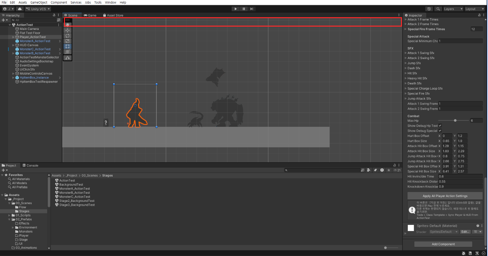

**`Player_ActionTest`는 선택되어 있고**(왼쪽 `Hierarchy`), `Inspector`의 `Combat` 값도 멀쩡히 들어 있습니다. **그런데 상자가 없습니다.**

**빨간 테두리 안을 보세요. 비어 있습니다.** 원래 여기에 `Gizmos` 버튼이 있는 도구 줄이 있어야 합니다.

### 원인 - 프로젝트가 아니라 「화면 표시 설정」입니다

**고장이 아닙니다. 프로젝트 문제도 아닙니다.**

판정 상자는 **프로젝트 파일에 들어 있는 그림이 아닙니다.** Unity가 **그때그때 화면에 그려주는 안내선**입니다. 그리고 그 표시를 켜고 끄는 설정은 **프로젝트가 아니라 Unity 프로그램 쪽에 저장됩니다.**

> ★ **그래서 프로젝트를 새로 받아도 안 고쳐집니다.** 새로 받는 것은 프로젝트를 바꾸는 일이고, 이 설정은 프로젝트 밖에 있기 때문입니다.

**그림과 소리 교체가 잘 된다면 프로젝트는 멀쩡한 것입니다.** 그것이 오히려 증거입니다.

### 해결 - 세 군데를 차례로 봅니다

**① 화면 위쪽 도구 줄이 살아 있는지**

`Scene` 탭 바로 아래에 **아이콘이 늘어선 줄**이 있어야 합니다. 판정 상자를 켜고 끄는 버튼이 거기 있습니다. **이 줄이 통째로 사라지는 일이 있습니다.**

Unity 위쪽 메뉴에서 되돌립니다.

**`Window` → `Layouts` → `Default`**

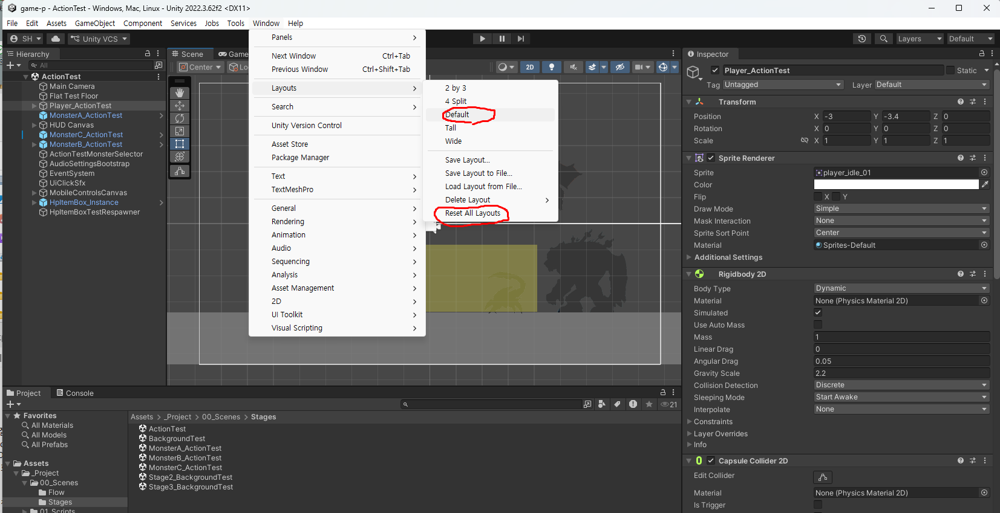

**그래도 안 돌아오면 같은 메뉴의 `Reset All Layouts`** 를 누릅니다. **이미 `Default` 배치를 쓰고 있으면 `Default`를 눌러도 아무 일이 안 일어나기 때문입니다.**

> **작업한 내용은 사라지지 않습니다.** 창 배치만 처음 상태로 되돌리는 것입니다.

**② `Gizmos` 버튼이 켜져 있는지**

도구 줄이 돌아왔으면, **오른쪽 끝 동그란 아이콘**이 `Gizmos` 버튼입니다. 꺼져 있으면 눌러서 켭니다.

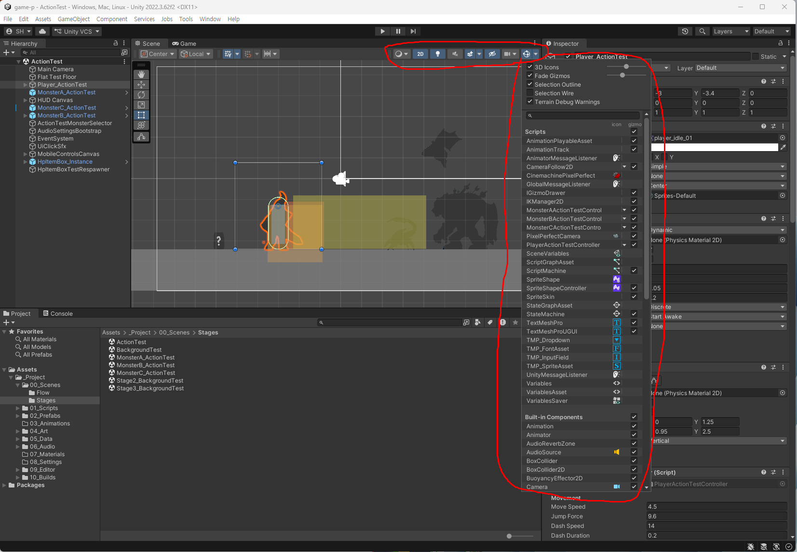

**③ 목록에서 `PlayerActionTestController`가 켜져 있는지**

`Gizmos` 버튼 옆 **작은 화살표(`▾`)** 를 누르면 목록이 열립니다. 거기서 **`PlayerActionTestController`** 를 찾아 **오른쪽 끝 체크박스**를 확인합니다.

> **여기가 꺼져 있으면 ②를 켜도 주인공 상자만 안 나옵니다.** 몬스터 상자는 멀쩡한데 주인공 것만 없다면 이 경우입니다.

**셋을 확인한 뒤 `Hierarchy`에서 `Player_ActionTest`를 클릭하면** 상자가 나옵니다.

### 그래도 안 보이면

`Player_ActionTest`를 선택하고 **`Inspector` 맨 위**로 올려서, **`Player Action Test Controller`** 항목 **왼쪽의 체크박스**가 켜져 있는지 보세요. **꺼져 있으면 상자가 그려지지 않습니다.**

### 알아둘 것

- **이 상자들은 `Player_ActionTest`를 「선택했을 때만」 나옵니다.** 선택을 풀면 사라지는 것이 정상입니다
- **몬스터도 같습니다.** `MonsterA/B/C_ActionTest`를 선택하면 그쪽 상자가 나옵니다

**관련 문서**

- [W02 플레이어 캐릭터1(기본)](<../주차별수업/W02_플레이어_캐릭터1(기본).md>) - 「판정 박스 보기」. 상자의 색이 각각 무슨 뜻인지
- [Unity 공식 매뉴얼 - Gizmos 메뉴](https://docs.unity3d.com/kr/2022.3/Manual/GizmosMenu.html) - **목록에 있는 항목이 아주 많습니다.** 여기서 다 설명하지 않으니, 궁금하면 이 문서를 보세요

---

## 5. `special_charge_frames` 폴더 그림이 게임에 안 나옵니다 - 필살기 차징은 어디에 그리나요

> **증상 예** - `special_charge_frames` 폴더에 차징 그림을 넣었는데 **게임에 안 나옵니다.** 원래 들어 있던 그림도 **다른 캐릭터(흰 졸라맨)** 입니다. 플레이해보면 **기 모으는 동작도, 터뜨리는 동작도 `special_fire_frames` 그림으로** 나오는 것 같습니다.

### 원인 - 쓰지 않는 옛 폴더가 남아 있었습니다

**보신 그대로입니다.** `special_charge_frames` 는 **예전 버전에서 쓰던 폴더가 지워지지 않고 남은 것**입니다. 게임은 이 폴더를 쓰지 않습니다.

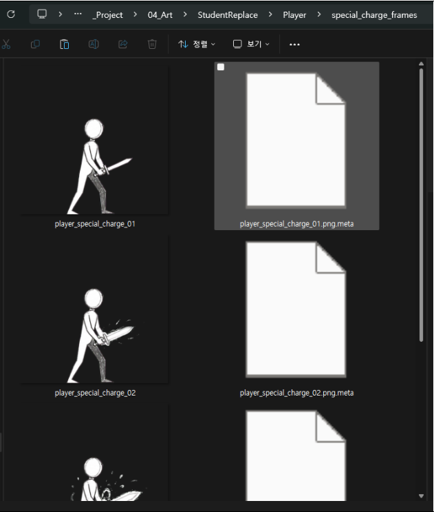

**그래서 캐릭터도 다릅니다.** 게임은 정상으로 돌아가서 티가 나지 않았고, 그래서 배포 전에 걸러지지 않았습니다.

> **필살기는 차징과 발동이 모두 `special_fire_frames` 한 폴더에 들어갑니다.**

### 이렇게 그리세요

| `special_fire_frames` 그림 | 무엇 | 규칙 |
|---|---|---|
| **1번, 2번** | **차징** (기 모으기) | **반드시 2장** - 1장이나 3장 이상은 안 됩니다 |
| **3번부터 끝까지** | **발동** (터뜨리기) | **장수 자유** |

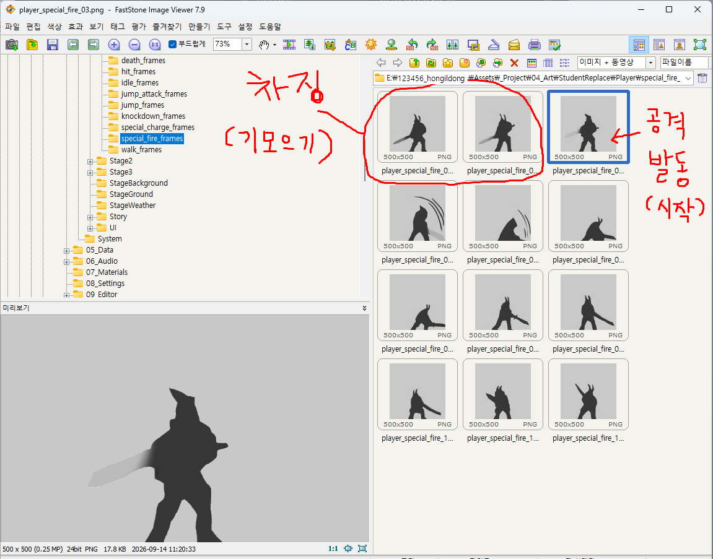

**`special_charge_frames` 폴더는 그리지 않아도 됩니다.** 폴더와 안의 그림은 **지우지 말고 그대로 두세요.**

### 차징 두 장 - 알아둘 것 둘

**① `K`(또는 마우스 우클릭)를 누르고 있는 동안 보이는 것은 2번입니다.**

누르는 순간 1번이 **아주 잠깐(0.07초)** 나오고, 곧바로 2번으로 넘어가 **누르는 동안 2번에서 멈춰 있습니다.**

> **기 모으는 대표 자세는 2번에 그리세요.** 1번에 그리면 거의 안 보입니다.

그동안 캐릭터 주위에서 **기 모으는 이펙트가 반복**됩니다. 차징의 움직임은 몸이 아니라 **이 이펙트가 담당**합니다 (`Effects/SpecialChargeEffect_frames`).

**② 1번과 2번은 비슷한 자세로 그리세요.**

`K`(또는 마우스 우클릭)를 떼면 발동이 **3번이 아니라 1번부터** 다시 재생됩니다.

```
누르는 동안   1번 → 2번 (멈춤)
떼는 순간     1번 → 2번 → 3번 → 4번 → ... → 끝
```

**1번과 2번이 크게 다르면, 떼는 순간 동작이 되감기듯 튑니다.**

### ★ 인스팩터 번호 = 그림 파일 번호

발동 중 **「몇 번째 그림에서 무슨 일이 일어나는가」** 를 정하는 숫자는, **그림 파일 이름의 번호를 그대로** 적습니다. 차징과 발동이 한 폴더에 있으니 **1번(차징)부터 셉니다.**

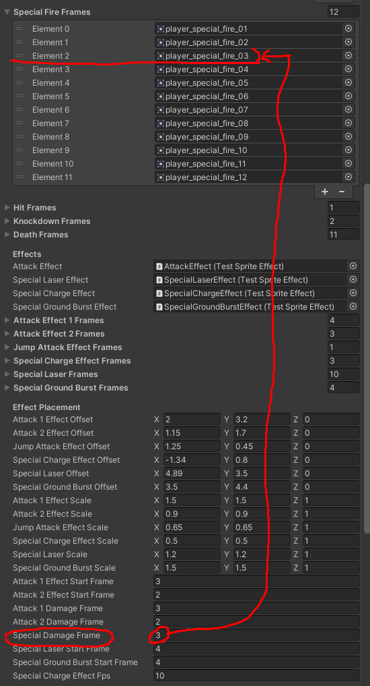

| 인스팩터 항목 | 기본값 | 가리키는 그림 |
|---|---|---|
| `Special Damage Frame` | `3` | `player_special_fire_03` = **발동 첫 장**에서 몬스터가 맞음 |
| `Special Laser Start Frame` | `4` | `player_special_fire_04` 에서 광선 시작 |
| `Special Ground Burst Start Frame` | `4` | `player_special_fire_04` 에서 지면 폭발 시작 |

> ★ **`player_special_fire_03` 에서 맞게 하려면 `3`, `_05` 에서 맞게 하려면 `5`** 를 적습니다. 파일 번호 그대로입니다.
>
> 발동이 들어가는 순간은 동작에 따라 **4번이나 5번으로 늦출 수도 있습니다.** 의도에 따라 정하세요. 다만 너무 늦으면 어색하게 느껴집니다.
>
> ⚠️ 위 그림에서 보듯 **`Special Fire Frames` 목록은 `Element 0` 부터** 셉니다. `Element 2` 가 `_03` 입니다. **목록 칸 번호가 아니라 파일 이름 번호를 보세요.**

**발동 장수를 바꿨다면 이 둘도 맞춥니다.**

| 항목 | 맞출 값 |
|---|---|
| `Special Fire Frames` (Sprites 묶음) | **전체 장수** = 차징 2 + 발동 장수 |
| `Special Fire Frame Times` (Frame Timing 묶음) | **칸 수도 전체 장수.** 이 목록은 **`Element 0` 부터** 세니, `Element 0` = 1번 그림입니다 |

> `Special Damage Frame` 은 1부터, `Special Fire Frame Times` 는 `Element 0` 부터 셉니다. **같은 필살기인데 세는 방식이 다릅니다.** [Inspector 항목 설명 6절](<../주차별수업/W02_플레이어_캐릭터2(인스팩터).md>)에도 적혀 있습니다.

### 확인할 때 - 1초 이상 누르고 있다가 떼기

**`K`(또는 마우스 우클릭)를 1초 이상 누르고 있다가 떼세요.** 그보다 짧게 떼면 필살기가 **취소**됩니다(`Special Minimum Charge Time`). 고장이 아닙니다.

**관련 문서**

- [W02 Inspector 항목 설명](<../주차별수업/W02_플레이어_캐릭터2(인스팩터).md>) - **4절** 판정 프레임 · **6절** Frame Timing · **7절** Special Attack

---

## 6. 그림을 바꿨더니 바닥 아래로 떨어져서 나옵니다 - 그림의 기준점(Pivot)이 틀어졌습니다

> **증상 예**
> - 그림을 새것으로 바꾸고 Play했더니 **몸이 바닥에 파묻히거나 바닥보다 아래로 떨어져서** 나옵니다
> - **어떤 동작은 멀쩡하고 어떤 동작만** 떨어집니다
> - 한 동작 안에서 **어떤 프레임만 갑자기 커지고 아래로 내려갑니다** (애니메이션이 덜그럭거려 보입니다)

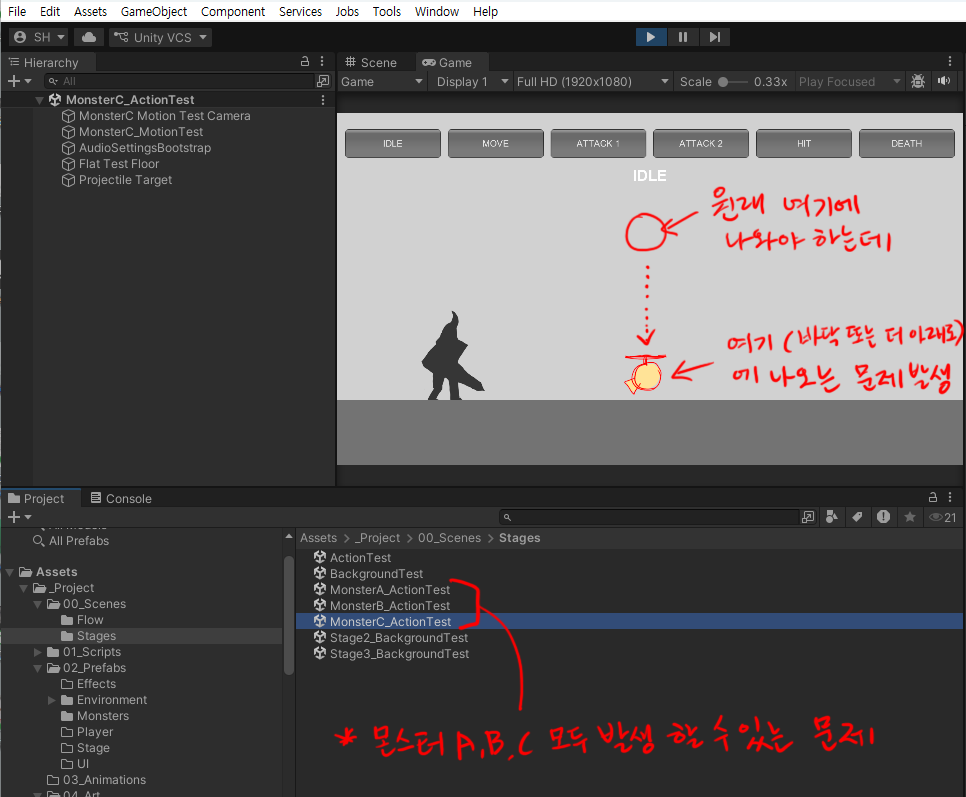

**몬스터 A·B·C, 주인공 모두 생길 수 있습니다.**

### 원인 - 그림의 「설정표(meta)」가 기본값이 되었습니다

그림 파일 옆에는 이름이 같은 **`.meta` 파일**이 하나씩 붙어 있습니다. 이게 그 그림의 **설정표**입니다. 어디를 기준점으로 세울지(`Pivot`), 크기 비율을 얼마로 할지(`Pixels Per Unit`) 가 여기 적혀 있습니다.

설정표가 없으면 Unity가 **새로 만들어 줍니다. 그런데 우리 값이 아니라 Unity 기본값으로 만듭니다.**

| | 우리 프로젝트 (몸 그림) | Unity 기본값 |
|---|---|---|
| `Pivot` | **`Bottom`** (발 기준) | `Center` (가운데 기준) |
| `Pixels Per Unit` | **`120`** | `100` |

`Center` 는 **그림의 한가운데를 발바닥 자리로 봅니다.** 그래서 그림의 아래쪽 절반이 바닥 밑으로 내려갑니다. `100` 은 `120` 보다 **1.2배 크게** 보입니다.

**설정표가 기본값이 되는 경로는 세 가지입니다.**

| 무엇을 했나 | 왜 그렇게 되나 |
|---|---|
| ① **그림을 새로 추가**했다 (프레임 장수를 늘리려고) | 새 파일에는 설정표가 아예 없습니다. **추가한 그림만** 1.2배 크게, 아래로 내려갑니다 |
| ② **meta 파일까지 지우고** 새 그림을 넣었다 | 설정표를 버린 것이라 기본값으로 다시 만들어집니다 |
| ③ 덮어쓰고 · 지우고 · 다시 넣고를 **섞어서** 했다 | 중간에 설정표가 초기화되는 경우가 있습니다 |

> **그림을 잘못 그린 것이 아닙니다.** 파일 설정만 고치면 됩니다. 특히 ①번은 **프레임을 늘리면 누구에게나 생깁니다.** 고장이 아닙니다.

> **`.meta` 파일이 안 보인다면** 정상입니다. Windows 탐색기에서 숨김 파일로 되어 있거나, Unity의 `Project` 창에서는 원래 보이지 않습니다. 없는 게 아니라 안 보이는 것입니다.

### 내 경우가 맞는지 - 그림 한 장만 눌러보세요

`Project` 창에서 **떨어져 보이는 동작 폴더의 그림 한 장**을 클릭하고 `Inspector` 를 봅니다.

| `Inspector` 에 보이는 것 | 판단 |
|---|---|
| `Pivot` 이 **`Bottom`** 또는 **`Custom`**(X 0.5 / Y 0) · `Pixels Per Unit` **`120`** | ✅ **정상** - 그대로 둡니다 |
| `Pivot` 이 **`Center`** · 또는 `Pixels Per Unit` 이 **`100`** | ❌ **이 문제입니다** |

> **처음 받은 그림은 `Custom`(X 0.5 / Y 0) 으로 보입니다.** `Bottom` 과 **위치가 똑같으니** 멀쩡한 것입니다. 고치지 마세요.

### 고치는 법 ① 몸 그림 - `Bottom` · `120`

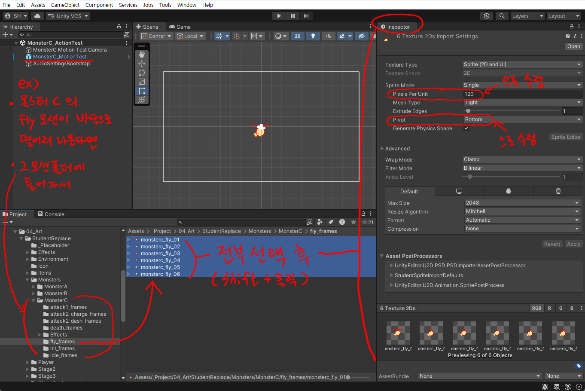

1. `Project` 창에서 **떨어져 보이는 동작의 폴더**를 클릭합니다 (예: `Monsters/MonsterC/fly_frames`)
2. 오른쪽에 그림들이 나오면 **첫 장 클릭 → 마지막 장 `Shift` + 클릭** 으로 **전부 선택**
3. `Inspector` 에서 바꿉니다

   | 항목 | 값 |
   |---|---|
   | `Pixels Per Unit` | **`120`** |
   | `Pivot` | **`Bottom`** |
   | 아래쪽 `Default` 칸의 `Compression` | **`None`** |

4. `Inspector` **오른쪽 아래 `Apply`** 클릭

> **여러 장을 한 번에 선택하면, 서로 값이 다른 칸은 `—` 로 보입니다.** 거기에 값을 넣으면 선택한 그림 전부에 들어갑니다.

> `Compression` 은 **위치와는 상관없고 화질 설정**입니다. 원래 그림들이 `None` 이라 같이 맞춥니다.

### 고치는 법 ② 이펙트·투사체 - `Center` · `120`

**이펙트는 기준점이 다릅니다.** 몸 그림과 **섞어서 선택하지 마세요.**

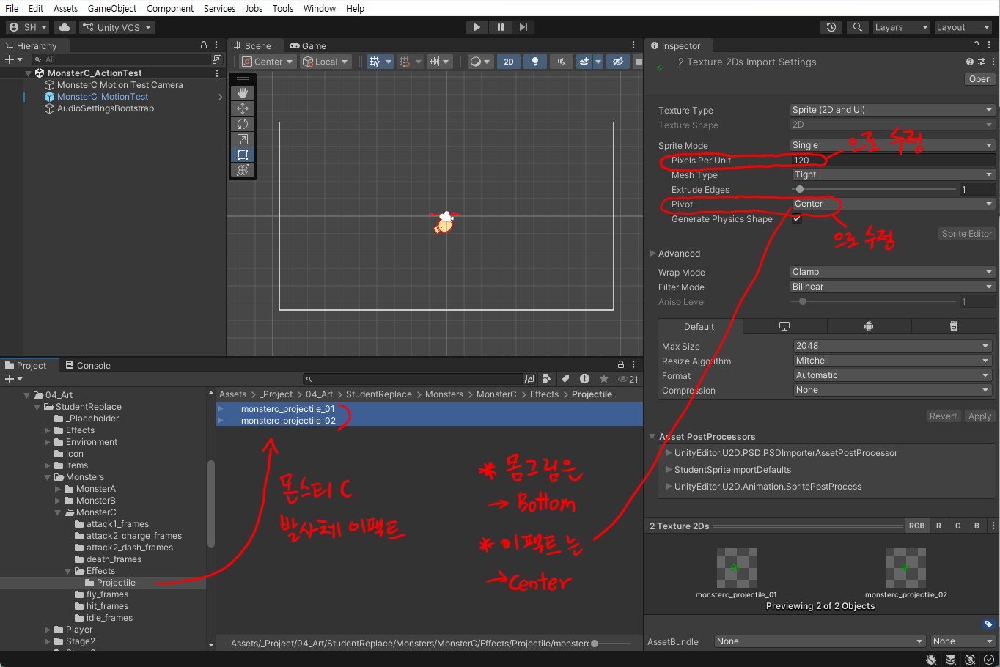

| | `Pivot` | `Pixels Per Unit` |
|---|---|---|
| **몸 그림** - `idle` · `walk` · `fly` · `jump` · `dash` · `attack` · `hit` · `death` · `knockdown` · `special` 등 | **`Bottom`** | **`120`** |
| **이펙트** - `Effects` 폴더 전부 · 몬스터 B `attack1_effect` · `attack2_effect` · 몬스터 C `Effects/Projectile` | **`Center`** | **`120`** |

### `Apply` 를 안 누르고 다른 곳을 클릭하면

**「적용하지 않은 설정이 있다」는 창**이 뜹니다.

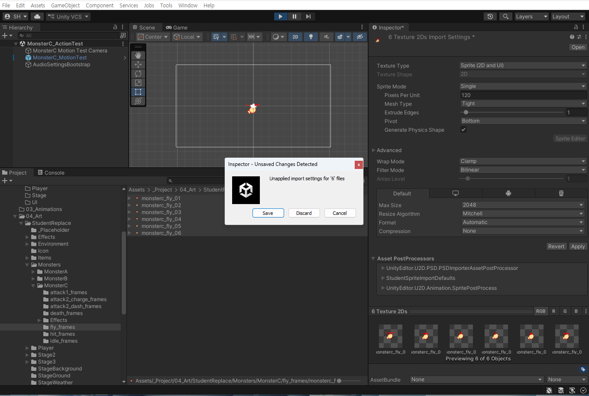

**`Save`** 를 누르면 적용됩니다. (`Discard` 는 바꾼 것을 버립니다.)

### 그림을 새로 추가할 때 - 설정을 물려받는 방법

프레임 장수를 늘리려고 그림을 새로 넣으면, **그 그림만** 기본값으로 들어옵니다. 넣을 때마다 위 ①번을 반복하지 않으려면 이렇게 하세요.

1. `Project` 창에서 **그 폴더에 이미 있는 그림 한 장**을 클릭합니다
2. **`Ctrl + D`** 를 눌러 복제합니다 (설정표까지 그대로 복사됩니다)
3. 복제된 파일의 이름을 규칙대로 바꿉니다 (예: `player_attack1_11`)
4. 탐색기에서 **그 파일을 내 그림으로 덮어씁니다**

이러면 처음부터 `120` · `Bottom` 으로 들어옵니다.

> ⚠️ **`.meta` 파일을 직접 복사해서 이름만 바꾸지 마세요.** 설정표에는 그 그림의 **고유번호**도 들어 있습니다. 복사하면 번호가 겹쳐서 Unity가 어느 그림인지 헷갈립니다. 복제는 **반드시 Unity의 `Project` 창에서 `Ctrl + D`** 로 하세요.

### meta 파일을 이미 지웠다면 - 되살릴 필요 없습니다

지운 설정표를 찾아올 필요가 없습니다. **`고치는 법 ①·②` 대로 값을 넣고 `Apply` 를 누르면, 그 값으로 설정표가 새로 만들어집니다.** 원래 파일이 없어도 됩니다.

> **그래도 meta는 지우지 않는 편이 좋습니다.** 설정이 날아가는 것도 문제지만, 고유번호가 바뀌면서 **인스펙터에 연결해둔 것이 끊어지는 일**도 생깁니다. 그림이 안 나오거나 칸이 비어버리는 식입니다.
>
> 그림을 바꿀 때는 **파일 이름을 똑같이 맞춰서 이미지만 덮어쓰세요.** meta는 그대로 두면 됩니다.

**파일 작업은 어디서 하나**

| 하려는 것 | 어디서 |
|---|---|
| 그림 **교체** | 탐색기에서 **같은 이름으로 덮어쓰기** (meta는 그대로 둠) |
| 그림 **추가 · 삭제 · 이름 변경** | **Unity의 `Project` 창 안에서** |

`Project` 창에서 지우면 meta도 같이 정리됩니다. 탐색기에서 지우면 meta만 남아 경고가 뜹니다.

### 확인하고 적용하기 - 몬스터

**몬스터는 세 단계로 확인합니다.** 3주차 몬스터 작업 순서와 같습니다.

**① 몬스터 테스트 씬에서 1차 확인**

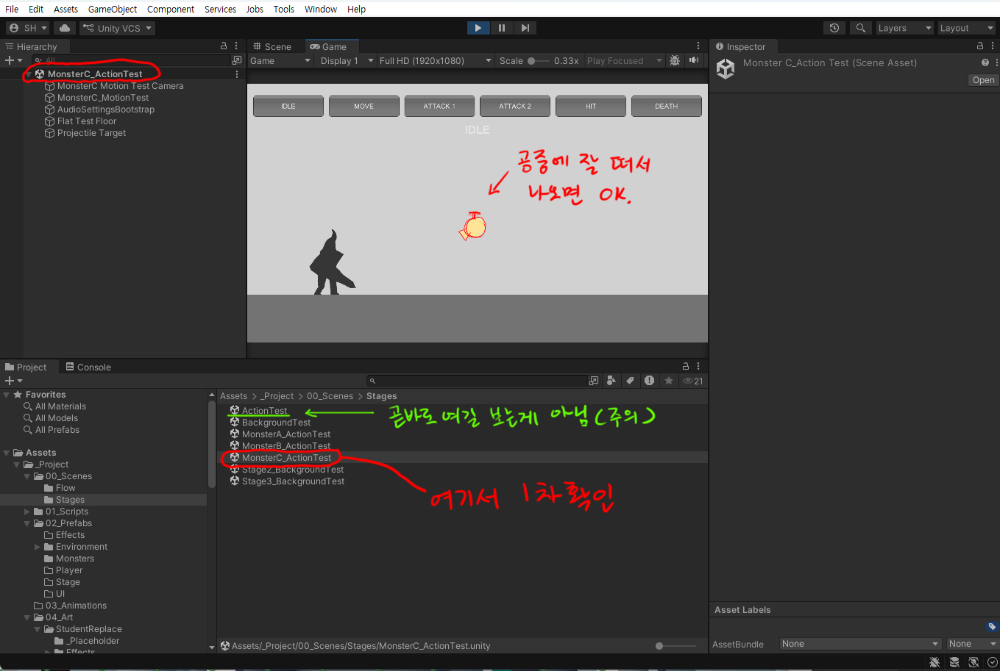

`Stages` 폴더에서 **그 몬스터의 테스트 씬**(예: `MonsterC_ActionTest`) 을 열고 Play → 위쪽 동작 버튼을 눌러 **제자리에 나오는지** 봅니다.

> ⚠️ **곧바로 `ActionTest` 를 보지 마세요.** 먼저 몬스터만 나오는 테스트 씬에서 확인합니다.

**② `Apply Monster ○ Settings To Prefab` 으로 적용**

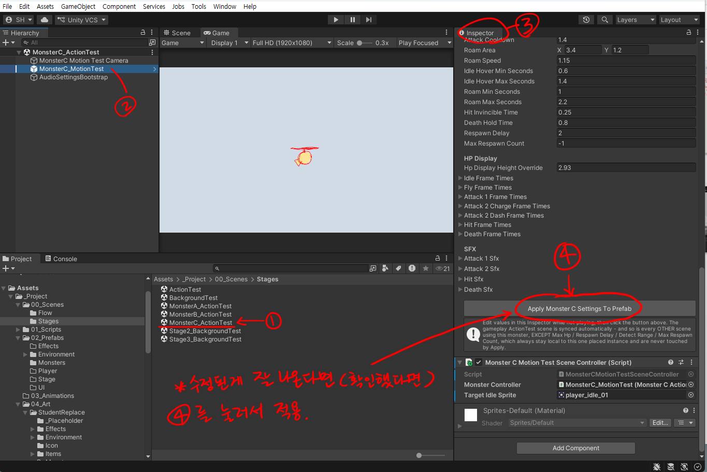

**① 테스트 씬** → **② `Hierarchy` 에서 몬스터 클릭** → **③ `Inspector`** 맨 아래 → **④ `Apply Monster ○ Settings To Prefab`**

**③ `ActionTest` 씬에서 최종 확인**

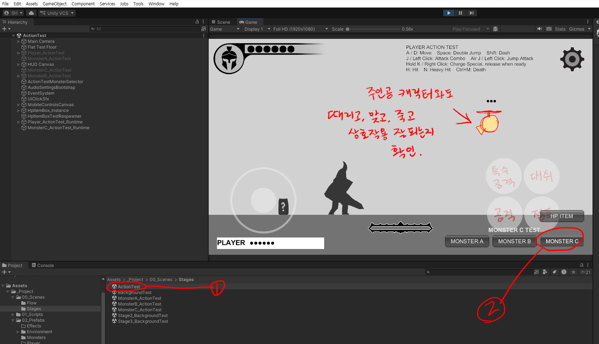

`ActionTest` 씬을 열고 Play → 오른쪽 아래 **`MONSTER A` / `B` / `C`** 버튼으로 몬스터를 고른 뒤, **주인공과 때리고 · 맞고 · 죽는 것**이 잘 되는지 봅니다.

**한눈에 보면**

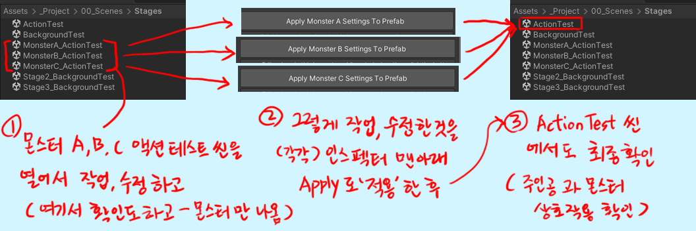

### 주인공이라면

**고치는 법 ①·② 는 똑같습니다.** 확인은 **`ActionTest` 씬**에서 바로 합니다. 주인공은 프리팹이 없어서 `Apply ... To Prefab` 단계가 없습니다.

**관련 문서**

- [3주차 몬스터](<../주차별수업/W03_몬스터1(기본).md>) - 4절 Unity에 적용하기 (`Apply` · 테스트 씬)
- [2주차 주인공](<../주차별수업/W02_플레이어_캐릭터1(기본).md>) - 캔버스에서 발 위치를 어디에 그리나

---

## 7. 점프 그림을 늘렸는데 3장만 나옵니다 - 점프는 순서대로 재생하지 않습니다

> **증상 예** - `jump_frames` 를 **7장으로 늘렸는데 3장만** 나옵니다. `idle` 과 `walk` 는 늘린 만큼 다 나오는데 **점프만** 그렇습니다.

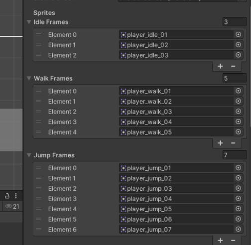

**잘못한 것이 없습니다. 프로그램이 그렇게 만들어져 있습니다.**

### 원인 - 점프는 다른 동작과 재생 방식이 다릅니다

`idle` 과 `walk` 는 넣은 그림을 **1번부터 끝까지 순서대로** 반복 재생합니다. 그래서 장수를 늘리면 늘린 만큼 다 나옵니다.

점프는 순서대로 재생하지 않습니다. **지금 캐릭터가 어떤 상태인지 보고, 정해진 번호의 그림을 골라서** 보여줍니다.

| 지금 상태 | 나오는 그림 |
|---|---|
| 뛰어오르는 순간 (약 0.1초) | **1번** |
| 올라가는 중 | **2번** |
| 가장 높은 지점 ~ 떨어지는 중 | **3번** |
| 땅에 닿는 순간 | **맨 마지막 장** |

그래서 **7장을 넣으면 1 · 2 · 3번과 7번만 나오고, 4 · 5 · 6번은 영원히 나오지 않습니다.** 3장만 나온다고 느끼는 것이 맞습니다. 7번(착지)은 아주 짧게 스쳐서 못 보고 지나가기 쉽습니다.

> **왜 이렇게 만들었나** - 공중에 떠 있는 동안 그림이 계속 바뀌면 오히려 어색해 보입니다. 올라갈 때는 올라가는 자세로, 내려올 때는 내려오는 자세로 **버텨주는 편이 자연스럽습니다.** 상용 게임에서도 점프는 이 방식을 많이 씁니다.

### 동작마다 재생 방식이 다릅니다

| 동작 | 재생 방식 | 장수 |
|---|---|---|
| `idle` | 순서대로 **반복** (초당 6장) | 자유 |
| `walk` | 순서대로 **반복** (초당 10장) | 자유 |
| `attack1` · `attack2` · `dash` · `jump_attack` · `hit` · `knockdown` · `death` · `special_fire` | 순서대로 **한 번** 재생 | 자유 |
| `jump` | **상태에 따라 골라서** 표시 | **4장 권장** |

> `attack1` · `attack2` · `special_fire` 는 장수를 바꾸면 **「몇 번째 프레임에서 판정이 나가는가」 숫자도 같이 확인**해야 합니다 → [2번 항목](#2-공격-모션-장수를-늘렸더니-몬스터가-너무-일찍-맞습니다)

### 고치는 법 - 점프는 4장으로 그립니다

| 번호 | 그릴 내용 |
|---|---|
| **1번** | 뛰어오르는 순간 - 무릎을 펴며 땅을 차는 자세 |
| **2번** | 올라가는 중 - 몸이 위로 쭉 뻗은 자세 |
| **3번** | 정점과 하강 - 다리를 모으거나 아래를 보는 자세 |
| **4번** | 착지 - 무릎을 굽혀 충격을 받는 자세 |

1. `Player_ActionTest` 를 클릭 → `Inspector` 의 `Jump Frames` 개수를 **`4`** 로
2. 위 순서대로 그림을 채웁니다
3. `Ctrl + S` 로 씬 저장

이미 7장을 그렸다면 **그중 네 장을 고르면 됩니다.** 나머지도 지우지 말고 폴더에 그대로 두세요.

> **7장을 그대로 두어도 게임은 정상으로 돌아갑니다.** 다만 4 · 5 · 6번은 화면에 안 나옵니다. 그려둔 그림을 보이게 하려면 **1 · 2 · 3번과 맨 마지막 자리**에 원하는 그림을 옮겨 넣으세요.

### 착지 그림이 안 보인다면

착지는 **순식간에 지나갑니다.** 높은 곳에서 떨어뜨려 보면 조금 더 잘 보입니다. 잠깐이라도 보였다면 정상입니다.

**관련 문서**

- [04. Unity 적용 가이드](04_Unity_적용_가이드.md) - 프레임 개수를 바꾸는 경우
- `Assets/_Project/04_Art/StudentReplace/Player/readme.txt` - 동작 폴더 12개 설명

---

## 8. 공격할 때 캐릭터가 위쪽에 하나 더 크게 나옵니다 - 몸 그림과 이펙트는 기준이 다릅니다

> **증상 예** - 공격하면 **같은 포즈의 캐릭터가 위쪽에 하나 더** 나옵니다. 그 그림은 **바닥에서 떠 있고 더 큽니다.** 다른 동작은 멀쩡합니다.

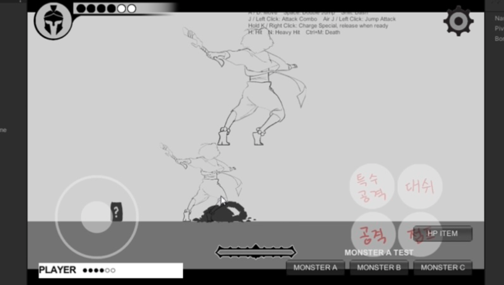

### 왜 이렇게 보이나 - 몸과 이펙트는 기준이 다릅니다

이 게임은 공격할 때 **몸 그림**과 **검격 이펙트 그림**을 **따로 겹쳐서** 보여줍니다. 그런데 이 둘은 기준이 완전히 다릅니다.

| | **몸 그림** (`Player` 폴더) | **이펙트 그림** (`Effects` 폴더) |
|---|---|---|
| 기준점 (`Pivot`) | 캔버스 **아래쪽** (발) | 캔버스 **정가운데** |
| 화면에 나오는 위치 | 바닥에 그대로 | 캐릭터보다 **위로 띄워서** |
| 크기 | 그대로 | **확대** (공격 1타는 1.5배) |
| 캔버스 크기 | **500x500 고정** | 자유 (원본은 768x512) |

이펙트는 **검격이 캐릭터 머리 위쪽에서 크게 번쩍이라고** 이렇게 만들어져 있습니다. 그래서 **이펙트 자리에 몸 그림이 들어가면, 그 몸이 위로 뜨고 크기까지 커진 채로 하나 더 나옵니다.**

**이펙트 자리에 몸 그림이 들어가는 경로는 두 가지입니다.** ①번이 훨씬 흔합니다.

### ① 인스펙터의 이펙트 칸에 몸 그림이 연결된 경우 - 먼저 여기를 보세요

**그림은 멀쩡한데 넣는 자리를 잘못 고른 경우입니다.** 프레임 개수를 늘리면서 빈 칸을 채울 때, `Project` 창에서 옆 폴더의 몸 그림을 끌어다 넣기 쉽습니다.

**확인 - 칸에 들어 있는 파일 이름만 보면 됩니다**

1. `ActionTest` 씬에서 `Hierarchy` 의 **`Player_ActionTest`** 를 클릭
2. `Inspector` 에서 **`Attack Effect 1 Frames`** 앞의 삼각형을 펼칩니다 (공중 공격이면 `Jump Attack Effect Frames`)
3. `Element 0`, `Element 1` … 칸에 들어 있는 **파일 이름**을 봅니다

| 칸에 보이는 이름 | 판단 |
|---|---|
| `effect_attack1_01` 처럼 **`effect_` 로 시작** | ✅ 정상 |
| `player_attack1_05` 처럼 **`player_` 로 시작** | ❌ **이 문제입니다** |

**고치는 법**

- 잘못 들어간 칸을 **`effect_` 로 시작하는 올바른 그림으로 바꿉니다** (칸 오른쪽 끝 ⊙ 버튼을 누르면 목록에서 고를 수 있습니다)
- 그 칸이 아예 필요 없으면 **배열 개수를 줄여서 칸을 없앱니다**
- 끝나면 `Ctrl + S` 로 씬 저장

> **이펙트 장수와 몸 그림 장수는 달라도 됩니다.** 몸이 10장이라고 이펙트도 10장일 필요는 없습니다. 검격이 번쩍이는 동안만 있으면 됩니다. **빈 칸을 억지로 채우지 마세요.**

### ② 이펙트 그림 자체에 몸이 그려진 경우

`Assets/_Project/04_Art/StudentReplace/Effects/` 안에서 해당하는 폴더를 열어봅니다.

| 이펙트 폴더 | 짝이 되는 동작 |
|---|---|
| `AttackEffect01_frames` | `Player/attack1_frames` (공격 1타) |
| `AttackEffect02_frames` | `Player/attack2_frames` (공격 2타) |
| `JumpAttackEffect_frames` | `Player/jump_attack_frames` (공중 공격) |
| `SpecialChargeEffect_frames` | 필살기 차지 중 |
| `SpecialLaser_frames` · `SpecialGroundBurst_frames` | `Player/special_fire_frames` (필살기 발동) |

그림에 **캐릭터 몸이 같이 그려져 있으면** 몸을 지우고 **검격 · 빛 · 폭발만** 남깁니다. 몸은 `Player` 폴더에만 있으면 됩니다. 이펙트는 **캔버스 정가운데**를 기준으로, 캔버스 크기는 **원본과 비슷한 비율**로 잡으세요.

> **왜 따로 그리나** - 몸과 이펙트가 분리되어 있어야 **검격만 크게 키우거나, 위치를 옮기거나, 이펙트만 다른 색으로** 바꿀 수 있습니다. 붙여서 그리면 그 조절이 전부 막힙니다.

### ①·② 둘 다 아니라면 - 몸 그림 쪽을 보세요

| 확인할 것 | 어떻게 |
|---|---|
| 몸 그림 `Pivot` 이 `Center` · `Custom` 으로 남아 있는지 | [6번 항목](#6-그림을-바꿨더니-바닥-아래로-떨어져서-나옵니다---그림의-기준점pivot이-틀어졌습니다) 대로 `Bottom` · `120` · `None` → **`Apply`** |
| 캔버스가 **500x500** 이 맞는지 | 더 크면 그만큼 크게 나옵니다 |
| **발 아래에 여백**이 있는지 | `Pivot Bottom` 은 캐릭터 발이 아니라 **캔버스 맨 아래**가 기준입니다. 여백만큼 뜹니다 |

> **「발이 아래에 있는지 확인했다」** 고 해도 다시 보세요. 그림 기준이 아니라 **캔버스 맨 아랫줄 기준**입니다.

### 이펙트 위치나 크기를 바꾸고 싶다면

그림을 고치지 않고 `Inspector` 에서 조절할 수 있습니다. `Player_ActionTest` 를 클릭하고 아래로 내리면 `Attack1 Effect Offset`(위치), `Attack1 Effect Scale`(크기) 같은 값이 있습니다. 조금씩 바꿔가며 Play로 확인하세요.

**관련 문서**

- `Assets/_Project/04_Art/StudentReplace/Effects/readme.txt` - 이펙트 폴더 규격
- [04. Unity 적용 가이드](04_Unity_적용_가이드.md) - 프레임 개수를 바꾸는 경우
- [6번 항목](#6-그림을-바꿨더니-바닥-아래로-떨어져서-나옵니다---그림의-기준점pivot이-틀어졌습니다) - 몸 그림과 이펙트의 `Pivot` 차이

---

## 9. GitHub에 올릴 때 씬 파일 충돌(merge conflict) 오류가 납니다

> **증상 예** - Console에 **`The file 'Assets/_Project/00_Scenes/Stages/ActionTest.unity' seems to have merge conflicts.`** 가 뜹니다. GitHub Desktop에서도 충돌이 났다고 나옵니다.

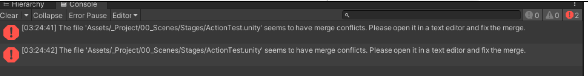

### 원인 - 같은 씬 파일을 양쪽에서 각각 고쳤기 때문입니다

**Unity를 켜둔 채로 올려서 생긴 문제가 아닙니다.** Unity가 켜져 있어도 올리는 것 자체는 됩니다.

GitHub에 올라가 있는 씬과 내 컴퓨터의 씬이 **서로 다르게 바뀐 상태**에서 합치려고 하면, Git은 어느 쪽이 맞는지 판단할 수 없습니다.

글자로 된 파일이면 Git이 알아서 섞어줍니다. 그런데 **Unity 씬 파일은 20만 자가 넘는 설정 덩어리**라서 섞으면 깨집니다. 그래서 Git이 손을 놓고 **「직접 고치세요」** 라고 알려준 것이 그 메시지입니다. **고장이 아니라 안내입니다.**

이런 때 생깁니다.

- 학교에서 작업해 올리고, 집에서 **받지 않은 채로** 작업한 뒤 올릴 때
- 한 컴퓨터에서 올린 것을 다른 컴퓨터에서 `Pull` 하지 않고 작업했을 때

### 예방 - 이 습관이면 충돌이 안 납니다

1. **작업을 시작하기 전에 `Pull origin` 을 먼저 누릅니다** ← 제일 중요합니다
2. 작업이 끝나면 Unity에서 `Ctrl + S` 로 씬 저장 → Unity 종료 → `Commit` → `Push origin`
3. **한 번에 한 컴퓨터에서만** 작업합니다

> 실제 개발 현장에서도 씬 충돌은 자주 일어납니다. 그래서 팀마다 **「씬은 한 사람만 건드린다」** 같은 규칙을 정해두고 일합니다.

### 이미 났다면

1. **Unity를 완전히 종료합니다**
2. 어느 쪽을 살릴지 정합니다 - **씬 파일 하나를 통째로** 골라야 합니다. 반반 섞을 수 없습니다

   | 상황 | 선택 |
   |---|---|
   | 내 컴퓨터의 작업이 더 최신 | 내 것을 살립니다 |
   | GitHub에 올라간 것이 더 최신 | 그것을 받고, 내 **그림 파일만** 다시 넣습니다 |

3. 판단이 어려우면 **손대지 말고 질문 시트에 적으세요**

> **그림 파일(png)은 씬과 별개입니다.** 충돌이 나도 그림은 그대로 남습니다. 그려둔 것이 날아갈까 걱정하지 않아도 됩니다.

### ⚠️ 저장소를 지우고 새로 만들지 마세요

충돌이 안 풀린다고 저장소를 새로 만들면 **그때까지의 작업 이력이 전부 사라지고, 제출 기록도 끊깁니다.** 충돌은 저장소를 새로 만들지 않고도 항상 해결할 수 있습니다.

**관련 문서**

- [01-③ GitHub Desktop](01_시작하기3_깃허브데스크탑.md) - `Clone` · `Commit` · `Push` · `Pull`
- [05. 제출 가이드](05_제출_가이드.md)

---

## 10. `Push` 가 아니라 `Publish` 로 뜹니다 - 내 저장소와 연결이 끊긴 폴더입니다

> **증상 예** - 그림을 바꾸고 `Commit` 까지는 했는데, 올리는 버튼이 **`Push origin` 이 아니라 `Publish repository`** 로 뜹니다. **`This repository is currently only available on your local machine.`** 이라고 쓰여 있습니다.

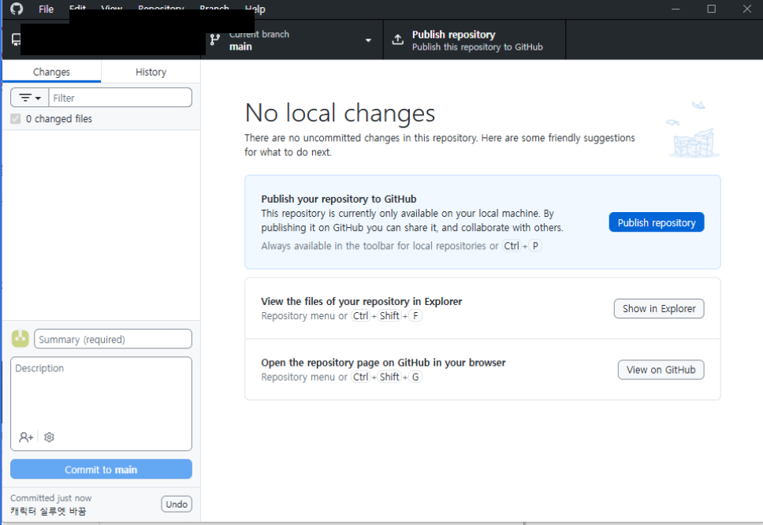

### 원인 - 지금 그 폴더는 `Clone` 으로 받은 폴더가 아닙니다

두 버튼은 뜻이 다릅니다.

| 버튼 | 뜻 |
|---|---|
| **`Push`** | 이미 인터넷에 있는 **내 저장소에 올린다** |
| **`Publish`** | 인터넷에 없으니 **새로 만들어서 올린다** |

`Publish` 가 보인다는 것은, 이 폴더가 **내 저장소와 연결되어 있지 않다**는 뜻입니다. 폴더 안에 있어야 할 연결 정보(`.git`)가 없거나 깨진 것입니다.

보통 이 두 경우입니다.

- 저장소 페이지의 초록색 `Code` 버튼에서 **`Download ZIP`** 으로 받은 경우
- 학교에서 쓰던 폴더를 **USB나 클라우드(OneDrive 등)로 복사**해 온 경우

> **둘 다 Unity로는 멀쩡히 열립니다.** 그래서 받는 순간에는 아무 문제가 없어 보이고, **올릴 때가 되어서야** 알게 됩니다. `Commit` 도 잘 됩니다. 내 컴퓨터 안에만 쌓일 뿐입니다.

### 내 경우가 맞는지 - 한 군데만 보세요

상단 메뉴 **`Repository` → `Repository settings` → `Remote`**

| 보이는 것 | 판단 |
|---|---|
| 내 저장소 주소가 들어 있다 | ✅ 정상 - 다른 문제입니다 |
| **비어 있다** | ❌ **이 문제입니다** |

### ⚠️ `Publish` 버튼은 누르지 마세요

누르면 원래 있던 내 저장소(`학번_영문이름`)와는 **별개의 저장소가 하나 더** 생깁니다. **제출물이 두 군데로 갈라져서** 나중에 훨씬 번거로워집니다.

### 고치는 법 - 작업한 그림은 없어지지 않습니다

1. **Unity를 완전히 종료합니다**
2. 지금 작업하던 폴더에서 **`Assets` · `Packages` · `ProjectSettings` 세 폴더**를 바탕화면에 복사해 둡니다 (백업)
3. GitHub Desktop → `File` → `Clone repository` → `GitHub.com` 탭 → `Your repositories` 에서 **내 저장소**를 골라 `Clone`
   - 저장 위치는 **2번 폴더와 다른 새 위치**로 정합니다
4. 새로 받아진 폴더에 2번의 세 폴더를 **덮어쓰기로 붙여넣습니다** (덮어쓸지 묻는 창이 뜨면 덮어쓰기)
5. Unity로 **새 폴더**를 열어 게임이 정상으로 도는지 확인합니다
6. GitHub Desktop에 바뀐 파일 목록이 뜹니다. `Summary` 를 적고 **`Commit to main`**
7. 이번에는 버튼이 **`Push origin`** 으로 뜹니다. 누르면 제출 완료입니다
8. 브라우저에서 내 저장소 페이지를 열어 **파일이 올라갔는지 눈으로 확인**합니다

> **왜 세 폴더를 통째로 옮기나** - 그림만 복사하면 Unity에서 맞춘 설정(프레임 개수, `Pivot`, 판정 프레임 숫자 등)이 빠집니다. 그 설정은 `Assets` 와 `ProjectSettings` 안에 들어 있습니다.

> **`Library` 폴더는 복사하지 않아도 됩니다.** 용량만 크고, Unity가 다시 만들어 줍니다.

### 앞으로 - 학교와 집을 오갈 때

**폴더를 USB나 클라우드로 옮기지 마세요.** 옮길 때마다 연결이 깨집니다.

**양쪽 컴퓨터에서 각각 한 번씩 `Clone`** 해 두고, 이 순서만 지키면 됩니다.

| 언제 | 무엇을 |
|---|---|
| 작업 **시작 전** | **`Pull origin`** - 다른 컴퓨터에서 한 작업을 받아옵니다 |
| 작업 **끝난 후** | Unity 저장 → 종료 → `Commit` → **`Push origin`** |

이렇게 쓰라고 만든 것이 GitHub입니다. 파일을 들고 다니지 않아도 되고, 실수로 지워도 되돌릴 수 있습니다.

> 시작 전에 `Pull` 을 빼먹으면 [9번 항목](#9-github에-올릴-때-씬-파일-충돌merge-conflict-오류가-납니다)의 씬 충돌이 납니다. 두 문제는 뿌리가 같습니다.

**관련 문서**

- [01-③ GitHub Desktop](01_시작하기3_깃허브데스크탑.md) - `Clone` 으로 받기 · `Download ZIP` 주의 · 이미 받아둔 폴더가 있다면
- [05. 제출 가이드](05_제출_가이드.md)

---

## 11. 공격1만 나오고 공격2(콤보)가 안 나옵니다 - 공격1이 너무 짧습니다

> **증상 예** - 공격을 **두 번 눌러도 1타만** 나가고 2타가 안 나옵니다. **키보드(`J`)로는 가끔 나오는데 마우스 클릭으로는 안 나오기도** 합니다. 그림과 연결은 다 맞게 해두었습니다.

**그림이나 설정이 잘못된 것이 아닙니다. 공격1 그림이 너무 적어서 생깁니다.**

### 원인 - 「공격1이 나오는 동안」에만 2타 입력을 받습니다

콤보는 이렇게 처리됩니다.

1. 공격을 누르면 **공격1**이 재생됩니다
2. **공격1이 재생되는 그 시간 동안에만** 두 번째 입력을 받아둡니다
3. 공격1이 끝나는 순간 확인해서, 두 번째 입력이 있었으면 **공격2**로 이어집니다

즉 **공격1의 재생 시간이 그대로 「2타를 입력할 수 있는 시간」** 입니다. 공격1이 짧으면 그 시간도 같이 짧아집니다.

**공격1 장수에 따라 이만큼 차이가 납니다** (템플릿 기본 설정 기준)

| 공격1 장수 | 2타를 넣을 수 있는 시간 | 결과 |
|---|---|---|
| **1장** | **0.10초** | 사실상 불가능 |
| **2장** | **0.25초** | 됩니다 |
| **3장** | **0.37초** | 여유 있습니다 |
| **4장** (처음 상태) | **0.47초** | 여유 있습니다 |

0.10초는 **같은 버튼을 두 번 누르는 데 걸리는 시간보다 짧습니다.** 사람이 아무리 빨라도 들어가지 않습니다.

> **키보드로는 되고 마우스로는 안 되는 이유** - 둘 다 처리는 똑같습니다. 다만 **연타 속도가 다릅니다.** 키보드는 0.1초 간격까지 간신히 되고, 마우스는 같은 버튼을 두 번 누르는 데 보통 0.15초 넘게 걸립니다. 그래서 1장일 때 키보드로만 가끔 나옵니다. **운이 아니라 장치 차이입니다.**

### 고치는 법 ① 공격1을 2장 이상으로 - 권장 3~4장

가장 간단하고 확실한 방법입니다.

1. `Player/attack1_frames` 폴더에 그림을 추가합니다
2. `Player_ActionTest` 를 클릭 → `Inspector` 의 **`Attack1 Frames`** 개수를 늘리고 채웁니다
3. **`Attack 1 Damage Frame`** 등 판정 번호도 같이 확인합니다 → [2번 항목](#2-공격-모션-장수를-늘렸더니-몬스터가-너무-일찍-맞습니다)
4. `Ctrl + S` 로 저장하고 Play로 확인합니다

동작으로도 이쪽이 낫습니다. **휘두르기 전 준비 자세**가 한 장 들어가면 타격감이 살아납니다.

### 고치는 법 ② 1장으로 가고 싶다면 - 표시 시간을 늘립니다

**공격을 아주 빠르게 보이게 하려고 일부러 1장으로 그리는 것도 선택입니다.** 그때는 그림 대신 **시간**을 늘려주면 됩니다.

1. `Player_ActionTest` 를 클릭하고 `Inspector` 를 아래로 내립니다
2. **`Attack 1 Frame Times`** 를 찾습니다. `0.1` `0.15` `0.12` `0.1` 처럼 프레임별 표시 시간이 들어 있습니다
3. **`Element 0`(첫 값)을 `0.25` ~ `0.3`** 으로 바꿉니다
4. Play로 확인합니다

그림 한 장이 그만큼 오래 보이고, 2타 입력 시간도 같이 늘어납니다.

> `Attack 1 Frame Times` 는 **그림 장수보다 값이 많아도 괜찮습니다.** 남는 값은 그냥 쓰이지 않습니다. 값이 그림보다 적으면 나머지 프레임은 기본 속도로 넘어갑니다.

### 확인 - Play에서 두 번 눌러보세요

1타만 나가면 아직 짧은 것입니다. 시간을 조금 더 늘리세요.

> **마우스로 확인할 때** - 커서가 화면의 **조그셔틀이나 버튼(공격 · 대쉬 · 특수공격 · HP ITEM) 위에 있으면 클릭이 무시됩니다.** 모바일 컨트롤을 누른 것으로 보기 때문입니다. **화면의 빈 곳**에서 클릭해보세요. 키보드 `J` 는 이 영향을 받지 않습니다.

### 다른 동작도 장수에 조건이 있습니다

| 동작 | 장수 조건 |
|---|---|
| `attack1` | **최소 2장** (1장은 콤보가 안 나갑니다) |
| `jump` | **4장 권장** - 상태별로 골라 쓰기 때문입니다 → [7번 항목](#7-점프-그림을-늘렸는데-3장만-나옵니다---점프는-순서대로-재생하지-않습니다) |
| `special_fire` | 앞의 **2장이 차징**, 3번부터 발동 → [5번 항목](#5-special_charge_frames-폴더-그림이-게임에-안-나옵니다---필살기-차징은-어디에-그리나요) |
| 나머지 동작 | 자유 |

**관련 문서**

- [03. 학생 리소스 제작규격](03_학생_리소스_제작규격.md) - 동작별 장수 조건
- [04. Unity 적용 가이드](04_Unity_적용_가이드.md) - 프레임 개수를 바꾸는 경우

---

## 여기 없는 문제는

**질문·답변 시트에 적어주세요.** 주소는 **E-class 공지**에 있습니다.

- 어느 씬에서, 무엇을 한 다음에 그랬는지를 구체적으로
- 에러는 스크린샷을 함께
- **다른 사람 질문도 읽어보세요.** 같은 문제를 이미 누군가 물어봤을 수 있습니다

여러 사람에게 해당되는 답은 이 문서에 정리해서 올립니다.
