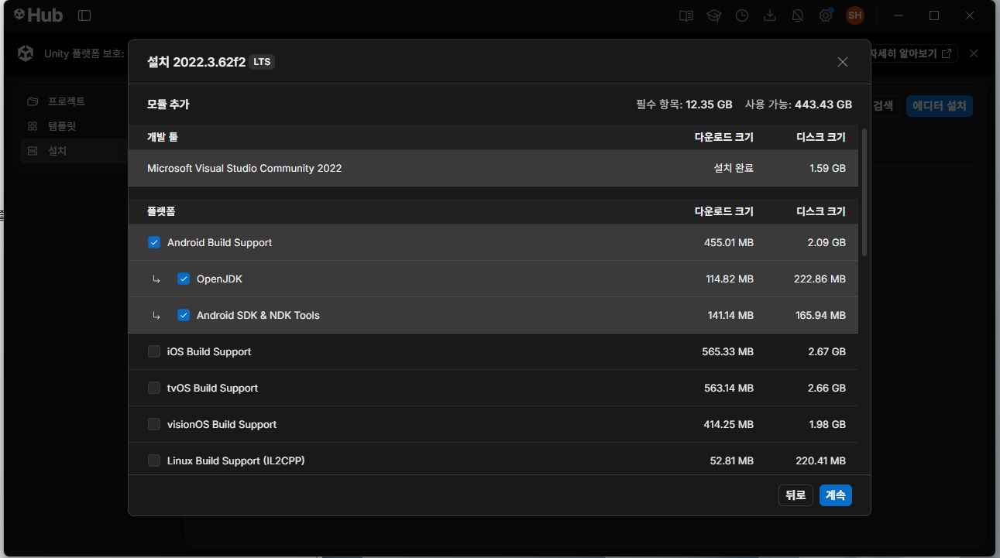
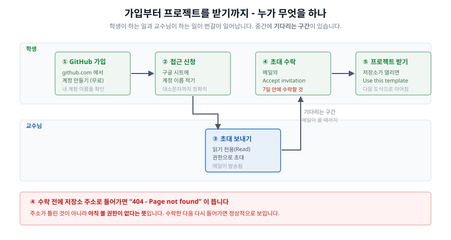
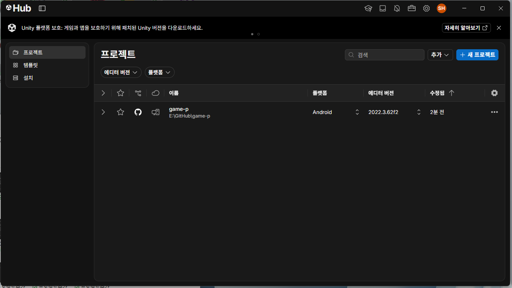
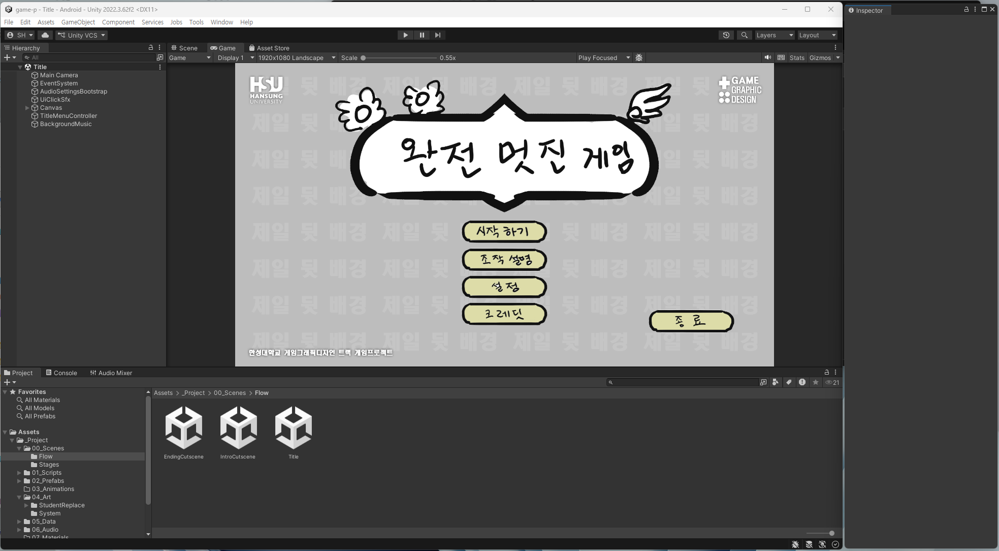

# 1주차 - 수업 개요 / Unity·GitHub 환경 구축 / 프로젝트 파악

**이번 주 목표**: 앞으로 15주 동안 무엇을 만드는지 이해하고, 내 컴퓨터에서 이 게임이 실제로 실행되는 것까지 확인한다.

---

## 1교시. 이 수업이 무엇인가

### 무엇을 만드나

**이미 완성되어 있는 2D 사이드 스크롤 액션게임**에, **내가 그린 그림과 사운드를 갈아 끼워서 나만의 게임으로 만듭니다.**

- 게임의 시스템(플레이어가 어떻게 움직이는지, 몬스터가 어떻게 공격하는지, HP가 어떻게 깎이는지)은 이미 다 만들어져 있습니다.
- 여러분은 **그 시스템 위에 올라가는 그래픽과 사운드를 전부 새로 만듭니다.**
- **코드는 한 줄도 건드리지 않습니다.**

그래서 같은 시스템으로 출발하지만, 15주 뒤에는 전원이 서로 완전히 다른 그림체의, 서로 다른 게임을 갖게 됩니다.

### 왜 이렇게 하나 - 이 수업의 목표

| 목표 | 이 수업에서 실제로 하는 것 |
|---|---|
| 게임 리소스를 **실무 방식으로** 제작·관리·적용 | 정해진 규격/파일명/폴더 구조를 지켜서 작업 |
| Unity, GitHub 같은 실무 도구를 다뤄본다 | 매주 Unity에서 확인하고 GitHub에 백업 |
| 2D 액션 게임이 어떻게 만들어지는지 이해 | 캐릭터·몬스터·배경·UI·컷신을 순서대로 제작 |
| **직접 실행되는 게임**을 완성 | 10주차/14주차에 실제 빌드 제작 |
| **빌드 파일**(배포 가능한 결과물)까지 만들어본다 | PC(.exe) + 모바일(.apk) |
| 더 큰 게임으로 확장할 수 있다는 가능성 체험 | 15주차 심화 - 스테이지 확장 |

여러분은 이미 2D 작업이 가능하고 사이드 스크롤 액션게임이 뭔지도 압니다. 이 수업에서 새로 배우는 건 **"그림을 게임 안에서 실제로 작동하게 만드는 과정"** 입니다.

### 만들 게임의 구조

```
타이틀 화면 → 인트로 컷신 → 스테이지(전투) → 스테이지 클리어 화면 → 엔딩 컷신 → 타이틀로 복귀
                                   ↓
                            (사망 시) 사망 화면
```

기본 조건:

- PC(Windows) + 모바일(Android), 1920x1080 기준 / 스테이지 1개 / 플레이 시간 약 3분
- 주인공 1명, 몬스터 3종
- 패럴렉스(여러 겹으로 원근감을 주는) 배경
- 추가로 제공되는 시스템: HP 표시, 스페셜 게이지, 일시정지 메뉴, 사망 화면, 스테이지 시작 배너/클리어 화면, HP 회복 아이템 박스, 모바일 터치 컨트롤

### 15주 로드맵

지금 전체 그림을 알아두면 매주 무엇을 왜 하는지가 훨씬 명확해집니다.

- **2~9주차 (러프 단계, 4주차는 추석 휴강)**: 컬러링 없이 스케치 상태로 캐릭터 → 몬스터 → 배경 → HUD → 타이틀 → 컷신을 순서대로 만듭니다.
- **10주차**: 여기까지 만든 것으로 **실제 빌드**를 뽑아봅니다. 이 시점에 이미 "처음부터 끝까지 돌아가는 게임"이 완성됩니다.
- **11주차**: 모바일 UI와 사운드를 추가합니다.
- **12~14주차**: 러프를 **완성본으로** 채웁니다.
- **15주차**: 발표 + 심화(스테이지 확장).

> **왜 컬러링을 나중에 하나?**
> 그림을 먼저 완성해놓고 게임에 붙였다가 크기·타이밍·동작이 안 맞으면, 그 완성도가 통째로 낭비됩니다. 실무에서도 러프로 전체를 먼저 돌려보고 확정된 다음에 마감합니다. **2~9주차는 "그림 그리기"가 아니라 "게임을 완성시키기"입니다.**

---

## 2교시. Unity 설치와 첫 실행

자세한 순서는 **[01-① Unity 설치](../기본설명/01_시작하기1_유니티설치.md)** 부터 시작하는 4부작 문서에 그대로 있습니다. 수업에서는 같이 따라 하며 진행합니다.

### 설치할 것

| 프로그램 | 용도 |
|---|---|
| Unity Hub | Unity 버전을 설치/관리하는 런처 |
| Unity **2022.3.62f2** (2022 LTS) | 실제 편집 프로그램 |
| GitHub 계정 | 내 프로젝트를 올려둘 온라인 저장 공간 (무료) |
| GitHub Desktop | 저장소를 받고 올리는 프로그램 (명령어 없이 버튼으로) |

Unity 설치 옵션(모듈) 화면에서 **반드시 체크할 것**:



- **Microsoft Visual Studio Community** (기본 체크 유지)
- **Windows Build Support (IL2CPP)** - 10주차 PC 빌드에 필요. 목록을 아래로 내리면 있습니다
- **Android Build Support** - 11주차 모바일에 필요. 왼쪽 화살표를 펼쳐서 하위 **`OpenJDK`**, **`Android SDK & NDK Tools`** 까지 **전부 체크**

> Android 관련 모듈은 용량이 크고 설치가 오래 걸립니다. **지금 미리 설치해두세요.** 나중에 처음 설치하려다 실패하는 경우가 매년 나옵니다.
>
> **처음 설치할 때 이 체크를 놓쳤어도 괜찮습니다.** Unity를 지우고 다시 깔 필요 없이 나중에 모듈만 추가하면 됩니다 - **Unity Hub → 왼쪽 `설치` 메뉴 → 해당 버전의 `관리`(톱니) 아이콘 → `모듈 추가`**.

설치 순서 전체(어느 탭에서 어떤 버전을 고르는지 포함)는 [01-① Unity 설치](../기본설명/01_시작하기1_유니티설치.md)에 화면별로 정리되어 있습니다.

### 원본 저장소 접근 권한 받기 (템플릿 복사보다 먼저)

수업에서 쓰는 원본 저장소는 **비공개**라, 초대를 받아 수락해야 열립니다. **이 단계를 건너뛰면 다음 항목에서 `404`가 뜹니다.**



**③은 여러분이 하는 일이 아닙니다.** 신청해두고 메일을 기다리는 구간이 있습니다.

1. [github.com](https://github.com) 로그인 → 오른쪽 위 **프로필 아이콘 → Your profile** → 주소창의 `github.com/` **뒤에 오는 이름**이 내 계정 이름
2. **계정 제출 시트**(주소는 **한성대 E-class → 수업 페이지 → 1주차**)에 `학번 / 이름 / 계정 이름` 한 줄 작성 (대소문자까지 그대로)
3. 초대 메일이 오면 **`Accept invitation`** 클릭 → 저장소가 보이면 성공

> ⏰ **초대는 7일 뒤 만료됩니다.** 메일을 받으면 미루지 말고 바로 수락하세요.
>
> 수락 전에 저장소 주소로 들어가면 `404`가 뜹니다. **주소가 틀린 게 아니라 아직 권한이 없다는 뜻**입니다. 화면별 안내는 [01-② GitHub 계정](../기본설명/01_시작하기2_깃허브계정.md)에 있습니다.

### 내 프로젝트 만들기 (템플릿 복사 → 내 컴퓨터로 내려받기)

**"받아온다"가 두 번 나옵니다.** ①은 인터넷 안에서 내 저장소를 만드는 것이고, 내 컴퓨터에 파일이 실제로 오는 것은 ②입니다.


1. 교수님 원본 저장소 접속 → **[github.com/hansung-game1/game-p](https://github.com/hansung-game1/game-p)**
   - 초대를 수락한 뒤에만 열립니다. `404`가 뜨면 **아직 수락을 안 한 것**입니다
2. 초록색 **Use this template → Create a new repository**
3. 저장소 이름을 **`학번_영문이름`** 형식(예: `123456_hongildong`)으로 짓고, 공개 설정을 **`Public`으로 바꾼 뒤** 생성
   - ⚠️ **이름에 한글을 쓰지 마세요.** 이 이름이 그대로 내 컴퓨터의 폴더 이름이 되는데, 한글 경로는 Unity에서 문제를 일으킬 수 있습니다 (아래 "저장 위치 주의"와 같은 이유).
   - 이렇게 만든 저장소는 **원본과 완전히 분리된 내 것**입니다. 내가 무엇을 바꿔도 원본에는 영향이 없습니다.
   - **처음엔 `Private`가 선택되어 있습니다**(원본이 비공개라서). `Public`으로 바꿔야 나중에 제출한 링크를 교수님이 열 수 있습니다. `Public`이어도 **수정 권한은 나에게만** 있으니 남이 내 작업을 건드릴 수는 없습니다.
4. GitHub Desktop → **File → Clone Repository** → 내 저장소 선택 → 저장 폴더 지정 → **Clone**

> **저장 위치 주의**: 한글이 들어간 경로, OneDrive/구글드라이브 동기화 폴더, 바탕화면은 피하세요. `C:\GameProject\` 처럼 짧고 영문인 경로를 권장합니다. 동기화 폴더 안에 두면 Unity가 파일을 쓰는 도중 동기화가 끼어들어 프로젝트가 깨지는 사고가 납니다.

### Unity에서 열기

1. Unity Hub → 왼쪽 **`프로젝트`** 탭 → 오른쪽 위 **`추가`** → 방금 클론한 폴더 선택
   - ⚠️ **`+ 새 프로젝트`를 누르면 안 됩니다.** 빈 프로젝트가 새로 만들어질 뿐입니다.
   - `Assets`, `Packages`, `ProjectSettings`가 **바로 안에 보이는** 그 폴더입니다. 안쪽에 프로젝트 폴더가 하나 더 있는 구조가 아닙니다.
2. 목록에 추가되면 이름을 클릭해서 엽니다.



3. 처음 열 때 Unity가 리소스를 정리(Import)하느라 **몇 분~십수 분** 걸립니다. 멈춘 것처럼 보여도 정상이니 기다립니다.

---

## 3교시. Unity 화면 익히기 + 게임 돌려보기

### 화면 구성 - 이 6개만 알면 됩니다



| 패널 | 역할 |
|---|---|
| **Scene** | 오브젝트를 배치하고 옮기는 "작업대" 화면 |
| **Game** | 실제 플레이 화면 그대로 |
| **Hierarchy** | 지금 열린 씬 안에 있는 오브젝트 목록 (왼쪽) |
| **Project** | 프로젝트 폴더의 모든 파일 (하단) - 내 그림을 넣을 곳을 여기서 찾습니다 |
| **Inspector** | 선택한 오브젝트/파일의 세부 설정 (오른쪽) |
| **Console** | 에러/경고 메시지 - **뭔가 이상하면 제일 먼저 여기** |

**Play(▶) 버튼은 켰다 끄는 토글입니다.** 다시 누르면 편집 화면으로 돌아옵니다.

> ⚠️ **Play 중에 바꾼 값은 Play를 끄는 순간 전부 사라집니다.** 초보자가 제일 자주 하는 실수입니다. 편집은 **항상 Play를 끈 상태에서** 하세요.

### 실습 1 - 게임 전체를 한 바퀴 돌아보기

1. `Project` 창에서 `Assets/_Project/00_Scenes/Flow/Title.unity` 더블클릭
2. **Play(▶)** → 타이틀 화면이 뜹니다
3. 버튼들을 눌러 조작설명/설정/크레딧 팝업을 확인
4. "시작하기" → 인트로 컷신 → 스테이지 → 클리어 또는 사망 → 엔딩까지 **끝까지 한 번 플레이**
5. Play를 끕니다

> 지금 화면에 나오는 그림들은 전부 임시 그림입니다. **15주 뒤에는 이 자리가 전부 여러분의 그림으로 바뀝니다.**

### 실습 2 - 조작 익히기 (ActionTest 씬)

`Assets/_Project/00_Scenes/Stages/ActionTest.unity` 를 열고 Play.

이 씬은 **캐릭터 동작만 집중해서 확인하는 테스트 전용 씬**입니다. 2주차부터 매주 여기서 확인하게 되니 조작을 익혀두세요.

| 키 | 동작 |
|---|---|
| `A` / `D` | 좌우 이동 |
| `Space` | 점프 (한 번 더 누르면 2단 점프) |
| `Shift` | 대시 |
| `J` 또는 마우스 좌클릭 | 공격 (연속으로 누르면 1타→2타 콤보) |
| 공중에서 `J` / 좌클릭 | 점프 공격 |
| `K` 또는 우클릭 **길게 누르기** | 필살기 차지 → 떼면 발동 (최소 1초) |
| `H` | (테스트용) 피격 |
| `N` | (테스트용) 강한 피격 - 넘어짐 |
| **`Ctrl` + `M`** | (테스트용) 사망 |

`H` / `N` / `Ctrl+M`은 실제 게임에는 없는, 그 동작 애니메이션만 확인하기 위한 테스트 키입니다. **사망만 `Ctrl`을 같이 누르는 이유**는, 그냥 `M`이면 조작키(`J`·`K`) 바로 아래라 플레이 중에 실수로 눌려 죽어버리기 때문입니다. **2주차 과제 영상을 찍을 때 이 키들을 써서 피격/다운/사망 동작을 보여줘야 합니다.**

### 실습 3 - 프로젝트 폴더 살펴보기

`Project` 창에서 `Assets/_Project` 를 펼쳐봅니다. 앞자리 숫자 순서로 정리되어 있습니다. 자세한 설명은 [02_Unity_프로젝트_구조](../기본설명/02_Unity_프로젝트_구조.md).

**여러분이 실제로 파일을 넣는 곳은 딱 두 군데입니다:**

```
Assets/_Project/04_Art/StudentReplace/   ← 그림 전부
Assets/_Project/06_Audio/BGM/, SFX/      ← 사운드 전부
```

`04_Art/StudentReplace` 를 펼쳐서 `Player`, `Monsters`, `StageBackground`, `UI` 같은 폴더가 용도별로 나뉘어 있는 것을 확인하세요. **대부분의 폴더 안에 `readme.txt`가 있고, 거기에 정확한 파일명과 픽셀 규격이 적혀 있습니다.** 매주 작업을 시작할 때 그 폴더의 `readme.txt`부터 여는 습관을 들이세요.

---

## 4교시. GitHub 사용법 (백업)

### 왜 GitHub를 쓰나

- 컴퓨터가 고장 나거나 파일을 실수로 날려도 **되돌릴 수 있습니다**
- 학교와 집 두 컴퓨터에서 이어서 작업할 수 있습니다
- 실무에서 그래픽 팀도 쓰는 도구라 경험 자체가 자산입니다

### 전체 그림 - 세 번을 거쳐야 올라갑니다


**`Ctrl+S` → `Commit` → `Push`.** 하나만 빠뜨려도 "올린 줄 알았는데 안 올라간" 상태가 됩니다. 지금 어디까지 왔는지는 **GitHub Desktop 화면으로** 알 수 있습니다.

### 실습 - 첫 백업

> 파일을 올렸다가 다시 지우는 **왕복 실습**은 [01-③ GitHub Desktop](../기본설명/01_시작하기3_깃허브데스크탑.md)의 "실습 - 파일 하나로 왕복해보기"에 화면별로 정리되어 있습니다. 수업에서는 그것을 같이 따라 합니다.

**아무것도 안 바꿨을 때의 화면**입니다. `No local changes` = 올릴 것이 없다는 뜻.


1. Unity에서 아무거나 바꾸고 **Ctrl+S**로 저장 (예: 씬을 열었다가 저장)
   - **저장하지 않으면 GitHub Desktop에 아무것도 안 뜹니다.**
2. **GitHub Desktop**으로 전환 → 왼쪽에 바뀐 파일 목록이 자동으로 뜹니다
3. 왼쪽 아래 **Summary** 칸에 무엇을 했는지 한 줄 입력 (예: `1주차 - 프로젝트 첫 실행 확인`)
4. **Commit to main** 클릭


5. 위쪽 **Push origin** 클릭 → 내 GitHub 저장소(온라인)에 올라갑니다


   - 커밋하면 왼쪽 목록이 비고, 위쪽에 **`Push origin`** 과 **`1↑`**(올릴 커밋 1개)이 뜹니다.
   - **여기서 멈추면 내 컴퓨터에만 저장된 상태입니다.** 가장 많이 하는 실수입니다.
6. 브라우저에서 내 GitHub 저장소 페이지를 새로고침해서 방금 올린 게 보이는지 확인

### 주의사항

| 상황 | 해야 할 것 |
|---|---|
| 작업을 시작할 때 | **Pull origin** 먼저 (특히 다른 컴퓨터에서 작업했다면 - 아래 참고) |
| 작업을 끝낼 때 | Unity에서 Ctrl+S **→** Commit **→** Push |
| Unity가 켜진 채로 Push하면? | 저장 안 한 변경은 안 올라갑니다. **반드시 Unity에서 먼저 저장** |
| `Library` 폴더가 목록에 안 보임 | 정상입니다 (Unity가 자동 생성하는 임시 폴더라 제외되어 있음) |
| 파일이 너무 많이 바뀐 것으로 표시됨 | 정상입니다. Unity는 파일 하나를 건드려도 관련 설정 파일이 같이 바뀝니다 |

### 학교와 집, 두 컴퓨터를 쓴다면

집에서 이어서 작업할 학생은 이 부분을 꼭 보세요. **매년 여기서 사고가 가장 많이 납니다.**


- 두 컴퓨터가 직접 주고받는 게 아니라 **항상 GitHub를 거칩니다.** 그래서 **앉자마자 `Pull`, 일어나기 전에 `Push`** 두 마디로 끝납니다.
- 집 컴퓨터에는 폴더가 없으니 **처음 한 번은 Clone**입니다(같은 GitHub 계정으로 로그인). **USB로 폴더를 복사해오면 안 됩니다** - 숨김 폴더 `.git`이 빠지면 GitHub와 연결이 끊깁니다.
- **학교에서 Push를 안 하고 갔다면 집에서 Pull을 해도 안 내려옵니다.** GitHub에 올라간 적이 없기 때문입니다.
- **Pull은 Unity를 닫고** 하세요. 켜둔 채로 받으면 Unity가 옛 내용을 계속 열고 있게 됩니다.

자세한 순서와 충돌(conflict)이 났을 때 대처는 [01-③ GitHub Desktop](../기본설명/01_시작하기3_깃허브데스크탑.md)의 "5. 학교와 집, 두 컴퓨터에서 작업하기" 참고.

> **습관 하나만 기억하세요: 저장 → Commit → Push.** 매주 과제를 마칠 때마다 반드시 하세요. "다음에 몰아서 해야지"가 사고의 시작입니다.

---

## 과제 (1주차)

### 필수

> 각 항목 끝의 **①~④** 는 그 단계가 설명된 문서입니다. 막히면 그것부터 여세요.
> [① Unity 설치](../기본설명/01_시작하기1_유니티설치.md) · [② GitHub 계정](../기본설명/01_시작하기2_깃허브계정.md) · [③ GitHub Desktop](../기본설명/01_시작하기3_깃허브데스크탑.md) · [④ 프로젝트 열기](../기본설명/01_시작하기4_프로젝트열기.md)

1. **환경 구축 완료**
   - Unity Hub + Unity 2022.3.62f2 설치 (Windows Build Support + Android Build Support 포함) — **①**
   - GitHub 계정 생성 — **②** / GitHub Desktop 설치·로그인 — **③**
   - **계정 제출 시트에 내 계정 이름 적기** (주소는 **한성대 E-class → 수업 페이지 → 1주차**) → 초대 메일 오면 수락 (수락해야 원본 저장소가 보입니다) — **②**
   - 템플릿으로 **내 저장소** 생성(`Public`으로) — **②** / 내 컴퓨터로 Clone — **③**
   - Unity에서 프로젝트 열기 성공 — **④**
2. **동작 확인**
   - `Title` 씬에서 Play → 엔딩까지 한 바퀴
   - `ActionTest` 씬에서 Play → 위 조작키 전부 눌러보기
3. **첫 Commit + Push** 완료 — **③**

### 함께 준비 (2주차 작업을 위한 컨셉 구상)

다음 주에 바로 **플레이어 캐릭터 작업을 합니다.** 작업하기 전에 방향을 먼저 정해두세요.

- **게임 전체의 세계관/분위기를 한 줄로**
  (예: "생명의 꽃을 구해 세계를 정화하기 위해 폐허가 된 도시에서 괴물과 싸우는 고양이 검사")
  - 이 한 줄이 게임의 **로그라인(Logline)** 입니다. **캐릭터·몬스터·배경은 물론 타이틀 화면과 컷신까지 전부 여기서 갈라져 나옵니다.**
  - 타이틀 화면과 컷신은 한참 뒤에 만듭니다. **지금은 구상만 해두면 됩니다.**
- **주인공의 컨셉**: 체형, 실루엣, 무기(근접 공격 + 필살기가 있는 캐릭터입니다), 성격
- **참고 이미지 몇 장 모아두기** (제출용이 아니라 **내 작업을 위해서**입니다)

> 컨셉을 정할 때 **실루엣**을 가장 신경 쓰세요. 게임 화면에서 캐릭터는 생각보다 작게 보입니다. 디테일보다 "멀리서 봐도 알아볼 수 있는 형태"가 완성도를 좌우합니다.

### 제출

**네이버 수업 카페**에 업로드합니다 - **[cafe.naver.com/hglab](https://cafe.naver.com/hglab)** (**가입 필수**)

- **마감: 다음 수업 전까지**
- 게시글 제목: **`2D게임제작_01주차_123456홍길동`**

제출물:

- [ ] Unity에서 게임이 실행되는 화면 **스크린샷 1장** (Game 화면이 보이게, Play 중)
- [ ] 내 **GitHub 저장소 주소(URL)** 와 그 **화면 스크린샷 1장**
- [ ] **캐릭터 컨셉 구상** (게임 로그라인 및 기타 내용 몇 줄 간단히 + 러프 스케치 - 형식 자유)

#### 캐릭터 컨셉 - 자유롭게 구상하되, 지켜야 할 규칙

이 캐릭터는 **이미 만들어져 있는 게임 시스템 위에서 움직입니다.** 그 시스템과 맞지 않는 컨셉은 2주차부터 그림을 다시 그려야 하는 상황이 됩니다.

| 항목 | 규칙 |
|---|---|
| **외형** | **자유** - 인간이어도, 동물이어도, 로봇이어도 됩니다. 단 **정해진 규격 안에서** 그릴 수 있어야 합니다 (캔버스 500x500px) |
| **전투 방식** | **근접 타격** - 기(에너지파) 발사, 대포 소환 같은 **원거리 공격형은 안 됩니다** |
| **이동 방식** | **중력의 영향을 받고 바닥(플랫폼)을 걸어 다님** - **날아다니는 캐릭터는 안 됩니다** (걷기 모션이 필요합니다) |

> ⚠️ **반드시 게임을 직접 플레이해서 파악한 다음에 구상하세요.** 실습 1·2에서 확인한 그 동작들을 2주차부터 여러분이 그리게 됩니다.
>
> **기본 구현 상태를 크게 벗어나거나 장르가 다른 컨셉은 안 됩니다.** 예를 들어 "총으로 싸우는 슈팅 게임 주인공", "하늘을 나는 비행 캐릭터"는 이 프로젝트에서 구현되지 않습니다.

### 제출 전 체크리스트

**이번 주는 그림 과제가 아니라 "환경이 실제로 돌아가는가"를 확인하는 주입니다.** 여기서 한 칸이라도 비어 있으면 **다음 주부터 작업 자체를 시작할 수 없습니다.**

- [ ] Unity 버전이 **`2022.3.62f2`** 인가 (`f1` 아님 - Unity Hub의 `Installs` 탭에서 확인)
- [ ] **Android Build Support** 모듈이 설치되어 있는가 (`Installs` → 톱니 → `Add modules`)
- [ ] 계정 제출 시트(**E-class** 1주차)에 내 GitHub 계정을 적고, **초대 메일을 수락**했는가
- [ ] 내 저장소를 **`Use this template`** 으로 만들었는가 (`Fork`나 `Download ZIP`이 아님)
- [ ] 내 저장소가 **`Public`** 인가 (시크릿 창에서 로그인 없이 열리면 정상)
- [ ] **`Clone`** 으로 받았는가 (GitHub Desktop에 저장소가 보이고 `Commit`·`Push` 버튼이 있으면 정상)
- [ ] Unity에서 프로젝트가 **에러 없이** 열리는가 (Console에 **빨간** 표시 없음 - 노란 경고와 흰 글씨는 정상입니다)
- [ ] `Title` 씬에서 Play → **엔딩까지 한 바퀴**가 돌아가는가
- [ ] `ActionTest` 씬에서 Play → **조작키가 전부** 먹는가
- [ ] Ctrl+S → Commit → **Push까지** 완료했는가
- [ ] **브라우저에서 내 저장소를 열어** 방금 올린 것이 보이는가

> ### ⚠️ Android 모듈은 지금 확인하세요
>
> 10주차 빌드에 필요한데 **설치에만 30분 이상** 걸립니다. 그 주에 시작하면 **그날 빌드를 못 만듭니다.** 지금 `Installs` 탭만 한 번 열어보면 됩니다.

> ### ⚠️ `Push`까지 해야 백업입니다
>
> `Commit`은 내 컴퓨터에만 기록하는 것이고, `Push`를 눌러야 GitHub에 올라갑니다. **컴퓨터가 고장 나면 `Commit`만 한 작업은 같이 사라집니다.** 매주 마지막에 브라우저로 확인하는 습관을 들이세요.

---

## 자주 나오는 문제

| 증상 | 원인/해결 |
|---|---|
| Unity에서 프로젝트를 열었는데 화면이 텅 비어 있음 | 씬을 아직 안 연 상태입니다. `Project` 창에서 `.unity` 파일을 더블클릭하세요 |
| Import가 30분 넘게 안 끝남 | 첫 실행은 오래 걸립니다. 그래도 안 끝나면 Unity를 종료하고 다시 여세요 |
| Console에 빨간 에러가 잔뜩 | 캡처해서 질문하세요. 대부분 Unity 버전이 다르거나 클론이 덜 된 경우입니다 |
| Play를 눌렀는데 아무 반응이 없음 | `Game` 탭을 클릭해서 활성화한 뒤 키를 누르세요 (키 입력은 Game 창이 선택된 상태에서만 들어갑니다) |
| GitHub Desktop에 저장소가 안 보임 | 로그인한 계정이 저장소를 만든 계정과 같은지 확인 |
| 다시 Clone하려니 **"Git can only clone to empty folders"** | 폴더는 그대로 있고 **목록에서만 사라진 것**입니다. Clone 말고 **`File → Add local repository`** 로 그 폴더를 다시 등록하세요 ([01-③](../기본설명/01_시작하기3_깃허브데스크탑.md)의 "이미 받아둔 폴더가 있다면") |
| GitHub Desktop에 바뀐 파일이 하나도 안 뜸 | **Unity에서 `Ctrl+S`로 저장을 안 한 것.** 저장하지 않은 변경은 잡히지 않습니다 |
| Push했는데 GitHub 사이트에 안 보임 | Commit만 하고 **Push origin을 안 누른 것**. 위쪽에 `1↑` 같은 표시가 남아 있는지 확인 |
| `Do you want to fork this repository?` 창이 뜸 | **내 저장소가 아닌 것을 클론한 것**입니다(주로 교수님 원본). `Cancel`을 누르고, `Use this template`으로 만든 **내 저장소**를 다시 클론하세요 |
| GitHub Desktop에 아예 등록이 안 되고 Commit·Push 버튼이 없음 | 웹에서 **`Code` → `Download ZIP`으로 받았거나 USB로 폴더를 복사한 것**입니다. 연결 정보(`.git`)가 없는 폴더라 백업이 안 됩니다. **`Clone`으로 다시 받으세요** (작업한 파일은 새로 받은 폴더로 옮기면 됩니다) |

## 관련 문서

- [01-① Unity 설치](../기본설명/01_시작하기1_유니티설치.md) - Unity Hub·에디터 설치, 모듈
- [01-② GitHub 계정](../기본설명/01_시작하기2_깃허브계정.md) - 계정, 초대 수락, 내 저장소 만들기
- [01-③ GitHub Desktop](../기본설명/01_시작하기3_깃허브데스크탑.md) - 내 컴퓨터로 받기, Commit·Push
- [01-④ 프로젝트 열기](../기본설명/01_시작하기4_프로젝트열기.md) - Unity로 열기, 에디터 화면
- [00_수업개요](../기본설명/00_수업개요.md) - 수업 목표와 게임 개요
- [02_Unity_프로젝트_구조](../기본설명/02_Unity_프로젝트_구조.md) - 폴더 구조
