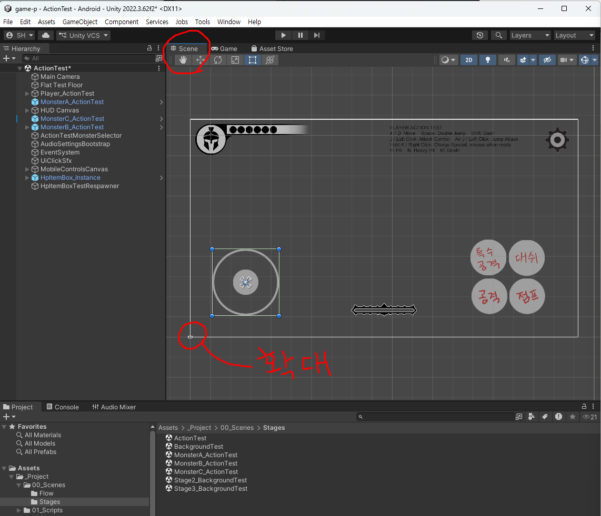
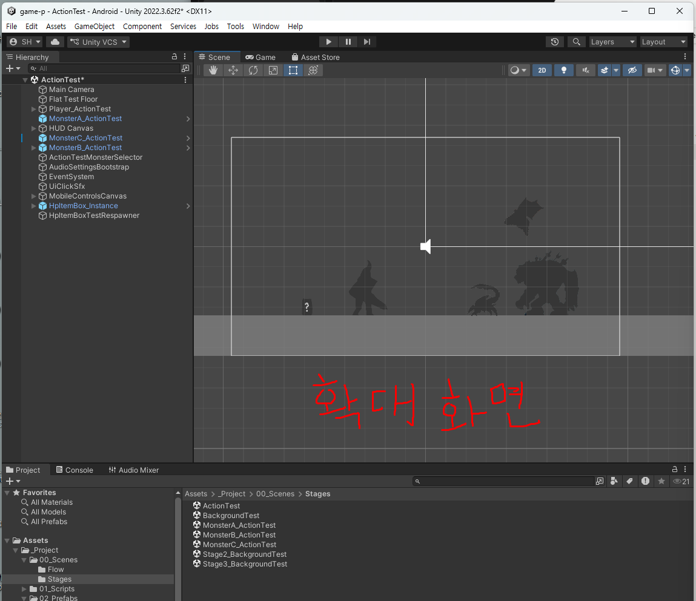
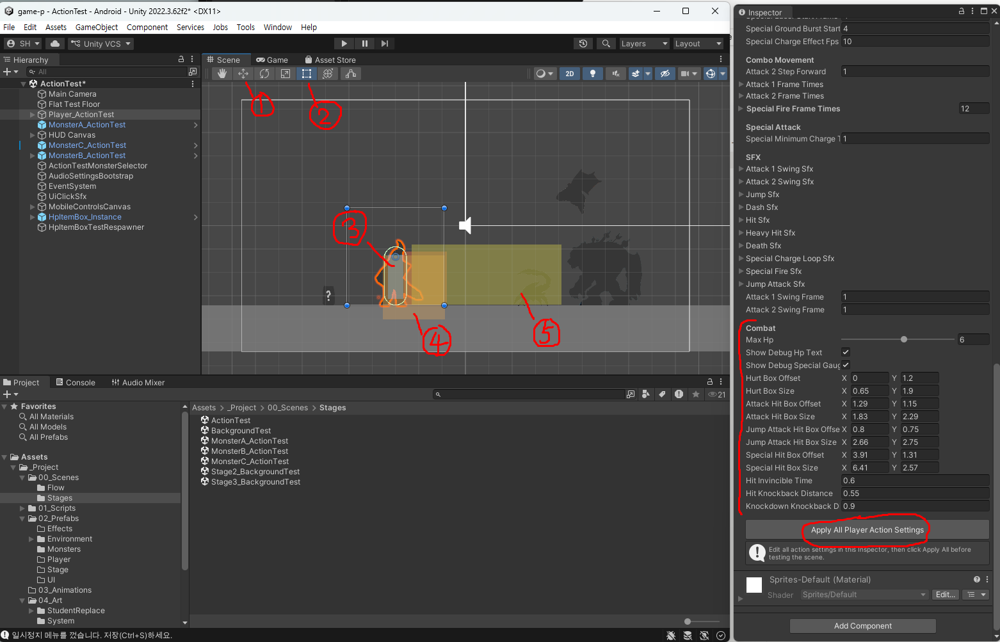
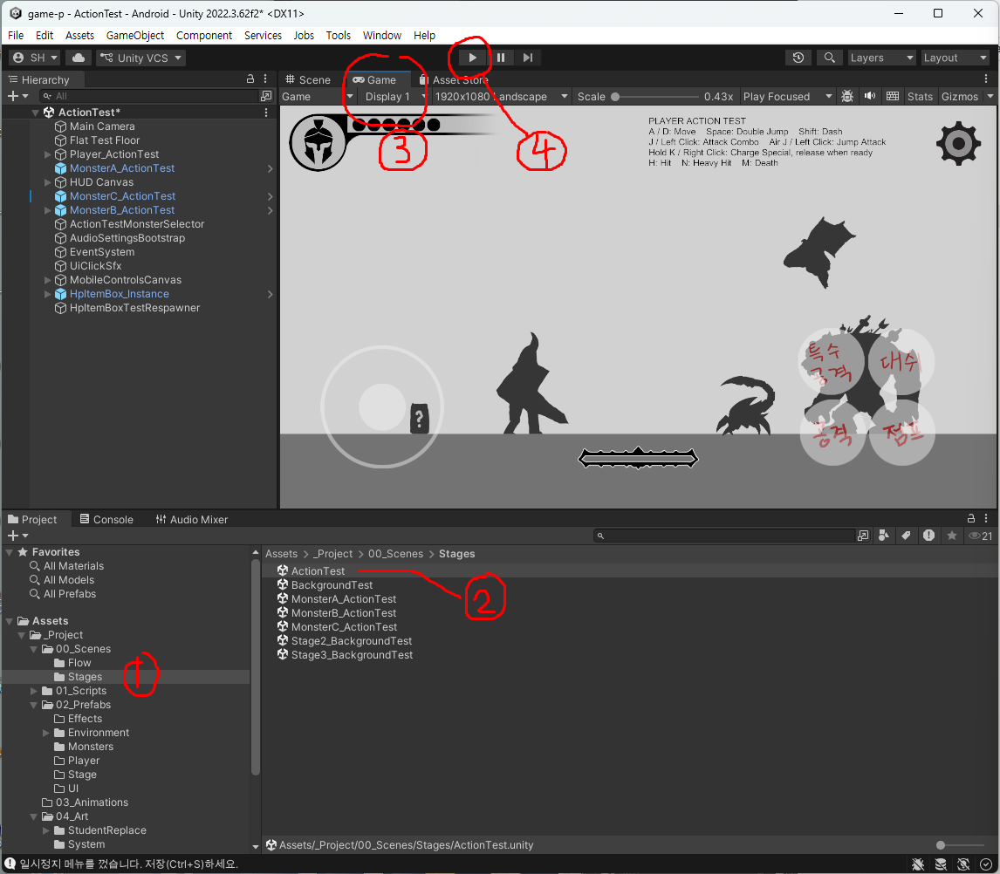
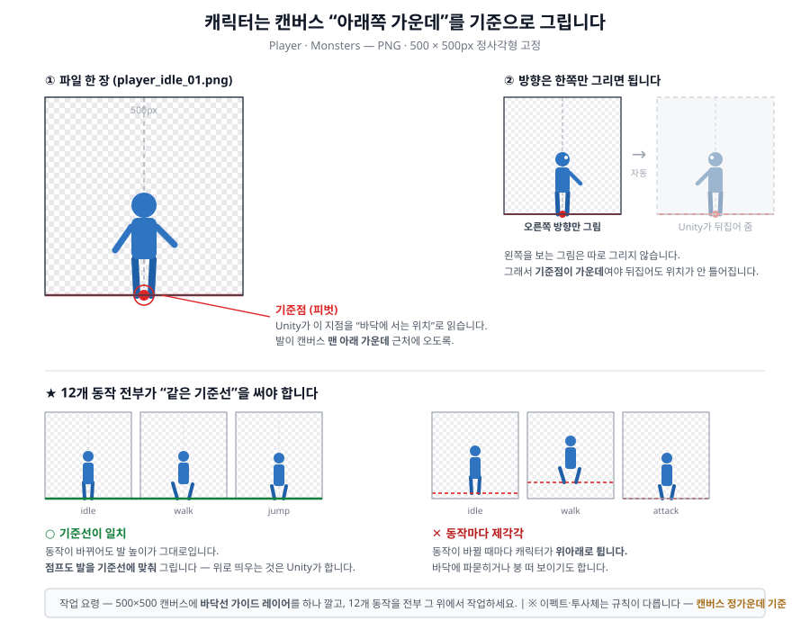
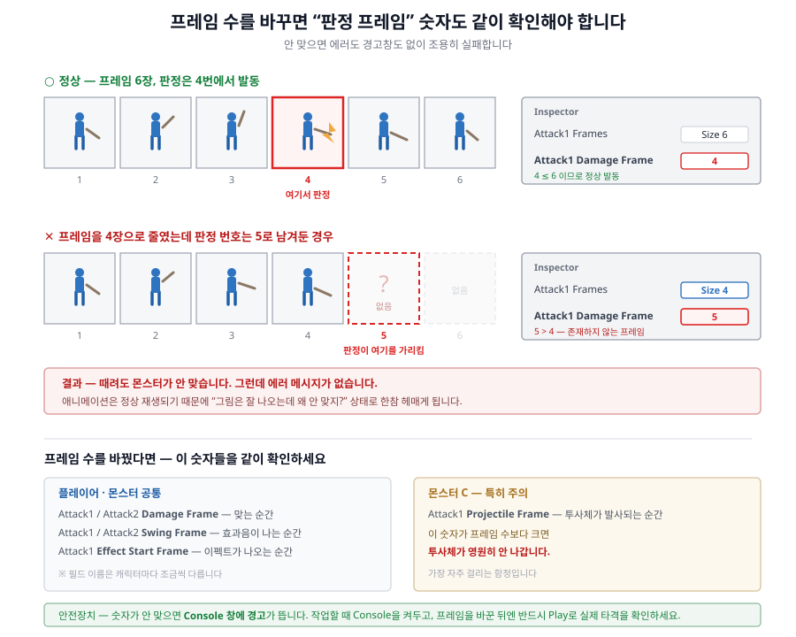

# 2주차 - 플레이어 캐릭터 (러프 단계)

**이번 주 목표**: 주인공의 12개 동작을 스케치 상태로 만들어서, 실제로 게임 안에서 움직이게 한다.

---

## 1. 작업할 화면 - `ActionTest` 씬

그림을 그리기 전에, **내가 그린 그림을 어디서 확인하는지**부터 알아둡시다. 앞으로 15주 내내 이 화면을 엽니다.

### 확인용 씬이 종류별로 나뉘어 있습니다

이 프로젝트에는 **무엇을 확인하느냐에 따라 열어야 할 씬이 따로** 있습니다.

| 씬 | 무엇을 확인 | 몇 주차 |
|---|---|---|
| **`ActionTest`** | **주인공 캐릭터** | **2주차 (이번 주)** |
| `MonsterA_ActionTest` / `B` / `C` | 몬스터 하나하나의 동작 | 3주차 |
| `BackgroundTest` | 배경·바닥·UI·전체 스테이지 | 5주차 이후 |
| `Title` / `IntroCutscene` / `EndingCutscene` | 타이틀·컷신 | 7~9주차 |

**이번 주 여러분이 열 씬은 `ActionTest` 하나입니다.**

```
Assets > _Project > 00_Scenes > Stages > ActionTest
```

`Project` 창에서 이 파일을 **더블클릭**하면 열립니다. **주인공 그림을 바꿀 때마다 여기서 확인**하게 되니, 위치를 외워두세요.

> `ActionTest`는 **주인공 동작만 집중해서 보려고 만든 연습장**입니다. 배경도 없고 스테이지도 없습니다. 대신 몬스터를 불러오거나 피격·사망을 강제로 일으키는 테스트 기능이 붙어 있습니다.

---

### 화면이 두 개입니다 - `Scene` 탭과 `Game` 탭

씬을 열면 가운데 위에 **`Scene`** 과 **`Game`** 두 개의 탭이 보입니다. **둘은 같은 것을 다르게 보여주는 화면**이라, 하는 일이 다릅니다.

| | `Scene` 탭 | `Game` 탭 |
|---|---|---|
| 무엇이 보이나 | **오브젝트가 놓인 배치도** | **실제 플레이 화면 그대로** |
| 언제 쓰나 | **고칠 때** | **확인할 때** |
| 편집 | 가능 | 불가능 (보기 전용) |

---

### `Scene` 탭 - 오브젝트를 고르고 고치는 작업대



**처음 열면 당황스럽습니다.** 화면 대부분을 조작 UI(조이스틱, 버튼)가 차지하고 있고, **정작 캐릭터는 왼쪽 아래 구석에 점처럼 작게** 있습니다.

**고장이 아닙니다. 정상입니다.**

> ### 왜 이렇게 보이나
>
> **UI와 게임 세계는 크기를 재는 자(단위)가 서로 다릅니다.**
>
> - **UI**(조이스틱·버튼·HP 표시)는 **화면 픽셀** 기준으로 배치됩니다 - 가로 **1920**
> - **게임 세계**(캐릭터·바닥·몬스터)는 **월드 단위** 기준입니다 - 화면 하나가 가로 **19.2**
>
> 숫자가 **100배 차이**나는데, `Scene` 탭은 이 둘을 **같은 자리에 겹쳐서** 보여줍니다. 그래서 UI만 거대하게 보이고 게임 세계는 구석에 티끌처럼 남습니다.
>
> **실제 게임에서는 이런 일이 없습니다.** 카메라가 게임 세계를 찍고, 그 위에 UI를 화면 크기에 맞춰 덧그리기 때문입니다. **`Game` 탭을 보면 딱 맞게 겹쳐 있는 것을 확인할 수 있습니다.**

**캐릭터를 보려면 확대해야 합니다.**



| 방법 | 하는 법 |
|---|---|
| **가장 빠른 방법** | `Hierarchy`에서 **`Player_ActionTest`를 더블클릭** → 캐릭터로 바로 확대됩니다 |
| 마우스 | 캐릭터 쪽에 커서를 두고 **휠을 굴립니다** |
| 화면 이동 | 마우스 **가운데 버튼을 누른 채 끌기** |

> **`Player_ActionTest` 더블클릭을 기억해두세요.** 확대·축소하다 길을 잃어도 이것 한 번이면 캐릭터 앞으로 돌아옵니다.

**`Scene` 탭에서 하는 일**

- **오브젝트를 클릭해서 `Inspector`를 여는 것** ← 이번 주 작업의 대부분입니다. 여기서 그림을 갈아 끼웁니다
- 캐릭터·몬스터를 끌어서 위치 옮기기
- 선택한 오브젝트의 판정 범위 확인

> ⚠️ **`Scene` 탭에 보이는 크기·위치가 실제 게임 화면과 같지는 않습니다.** 여기는 "작업대를 위에서 내려다본 그림"이고, 실제로 플레이어가 보는 것은 카메라가 찍는 범위입니다. **최종 확인은 반드시 `Game` 탭에서** 하세요.

---

### 판정 박스 보기 - 내 캐릭터에 맞춰 조정할 때

`Hierarchy`에서 **`Player_ActionTest`를 클릭하면**, Scene 탭에 **평소엔 안 보이던 색깔 상자들**이 나타납니다. 이것이 **판정 범위**입니다 - "여기에 닿으면 맞은 것으로 친다"를 눈에 보이게 그려준 것입니다.



| 번호 | 무엇인가 |
|---|---|
| **①** | **이동 도구** (`W` 키) - 선택한 오브젝트에 **초록·빨강 화살표**가 생기고, 그걸 끌어서 위치를 옮깁니다. 지금 켜져 있는 도구입니다 |
| **②** | **사각형 도구** (`T` 키) - 오브젝트를 네모 틀로 감싸서 **크기와 위치를 함께** 조절합니다. 주로 UI 작업에 씁니다 |
| **③** | **몸통 충돌 범위** (`Capsule Collider 2D`) - 바닥에 서고 벽에 막히는 **물리적인 몸**입니다. 캡슐 모양 실선 |
| **④** | **공격 판정 박스** - 내 공격이 닿는 범위. 기본 공격과 공중 공격이 **겹쳐서** 보입니다 |
| **⑤** | **필살기 판정 범위** - 가장 넓은 노란 상자. 이만큼이 한 번에 쓸립니다 |

### 색으로 구분합니다

박스는 서로 겹쳐 보이지만 **색이 다릅니다.**

| 색 | 무엇인가 | Inspector 항목 |
|---|---|---|
| **하늘색** | **내가 맞는 범위** | `Hurt Box Offset` / `Size` |
| **빨강** | 기본 공격(1타·2타) | `Attack Hit Box Offset` / `Size` |
| **주황** | 공중 공격 | `Jump Attack Hit Box Offset` / `Size` |
| **노랑** | 필살기 | `Special Hit Box Offset` / `Size` |

> **하늘색만 성격이 다릅니다.** 나머지 셋은 "내가 때리는 범위"인데, 하늘색은 **"내가 맞는 범위"** 입니다. 이 상자에 몬스터의 공격이 닿으면 HP가 깎입니다.

### 안 보일 때

| 증상 | 확인할 것 |
|---|---|
| 상자가 하나도 안 보임 | **`Player_ActionTest`가 선택되어 있는지.** 선택을 풀면 사라집니다 (정상입니다) |
| 그래도 안 보임 | Scene 탭 오른쪽 위 **`Gizmos`** 버튼이 꺼졌는지 확인 |
| 캐릭터가 너무 작아서 안 보임 | `Hierarchy`에서 **`Player_ActionTest` 더블클릭**으로 확대 |

### 어떻게 고치나 - **끌어서는 안 됩니다**

⚠️ **이 상자들은 마우스로 끌어서 못 옮깁니다.** ①②의 도구로도 안 됩니다. **`Inspector`의 `Combat` 항목에 있는 숫자를 바꾸면**, Scene 탭의 상자가 **바로 따라 움직입니다.**

| 값 | 뜻 |
|---|---|
| `Offset` | 캐릭터 기준으로 **어디에** 놓을지 (`X` 좌우, `Y` 위아래) |
| `Size` | **얼마나 크게** (`X` 가로, `Y` 세로) |

**Scene 탭을 보면서 Inspector 숫자를 조금씩 바꾸는 것**이 가장 정확합니다. Play를 켜지 않아도 즉시 반영됩니다.

### 언제 고쳐야 하나

**기본 캐릭터와 비슷한 체형으로 그렸다면 손댈 필요가 없습니다.** 아래 경우에만 조정하세요.

| 이런 캐릭터를 그렸다면 | 조정할 것 |
|---|---|
| 기본보다 **훨씬 크거나 작게** 그림 | **하늘색**(`Hurt Box`)을 몸에 맞춤 |
| **가로로 넓은** 체형 (뚱뚱함, 네 발) | 하늘색의 `Size X` |
| **긴 무기**를 들고 크게 휘두름 | **빨강**(`Attack Hit Box`)의 `Size X`를 조금 |

> ⚠️ **"넉넉하게 크면 좋겠지"는 안 됩니다.**
>
> - **하늘색을 키우면** 몬스터에게 더 잘 맞아서 **게임이 어려워집니다**
> - **빨강·노랑을 키우면** 닿지도 않은 거리에서 몬스터가 맞아 **게임이 너무 쉬워집니다**
>
> **몬스터 3종의 공격 거리와 체력이 지금 크기를 기준으로 맞춰져 있습니다.** 내 그림에 맞추는 정도까지만 하고, **이유 없이 키우지 마세요.**

> **그림 크기와 판정 범위는 별개입니다.** 캐릭터를 크게 그렸다고 상자가 자동으로 커지지 않고, 반대로 상자를 키운다고 캐릭터가 커지지도 않습니다.

> **고친 뒤에는 `Inspector` 맨 아래 `Apply All Player Action Settings`를 누르세요.** 그래야 씬에 저장됩니다.

---

### `Game` 탭 - 실제로 플레이해보는 화면



**`Game` 탭을 누르면 실제 플레이 화면이 나옵니다.** 위 그림의 ①~④ 순서로 오면 됩니다.

1. `Project` 창에서 **`Stages`** 폴더
2. **`ActionTest`** 더블클릭
3. 가운데 위 **`Game`** 탭 클릭
4. 맨 위 **`Play`(▶)** 버튼

**Play를 누르면 액션 테스트용 게임이 시작됩니다.** 조이스틱·HP·버튼이 게임 세계 위에 딱 맞게 겹쳐 있는 것을 볼 수 있습니다 - `Scene` 탭에서 따로 놀던 그 둘입니다.

> **이 화면은 완성된 게임이 아닙니다.** 배경도 없고 스테이지도 없습니다. **주인공 동작을 확인하기 위한 최소한의 구성**만 들어 있습니다. 배경과 함께 보는 것은 5주차 `BackgroundTest`부터입니다.

**`Game` 탭에서 하는 일**

- **12개 동작이 제대로 나오는지 눈으로 확인**
- 동작이 바뀔 때 **발 높이가 튀지 않는지**
- 공격이 **몬스터에게 실제로 맞는지**
- **과제 영상 녹화** (제출 항목)

> ⚠️ **Play 중에 바꾼 값은 Play를 끄는 순간 전부 사라집니다.** 초보자가 제일 자주 하는 실수입니다. **편집은 항상 Play를 끈 상태에서** 하세요.

> **Play를 눌렀는데 키가 안 먹으면** `Game` 화면을 **한 번 클릭**하세요. 그 창이 선택된 상태에서만 키 입력이 들어갑니다.

---

### 정리 - 이번 주 작업의 리듬

```
Scene 탭에서 그림 갈아 끼우기  →  Ctrl+S  →  Game 탭에서 Play로 확인  →  Play 끄기  →  다시 수정
```

**이 왕복을 12개 동작에 대해 반복하는 것이 2주차 작업입니다.**

---

## 2. 플레이어 캐릭터의 특징 - 무엇을 그려야 하나

이 게임의 주인공은 **근접 무기로 콤보 공격을 하고, 차지해서 필살기를 쏘는 캐릭터**입니다. 동작이 총 **12종**이고, 각각이 게임에서 언제 나오는지가 정해져 있습니다.

| 폴더 이름 | 동작 | 게임에서 언제 나오나 | 조작키 |
|---|---|---|---|
| `idle_frames` | 대기 | 가만히 서 있을 때 (계속 반복) | - |
| `walk_frames` | 걷기/이동 | 좌우로 움직일 때 (계속 반복) | `A` / `D` (또는 `←` / `→`) |
| `jump_frames` | 점프 | 공중에 떠 있는 동안 | `Space` (2단 점프 가능) |
| `jump_attack_frames` | 공중 공격 | 점프 중 공격 | 공중에서 `J` |
| `dash_frames` | 대시 | 짧게 돌진 (회피 겸 이동) | `Shift` |
| `attack1_frames` | 기본 공격 1타 | 공격 첫 번째 | `J` |
| `attack2_frames` | 기본 공격 2타 | 1타에 이어지는 콤보 | `J` 연타 |
| `special_charge_frames` | 필살기 차지 | 버튼을 누르고 있는 동안 (반복) | `K` 길게 |
| `special_fire_frames` | 필살기 발동 | 차지 후 놓았을 때 터뜨리는 동작 | `K` 떼기 |
| `hit_frames` | 피격 | 맞았을 때 살짝 움찔 | (테스트: `H`) |
| `knockdown_frames` | 다운 | 크게 맞아 넘어짐 | (테스트: `N`) |
| `death_frames` | 사망 | HP가 0이 됐을 때 | (테스트: `Ctrl+M`) |

### 러프 단계에서 특히 신경 쓸 것

동작마다 "게임에서 요구하는 성격"이 다릅니다. 러프 단계는 **이 성격을 잡는 단계**입니다.

- **idle / walk**: 계속 반복 재생됩니다. **첫 프레임과 마지막 프레임이 자연스럽게 이어져야** 끊겨 보이지 않습니다.
- **attack1 / attack2**: 공격이 "맞는 순간"이 프레임 중 한 지점으로 정해집니다. **타격 순간이 명확한 프레임**을 반드시 넣으세요. 밋밋하게 팔만 휘두르면 게임에서 타격감이 안 삽니다.
- **special_charge**: 힘을 모으는 반복 동작. 짧아도 됩니다(2~4장).
- **hit**: 1~2장이면 충분합니다. 길면 게임이 답답해집니다.
- **death / knockdown**: 반복하지 않고 한 번 재생 후 멈춥니다. **마지막 프레임이 "쓰러진 상태"로 끝나야** 자연스럽습니다.

> **동작 개수는 12개 고정이지만, 각 동작의 프레임 수는 자유입니다.** idle이 4장, hit가 1장이어도 됩니다. 러프 단계에서는 **동작당 3~6장** 정도를 권장합니다 - 나중에 늘릴 수 있습니다.

---

## 3. 프로젝트 구조 - 어디에 넣나

```
Assets/_Project/04_Art/StudentReplace/Player/
 ├─ idle_frames/            ← 여기에 player_idle_01.png, player_idle_02.png ...
 ├─ walk_frames/
 ├─ jump_frames/
 ├─ jump_attack_frames/
 ├─ dash_frames/
 ├─ attack1_frames/
 ├─ attack2_frames/
 ├─ special_charge_frames/
 ├─ special_fire_frames/
 ├─ hit_frames/
 ├─ knockdown_frames/
 ├─ death_frames/
 └─ readme.txt             ← 규격이 그대로 적혀 있음. 작업 전에 꼭 열어볼 것
```

폴더는 **이미 다 만들어져 있습니다.** 새로 만들거나 이름을 바꾸지 마세요.

> **공격 이펙트(검격 등)는 여기가 아닙니다.** 플레이어의 몸과 이펙트는 서로 다른 파일로 분리되어 있고, 이펙트는 `StudentReplace/Effects` 폴더입니다. 이번 주는 **몸만** 그립니다. (이펙트는 12주차 완성 단계 또는 여유 있을 때)

---

## 4. 리소스 제작 규격

### 파일 형식과 크기

| 항목 | 규격 |
|---|---|
| 파일 형식 | **PNG** |
| 배경 | **알파 채널 투명** (캐릭터 바깥은 완전 투명) |
| 캔버스 크기 | **500 x 500px 정사각형 고정** |
| 방향 | **오른쪽을 보는 방향만** (왼쪽은 Unity가 자동으로 뒤집음) |
| 프레임 수 | 동작마다 자유 |

### 파일명 규칙 (제일 중요)

```
player_(폴더이름에서 _frames 뺀 것)_(두 자리 번호).png
```

| 폴더 | 파일명 |
|---|---|
| `idle_frames` | `player_idle_01.png`, `player_idle_02.png`, ... |
| `attack1_frames` | `player_attack1_01.png`, `player_attack1_02.png`, ... |
| `special_charge_frames` | `player_special_charge_01.png`, ... |
| `jump_attack_frames` | `player_jump_attack_01.png`, ... |

- **전부 소문자**, 언더바 사용, 번호는 **두 자리** (`01`, `02` ... `09`, `10`)
- 대소문자 하나만 틀려도 Unity가 그 파일을 못 찾습니다. **에러도 안 나고 그냥 조용히 안 나옵니다.**

### ★ 캐릭터를 캔버스 어디에 그리나 - 제일 많이 틀리는 부분

**캐릭터는 500x500 캔버스의 "아래쪽 가운데"를 기준으로 그립니다.**



Unity는 이 위치를 **"바닥에 서는 기준점"** 으로 읽습니다. 이 기준이 프레임마다 흔들리면 게임에서 캐릭터가 **바닥에 붕 뜨거나, 바닥에 파묻히거나, 동작이 바뀔 때마다 위아래로 튑니다.**

> **작업 요령**: 500x500 캔버스에 "바닥선" 가이드 레이어를 하나 깔고, **12개 동작 전부 그 가이드 위에서 작업**하세요. **점프도 마찬가지로 발을 바닥선에 맞춰** 그립니다 - **캐릭터가 공중으로 뜨는 것은 그림이 아니라 Unity가 처리합니다.** 그림에서 미리 올려 그리면 Unity가 띄우는 높이에 그만큼이 더해져서, 점프할 때 캐릭터가 필요 이상으로 붕 뜹니다.

### 러프 단계 작업 지침

- **컬러링 하지 않습니다.** 선/실루엣/명암 정도까지만.
- 단, **캐릭터 디자인 컨셉은 알아볼 수 있어야 합니다.** 막대 인간(스틱맨)은 안 됩니다 - 체형, 실루엣, 무기, 복장 특징이 보여야 합니다.
- **모션과 타이밍에 집중**하세요. 이번 주의 진짜 목표는 "예쁜 그림"이 아니라 **"게임 안에서 움직였을 때 어색하지 않은 동작"** 입니다.
- 12주차에 이 러프 위에 채색해서 완성합니다. **지금 잡은 동작이 최종본의 뼈대가 됩니다.**

---

## 5. Unity에 적용하기

### 경우 1 - 파일명과 개수를 그대로 두고 그림만 바꿀 때 (제일 쉬움)

**파일을 덮어쓰기만 하면 끝입니다.** Unity가 자동으로 다시 읽어들이고, 게임 안 모든 곳에 반영됩니다. 메뉴를 실행할 필요가 없습니다.

기존 파일이 몇 장인지 먼저 확인하고 같은 개수로 맞춰 그리면 이 방법이 제일 편합니다.

### 경우 2 - 프레임 개수를 바꿀 때 (늘리거나 줄일 때)

1. `Assets/_Project/00_Scenes/Stages/ActionTest.unity` 씬을 엽니다
   - **캐릭터 튜닝은 항상 이 씬에서 합니다.** 다른 씬에서 하면 나중에 반영이 꼬입니다.
2. `Hierarchy`에서 **`Player_ActionTest`** 클릭
   - Inspector에 항목이 아주 많이 나옵니다. **어떤 것이 내가 만질 것이고 어떤 것이 아닌지**는 [W02 보조자료 - 주인공 Inspector 항목 설명](W02_플레이어_캐릭터_인스팩터.md)에 항목별로 정리해뒀습니다.
3. `Inspector`에서 해당 동작의 Sprite 배열을 찾습니다 (예: `Idle Frames`)
4. 배열 이름 **오른쪽 끝의 숫자**를 새 프레임 개수로 바꿉니다 (또는 오른쪽 아래 `+` / `−` 버튼으로 한 칸씩)
5. 새로 생긴 빈 칸에 `Project` 창에서 새 프레임 파일을 **순서대로** 드래그해 채웁니다

### ★★ 프레임 개수를 바꿨다면 반드시 확인할 것 - 판정 프레임

`Inspector`에는 **"몇 번째 프레임에서 공격 판정이 나가는가"** 같은 숫자 필드가 짝지어 있습니다.

| 필드 예시 | 의미 |
|---|---|
| `Attack1 Damage Frame` | 1타가 실제로 몬스터에게 맞는 프레임 번호 |
| `Attack1 Swing Frame` | 휘두르는 효과음이 나는 프레임 번호 |
| `Attack1 Effect Start Frame` | 검격 이펙트가 나타나기 시작하는 프레임 번호 |

**프레임 개수만 바꾸고 이 숫자를 안 맞추면, 에러도 경고도 없이 조용히 공격이 안 나가거나 엉뚱한 타이밍에 나갑니다.** Unity가 자동으로 맞춰주지 않습니다.



프레임을 바꿨으면 그 동작의 숫자 필드를 눈으로 다시 확인하는 것을 **습관**으로 만드세요.

### 마지막 - 다른 씬에도 반영하기

플레이어는 프리팹이 없어서(각 씬마다 따로 존재), 한 씬에서 고쳐도 다른 씬에 자동으로 안 퍼집니다. 그래서 두 단계가 필요합니다.

1. `ActionTest` 씬에서 `Player_ActionTest` 선택 → `Inspector` 맨 아래 **`Apply All Player Action Settings`** 버튼 클릭
2. 상단 메뉴 → **`Tools > Class Template > Sync Player & HUD From ActionTest`** 실행

이것으로 `BackgroundTest`(스테이지1) 등 존재하는 모든 스테이지 씬의 플레이어에 한 번에 복사됩니다. **안전하게 몇 번이든 다시 실행해도 됩니다.**

3. **Ctrl+S**로 저장

---

## 6. 확인하고 수정하기

### ActionTest 씬에서 Play

`ActionTest` 씬을 열고 Play를 누른 뒤, 조작키를 하나씩 눌러가며 확인합니다.

| 확인 항목 | 이렇게 보면 됨 |
|---|---|
| 대기/이동이 부드럽게 반복되나 | 가만히 두기 / `A` `D` 이동 |
| 캐릭터가 바닥에 제대로 서 있나 | 동작을 바꿔가며 **발 높이가 튀지 않는지** |
| 점프/대시가 자연스러운가 | `Space`, `Shift` |
| 공격 콤보가 이어지나 | `J` 연타 |
| **공격이 몬스터에게 실제로 맞나** | 몬스터 쪽으로 가서 `J` - HP가 깎이는지 |
| 필살기 차지→발동 | `K` 1초 이상 누르고 떼기 |
| 피격/다운/사망 | `H` / `N` / **`Ctrl+M`** |

### 잘 안 될 때

| 증상 | 원인 |
|---|---|
| 그림이 안 바뀜 | 파일명 오타(대소문자 포함), 또는 다른 폴더에 넣음 |
| 캐릭터가 바닥에 파묻히거나 떠 있음 | 캔버스 안에서 캐릭터 위치가 "아래쪽 가운데" 기준이 아님 |
| 동작이 바뀔 때 캐릭터가 위아래로 튐 | 동작별로 캔버스 안 기준 위치가 다름 |
| 때려도 몬스터가 안 맞음 | **판정 프레임 숫자**가 프레임 개수와 안 맞음 (위 참고) |
| 캐릭터가 화면에서 너무 크거나 작음 | 500x500 캔버스 안에서 캐릭터가 차지하는 비율을 조정 (캔버스 크기는 바꾸지 말 것) |
| 동작이 너무 빠르거나 느림 | **재생 속도는 대부분 고정**이라, 프레임 수를 늘리면 그만큼 동작이 길어집니다. 개수로 조절하세요 ([항목 설명](W02_플레이어_캐릭터_인스팩터.md)의 "동작이 재생되는 속도") |

---

## 7. GitHub 백업

작업이 끝나면 반드시:

1. Unity에서 **Ctrl+S** (씬 저장)
2. GitHub Desktop → 바뀐 파일 확인 → Summary에 `2주차 - 플레이어 캐릭터 러프` → **Commit to main**
3. **Push origin**

### 주의사항

- **Unity를 켠 채로 Push하지 마세요.** 저장 안 한 변경은 안 올라갑니다. 저장 → Commit → Push 순서.
- 다른 컴퓨터에서 이어서 작업할 거면, **시작 전에 Pull origin 먼저.** 안 하고 작업하면 나중에 충돌이 나서 수습이 복잡해집니다.
- 그림 파일이 많아서 Push가 몇 분 걸릴 수 있습니다. 정상입니다.
- `.png` 옆에 `.png.meta` 파일이 같이 올라가는 것도 정상입니다. **`.meta` 파일을 지우지 마세요** - Unity가 그 파일에 임포트 설정을 저장합니다.

---

## 과제 (2주차)

### 무엇을 해오나

**플레이어 캐릭터 12개 동작을 러프(스케치) 상태로 제작하고, Unity에 적용해서 실제로 움직이게 만들기**

- 완성본이 아닌 **스케치 버전의 러프** 상태 - **모션과 타이밍에 집중**, 완성은 12주차에 합니다
- 스케치지만 **캐릭터 디자인 컨셉은 담겨 있어야 함** (컬러링 X)
- 12개 동작 전부 (빠진 동작이 있으면 게임에서 그 상황에 아무것도 안 나옵니다)

### 제출

네이버 카페 업로드 - 제목 `2D게임제작_02주차_123456홍길동`

- [ ] **캐릭터 리소스** - 각 모션의 **대표컷 1개씩** (12장)
- [ ] **유니티 플레이 영상** - `ActionTest` 씬에서 캐릭터가 작동하는 모습, **10~20초**
  - 이동 → 점프 → 공격 콤보 → 대시 → 필살기 → 피격/사망까지 최대한 담을 것
  - 화면 녹화 프로그램(OBS, Windows `Win+G` 등) 사용

녹화하는 화면은 **1번 「작업할 화면」** 에서 설명한 그 `Game` 탭 화면입니다. `ActionTest` 씬 → `Game` 탭 → `Play` 를 누르고 조작하면서 녹화하면 됩니다.

> **찍는 범위는 자유입니다.** **Unity 에디터 전체**를 찍어도 되고, **가운데 게임 화면만** 잘라서 찍어도 됩니다. 캐릭터의 동작이 잘 보이기만 하면 됩니다.
>
> 게임 화면을 크게 보고 싶다면 `Game` 탭 위쪽의 **`Scale`** 슬라이더를 조절하거나, Play 중에 **`Maximize On Play`** 를 켜면 됩니다.

> **녹화 전에 확인할 것**: `Game` 탭이 선택된 상태여야 키 입력이 들어갑니다. Play를 눌렀는데 반응이 없으면 **게임 화면을 한 번 클릭**하세요.

### 제출 전 체크리스트

- [ ] 12개 폴더에 전부 파일이 들어갔는가
- [ ] 파일명이 `player_○○_01.png` 규칙과 정확히 일치하는가 (소문자, 두 자리 번호)
- [ ] 캔버스가 전부 500x500px인가
- [ ] 배경이 투명한가 (흰색 배경으로 저장되지 않았는지)
- [ ] Play했을 때 발 높이가 동작마다 튀지 않는가
- [ ] 공격이 몬스터에게 실제로 맞는가
- [ ] Console 창에 빨간 에러가 없는가
- [ ] Ctrl+S → Commit → **Push까지 완료**했는가

---

## 관련 문서

- `Assets/_Project/04_Art/StudentReplace/Player/readme.txt` - **작업 전에 반드시 열어볼 것**
- [03_학생_리소스_제작규격](../기본설명/03_학생_리소스_제작규격.md) - 전체 리소스 규격 지도
- [W02 보조자료 - 주인공 Inspector 항목 설명](W02_플레이어_캐릭터_인스팩터.md) - **Inspector 항목이 뭐가 뭔지 모르겠을 때**
- [04_Unity_적용_가이드](../기본설명/04_Unity_적용_가이드.md) - "그래픽 리소스 반영하기" 항목
