# 2주차 보조자료 - 주인공 캐릭터 Inspector 항목 설명

> 본 수업 문서: **[W02 플레이어 캐릭터](W02_플레이어_캐릭터.md)** · 반영 방법 전반: **[04_Unity_적용_가이드](../기본설명/04_Unity_적용_가이드.md)**

주인공을 클릭하면 오른쪽 Inspector에 **항목이 수십 개** 나옵니다. 처음 보면 겁이 나는 게 정상입니다.

**하지만 여러분이 실제로 손대는 것은 몇 개 안 됩니다.** 대부분은 이미 맞춰져 있어서, 건드리면 오히려 게임이 망가집니다. 이 문서는 **어떤 것이 내 몫이고 어떤 것이 아닌지**를 항목별로 알려줍니다.

---

## 이 문서를 보는 법

표의 맨 오른쪽 칸을 먼저 보세요.

| 표시 | 뜻 |
|---|---|
| **★** | **여러분이 직접 다루는 것.** 그림을 갈아 끼우면 여기를 만지게 됩니다 |
| **△** | **필요하면 조정.** 안 건드려도 게임은 정상 작동합니다. 내 그림에 맞춰 미세 조정할 때만 |
| **✕** | **손대지 마세요.** 게임 시스템이 쓰는 값입니다. 바꾸면 조작감이 깨지거나 판정이 안 나갑니다 |

> **★가 붙은 것만 봐도 2주차 과제는 끝납니다.** △와 ✕는 "이건 뭐지?" 싶을 때 찾아보는 용도로 두세요.

> 이 문서의 숫자는 **`ActionTest` 씬의 현재 설정값**입니다. 값을 바꿨다가 원래대로 돌리고 싶을 때 여기를 보면 됩니다.

---

## 0. Inspector 어디를 보는가

`ActionTest` 씬에서 `Hierarchy` 창의 **`Player_ActionTest`** 를 클릭하면 오른쪽 Inspector에 내용이 나옵니다.

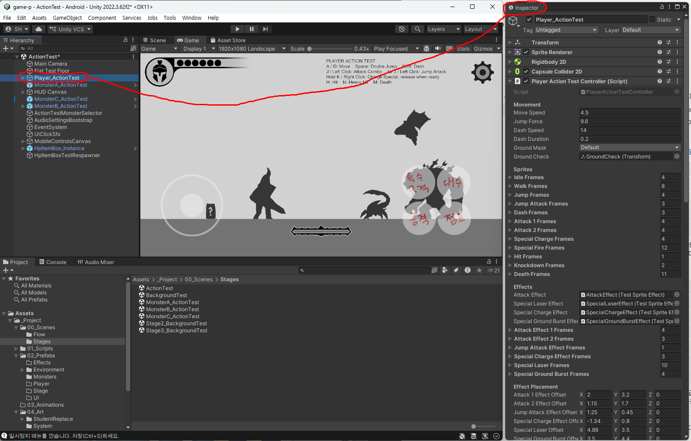

전부 접으면 **다섯 덩어리**입니다.

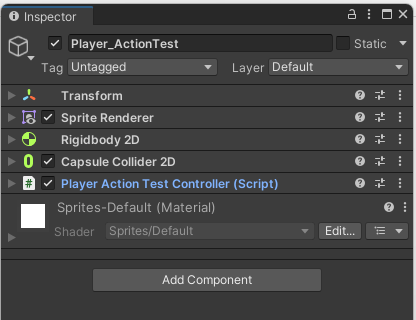

| 덩어리(컴포넌트) | 무엇인가 | |
|---|---|---|
| **Transform** | 씬 안에서의 위치·회전·크기 | **✕** |
| **Sprite Renderer** | 지금 화면에 보이는 그림 한 장을 그려주는 부품 | **✕** |
| **Rigidbody 2D** | 중력·물리 (`Gravity Scale` 2.2) | **✕** |
| **Capsule Collider 2D** | 바닥·벽에 부딪히는 몸통 범위 | **✕** |
| **Player Action Test Controller** | **주인공의 동작 전부를 담당하는 부품** | **★ 여기만 봅니다** |

**위 네 개는 손대지 않습니다.** 이름이 **파란 글씨**인 맨 아래 **`Player Action Test Controller`** 를 펼치면, 그 안에 이 문서에서 다루는 항목들이 전부 들어 있습니다.

> `Sprite Renderer`의 그림은 **Play 중에 계속 바뀝니다.** 여기에 직접 그림을 끼워 넣어도 게임이 시작되는 순간 덮어써집니다. 그림은 아래 `Sprites` 항목에 넣어야 합니다.

> **씬마다 이름이 조금 다릅니다** - `ActionTest`에서는 `Player_ActionTest`, `BackgroundTest`에서는 `Player_BackgroundTest`입니다. 붙어 있는 부품은 같습니다.

---

## 1. Movement - 이동

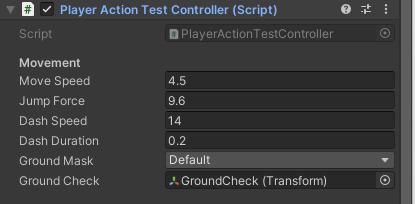

| 항목 | 현재값 | 설명 | |
|---|---|---|---|
| `Move Speed` | 4.5 | 걷는 속도 | **✕** |
| `Jump Force` | 9.6 | 점프하는 힘(높이) | **✕** |
| `Dash Speed` | 14 | 대시할 때의 속도 | **✕** |
| `Dash Duration` | 0.2 | 대시가 지속되는 시간(초) | **✕** |
| `Ground Mask` | Ground | "무엇을 바닥으로 볼 것인가" | **✕** |
| `Ground Check` | GroundCheck | 발밑에 바닥이 있는지 검사하는 지점 | **✕** |

**이 항목들은 조작감 그 자체입니다.** 몬스터 배치, 발판 간격, 스테이지 길이가 전부 이 값을 기준으로 맞춰져 있습니다. 속도를 올리면 원래 못 넘던 곳을 넘어가고, 낮추면 스테이지를 못 깨게 됩니다.

> `Dash Duration`은 대시 **그림의 재생 속도**도 함께 결정합니다 - 아래 `Dash Frames` 참고.

---

## 2. Sprites - 동작 그림 ★ 가장 중요

**2주차 과제의 핵심이 여기입니다.** 12개 동작의 그림 묶음이 순서대로 들어갑니다.

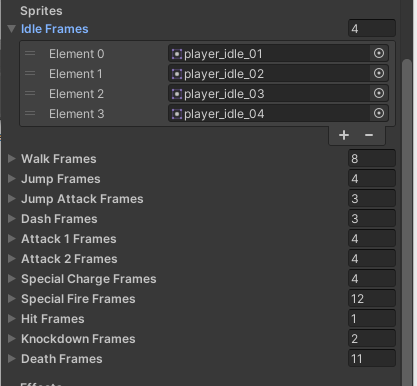

| 항목 | 현재 장수 | 어떤 동작 | |
|---|---:|---|---|
| `Idle Frames` | 4 | 가만히 서 있기 | **★** |
| `Walk Frames` | 8 | 걷기 | **★** |
| `Jump Frames` | 4 | 점프 (아래 설명 꼭 볼 것) | **★** |
| `Jump Attack Frames` | 3 | 공중 공격 | **★** |
| `Dash Frames` | 3 | 대시 | **★** |
| `Attack 1 Frames` | 4 | 기본 공격 1타 | **★** |
| `Attack 2 Frames` | 4 | 기본 공격 2타(콤보) | **★** |
| `Special Charge Frames` | 4 | 필살기 모으는 중 | **★** |
| `Special Fire Frames` | 12 | 필살기 발동 | **★** |
| `Hit Frames` | 1 | 맞았을 때 | **★** |
| `Knockdown Frames` | 2 | 크게 맞아 넘어짐 | **★** |
| `Death Frames` | 11 | 사망 | **★** |

### 배열을 다루는 법

위 그림의 `Idle Frames`처럼, 각 항목 **왼쪽의 ▶ 화살표를 누르면** 안이 펼쳐집니다.

- **항목 이름 오른쪽 끝의 숫자가 장수**입니다 (`Idle Frames`는 `4`)
- 그 아래 **`Element 0`, `Element 1` ...** 이 **1번 그림, 2번 그림 ...** 입니다
- **`Element` 번호는 0부터 시작합니다.** `Element 0`이 첫 장입니다 - 헷갈리기 쉬운 부분입니다
- 각 칸에 `Project` 창의 그림을 **끌어다 놓습니다**

### 장수를 늘리거나 줄이려면 - 두 가지 방법

| 방법 | 어떻게 | 언제 |
|---|---|---|
| **오른쪽 아래 `+` / `−` 버튼** | 한 번에 한 칸씩 늘리거나 줄임 | **한두 장만 바꿀 때** |
| **오른쪽 끝 숫자를 직접 입력** | 원하는 장수를 바로 입력 | 4장 → 12장처럼 **많이 바꿀 때** |

- **`+`** 를 누르면 **마지막 칸이 복제된 채로** 새 칸이 생깁니다. 거기에 새 그림을 끌어다 덮어씌우세요
- **`−`** 를 누르면 **맨 마지막 칸부터** 사라집니다. 중간 것을 지우려면 그 줄 왼쪽의 **`≡` 손잡이를 끌어서** 순서를 옮긴 뒤 지우세요

> **파일 이름만 그대로 두고 그림만 바꿔 덮어쓴 경우에는 여기를 손댈 필요가 없습니다.** 장수가 그대로면 Unity가 알아서 새 그림을 씁니다. **장수를 바꿨을 때만** 이 작업이 필요합니다.

> ⚠️ **장수를 바꿨다면 아래 `4-2. 판정 프레임`을 반드시 같이 확인하세요.** Unity가 자동으로 맞춰주지 않습니다.

### ⚠️ `Jump Frames`는 장수가 아니라 **역할**입니다

점프만 구조가 다릅니다. 순서대로 반복 재생하는 게 아니라, **상황에 따라 특정 번째 그림을 골라 씁니다.**

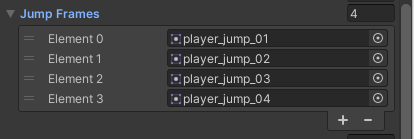

| 그림 | 언제 나오나 |
|---|---|
| **1번째** (`Element 0`) | 땅에서 막 뛰어오르는 순간 |
| **2번째** (`Element 1`) | 올라가는 중 |
| **3번째** (`Element 2`) | 내려오는 중 |
| **맨 마지막** | 착지 직후 |

**그래서 4장이 정확히 맞습니다.** 5장 이상 넣으면 **4번째 그림은 아예 안 나옵니다**(맨 마지막이 착지로 쓰이므로). 3장 이하면 일부 상황에서 같은 그림이 겹쳐 쓰입니다.

> 다른 11개 동작은 장수가 자유롭지만, **점프만은 4장을 권장합니다.**

### 동작이 재생되는 속도

**대부분 코드에 고정되어 있어 Inspector에 없습니다.**

| 동작 | 속도 |
|---|---|
| Idle | 초당 6장 |
| Walk | 초당 10장 |
| Hit | 초당 12장 (크게 맞았을 때는 10장) |
| Death | 초당 8장 |
| Dash | **`Dash Duration`(0.2초)을 장수로 나눔** - 장수를 늘려도 대시 길이는 그대로 |
| Attack 1 / 2 | 아래 **`Frame Timing`** 에서 장별로 지정 |
| Special Fire | 아래 **`Frame Timing`** 에서 장별로 지정 |

> **속도가 고정이라는 것은, 장수를 늘리면 그 동작이 그만큼 길어진다**는 뜻입니다. 예를 들어 `Walk Frames`를 8장에서 16장으로 늘리면 걷기 한 바퀴가 **두 배로 느려집니다.** 부드럽게 만들려던 것이 굼떠 보일 수 있으니, 늘린 뒤 반드시 Play로 확인하세요.

---

## 3. Effects - 이펙트 그림

**주인공의 몸**과 **검격·빛 같은 이펙트**는 **서로 다른 파일**입니다. 몸은 위 `Sprites`, 이펙트는 여기입니다.

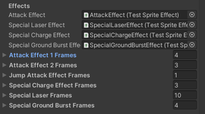

| 항목 | 현재 장수 | 설명 | |
|---|---:|---|---|
| `Attack Effect` | | 이펙트를 그려줄 담당 오브젝트 연결 | **✕** |
| `Special Laser Effect` | | 〃 | **✕** |
| `Special Charge Effect` | | 〃 | **✕** |
| `Special Ground Burst Effect` | | 〃 | **✕** |
| `Attack Effect 1 Frames` | 4 | 공격 1타 검격 그림 | **★** |
| `Attack Effect 2 Frames` | 3 | 공격 2타 검격 그림 | **★** |
| `Jump Attack Effect Frames` | 1 | 공중 공격 이펙트 | **★** |
| `Special Charge Effect Frames` | 3 | 차지 중 이펙트 | **★** |
| `Special Laser Frames` | 10 | 필살기 광선 | **★** |
| `Special Ground Burst Frames` | 4 | 필살기 지면 폭발 | **★** |

위쪽 네 개(**`~ Effect`**)는 **"어떤 오브젝트가 이펙트를 그릴지"** 를 연결해둔 칸입니다. **비우면 이펙트가 아예 안 나옵니다.** 지우지 마세요.

> 이펙트 그림은 `04_Art/StudentReplace/Player`가 아니라 **`04_Art/StudentReplace/Effects`** 폴더에 넣습니다. 그 폴더의 `readme.txt`를 확인하세요.

---

## 4. Effect Placement - 이펙트 위치와 **판정 프레임**

이름은 "이펙트 배치"지만, **가장 중요한 판정 프레임 숫자들이 여기 섞여 있습니다.**

### 4-1. 이펙트 위치·크기

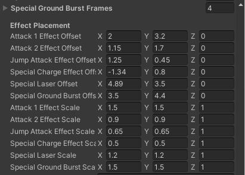

| 항목 | 현재값 | 설명 | |
|---|---|---|---|
| `Attack 1 Effect Offset` | (2, 3.2, 0) | 1타 검격이 캐릭터 기준 어디에 뜨는지 | **△** |
| `Attack 2 Effect Offset` | (1.15, 1.7, 0) | 2타 검격 위치 | **△** |
| `Jump Attack Effect Offset` | (1.25, 0.45, 0) | 공중 공격 이펙트 위치 | **△** |
| `Special Charge Effect Offset` | (-1.34, 0.8, 0) | 차지 이펙트 위치 | **△** |
| `Special Laser Offset` | (4.89, 3.5, 0) | 광선 위치 | **△** |
| `Special Ground Burst Offset` | (3.5, 4.4, 0) | 지면 폭발 위치 | **△** |
| `Attack 1 Effect Scale` | (1.5, 1.5, 1) | 1타 검격 크기 | **△** |
| `Attack 2 Effect Scale` | (0.9, 0.9, 1) | 2타 검격 크기 | **△** |
| `Jump Attack Effect Scale` | (0.65, 0.65, 1) | 공중 공격 이펙트 크기 | **△** |
| `Special Charge Effect Scale` | (0.5, 0.5, 1) | 차지 이펙트 크기 | **△** |
| `Special Laser Scale` | (1.2, 1.2, 1) | 광선 크기 | **△** |
| `Special Ground Burst Scale` | (1.5, 1.5, 1) | 지면 폭발 크기 | **△** |

**△인 이유**: 내 캐릭터가 기본 캐릭터보다 크거나, 무기가 길거나, 팔을 뻗는 방향이 다르면 **검격이 엉뚱한 데 뜹니다.** 그때만 `X`(좌우)와 `Y`(위아래)를 조금씩 바꿔가며 맞추세요. **`Z`는 건드리지 않습니다.**

> **Play를 켠 채로 값을 바꾸면 Play를 끄는 순간 전부 사라집니다.** 반드시 Play를 끄고 조정한 뒤, 다시 Play로 확인하세요.

### 4-2. ★ 판정 프레임 - 프레임 개수를 바꿨다면 반드시 확인

**"몇 번째 그림에서 일이 벌어지는가"** 를 지정하는 숫자들입니다. **이 게임에서 사고가 가장 자주 나는 곳입니다.**

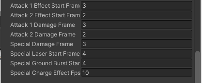

> 위 4-1의 위치·크기 항목 **바로 아래에 이어서** 나옵니다. 같은 `Effect Placement` 묶음이라 놓치기 쉬우니, 스크롤을 조금 더 내려서 이 숫자들까지 확인하세요.

| 항목 | 현재값 | 설명 | |
|---|---:|---|---|
| `Attack 1 Effect Start Frame` | 3 | 1타 검격 이펙트가 **몇 번째 그림에서** 나타나는가 | **★** |
| `Attack 2 Effect Start Frame` | 2 | 2타 검격이 나타나는 그림 번호 | **★** |
| `Attack 1 Damage Frame` | 3 | **1타의 공격 판정이 들어가는 그림 번호** | **★** |
| `Attack 2 Damage Frame` | 2 | 2타의 공격 판정 그림 번호 | **★** |
| `Special Damage Frame` | 3 | 필살기의 공격 판정 그림 번호 | **★** |
| `Special Laser Start Frame` | 4 | 광선이 나가기 시작하는 그림 번호 | **★** |
| `Special Ground Burst Start Frame` | 4 | 지면 폭발이 시작되는 그림 번호 | **★** |
| `Special Charge Effect Fps` | 10 | 차지 이펙트 재생 속도(초당 장수) | **△** |

**이 숫자들은 1부터 셉니다.** 위 `Sprites` 배열의 `Element`는 0부터 시작하는데 여기는 1부터입니다 - **`Attack 1 Damage Frame`이 3이면 `Element 2`(세 번째 그림)에서 판정이 나갑니다.**

> ### ⚠️ 프레임 개수를 바꿨으면 이 숫자를 반드시 다시 보세요
>
> 예를 들어 `Attack 1 Frames`를 4장에서 **3장으로 줄였는데** `Attack 1 Damage Frame`이 그대로 `4`라면, **있지도 않은 4번째 그림에서 판정을 내라**는 뜻이 됩니다.
>
> **결과: 공격을 해도 몬스터가 안 맞습니다. 그런데 에러는 하나도 안 뜹니다.** Console도 조용하고 애니메이션도 잘 나옵니다. "왜 안 맞지?"만 남습니다. Unity가 자동으로 맞춰주지 않으니 **사람이 눈으로 확인하는 수밖에 없습니다.**
>
> 장수를 **늘렸을 때도** 확인하세요. 판정이 원하는 것보다 이른 그림에서 나가게 됩니다.

---

## 5. Combo Movement

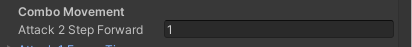

| 항목 | 현재값 | 설명 | |
|---|---:|---|---|
| `Attack 2 Step Forward` | 1 | 2타를 칠 때 앞으로 미끄러지는 거리 | **✕** |

콤보의 타격감을 만드는 값입니다. 0으로 두면 2타가 제자리에서 나가 밋밋해집니다.

---

## 6. Frame Timing - 공격 그림 한 장씩의 체류 시간

공격과 필살기는 **그림마다 머무는 시간을 따로** 정합니다. 1타를 짧게 끊고 2타를 묵직하게 만드는 식의 조절입니다. (단위: 초)

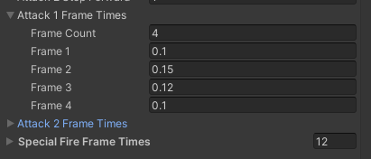

| 항목 | 현재값 | |
|---|---|---|
| `Attack 1 Frame Times` | 0.1 / 0.15 / 0.12 / 0.1 (4개) | **△** |
| `Attack 2 Frame Times` | 0.1 / 0.15 / 0.1 / 0.1 (4개) | **△** |
| `Special Fire Frame Times` | 12개 | **△** |

- `Attack 1 / 2 Frame Times`는 펼치면 **`Frame Count`** 와 **`Frame 1`, `Frame 2` ...** 로 나옵니다. **여기는 1부터** 셉니다. 위 그림에서 확인할 수 있습니다.
- `Special Fire Frame Times`는 일반 배열이라 펼치면 **`Element 0`부터** 나옵니다. **같은 화면 안에서 세는 방식이 다르니** 주의하세요.

> **공격 프레임을 늘렸는데 여기 개수를 안 늘려도 게임은 돌아갑니다.** 시간이 지정되지 않은 그림은 자동으로 **초당 13장** 속도로 넘어갑니다. 다만 의도한 리듬은 아니니, 장수를 바꿨다면 여기도 같이 맞추는 편이 좋습니다.

---

## 7. Special Attack

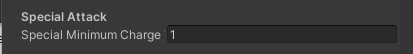

| 항목 | 현재값 | 설명 | |
|---|---:|---|---|
| `Special Minimum Charge Time` | 1 | 필살기가 나가기 위해 눌러야 하는 **최소 시간(초)** | **✕** |

이 시간보다 짧게 떼면 필살기가 발동하지 않습니다. 난이도와 직결되는 값입니다.

---

## 8. SFX - 사운드

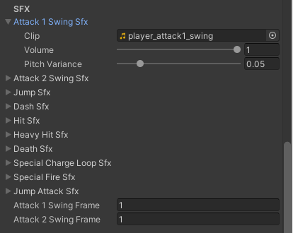

**소리 하나마다 칸이 세 개**입니다. 펼치면 **`Clip`**(어떤 소리), **`Volume`**(크기), **`Pitch Variance`**(재생할 때마다 음높이를 조금씩 다르게)가 나옵니다. 자세한 설명은 [11주차 편](W11_모바일UI_사운드_인스팩터.md)에 있습니다.

| 항목 | 설명 | |
|---|---|---|
| `Attack 1 Swing Sfx` | 1타 휘두르는 소리 | **★** |
| `Attack 2 Swing Sfx` | 2타 휘두르는 소리 | **★** |
| `Jump Sfx` | 점프 | **★** |
| `Dash Sfx` | 대시 | **★** |
| `Hit Sfx` | 피격 | **★** |
| `Heavy Hit Sfx` | 크게 맞았을 때 | **★** |
| `Death Sfx` | 사망 | **★** |
| `Special Charge Loop Sfx` | 차지 중 계속 나는 소리 | **★** |
| `Special Fire Sfx` | 필살기 발동 | **★** |
| `Jump Attack Sfx` | 공중 공격 | **★** |
| `Attack 1 Swing Frame` | 1타 소리가 **몇 번째 그림에서** 나는가 (현재 1) | **★** |
| `Attack 2 Swing Frame` | 2타 소리가 나는 그림 번호 (현재 1) | **★** |

**사운드는 11주차 작업입니다.** 2주차에는 비어 있어도 정상입니다.

> 맨 아래 두 개도 **판정 프레임과 같은 성격**입니다. 공격 그림 장수를 줄였다면 이 숫자가 범위를 벗어나지 않았는지 확인하세요.

> 사운드는 파일을 직접 끌어다 놓는 게 아니라 **`SfxCue`** 라는 설정 파일을 연결합니다. 자세한 건 [04_Unity_적용_가이드](../기본설명/04_Unity_적용_가이드.md)의 "사운드 연결하기"를 보세요.

---

## 9. Combat - 체력과 판정 범위

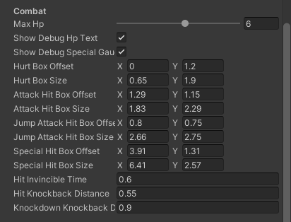

| 항목 | 현재값 | 설명 | |
|---|---|---|---|
| `Max Hp` | 6 | **주인공의 최대 체력.** 화면 왼쪽 위 HP UI 칸 수가 이 숫자에 자동으로 맞춰집니다 | **△** |
| `Show Debug Hp Text` | 켜짐 | 왼쪽 아래에 뜨는 **개발용 HP 글자** | **△** |
| `Show Debug Special Gauge` | 켜짐 | 차지 중 뜨는 **개발용 게이지 글자** | **△** |
| `Hurt Box Offset` | (0, 1.2) | **내가 맞는 범위**의 위치 (**하늘색**) | **△** |
| `Hurt Box Size` | (0.65, 1.9) | 〃 크기 | **△** |
| `Attack Hit Box Offset` | (1.29, 1.15) | **내 공격이 닿는 범위**의 위치 (**빨강**) | **△** |
| `Attack Hit Box Size` | (1.83, 2.29) | 〃 크기 | **△** |
| `Jump Attack Hit Box Offset` | (0.8, 0.75) | 공중 공격 범위 위치 (**주황**) | **△** |
| `Jump Attack Hit Box Size` | (2.66, 2.75) | 〃 크기 | **△** |
| `Special Hit Box Offset` | (3.91, 1.31) | 필살기 범위 위치 (**노랑**) | **△** |
| `Special Hit Box Size` | (6.41, 2.57) | 〃 크기 | **△** |
| `Hit Invincible Time` | 0.6 | 맞은 뒤 무적 시간(초) | **✕** |
| `Hit Knockback Distance` | 0.55 | 맞았을 때 밀려나는 거리 | **✕** |
| `Knockdown Knockback Distance` | 0.9 | 크게 맞았을 때 밀려나는 거리 | **✕** |

- **`Max Hp`가 △인 이유**: 바꿔도 게임은 정상 작동합니다(HP UI도 알아서 따라옵니다). 다만 난이도가 통째로 달라지니 이유 없이 올리지 마세요. **슬라이더로 되어 있고 1~10 사이만** 넣을 수 있습니다.
- **`Show Debug ~`가 △인 이유**: 화면 구석의 개발용 글자를 켜고 끄는 스위치입니다. 그래픽 HP UI가 붙은 씬에서는 꺼두면 화면이 깔끔합니다. **게임 동작에는 영향이 없습니다.**

### ★ `~ Box ~` - 판정 범위는 Scene 탭에서 눈으로 맞춥니다

**`Hierarchy`에서 `Player_ActionTest`를 클릭하면 Scene 탭에 이 상자들이 색깔로 나타납니다.** 숫자만 보고 짐작하지 말고 **눈으로 보면서** 맞추세요.

| 번호 | 무엇인가 |
|---|---|
| **①** | **이동 도구** (`W`) - 화살표를 끌어 오브젝트를 옮깁니다 |
| **②** | **사각형 도구** (`T`) - 네모 틀로 크기·위치를 함께 조절 (주로 UI용) |
| **③** | **몸통 충돌 범위** (`Capsule Collider 2D`) - 바닥에 서고 벽에 막히는 물리적인 몸. **✕ 손대지 마세요** |
| **④** | **공격 판정 박스** - 기본 공격과 공중 공격이 겹쳐 보입니다 |
| **⑤** | **필살기 판정 범위** - 가장 넓은 노란 상자 |

| 색 | 무엇인가 | Inspector 항목 |
|---|---|---|
| **하늘색** | **내가 맞는 범위** | `Hurt Box ~` |
| **빨강** | 기본 공격(1타·2타) | `Attack Hit Box ~` |
| **주황** | 공중 공격 | `Jump Attack Hit Box ~` |
| **노랑** | 필살기 | `Special Hit Box ~` |

- **`Offset`** = 캐릭터 기준으로 어디에 (`X` 좌우, `Y` 위아래), **`Size`** = 얼마나 크게 (`X` 가로, `Y` 세로)
- **마우스로 끌어서는 못 옮깁니다.** ①②의 도구로도 안 됩니다. **Inspector 숫자를 바꾸면 Scene 탭의 상자가 즉시 따라 움직입니다** (Play 불필요)
- **상자가 안 보이면**: `Player_ActionTest`가 선택되어 있는지 확인하세요. 선택을 풀면 사라지는 것이 정상입니다

**`△`인 이유 - 조정해야 하는 경우가 있습니다**

| 이런 캐릭터를 그렸다면 | 조정할 것 |
|---|---|
| 기본보다 **훨씬 크거나 작게** 그림 | **하늘색**(`Hurt Box`)을 몸에 맞춤 |
| **가로로 넓은** 체형 (뚱뚱함, 네 발) | 하늘색의 `Size X` |
| **긴 무기**를 크게 휘두름 | **빨강**(`Attack Hit Box`)의 `Size X`를 조금 |

> ⚠️ **"넉넉하게 크면 좋겠지"는 안 됩니다.** 하늘색을 키우면 더 잘 맞아서 **어려워지고**, 빨강·노랑을 키우면 닿지도 않은 거리에서 몬스터가 맞아 **너무 쉬워집니다.** **몬스터 3종의 공격 거리와 체력이 지금 크기를 기준으로 맞춰져 있습니다.** 내 그림에 맞추는 정도까지만 하세요.

> **그림 크기와 판정 범위는 별개입니다.** 캐릭터를 크게 그렸다고 상자가 자동으로 커지지 않고, 상자를 키운다고 캐릭터가 커지지도 않습니다.

---

## 10. 맨 아래 버튼 - `Apply All Player Action Settings`

Inspector를 끝까지 내리면 큰 버튼이 하나 있습니다.

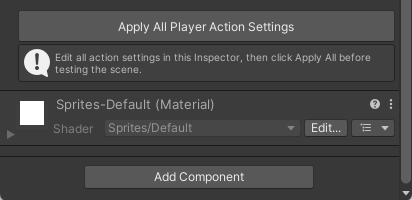

**하는 일은 "지금 씬을 저장"하는 것입니다.** 여기서 바꾼 값들을 파일에 확정 짓습니다. `Ctrl+S`와 결과가 같습니다. **값을 바꿨으면 Play 전에 눌러두세요.**

> **주인공은 프리팹이 아닙니다.** 몬스터와 달리, 여기서 바꾼 값은 **그 씬의 주인공에게만** 적용됩니다. `ActionTest`에서 고쳤다고 `BackgroundTest`의 주인공이 따라 바뀌지 않습니다.
>
> 두 씬을 맞추려면 **`Tools > Class Template > Sync Player & HUD From ActionTest`** 를 쓰세요. 자세한 순서는 [04_Unity_적용_가이드](../기본설명/04_Unity_적용_가이드.md)의 "플레이어: Sync Player & HUD From ActionTest"에 있습니다.

---

## 11. 자주 나오는 문제

| 증상 | 원인 |
|---|---|
| 공격 애니메이션은 나오는데 **몬스터가 안 맞음** | `Attack 1 / 2 Damage Frame`이 실제 장수를 벗어남. **프레임을 줄인 뒤 제일 많이 나옵니다** |
| 검격 이펙트가 **엉뚱한 위치**에 뜸 | `~ Effect Offset` 조정 필요 (내 캐릭터의 크기·자세가 달라졌을 때) |
| 검격이 **아예 안 보임** | `Attack Effect` 같은 오브젝트 연결 칸이 비었거나, 이펙트 그림 배열이 비었음 |
| 점프 중 그림 한 장이 **끝까지 안 나옴** | `Jump Frames`를 5장 이상 넣음 (4번째는 쓰이지 않습니다) |
| 걷기가 **느려짐** | `Walk Frames` 장수를 늘림. 재생 속도는 고정이라 장수만큼 길어집니다 |
| 값을 고쳤는데 **Play하면 원래대로** | **Play 중에 고친 것**입니다. Play를 끄면 전부 사라집니다 |
| `ActionTest`에서 고쳤는데 **다른 씬은 그대로** | 주인공은 프리팹이 아닙니다. `Sync Player & HUD From ActionTest` 실행 |

---

## 12. 값이 꼬였을 때 되돌리는 법

1. **`Ctrl+Z`** - 방금 한 것이면 이게 제일 빠릅니다
2. **이 문서의 "현재값"을 보고 직접 되돌리기** - 위 표의 숫자가 원래 값입니다
3. **파일 통째로 되돌리기** - 씬을 저장까지 해버려서 손쓸 수 없을 때
   - GitHub Desktop → `Changes` 목록에서 그 `.unity` 파일에 **마우스 오른쪽 클릭** → **`Discard changes`**
   - ⚠️ **그 파일에 한 작업이 마지막 Commit 시점으로 전부 돌아갑니다.** 같은 씬에서 한 다른 작업도 함께 사라지니, 정말 되돌릴 것이 없을 때만 쓰세요

> **가장 안전한 습관**: 값을 만지기 전에 **먼저 Commit**해두세요. 그러면 언제든 그 시점으로 되돌아올 수 있습니다. ([01-③ GitHub Desktop](../기본설명/01_시작하기3_깃허브데스크탑.md))
