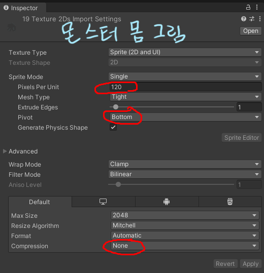
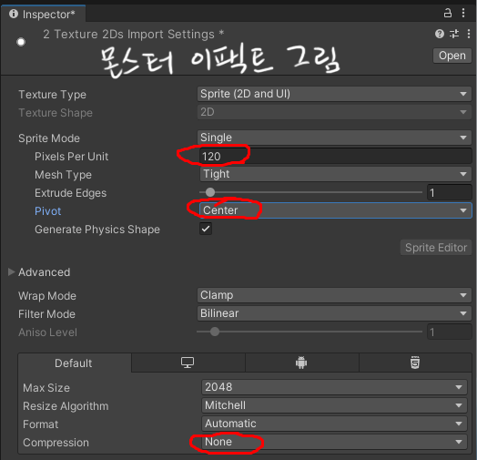

# 3주차 실습 - 샘플로 몬스터 바꿔보기

**수업 시간에 함께 따라 하는 문서입니다.** 그림은 준비해 두었으니 **바꾸는 절차를 손으로 한 번 해보는 것**이 목적입니다.

**2주차에 주인공으로 한 것과 순서가 같습니다.** 파일 덮어쓰기 → 확인 → 남은 파일 지우기 → 배열 맞추기 → 판정 숫자 확인. **몬스터에서 새로 붙는 것은 하나뿐입니다 - 고친 뒤 `Apply` 버튼으로 적용하는 것.**

> **개념 설명은 [3주차 본문](<W03_몬스터1(기본).md>), 항목별 설명은 [Inspector 항목 설명](<W03_몬스터2(인스팩터).md>) 에 있습니다.** 이 문서는 **순서대로 따라 하는 대본**입니다.

---

## 0. 오늘 하는 것과 안 하는 것

**오늘 수업에서 하는 것**

| 순서 | 무엇을 | 새로 나오는 것 |
|---|---|---|
| 1 | **몬스터 B - 대기 · 걷기 · 피격 · 사망** | ★ **`Apply` - 고친 것을 모든 씬에 적용** |
| 2 | **몬스터 B - 공격1 · 공격2** | 판정 숫자 · **이펙트 위치와 크기** |
| 3 | **몬스터 B - 소리** | 소리 연결 뒤 `Apply` |
| 4 | **몬스터 C - 그림 전부** | ★ **그림이 바닥 아래로 떨어져 나올 때 고치기** · 공격1 **늘리기** |
| 5 | `ActionTest` 에서 싸워보기 | |
| 6 | **주인공을 배경 씬에 반영** | **2주차에 미뤄둔 것** |

**오늘 안 하는 것**

| | 왜 / 언제 |
|---|---|
| **몬스터 A** | **주인공과 개념이 같습니다.** 폴더·배열·판정 숫자·`Apply` 가 B와 똑같아서 따로 실습하지 않습니다. **과제에서 같은 방법으로** 합니다 |
| 본인이 그린 그림으로 바꾸기 | **과제** - 집에서 |
| 판정 상자 크기 조정 | 과제 - 필요하면 ([본문 5절](<W03_몬스터1(기본).md>)) |

> **샘플 그림은 연습용입니다. 이것을 과제로 내는 것이 아닙니다.**

---

## 1. 샘플 받기

**[샘플 파일 내려받기](https://github.com/hansung-game1/game-p-docs/raw/main/%EC%A3%BC%EC%B0%A8%EB%B3%84%EC%88%98%EC%97%85/files/W03_%EC%83%98%ED%94%8C_%EB%AA%AC%EC%8A%A4%ED%84%B0.zip)** ← 누르면 바로 받아집니다 (약 2MB)

압축을 풀면 **`Art` 와 `Sound` 두 폴더**가 나옵니다. **들어가는 자리가 서로 다릅니다.**

**① `Art\` → `Assets\_Project\04_Art\StudentReplace\`**

```
Art\Monsters\MonsterB\idle_frames\             (4장)
Art\Monsters\MonsterB\walk_frames\             (4장)
Art\Monsters\MonsterB\attack1_frames\          (5장)
Art\Monsters\MonsterB\attack2_frames\          (5장)
Art\Monsters\MonsterB\attack1_effect_frames\   (3장)
Art\Monsters\MonsterB\attack2_effect_frames\   (2장)
Art\Monsters\MonsterB\hit_frames\              (1장)
Art\Monsters\MonsterB\death_frames\            (5장)

Art\Monsters\MonsterC\idle_frames\             (6장)
Art\Monsters\MonsterC\fly_frames\              (6장)
Art\Monsters\MonsterC\attack1_frames\          (6장)
Art\Monsters\MonsterC\attack2_charge_frames\   (6장)
Art\Monsters\MonsterC\attack2_dash_frames\     (1장)
Art\Monsters\MonsterC\hit_frames\              (1장)
Art\Monsters\MonsterC\death_frames\            (9장)
Art\Monsters\MonsterC\Effects\Projectile\      (2장)
```

**② `Sound\` → `Assets\_Project\06_Audio\SFX\`**

```
Sound\MonsterB\monsterb_attack1.mp3
Sound\MonsterB\monsterb_attack2.mp3
Sound\MonsterB\monsterb_hit.mp3
Sound\MonsterB\monsterb_death.mp3
```

> **`Art` · `Sound` 안쪽은 프로젝트의 그 폴더와 구조가 똑같습니다.**

> **확장자가 보이는지 확인하세요.** 소리 교체에서 `.wav` · `.ogg` 와 `.mp3` 를 구별해야 합니다. 안 켰다면 [2주차 실습 1번](<W02_플레이어_캐릭터3(실습).md>)의 「시작 전에」를 보세요.

> **한꺼번에 다 덮어쓰지 마세요.** 아래 단계에서 **하나씩** 넣습니다.

---

## 2. ★ 먼저 알아둘 것 - 몬스터는 세 단계로 확인합니다

**주인공은 `ActionTest` 씬 하나에서 고치고 확인했습니다. 몬스터는 다릅니다.**


| 단계 | 어디서 | 무엇을 |
|---|---|---|
| **①** | **`MonsterB_ActionTest`** (몬스터 테스트 씬) | 그림을 바꾸고 **몬스터만 따로** 확인 |
| **②** | 같은 씬 `Inspector` **맨 아래** | **`Apply Monster B Settings To Prefab`** |
| **③** | **`ActionTest`** | **주인공과 싸워보며** 최종 확인 |

> **왜 `Apply` 가 필요한가** - 몬스터는 **프리팹**(원본 하나를 여러 씬이 같이 쓰는 구조)입니다. **테스트 씬에서 고친 배열 장수·판정 숫자는 `Apply` 를 눌러야 다른 씬에도 들어갑니다.** 안 누르면 테스트 씬에서만 바뀌어 있고 `ActionTest` 는 옛 상태입니다.

> `Apply` 를 누르면 **화면이 잠깐 다른 씬들로 넘어갔다가 돌아옵니다. 정상입니다.** 그 몬스터가 있는 씬을 차례로 열어 맞추고 원래 씬으로 돌아옵니다.

### ⚠️ 이름이 겹칩니다

| 이름 | 무엇 |
|---|---|
| **`MonsterB_ActionTest.unity`** (`Stages` 폴더의 씬 파일) | **몬스터 B 혼자 있는 테스트 씬** - 여기서 작업합니다 |
| 그 씬 `Hierarchy` 의 **`MonsterB`** | 여기서 고를 몬스터 |
| `ActionTest.unity` 의 `Hierarchy` 에 있는 **`MonsterB_ActionTest`** | 주인공과 같이 있는 씬 속 몬스터 B - **③ 에서** 봅니다 |

> ⚠️ **`Project` 창의 프리팹 파일(`02_Prefabs` 폴더)은 더블클릭하지 마세요.** 프리팹 편집 모드로 들어가서, 고쳐도 Play에 안 나옵니다. **항상 씬을 열고 `Hierarchy` 에서 고릅니다.**

> ⚠️ **`Tools > Class Template > Create Or Update Monster○ Prefab` 메뉴는 쓰지 마세요.** 몬스터 B는 누르면 오늘 고친 값이 전부 처음으로 돌아갑니다.

---

## 3. 몬스터 B - 대기 · 걷기 · 피격 · 사망 (장수 줄이기)

### 3-1. 테스트 씬을 엽니다

1. `Project` → `Assets` → `_Project` → `00_Scenes` → `Stages` → **`MonsterB_ActionTest`** 더블클릭
2. `Game` 탭 → **Play** → 위쪽에 **`IDLE` · `WALK` · `ATTACK 1` · `ATTACK 2` · `HIT` · `DEATH`** 버튼이 나옵니다
3. 버튼을 눌러 지금 모습을 한 번 봐둡니다 → **Play 끄기**

> **Play 중에 바꾼 값은 Play를 끄는 순간 사라집니다.** 고칠 때는 항상 Play를 끈 상태에서.

### 3-2. 대기(IDLE) - 13장 → 4장

**2주차 주인공 대기와 순서가 똑같습니다.**

1. 탐색기에서 `Monsters\MonsterB\idle_frames\` 에 샘플 **4장**을 **덮어씁니다**
2. Play → **`IDLE`** → 새 그림 4장 뒤로 **옛 그림이 섞여** 나옵니다
3. 탐색기에서 남은 **`monsterb_idle_05.png` ~ `_13.png`** 를 지웁니다 (`.meta` 도 같이)
4. `Hierarchy` 에서 **`MonsterB`** 클릭 → `Inspector` → **`Idle Frames`** 를 **`13` → `4`**
5. Play → **`IDLE`** → 새 그림 4장만 반복됩니다

### 3-3. 나머지 셋 - 같은 방법

| 폴더 | 장수 | 지울 파일 | `Inspector` 배열 | 확인 버튼 |
|---|---|---|---|---|
| `walk_frames` | 28 → **4** | `_05` ~ `_28` | `Walk Frames` **`28` → `4`** | `WALK` |
| `hit_frames` | 2 → **1** | `_02` | `Hit Frames` **`2` → `1`** | `HIT` |
| `death_frames` | 5 → **5** | **없음 - 덮어쓰기만** | 그대로 | `DEATH` |

> **장수가 같으면 덮어쓰기만으로 끝납니다.** 사망이 그 경우입니다.

### 3-4. ★ `Apply` 로 적용합니다

1. `Hierarchy` 에서 **`MonsterB`** 클릭
2. `Inspector` **맨 아래** → **`Apply Monster B Settings To Prefab`**

> **화면이 잠깐 넘어갔다 돌아옵니다.** 이것으로 `ActionTest` · `BackgroundTest` 의 몬스터 B도 **4장 · 4장 · 1장**이 됩니다.

> **그림 파일을 덮어쓴 것은 원래 모든 씬에 바로 바뀝니다.** `Apply` 가 옮기는 것은 **배열 장수와 숫자**입니다. 그래도 **몬스터는 고친 뒤엔 항상 `Apply`** 로 기억하세요.

---

## 4. 몬스터 B - 공격1 · 공격2 (판정 숫자 + 이펙트)

### 4-1. 그림 - 공격 몸과 이펙트

**3-2 와 같은 순서입니다.** 이펙트 그림은 `Effects` 가 아니라 **몬스터 B 폴더 안**에 있습니다.

| 폴더 | 장수 | 지울 파일 | `Inspector` 배열 |
|---|---|---|---|
| `attack1_frames` | 19 → **5** | `_06` ~ `_19` | `Attack 1 Frames` **`19` → `5`** |
| `attack2_frames` | 27 → **5** | `_06` ~ `_27` | `Attack 2 Frames` **`27` → `5`** |
| `attack1_effect_frames` | 4 → **3** | `_04` | `Attack 1 Effect Frames` **`4` → `3`** |
| `attack2_effect_frames` | 4 → **2** | `_03` · `_04` | `Attack 2 Effect Frames` **`4` → `2`** |

Play → **`ATTACK 1`** · **`ATTACK 2`** → 몸은 바뀌었는데 **이펙트가 맨 마지막 그림에서야 늦게 뜹니다.** 다음 절에서 봅니다.

### 4-2. 판정 숫자 넷 - 전부 `15` → `3`

**원래 공격은 19장·27장이라 15번째에서 맞고 이펙트가 떴습니다. 이제 5장뿐이라 `15` 가 범위 밖입니다.** 범위 밖 숫자는 **마지막 그림(5번째)으로 밀려서** 이펙트도 판정도 공격이 끝날 때쯤 늦게 나옵니다.

| 항목 | 무엇이 일어나는 순간 | 이번에는 |
|---|---|---|
| `Attack 1 Damage Frame` | 주인공이 **맞는** 순간 | `15` → **`3`** |
| `Attack 1 Effect Start Frame` | 이펙트가 **뜨는** 순간 | `15` → **`3`** |
| `Attack 2 Damage Frame` | 주인공이 맞는 순간 | `15` → **`3`** |
| `Attack 2 Effect Start Frame` | 이펙트가 뜨는 순간 | `15` → **`3`** |

Play → **`ATTACK 1`** · **`ATTACK 2`** → 3번째 그림에서 이펙트가 뜹니다.

> ★ **범위 밖 숫자는 에러도 경고도 없습니다.** Console을 봐도 아무것도 없고, 몬스터 B는 **마지막 그림으로 밀려 늦게 맞고 늦게 이펙트가 뜰 뿐**이라 **틀린 줄 모르고 넘어가기 쉽습니다.** 장수를 줄였다면 이 숫자는 **내가 직접** 봐야 합니다.
>
> (몬스터 C의 투사체는 다릅니다 - 밀리지 않고 **아예 안 나갑니다.** 6-3에서 봅니다.)

### 4-3. 이펙트 위치와 크기

**샘플 이펙트는 원래 그림과 모양·크기가 달라서** 자리가 어긋나 보입니다. 이번 샘플에 맞춘 값입니다.

| 항목 | 원래 | 이번에는 |
|---|---|---|
| `Attack 1 Effect Offset` | X `-1.85` / Y `2.6` | X `-1.85` / Y **`2`** |
| `Attack 2 Effect Offset` | X `-3.62` / Y `2.2` | X **`-6`** / Y `2.2` |
| `Attack 2 Effect Scale` | X `0.4` / Y `0.4` | X **`1`** / Y **`1`** |

> **`Offset` 은 몬스터 기준 어디에(`X` 좌우 · `Y` 위아래), `Scale` 은 얼마나 크게.** 몬스터는 **왼쪽을 보고** 있어서 `X` 가 **음수일수록 앞쪽**입니다.
>
> **본인 그림으로 할 때는 이 숫자를 그대로 쓰지 말고** Play로 보면서 조금씩 맞추세요. 2주차 [실습 5절](<W02_플레이어_캐릭터3(실습).md>)의 이펙트 위치 맞추기와 같습니다.

### 4-4. `Apply`

**`Apply Monster B Settings To Prefab`** → 화면이 넘어갔다 돌아옴

> **숫자만 바꿔도 `Apply` 입니다.**

---

## 5. 몬스터 B - 소리

### 5-1. 파일 넣기 - 넷 중 셋은 확장자가 바뀝니다

```
Assets\_Project\06_Audio\SFX\MonsterB\
```

| 소리 | 지금 폴더에 있는 것 | 샘플 | 할 일 |
|---|---|---|---|
| 공격1 | `monsterb_attack1.mp3` | `.mp3` | **덮어쓰기** |
| 공격2 | `monsterb_attack2.wav` | `.mp3` | **넣고 → `.wav` 지우기** |
| 피격 | `monsterb_hit.wav` | `.mp3` | **넣고 → `.wav` 지우기** |
| 사망 | `monsterb_death.ogg` | `.mp3` | **넣고 → `.ogg` 지우기** |

> **2주차 소리와 같습니다.** 확장자가 다르면 덮어써지지 않고 **둘 다 남습니다.** 옛 파일을 지우세요 (`.meta` 도 같이).

### 5-2. 연결하고 `Apply`

**파일만 바꿔서는 소리가 안 납니다.** 몬스터에 다시 연결해야 합니다.

1. **`Ctrl+S`** 로 지금 씬 저장
2. 상단 메뉴 **`Tools` > `Class Template` > `Wire MonsterB SFX Clips`**
3. ★ **화면이 `ActionTest` 씬으로 넘어갑니다.** 이 메뉴는 `ActionTest` 에 있는 몬스터 B에 소리를 넣습니다
4. **그 씬의** `Hierarchy` 에서 **`MonsterB_ActionTest`** 클릭
5. `Inspector` 맨 아래 **`Apply Monster B Settings To Prefab`**

> ⚠️ **3번에서 씬이 바뀌는 것이 정상입니다.** 그래서 **4번은 `MonsterB_ActionTest` 씬이 아니라 `ActionTest` 씬에서** 고릅니다. 이름이 겹치니 주의하세요 - 2절의 표.

> **소리 확인은 6번 `ActionTest` 에서 싸우면서** 합니다.

---

## 6. 몬스터 C - 그림 전부

### 6-1. 테스트 씬을 엽니다

`Stages` → **`MonsterC_ActionTest`** 더블클릭 → Play → 위쪽 **`IDLE` · `MOVE` · `ATTACK 1` · `ATTACK 2` · `HIT` · `DEATH`**

`Hierarchy` 에서 고를 몬스터는 **`MonsterC_MotionTest`** 입니다.

### 6-2. 줄이기 - 대부분 폴더

**3절과 같은 순서** - 덮어쓰기 → 확인 → 남은 파일 지우기 → 배열 줄이기

| 폴더 | 장수 | 지울 파일 | `Inspector` 배열 | 확인 버튼 |
|---|---|---|---|---|
| `idle_frames` | 49 → **6** | `_07` ~ `_49` | `Idle Frames` **`49` → `6`** | `IDLE` |
| `fly_frames` | 49 → **6** | `_07` ~ `_49` | `Fly Frames` **`49` → `6`** | `MOVE` |
| `attack2_charge_frames` | 10 → **6** | `_07` ~ `_10` | `Attack 2 Charge Frames` **`10` → `6`** | `ATTACK 2` |
| `attack2_dash_frames` | 2 → **1** | `_02` | `Attack 2 Dash Frames` **`2` → `1`** | `ATTACK 2` |
| `hit_frames` | 2 → **1** | `_02` | `Hit Frames` **`2` → `1`** | `HIT` |
| `death_frames` | 10 → **9** | `_10` | `Death Frames` **`10` → `9`** | `DEATH` |
| `Effects\Projectile` | 2 → **2** | **없음 - 덮어쓰기만** | 그대로 | `ATTACK 1` |

> **49장짜리 폴더가 둘 있습니다.** 지울 파일이 많으니 탐색기에서 **`_07` 을 클릭 → `_49` 를 `Shift` + 클릭**으로 한 번에 고르세요.

### 6-3. 늘리기 - 공격1 (4장 → 6장)

**공격1만 장수가 늘어납니다.** [2주차 실습 2-6](<W02_플레이어_캐릭터3(실습).md>)과 같습니다.

1. 샘플 **6장**을 `attack1_frames` 에 넣습니다 - `_01` ~ `_04` 는 덮어쓰기, **`_05` · `_06` 은 새로 들어감**
2. `Inspector` → **`Attack 1 Frames`** 를 **`4` → `6`**
3. ★ **새로 생긴 두 칸에 `monsterc_attack1_05` · `_06` 을 끌어다 넣습니다**

> **3번을 빠뜨리면 새 칸에 4번 그림이 복제되어 들어갑니다.** 에러 없이 같은 그림이 세 번 나옵니다.

**투사체 숫자를 확인합니다.**

| 항목 | 무엇 | 이번에는 |
|---|---|---|
| `Attack 1 Projectile Frame` | **투사체가 나가는** 그림 번호 | `3` - **그대로** (6장 중 3번째) |

> **이 숫자가 장수보다 크면 투사체가 영원히 안 나갑니다.** 에러도 경고도 없습니다. 이번엔 **늘렸으니** 괜찮지만, 장수를 **줄일 때는 반드시** 확인하세요.

### 6-4. ★ 그림이 바닥 아래로 떨어져서 나오면

**그림을 바꾸다 보면 몸이 바닥에 파묻히거나 아래로 떨어져 나오는 경우가 있습니다.** 동작마다 다르게 - 어떤 건 멀쩡하고 어떤 건 떨어지기도 합니다.

**그림을 잘못 그린 것이 아니라, 그림 파일의 설정이 기본값으로 바뀐 것입니다.** 파일을 넣고 지우고 Unity로 확인하기를 섞어서 하다 보면 생길 수 있습니다.

**확인** - 떨어진 동작 폴더의 그림 **한 장**을 클릭 → `Inspector`

| 보이는 것 | 판단 |
|---|---|
| `Pivot` **`Bottom`** 또는 **`Custom`**(X 0.5 / Y 0) · `Pixels Per Unit` **`120`** | ✅ 정상 |
| `Pivot` **`Center`** · 또는 `Pixels Per Unit` **`100`** | ❌ **이 문제** |

**고치기** - 그 폴더 그림 **전부 선택** (첫 장 → 마지막 장 `Shift` + 클릭)

| 항목 | 몸 그림 | 투사체 (`Effects\Projectile`) |
|---|---|---|
| `Pixels Per Unit` | **`120`** | **`120`** |
| `Pivot` | **`Bottom`** | **`Center`** |
| `Default` 칸의 `Compression` | **`None`** | **`None`** |

**몸 그림** - `Pixels Per Unit` `120` · `Pivot` `Bottom` · `Compression` `None`



**이펙트·투사체** - `Pivot` 만 `Center`, 나머지는 같습니다



> **몸 그림과 이펙트를 같이 선택해서 바꾸지 마세요.** `Pivot` 이 서로 다릅니다.

→ `Inspector` 오른쪽 아래 **`Apply`** → Play로 확인

> **그림과 함께 자세한 순서는 → [08. 자주 나오는 문제 6번](../기본설명/08_자주_나오는_문제.md)**

### 6-5. `Apply`

`Hierarchy` 에서 **`MonsterC_MotionTest`** → `Inspector` 맨 아래 **`Apply Monster C Settings To Prefab`**

---

## 7. `ActionTest` 에서 싸워보기

`Stages` → **`ActionTest`** 더블클릭 → Play

**오른쪽 아래 `MONSTER A` / `MONSTER B` / `MONSTER C` 버튼**으로 싸울 몬스터를 고릅니다.

| 확인 | 방법 |
|---|---|
| 몬스터 B가 오늘 넣은 그림인가 · **걷고 공격하나** | `MONSTER B` → 가까이 가기 |
| **몬스터 B 공격 이펙트가 뜨나 · 나에게 맞나** | 가만히 서서 맞아보기 |
| **몬스터 B 소리가 바뀌었나** | 공격·피격·사망 소리 |
| **몬스터 C가 투사체를 쏘나** | `MONSTER C` → 멀리 떨어져서 관찰 |
| 몬스터 C 돌진 공격 | 가까이 접근 |
| 둘 다 **때리면 맞고 죽나** | `J` 로 공격 |

> **여기서 옛 모습이 나오면 `Apply` 를 안 누른 것입니다.** 그 몬스터의 테스트 씬으로 돌아가 누르고 오세요.

---

## 8. ★ 주인공을 배경 씬에 반영 - 2주차에 미뤄둔 것

**2주차에 「주인공은 씬마다 따로 있어서, 다른 씬 반영은 3주차에 몬스터까지 만든 뒤 한 번에」라고 했습니다. 지금입니다.**

1. `ActionTest` 씬에서 **`Ctrl+S`**
2. 상단 메뉴 **`Tools` > `Class Template` > `Sync Player & HUD From ActionTest`**
3. **`BackgroundTest`** 씬을 열어 Play → **주인공이 2주차에 넣은 모습**으로, **몬스터가 오늘 넣은 모습**으로 나오는지 확인

> **오늘은 「들어갔는지」만 확인합니다.** 배경은 아직 원래 그림이라 캐릭터·몬스터와 어울리지 않아도 괜찮습니다. **5주차에 배경을 작업한 뒤 이 씬을 다시 열어 캐릭터·몬스터·배경을 함께 맞춥니다.**

> ⚠️ **주인공의 `Apply All Player Action Settings` 버튼은 「지금 씬 저장」입니다.** 다른 씬으로 옮기는 것은 **2번의 메뉴**입니다. 몬스터의 `Apply` 와 이름이 비슷해서 헷갈리기 쉽습니다.

> **몬스터는 오늘 `Apply` 를 눌렀으니 `BackgroundTest` 에도 이미 들어가 있습니다.** 주인공만 따로 옮기는 것입니다.

---

## 9. 저장하고 올리기

**오늘은 씬을 여러 개 열었습니다.**

1. 열려 있는 씬에서 **`Ctrl+S`** - 씬 이름 옆에 **`*` 가 있으면 저장 안 된 것**
2. GitHub Desktop → `Commit` → **`Push`**

> **프리팹 파일(`.prefab`)과 씬 여러 개가 변경 목록에 뜨는 것은 정상입니다.** `Apply` 가 여러 씬을 고쳤기 때문입니다.

---

## 과제로 이어가기

**몬스터도 방법은 2주차와 같고, 끝에 `Apply` 가 붙습니다.** 몬스터 A도 똑같이 합니다.

**장수를 줄일 때**

| | |
|---|---|
| **①** | 파일 덮어쓰기 |
| **②** | 테스트 씬에서 Play - 동작 버튼으로 확인 |
| **③** | 남은 파일 지우기 |
| **④** | 배열 줄이기 |
| **⑤** | **공격 계열이면** 숫자 확인 - A: `Attack Damage Frame` · `Attack Swing Frame` / B: `Damage Frame` · `Effect Start Frame` / C: **`Attack 1 Projectile Frame`** |
| **⑥** | ★ **`Apply Monster ○ Settings To Prefab`** |
| **⑦** | `ActionTest` 에서 최종 확인 |

**장수를 늘릴 때**

| | |
|---|---|
| **①** | 파일 넣기 |
| **②** | 배열 늘리기 |
| **③** | **새 칸에 새 그림 끌어다 넣기** |
| **④** | **공격 계열이면** 숫자 확인 |
| **⑤** | ★ **`Apply`** |
| **⑥** | `ActionTest` 에서 최종 확인 |

**소리를 바꿀 때** - 파일 넣기 → 옛 파일 지우기 → `Wire Monster○ SFX Clips` → **`ActionTest` 씬에서** 그 몬스터 골라 `Apply`

> **떨어져서 나오면** → 6-4 / [FAQ 6번](../기본설명/08_자주_나오는_문제.md)

> **공격 장수를 바꿨다면 `Frame Times` 도 한 번 보세요.** 그림마다 머무는 시간인데, 안 맞춰도 게임은 돌아갑니다. 몬스터 C는 `Attack 1` · `Attack 2 Charge` · `Attack 2 Dash` 에 값이 들어 있습니다. [Inspector 항목 설명 6절](<W03_몬스터2(인스팩터).md>)

---

## 관련 문서

- [3주차 본문](<W03_몬스터1(기본).md>) - 몬스터 3종의 특징, 규격, 프리팹 설명, 과제
- [Inspector 항목 설명](<W03_몬스터2(인스팩터).md>) - 항목 하나하나가 무슨 뜻인가
- [08. 자주 나오는 문제 6번](../기본설명/08_자주_나오는_문제.md) - 그림이 바닥 아래로 떨어져서 나올 때
- [2주차 실습](<W02_플레이어_캐릭터3(실습).md>) - 순서의 원본. 확장자 켜기 · 늘리기 · 이펙트 위치 · 소리
