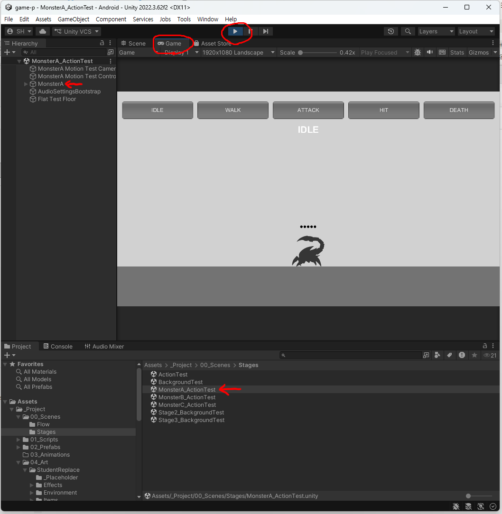
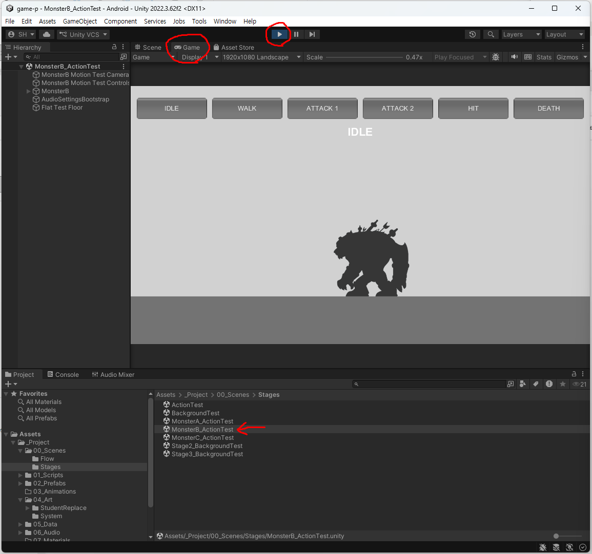
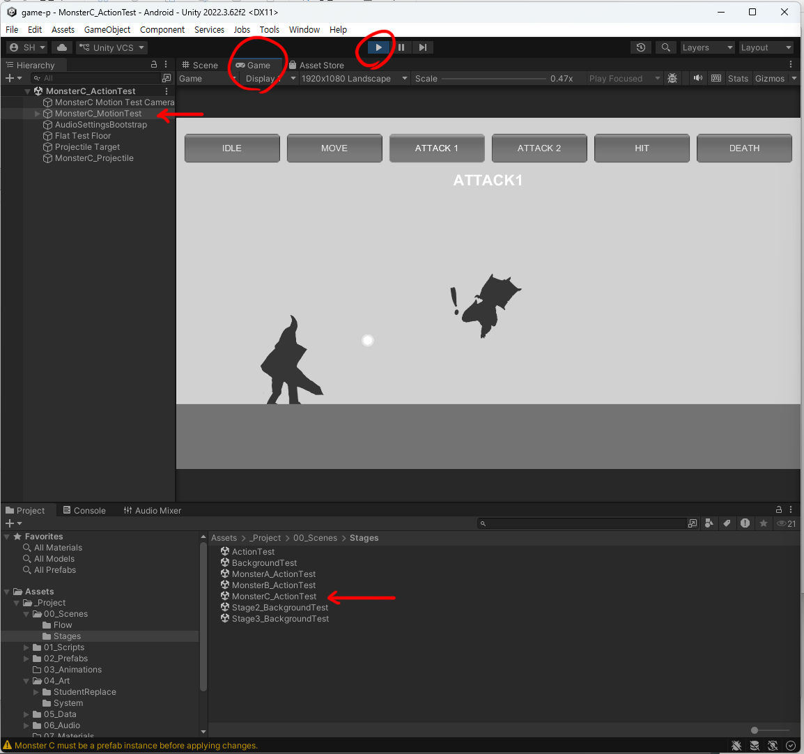
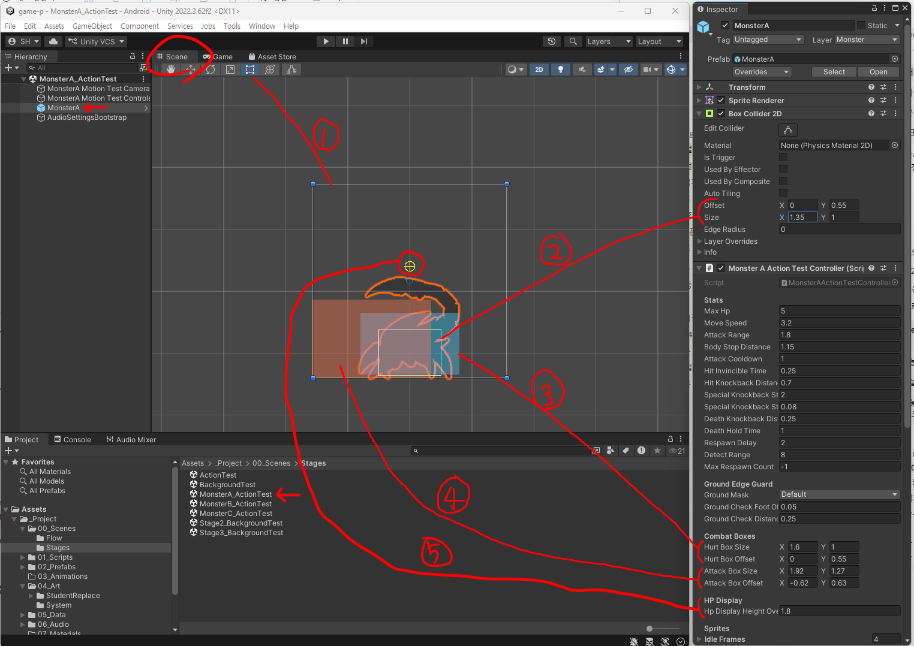
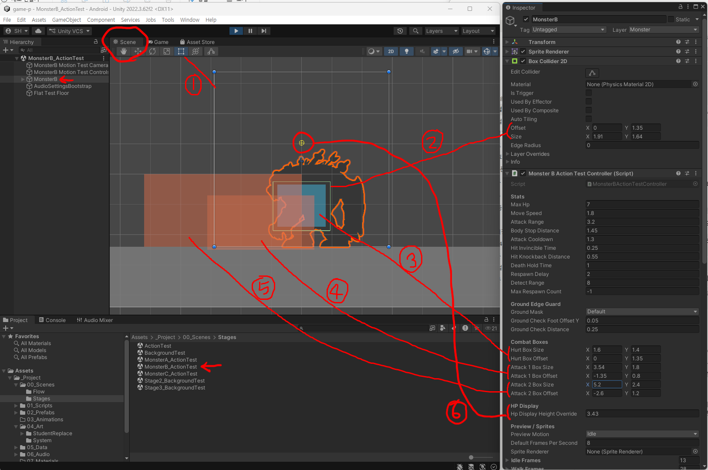
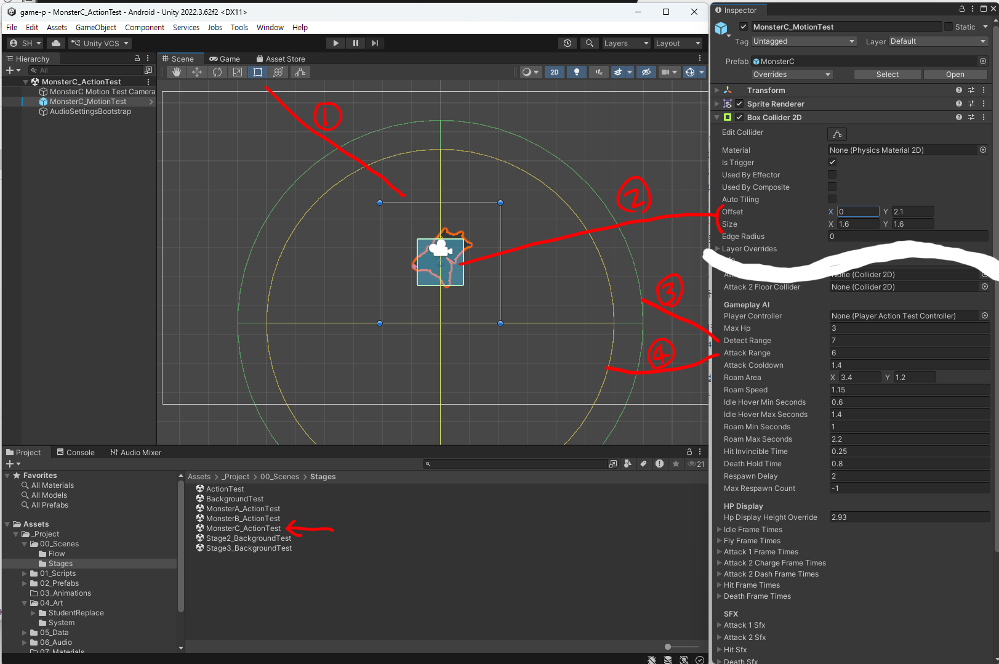
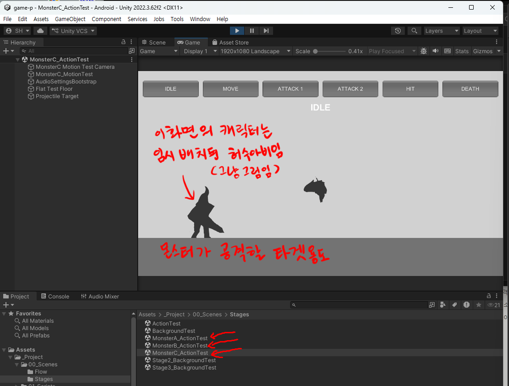
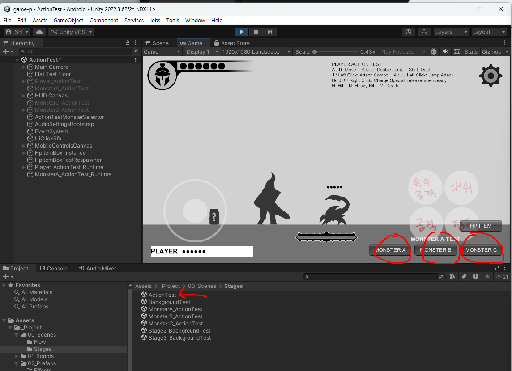

# 3주차 - 몬스터 A · B · C (러프 단계)

**이번 주 목표**: 성격이 다른 몬스터 3종을 만들고, 플레이어와 실제로 전투가 되게 한다.

---

## 1. 몬스터 3종의 특징 - 셋이 어떻게 다른가

몬스터는 **행동 패턴(스크립트)이 이미 3종류로 만들어져 있고, 그 행동은 바꾸지 않습니다.** 여러분은 그 행동에 맞는 그림을 그립니다. 그래서 **"어떤 행동을 하는 몬스터인가"를 먼저 이해하는 것이 이번 주의 핵심**입니다.

| | 몬스터 A | 몬스터 B | 몬스터 C |
|---|---|---|---|
| **성격** | 근접 / 단순형 | 근접 / 2단 공격형 | **비행** / 원거리형 |
| **이동** | 걸어서 다가옴 | 걸어서 다가옴 | **공중에 떠서** 날아다님 |
| **공격** | 근접 공격 1종 | 근접 공격 2종 (상황에 따라) | 투사체 발사 + 돌진 |
| **동작 수** | **5개** | **8개** (이펙트 2개 포함) | **7개 + 투사체** |
| **난이도** | 쉬움 | 보통 | 어려움 |
| **디자인 방향 예시** | 잡몹, 좀비, 슬라임 | 중간 보스급, 무기 든 적 | 새, 박쥐, 드론, 마법사 |

> **셋의 실루엣을 확실히 다르게 만드세요.** 플레이어는 화면에 나타난 몬스터를 보고 "저건 붙어서 때리는 놈, 저건 날면서 쏘는 놈"을 순간적으로 구분해야 합니다. 크기·형태·색조가 비슷하면 게임이 답답해집니다. 특히 **C는 날아다니므로 지상형(A/B)과 형태가 확실히 달라야** 합니다.

### 몬스터 A - 근접 / 단순형 (5개 동작)

| 폴더 | 동작 | 설명 |
|---|---|---|
| `idle_frames` | 대기 | 플레이어가 멀리 있을 때 (반복) |
| `walk_frames` | 이동 | 플레이어를 향해 걸어옴 (반복) |
| `attack1_frames` | 공격 | 근접 공격 1종 |
| `hit_frames` | 피격 | 맞았을 때 |
| `death_frames` | 사망 | 쓰러짐 |

가장 단순합니다. **여기서 작업 흐름을 먼저 익히고 B, C로 넘어가세요.**

### 몬스터 B - 근접 / 2단 공격형 (8개 동작)

| 폴더 | 동작 | 설명 |
|---|---|---|
| `idle_frames` | 대기 | |
| `walk_frames` | 이동 | |
| `attack1_frames` | 공격 1종 | |
| `attack1_effect_frames` | **공격 1의 이펙트** | 공격과 **같이** 화면에 나오는 별도 그림 |
| `attack2_frames` | 공격 2종 | 1과 다른 형태의 공격 |
| `attack2_effect_frames` | **공격 2의 이펙트** | |
| `hit_frames` | 피격 | |
| `death_frames` | 사망 | |

**이펙트는 몸과 별개의 파일**입니다. 몸 그림에 이펙트를 그려 넣지 말고, 이펙트 폴더에 따로 그리세요. (그래야 이펙트만 크게 하거나 위치를 조정할 수 있습니다.)

### 몬스터 C - 비행 / 원거리형 (7개 동작 + 투사체)

| 폴더 | 동작 | 설명 |
|---|---|---|
| `idle_frames` | 대기 | 공중에 떠 있는 상태 |
| **`fly_frames`** | **이동** | 걷기가 아니라 **날아서 이동** (`walk`가 아님에 주의) |
| `attack1_frames` | 공격 1 (원거리) | 투사체를 쏘는 동작 |
| `attack2_charge_frames` | 공격 2 준비/차지 | 돌진 전에 힘을 모으는 동작 |
| `attack2_dash_frames` | 공격 2 돌진 | 실제로 플레이어에게 날아드는 동작 |
| `hit_frames` | 피격 | |
| `death_frames` | 사망 | |
| **`Effects/Projectile`** | **투사체** | 공격 1에서 실제로 날아가는 발사체 그림 |

> C는 **날개짓 / 부유감**이 핵심입니다. `idle`도 가만히 정지가 아니라 **살짝 위아래로 떠 있는 느낌**이어야 공중에 있는 게 읽힙니다.

---

## 2. 프로젝트 구조 - 어디에 넣나

```
Assets/_Project/04_Art/StudentReplace/Monsters/
 ├─ MonsterA/
 │   ├─ idle_frames/  walk_frames/  attack1_frames/  hit_frames/  death_frames/
 │   └─ readme.txt
 ├─ MonsterB/
 │   ├─ idle_frames/  walk_frames/  attack1_frames/  attack1_effect_frames/
 │   │  attack2_frames/  attack2_effect_frames/  hit_frames/  death_frames/
 │   └─ readme.txt
 └─ MonsterC/
     ├─ idle_frames/  fly_frames/  attack1_frames/
     │  attack2_charge_frames/  attack2_dash_frames/  hit_frames/  death_frames/
     ├─ Effects/Projectile/
     └─ readme.txt
```

---

## 3. 리소스 제작 규격

### 몸 그림 (idle / walk / fly / attack / hit / death) - 플레이어와 완전히 동일

| 항목 | 규격 |
|---|---|
| 파일 형식 | PNG, **알파 채널 투명** |
| 캔버스 | **500 x 500px 정사각형 고정** |
| 기준 위치 | **캔버스 아래쪽 가운데** (플레이어와 같은 규칙) |
| 방향 | 오른쪽을 보는 방향만 (반전은 자동) |
| 프레임 수 | 폴더마다 자유 |

> **몬스터C도 몸 그림은 500x500 아래쪽 가운데 기준입니다.** 날아다니는 몬스터라고 규격이 다르지 않습니다. "떠 있는 느낌"은 캔버스 안에서 몸을 위쪽에 그려서 표현하세요.

### 이펙트 / 투사체 - 규칙이 다릅니다 ★

`MonsterB/attack1_effect_frames`, `attack2_effect_frames`, `MonsterC/Effects/Projectile`:

| 항목 | 규격 |
|---|---|
| 파일 형식 | PNG, 알파 채널 투명 |
| 캔버스 | **크기 자유** (500x500 고정 아님) |
| 기준 위치 | **캔버스 정가운데** ← 몸 그림(아래쪽 가운데)과 **다릅니다** |
| 권장 | 원래 들어 있던 파일과 **비슷한 크기 비율**로 작업 |

> **왜 원래 크기와 비슷하게?** 캔버스 크기가 곧 게임에서의 크기가 됩니다. 원래 파일보다 훨씬 큰 캔버스로 그리면 게임에서 이펙트가 화면을 뒤덮을 만큼 커집니다.

### 파일명 규칙

```
monstera_(동작이름)_(두 자리 번호).png
monsterb_(동작이름)_(두 자리 번호).png
monsterc_(동작이름)_(두 자리 번호).png
```

| 폴더 | 파일명 예시 |
|---|---|
| `MonsterA/idle_frames` | `monstera_idle_01.png` |
| `MonsterB/attack1_effect_frames` | `monsterb_attack1_effect_01.png` |
| `MonsterC/fly_frames` | `monsterc_fly_01.png` |
| `MonsterC/attack2_charge_frames` | `monsterc_attack2_charge_01.png` |
| `MonsterC/Effects/Projectile` | `monsterc_projectile_01.png` |

**전부 소문자, 두 자리 번호.** 오타가 있으면 에러 없이 조용히 안 나옵니다.

### 러프 단계 작업 지침

- 컬러링 없이, 단 **몬스터 디자인 컨셉은 알아볼 수 있게**
- **3종의 실루엣과 크기감을 서로 확실히 다르게**
- 플레이어와 나란히 놓았을 때의 **크기 비교**를 미리 생각하세요 (A는 플레이어보다 작게, B는 비슷하거나 크게, 같은 식으로 결정해두면 좋습니다)
- 프레임 수는 동작당 **3~6장** 권장

---

## 4. Unity에 적용하기

### ★ 먼저 알아둘 것 - 몬스터는 "프리팹"입니다

플레이어와 결정적으로 다른 점입니다.

- **프리팹(Prefab)** = 원본 하나를 만들어두고, 여러 씬이 그것을 가져다 쓰는 구조
- 몬스터 원본을 고치면 **그 몬스터를 쓰는 모든 씬이 한 번에 같이 바뀝니다**
- 그래서 몬스터는 "원본에 반영하기(Apply)"라는 단계가 필요합니다

> ### ⚠️ 그래도 **작업은 항상 테스트 씬에서** 합니다
>
> 위 설명은 **"왜 Apply 버튼이 필요한가"를 이해하기 위한 것**입니다. 실제 작업 방법은 딱 하나로 정해져 있습니다.
>
> **`MonsterA(B, C)_ActionTest` 씬을 열고 → `Hierarchy`에서 그 몬스터를 클릭 → `Inspector`에서 수정**
>
> ⚠️ **`Project` 창에서 프리팹 파일을 더블클릭하지 마세요.** 그러면 **프리팹 편집 모드**로 들어가는데, 겉보기에는 똑같이 고쳐지지만 **그 상태에서 Play를 누르면 엉뚱한 화면이 나옵니다** - `Game` 탭은 프리팹이 아니라 **열려 있는 씬**을 보여주기 때문입니다. "고쳤는데 왜 안 바뀌지?"의 흔한 원인입니다.
>
> **씬을 열고 `Hierarchy`에서 고르는 습관만 지키면** 이 문제가 아예 생기지 않습니다.

### 순서

**1) 그림을 폴더에 넣습니다.**

파일명/개수를 그대로 두고 덮어쓴 거라면 자동 반영됩니다. **새 폴더 구성이거나 프레임 수가 달라졌다면** 다음 도구를 실행하세요:

```
Tools > Class Template > Create Or Update MonsterA Prefab
Tools > Class Template > Create Or Update MonsterB Prefab
Tools > Class Template > Create Or Update MonsterC Prefab
```

이 도구는 폴더를 다시 스캔해서 프리팹을 만들거나 갱신하고, `ActionTest` 씬에 몬스터를 배치까지 해줍니다. **안전하게 반복 실행 가능**합니다.

**2) `ActionTest` 씬에서 프레임 수 / 판정 프레임을 확인·수정합니다.**

`Hierarchy`에서 `MonsterA_ActionTest` / `MonsterB_ActionTest` / `MonsterC_ActionTest` 를 선택 → `Inspector`.

플레이어와 마찬가지로, **프레임 개수를 바꿨다면 판정 프레임 숫자를 반드시 같이 확인**해야 합니다.

| 필드 | 의미 |
|---|---|
| `Attack1 Damage Frame` | 공격이 플레이어에게 맞는 프레임 번호 |
| `Attack1 Projectile Frame` (몬스터C) | **투사체가 발사되는 프레임 번호** |
| `Attack1 Effect Start Frame` (몬스터B) | 공격 이펙트가 나오기 시작하는 프레임 번호 |


> 몬스터C의 `Attack1 Projectile Frame`이 실제 프레임 수보다 크면 **투사체가 영원히 안 나갑니다.** 에러도 안 뜹니다. 이 프로젝트에서 가장 자주 걸리는 함정입니다.
>
> (프레임 배열 크기와 판정 프레임 번호가 안 맞으면 Console에 **경고**를 띄워주는 안전장치가 들어 있습니다. Console 창을 켜두고 작업하세요.)

**3) 원본(프리팹)에 반영합니다. ★ 이걸 빼먹으면 다른 씬에 반영이 안 됩니다.**

몬스터를 선택한 채로 `Inspector` **맨 아래**의 버튼을 클릭:

```
Apply Monster A Settings To Prefab
Apply Monster B Settings To Prefab
Apply Monster C Settings To Prefab
```

- 지금 선택한 몬스터의 **모든 값을 한 번에** 원본에 반영합니다 (필드 골라서 적용은 안 됩니다 - 전부 아니면 전부)
- 이 몬스터를 쓰는 다른 씬도 자동으로 같이 맞춰집니다

**예외 - 이 4개 값만은 따라가지 않습니다** (의도된 설계):

| 필드 | 왜 예외인가 |
|---|---|
| `Max Hp` | **같은 몬스터라도 놓인 자리마다 체력을 다르게** - 초반은 약하게, 후반은 튼튼하게 |
| `Detect Range` | 같은 몬스터라도 배치 위치마다 인식 범위를 다르게 두고 싶을 수 있음 |
| `Max Respawn Count` | 스테이지마다 리스폰 횟수를 다르게 (`-1` 무제한 / `0` 한 번만 / `1` 두 번 - [항목 설명](W03_몬스터_ABC_인스팩터.md)) |
| `Respawn Delay` | 리스폰 간격을 다르게 |

즉 이 4개는 **배치된 몬스터마다 따로 조절해도 안전**합니다. 반대로 말하면, **이 값들은 프리팹으로 올라가지 않으므로 몬스터를 놓을 때마다 각각 정해야** 합니다.

**4) Ctrl+S로 저장**

---

## 5. 확인하고 수정하기 - 두 종류의 테스트 씬

이번 주에는 확인할 씬이 **두 가지**입니다. 용도가 다릅니다.

### (1) 몬스터 개별 테스트 씬 - 동작 하나하나 확인용

```
Assets/_Project/00_Scenes/Stages/MonsterA_ActionTest.unity
Assets/_Project/00_Scenes/Stages/MonsterB_ActionTest.unity
Assets/_Project/00_Scenes/Stages/MonsterC_ActionTest.unity
```

씬을 열고 **`Game` 탭에서 `Play`(▶)** 를 누르면, **화면 위쪽에 동작 이름 버튼들이 나옵니다.** 버튼을 눌러서 원하는 동작을 반복 재생시켜 볼 수 있습니다.

> **`Scene` 탭에서는 동작이 재생되지 않습니다.** 그림이 멈춰 있는 것이 정상입니다. 동작을 보려면 반드시 **`Game` 탭 + `Play`**.

| 몬스터 A (5개 버튼) | 몬스터 B (6개) | 몬스터 C (6개) |
|---|---|---|
|  |  |  |

**A는 공격이 1종이라 버튼이 5개, B와 C는 2종이라 6개**입니다. C는 걷기가 아니라 `MOVE`(비행)입니다.

- 배경 없이 회색 바탕에 몬스터만 크게 나오므로 **애니메이션 자체를 검사하기에 가장 좋습니다**
- 반복이 자연스러운지, 발이 바닥에 붙어 있는지, 프레임이 튀지 않는지 확인

> **몬스터 C 화면에만 사람 모양이 하나 서 있습니다.** 여러분의 주인공이 아니라, **C가 겨냥할 곳을 알려주는 허수아비**입니다. 손대지 마세요 - 자세한 것은 아래 「과제」의 "영상 두 개는 서로 다른 씬에서 찍습니다".

**과제 영상 중 "각 동작들 영상"은 이 씬에서 찍습니다.**

### 판정 범위를 눈으로 확인하기 (`Scene` 탭)

`Hierarchy`에서 몬스터를 **클릭하면**, `Scene` 탭에 **평소엔 안 보이던 색깔 상자와 원**이 나타납니다. **"여기에 닿으면 맞은 것으로 친다"를 눈에 보이게** 그려준 것입니다.

**Play를 누를 필요가 없습니다.** 선택만 하면 바로 보입니다.

#### 몬스터 A



| 번호 | 무엇인가 | Inspector 항목 |
|---|---|---|
| **①** | **스프라이트 범위** - 그림 파일이 차지하는 넓이. 네 귀퉁이에 파란 점이 붙습니다. **판정과는 무관합니다** | (없음) |
| **②** | **몸통 충돌 범위** - 바닥에 서고 벽에 막히는 몸 | `Box Collider 2D`의 `Offset` / `Size` |
| **③** | **맞는 범위** (하늘색) | `Hurt Box Offset` / `Size` |
| **④** | **공격이 닿는 범위** (주황) | `Attack Box Offset` / `Size` |
| **⑤** | **HP 점이 뜰 높이** (노란 십자) | `Hp Display Height Override` |

#### 몬스터 B



**A와 같은데 공격 상자가 하나 더 있습니다.**

| 번호 | 무엇인가 | Inspector 항목 |
|---|---|---|
| **①** | 스프라이트 범위 (판정 아님) | (없음) |
| **②** | 몸통 충돌 범위 | `Box Collider 2D`의 `Offset` / `Size` |
| **③** | **맞는 범위** (하늘색) | `Hurt Box Offset` / `Size` |
| **④** | **1번 공격 범위** | `Attack 1 Box Offset` / `Size` |
| **⑤** | **2번 공격 범위** (훨씬 넓음) | `Attack 2 Box Offset` / `Size` |
| **⑥** | HP 점이 뜰 높이 | `Hp Display Height Override` |

#### 몬스터 C - **상자가 아니라 원입니다**



**C만 화면이 전혀 다릅니다.** 날아다니면서 멀리서 쏘는 몬스터라, 공격 상자 대신 **거리를 나타내는 큰 원 두 개**가 나옵니다.

| 번호 | 무엇인가 | Inspector 항목 |
|---|---|---|
| **①** | 스프라이트 범위 (판정 아님) | (없음) |
| **②** | **몸통 범위** - C는 이것이 **맞는 범위도 겸합니다** | `Box Collider 2D`의 `Offset` / `Size` |
| **③** | **알아차리는 거리** (초록 원) - 주인공이 이 안에 들어와야 반응 | `Detect Range` |
| **④** | **공격 시작 거리** (노란 원) - 이 안에 들어오면 쏘기 시작 | `Attack Range` |

> **원이 커서 한 화면에 안 들어올 수 있습니다.** 마우스 휠로 축소해서 보세요.

> C는 `Hurt Box` / `Attack Box` 항목이 **아예 없습니다.** 몸통 범위를 그대로 판정에 쓰기 때문입니다.

#### 색으로 구분합니다

상자들이 겹쳐 보이지만 **색이 다릅니다.**

| 색 | 무엇인가 |
|---|---|
| **하늘색** | **몬스터가 맞는 범위** |
| **빨강 · 주황** | **몬스터의 공격이 닿는 범위** |
| **초록 원** (C) | 주인공을 알아차리는 거리 |
| **노란 원** (C) | 공격을 시작하는 거리 |
| **노란 십자** | HP 점이 뜰 높이 |

#### 이 값들을 고칠 때

**마우스로 끌어서는 못 옮깁니다.** `Inspector`의 숫자를 바꾸면 **Scene 탭의 상자가 바로 따라 움직입니다.** Play를 켤 필요도 없습니다.

| 언제 고치나 | 무엇을 |
|---|---|
| **그림을 바꿔서 HP 점이 머리에서 멀어졌을 때** | `Hp Display Height Override` **★ 이건 거의 항상 맞춰야 합니다** |
| 몬스터를 훨씬 크게/작게 그렸을 때 | 하늘색(`Hurt Box`)을 몸에 맞춤 |

> ⚠️ **공격 범위(빨강·주황)와 C의 원들은 되도록 두세요.** 주인공의 공격 거리와 스테이지 난이도가 지금 크기를 기준으로 맞춰져 있습니다.

> **상자가 하나도 안 보이면** 몬스터가 선택되어 있는지 확인하세요. 선택을 풀면 사라지는 것이 정상입니다.

각 항목의 자세한 설명은 [W03 보조자료 - Inspector 항목 설명](W03_몬스터_ABC_인스팩터.md)에 있습니다.

### (2) `ActionTest` 씬 - 실전 전투 확인용

플레이어와 몬스터 3종이 같이 있는 씬입니다. 여기서는 **실제로 싸움이 되는지**를 봅니다.

| 확인 항목 | 방법 |
|---|---|
| 몬스터가 플레이어를 인식하고 다가오나 | 몬스터 쪽으로 걸어가기 |
| **내 공격이 몬스터에게 맞나** | `J`로 때려서 몬스터 HP가 깎이는지 |
| **몬스터 공격이 나에게 맞나** | 가만히 서서 맞아보기, 내 HP가 깎이는지 |
| 몬스터B가 공격 2종을 다 쓰나 | 계속 붙어 있으면서 관찰 |
| **몬스터C가 투사체를 쏘나** | 멀리 떨어져서 관찰 |
| 몬스터C가 돌진 공격을 하나 | 가까이 접근 |
| 죽을 때 자연스럽게 사라지나 | 다 때려잡기 |

**과제 영상 중 "전투 영상"은 이 씬에서 찍습니다.**

### 잘 안 될 때

| 증상 | 원인 |
|---|---|
| 몬스터가 임시 그림 그대로 | 파일명 오타, 또는 `Create Or Update Monster○ Prefab` 미실행 |
| 때려도 안 맞음 / 몬스터가 공격을 안 함 | **판정 프레임 숫자**가 프레임 수와 안 맞음 |
| 몬스터C 투사체가 안 나감 | `Attack1 Projectile Frame` 확인 |
| 몬스터B 이펙트가 안 보임 | 이펙트 폴더 파일명 확인 (`monsterb_attack1_effect_01.png`) |
| 이펙트가 너무 크거나 작음 | 이펙트 캔버스 크기 = 게임에서의 크기. 원래 파일 비율에 맞추세요 |
| ActionTest에서 고쳤는데 다른 씬은 그대로 | **Apply Monster ○ Settings To Prefab** 안 눌렀음 |
| 몬스터가 바닥에 파묻힘 / 떠 있음 | 500x500 캔버스에서 "아래쪽 가운데" 기준이 안 맞음 |

---

## 6. GitHub 백업

1. Unity에서 **Ctrl+S** (여러 씬을 만졌다면 각각 저장 - 이번 주는 씬을 여러 개 엽니다)
2. GitHub Desktop → Summary `3주차 - 몬스터 A/B/C 러프` → **Commit to main** → **Push origin**

### 이번 주 특히 주의

- 몬스터 작업은 **씬 4개 + 프리팹 3개**를 건드립니다. 저장 안 한 씬이 있으면 그 부분이 백업에서 빠집니다. Unity 상단 씬 이름 옆에 **`*` 표시가 있으면 저장 안 된 상태**입니다.
- 프리팹 파일(`.prefab`)이 변경 목록에 뜨는 것은 정상입니다.
- Push 전에 Console에 빨간 에러가 없는지 확인하세요. **에러가 있는 상태로 백업하면 나중에 되돌릴 지점이 오염됩니다.**

---

## 과제 (3주차)

### 무엇을 해오나

**몬스터 A, B, C를 러프(스케치) 상태로 제작하고, Unity에 적용해서 플레이어와 전투가 되게 만들기**

- 완성본이 아닌 **스케치 버전의 러프** 상태 - **모션과 타이밍에 집중**, 완성은 12주차
- 스케치지만 **몬스터 디자인 컨셉은 담겨 있어야 함** (컬러링 X)
- A(5) + B(8) + C(7 + 투사체) 전부

### 제출

네이버 카페 업로드 - 제목 `2D게임제작_03주차_123456김한성`

- [ ] **몬스터 A·B·C 리소스** - 각 모션의 **대표컷 1개씩**
- [ ] **몬스터 동작 영상** - `MonsterA/B/C_ActionTest` 씬에서 각 동작을 재생한 영상, **10~20초**
- [ ] **전투 영상** - `ActionTest` 씬에서 플레이어와 몬스터 A·B·C가 싸우는 영상, **20~30초**
  - 내가 때리는 장면 **+ 내가 맞는 장면**이 둘 다 들어가야 함
  - 몬스터C의 투사체 발사 장면 포함

### 영상 두 개는 **서로 다른 씬**에서 찍습니다

헷갈리기 쉬운 부분입니다. **용도가 다른 씬이 두 종류** 있고, 영상도 각각 하나씩입니다.

#### ① 몬스터 동작 영상 → `MonsterA / MonsterB / MonsterC_ActionTest`

**몬스터 하나만 놓고 "이 몬스터의 그림에 이상이 없는지"를 보는 씬**입니다. 배경도 전투도 없이, 화면 위 버튼으로 동작을 하나씩 골라 재생합니다.



- **몬스터가 셋이니 씬도 셋**입니다. `A`, `B`, `C` 각각 열어서 찍으세요
- 반복이 자연스러운지, 발이 바닥에 붙어 있는지, 프레임이 튀지 않는지를 봅니다

> ### ⚠️ 몬스터 C 화면에 서 있는 사람 - **여러분의 주인공이 아닙니다**
>
> 위 그림의 왼쪽에 사람 모양이 하나 서 있는데, **몬스터 C가 공격할 곳을 알려주기 위해 놓아둔 허수아비**입니다. 움직이지도 않고 반응도 없는 **그냥 그림**입니다.
>
> C는 **멀리서 투사체를 쏘는 몬스터**라, 겨냥할 상대가 없으면 발사 동작을 확인할 수 없어서 세워둔 것입니다. **A와 B의 씬에는 없습니다.**
>
> **이 허수아비는 손대지 마세요.** 지우면 C의 투사체가 어디로 갈지 정해지지 않습니다.

#### ② 전투 영상 → `ActionTest`

**주인공과 몬스터를 함께 놓고 "전체가 제대로 맞물리는지"를 보는 씬**입니다. 실제로 싸움이 되는지를 확인합니다.



- 화면 오른쪽 아래 **`MONSTER A` · `MONSTER B` · `MONSTER C`** 버튼으로 **부를 몬스터를 바꿉니다**
- **셋을 차례로 불러서** 한 영상에 담으면 됩니다
- 내가 때리는 장면 **+ 내가 맞는 장면**을 둘 다 넣으세요

#### 두 씬은 **연결되어 있습니다**

씬은 나뉘어 있지만 **같은 몬스터 원본(프리팹)을 씁니다.** 그래서 몬스터 테스트 씬에서 고치고 **`Apply ~ To Prefab` 버튼을 누르면**, `ActionTest` 씬의 몬스터도 **자동으로 같이 바뀝니다.** 두 번 작업할 필요가 없습니다.

> ### ★ 수정은 **몬스터 테스트 씬에서** 하세요
>
> ```
> MonsterA(B, C)_ActionTest 에서 고친다  →  Apply  →  ActionTest 에도 반영됨
> ```
>
> **반대로 하지 마세요.** `ActionTest`의 몬스터는 게임이 시작될 때 **복사되어 나오는 것**이라, 거기서 고치면 헷갈리기 쉽습니다. **고치는 곳은 항상 몬스터 테스트 씬, 확인은 양쪽에서.**

### 제출 전 체크리스트

- [ ] A 5개 / B 8개 / C 7개 + 투사체 폴더가 전부 채워졌는가
- [ ] 파일명 접두사가 `monstera_` / `monsterb_` / `monsterc_`로 정확한가
- [ ] 몸 그림은 500x500, 이펙트/투사체는 **정가운데 기준**으로 그렸는가
- [ ] `Create Or Update Monster○ Prefab` 실행했는가
- [ ] **`Apply Monster ○ Settings To Prefab`을 A·B·C 전부 눌렀는가** ← 제일 많이 빠뜨림
- [ ] 3종 다 공격이 플레이어에게 맞고, 플레이어 공격도 3종 다 맞는가
- [ ] Console에 경고/에러가 없는가
- [ ] Ctrl+S → Commit → **Push까지 완료**했는가

---

## 관련 문서

- `Assets/_Project/04_Art/StudentReplace/Monsters/MonsterA(B,C)/readme.txt` - **작업 전에 반드시 열어볼 것**
- [04_Unity_적용_가이드](../기본설명/04_Unity_적용_가이드.md) - "프리팹으로 만들어진 것 vs 씬에만 있는 것", "몬스터: Apply 버튼으로 확정 짓기"
- [W03 보조자료 - 몬스터 Inspector 항목 설명](W03_몬스터_ABC_인스팩터.md) - **Inspector 항목이 뭐가 뭔지 모르겠을 때**
- [W02_플레이어_캐릭터](W02_플레이어_캐릭터.md) - 캔버스 기준 위치, 판정 프레임 개념 (같은 내용)
