# 3주차 보조자료 - 몬스터 A·B·C Inspector 항목 설명

> 본 수업 문서: **[W03 몬스터 A·B·C](W03_몬스터_ABC.md)** · 같은 형식의 주인공 편: **[W02 주인공 Inspector 항목 설명](W02_플레이어_캐릭터_인스팩터.md)**

몬스터도 주인공처럼 Inspector 항목이 많습니다. **구조는 주인공과 거의 같으니 [주인공 편](W02_플레이어_캐릭터_인스팩터.md)을 먼저 읽고 오면 훨씬 빠릅니다.**

이 문서는 **몬스터에만 있는 것**과 **A·B·C가 서로 다른 부분**에 집중합니다.

---

## 이 문서를 보는 법

| 표시 | 뜻 |
|---|---|
| **★** | **여러분이 직접 다루는 것** |
| **△** | **필요하면 조정.** 안 건드려도 정상 작동합니다 |
| **✕** | **손대지 마세요.** 밸런스나 판정이 깨집니다 |

> 이 문서의 숫자는 **프리팹의 현재 설정값**입니다. 값을 되돌리고 싶을 때 여기를 보면 됩니다.

---

## 0. 주인공과 결정적으로 다른 점 - 몬스터는 **프리팹**입니다

**이것 하나만 놓쳐도 작업이 전부 날아갑니다.**

주인공은 씬마다 따로 존재하지만, 몬스터는 **`02_Prefabs/Monsters/`에 있는 원본(프리팹) 하나**를 여러 씬에서 가져다 씁니다.

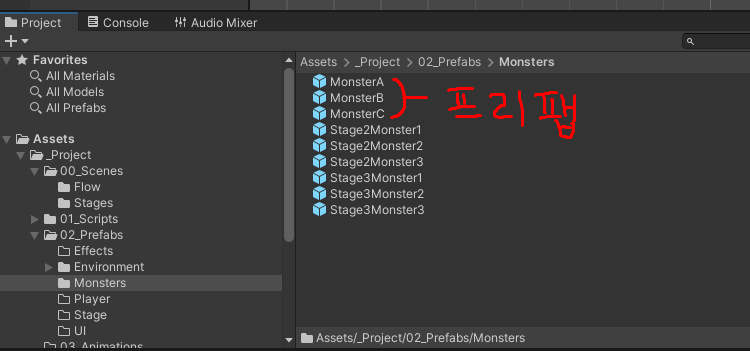

**씬에 놓인 몬스터는 이 원본에서 복사되어 온 것**입니다. `Hierarchy`에서 이름이 **파란 글씨 + 파란 상자 아이콘**이면 프리팹에서 온 것이라는 표시입니다.

| 몬스터 A | 몬스터 B | 몬스터 C |
|---|---|---|
| 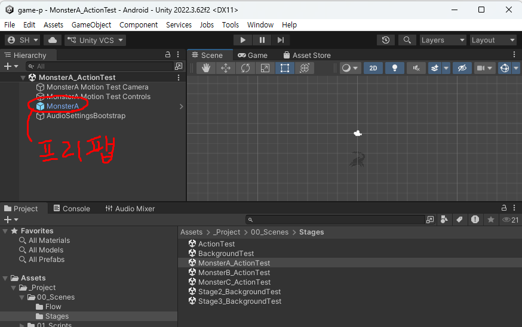 | 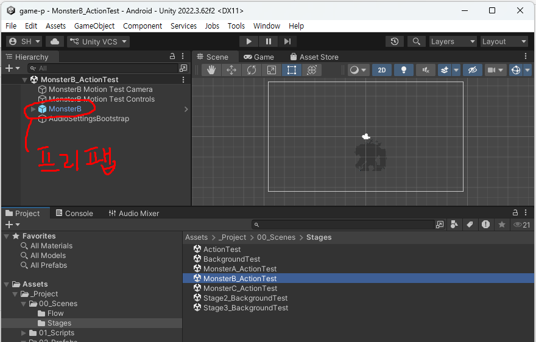 | 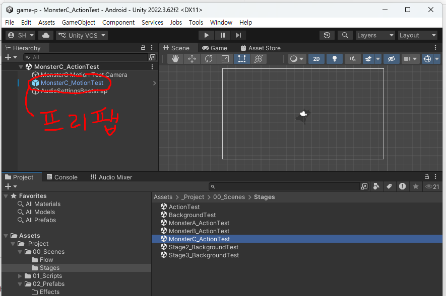 |

> **몬스터 C만 씬에서의 이름이 다릅니다** - `MonsterC_MotionTest`. 이름이 달라도 같은 프리팹에서 온 것입니다.

**그래서 씬에서 몬스터를 고치면 그 씬에만 반영됩니다.** 원본에 확정 지으려면 Inspector 맨 아래 버튼을 눌러야 합니다.

| 몬스터 | 버튼 |
|---|---|
| A | **`Apply Monster A Settings To Prefab`** |
| B | **`Apply Monster B Settings To Prefab`** |
| C | **`Apply Monster C Settings To Prefab`** |

> ⚠️ **이 버튼을 안 누르고 씬을 저장하면**, 그 씬의 몬스터만 바뀌고 다른 씬(`ActionTest` / `BackgroundTest` / 스테이지2·3)의 몬스터는 **옛날 그림 그대로** 남습니다. 나중에 "여기선 되는데 저기선 안 돼요"의 원인이 대부분 이것입니다.

### ★ 작업은 **항상 테스트 씬에서** - 프리팹을 직접 열지 마세요

위 설명은 **"왜 Apply 버튼이 필요한가"를 이해하기 위한 것**입니다. 실제 작업 방법은 하나로 정해져 있습니다.

```
MonsterA(B, C)_ActionTest 씬 열기
  → Hierarchy에서 그 몬스터 클릭
  → Inspector에서 수정
  → 끝나면 Apply
```

> ⚠️ **`Project` 창의 `02_Prefabs/Monsters/` 에서 프리팹 파일을 더블클릭하지 마세요.**
>
> 더블클릭하면 **프리팹 편집 모드**로 들어갑니다. `Hierarchy`가 씬 대신 **그 프리팹의 내부**로 바뀌고, 값은 똑같이 고쳐지는 것처럼 보입니다. **그런데 그 상태에서 `Play`를 누르면 엉뚱한 화면이 나옵니다.**
>
> **`Game` 탭은 프리팹을 보여주지 않습니다.** 언제나 **열려 있는 씬**을 그립니다. 그래서 MonsterB 프리팹을 열어놓고 Play하면, 화면에는 **그때 열려 있던 씬**(예: `MonsterA_ActionTest`)이 나옵니다. **"내가 고친 게 왜 안 보이지?"** 의 흔한 원인입니다.
>
> **프리팹 모드에서 나가려면** `Hierarchy` 왼쪽 위의 **`<`(뒤로)** 화살표를 누르세요.

**씬을 열고 `Hierarchy`에서 고르는 습관만 지키면** 이 혼동이 아예 생기지 않습니다. 프리팹 원본은 **`Apply` 버튼이 대신 고쳐줍니다** - 여러분이 직접 열 일이 없습니다.

---

## 0-1. 세 몬스터가 어떻게 다른가

| | **몬스터 A** | **몬스터 B** | **몬스터 C** |
|---|---|---|---|
| 유형 | 근접 · 단순 | 근접 · 2단 공격 | **비행** · 원거리 |
| 체력(`Max Hp`) | 5 | 7 | 3 |
| 이동 속도 | 3.2 (빠름) | 1.8 (느림) | 떠다님 |
| 공격 | 1종 | 2종 (+이펙트) | 투사체 + 돌진 |
| 동작 그림 | 5종 | 6종 | 7종 (+투사체) |
| Combat Boxes | 있음 | 있음 (공격 2개) | **없음** (몸통 콜라이더 사용) |

**C만 구조가 꽤 다릅니다.** A와 B는 거의 같은 항목을 가집니다.

---

## 1. Stats - 능력치 (A·B 공통, C는 `Gameplay AI`에 있음)

**아래는 몬스터 A의 화면입니다.** B도 항목이 거의 같고, C는 이 항목들이 `Gameplay AI` 묶음에 따로 있습니다(9-3 참고).

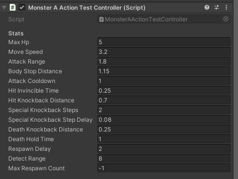

| 항목 | A | B | 설명 | |
|---|---:|---:|---|---|
| `Max Hp` | 5 | 7 | 몬스터의 체력. **놓인 몬스터마다 따로 정합니다** (아래 설명) | **△** |
| `Move Speed` | 3.2 | 1.8 | 쫓아오는 속도 | **△** |
| `Attack Range` | 1.8 | 3.2 | 이 거리 안에 들어오면 공격 시작 | **✕** |
| `Body Stop Distance` | 1.15 | 1.45 | 주인공에게 이만큼까지만 붙고 멈춤 | **✕** |
| `Attack Cooldown` | 1.0 | 1.3 | 공격 후 다음 공격까지 쉬는 시간(초) | **△** |
| `Hit Invincible Time` | 0.25 | 0.25 | 맞은 뒤 잠깐 무적인 시간 | **✕** |
| `Hit Knockback Distance` | 0.7 | 0.55 | 맞았을 때 밀려나는 거리 | **✕** |
| `Special Knockback Steps` | 2 | - | 필살기에 맞았을 때 여러 번 밀려나는 횟수 (A만) | **✕** |
| `Special Knockback Step Delay` | 0.08 | - | 그 사이 간격(초) (A만) | **✕** |
| `Death Knockback Distance` | 0.25 | - | 죽을 때 밀려나는 거리 (A만) | **✕** |
| `Death Hold Time` | 1.0 | 1.0 | 죽은 자세로 머무는 시간(초) | **△** |
| `Respawn Delay` | 2.0 | 2.0 | 죽고 나서 다시 나타나기까지(초) | **△** |
| `Detect Range` | 8 | 8 | **제자리에서 이 거리 안에 주인공이 들어와야** 반응 | **△** |
| `Max Respawn Count` | -1 | -1 | **몇 번까지 부활하는가** (아래 표 참고) | **△** |

**△인 것들의 쓸모** - 스테이지 난이도를 조절할 때 씁니다.

- **`Max Hp`**: 내 그림이 "덩치 큰 보스"처럼 생겼으면 올려서 어울리게 만들 수 있습니다.

  **이 값은 `Apply`를 눌러도 프리팹으로 올라가지 않습니다.** 즉 **놓인 몬스터 하나하나에 따로** 정하는 값입니다 - 스테이지 초반에 놓인 것은 약하게, 후반은 튼튼하게 하는 식으로 난이도를 조절하라고 그렇게 만들어져 있습니다. 같은 종류라도 자리마다 다르게 둘 수 있습니다.
- **`Max Respawn Count`**: 씬에 놓인 **몬스터 하나하나 따로** 정할 수 있습니다. 초반 몬스터는 적게, 후반은 많이 하는 식으로 난이도를 조절합니다.

  | 값 | 뜻 | 총 몇 번 나오나 |
  |---:|---|---|
  | **`-1`** | **무제한 부활** (기본값) | 계속 |
  | **`0`** | 부활 없음 - **한 번 죽으면 끝** | **1번** |
  | **`1`** | 최초 등장 + **1번 부활** | **2번** |
  | **`2`** | 최초 등장 + **2번 부활** | **3번** |
  | `3`, `4`, `5` ... | 같은 방식 | 값 + 1번 |

  > **숫자는 "부활 횟수"이지 "등장 횟수"가 아닙니다.** 그래서 **실제로 나오는 횟수는 항상 값보다 1 큽니다.** `2`를 넣으면 세 번 나옵니다.

- **`Detect Range`**: **자기가 처음 놓인 자리에서** 재는 거리입니다. 그래서 몬스터가 이 범위 밖으로 따라오지 않습니다

> ⚠️ **`Attack Range`와 `Body Stop Distance`는 세트입니다.** 정지 거리보다 공격 거리가 짧으면 **몬스터가 주인공 앞에 서서 공격을 영원히 안 합니다.** 둘 중 하나만 바꾸지 마세요.

---

## 2. Ground Edge Guard - 낭떠러지 방지 (A·B)

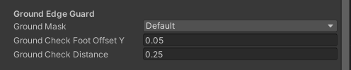

| 항목 | 현재값 | 설명 | |
|---|---|---|---|
| `Ground Mask` | Ground | 무엇을 바닥으로 볼 것인가 | **✕** |
| `Ground Check Foot Offset Y` | 0.05 | 발밑 어느 높이에서 검사할지 | **✕** |
| `Ground Check Distance` | 0.25 | 얼마나 아래까지 검사할지 | **✕** |

**몬스터가 구덩이로 걸어 들어가거나, 맞고 밀려서 떨어지는 것을 막는 장치입니다.** 배경 작업(5주차)에서 구덩이를 만들었을 때 몬스터가 빠지지 않는 이유가 이것입니다. 건드리면 몬스터가 낭떠러지로 걸어갑니다.

---

## 3. Combat Boxes - 판정 범위 (A·B)

**A는 공격 상자가 1개, B는 2개**입니다. 그것 말고는 구조가 같습니다.

| 몬스터 A | 몬스터 B |
|---|---|
| 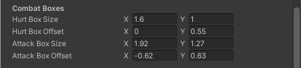 | 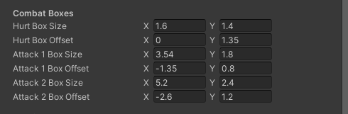 |

| 항목 | A | B | 설명 | |
|---|---|---|---|---|
| `Hurt Box Size` | (1.6, 1.0) | (1.6, 1.4) | **몬스터가 맞는 범위**의 크기 | **✕** |
| `Hurt Box Offset` | (0, 0.55) | (0, 1.35) | 〃 위치 | **✕** |
| `Attack Box Size` | (1.92, 1.27) | - | **몬스터의 공격이 닿는 범위** | **✕** |
| `Attack Box Offset` | (-0.62, 0.63) | - | 〃 위치 | **✕** |
| `Attack 1 Box Size` | - | (3.54, 1.8) | B의 1번 공격 범위 | **✕** |
| `Attack 1 Box Offset` | - | (-1.35, 0.8) | 〃 위치 | **✕** |
| `Attack 2 Box Size` | - | (5.2, 2.4) | B의 2번 공격 범위 (훨씬 넓음) | **✕** |
| `Attack 2 Box Offset` | - | (-2.6, 1.2) | 〃 위치 | **✕** |

**이 숫자들은 `Scene` 탭에서 눈으로 확인할 수 있습니다.** `Hierarchy`에서 몬스터를 클릭하면 색깔 상자로 나타납니다 (Play 불필요).

| 색 | 무엇인가 |
|---|---|
| **하늘색** | **몬스터가 맞는 범위** (`Hurt Box ~`) |
| **빨강 · 주황** | **몬스터의 공격이 닿는 범위** (`Attack ~ Box ~`) |
| **노란 십자** | HP 점이 뜰 높이 (`Hp Display Height Override`) |

> **화면과 번호별 설명은 [W03 본문](W03_몬스터_ABC.md)의 "판정 범위를 눈으로 확인하기"에 A·B·C 각각 있습니다.** 몬스터 C는 상자가 아니라 **원**으로 나오니 그쪽을 보세요.

**그림 크기와 판정 범위는 별개입니다.** 몬스터를 크게 그렸다고 여기를 키우면, 주인공이 닿지도 않는 거리에서 맞게 됩니다.

> `Offset`의 `X`가 **음수**인 것은 몬스터가 **왼쪽을 보는 것이 기본**이기 때문입니다(주인공은 오른쪽 기준). 반대 방향을 볼 때는 Unity가 알아서 뒤집습니다.

> **몬스터 C는 이 항목이 없습니다.** C는 몸통 콜라이더를 그대로 판정에 씁니다.

---

## 4. HP Display - 머리 위 체력 표시

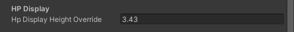

| 항목 | A | B | C | |
|---|---:|---:|---:|---|
| `Hp Display Height Override` | 1.8 | 3.43 | 2.93 | **★** |

**머리 위에 뜨는 HP 점들의 높이**입니다. **몬스터 그림을 갈아 끼우면 이 값을 다시 맞춰야 합니다.**

- **`-1`로 두면 자동**입니다. 다만 자동은 **그림의 투명 여백까지 포함해서** 계산하기 때문에, 여백이 많은 그림이면 **점이 머리 위로 한참 떠 보입니다**
- 그래서 세 몬스터 다 숫자를 직접 넣어 두었습니다. 여러분 그림에 맞는 값은 다를 수 있습니다

> **Play 없이 확인할 수 있습니다.** `Scene` 탭에서 그 몬스터를 선택하면 **노란 십자 표시**가 뜨는데, 그 위치가 HP 점이 뜰 높이입니다. 머리 바로 위에 오도록 숫자를 조정하세요 - **화면은 [W03 본문](W03_몬스터_ABC.md)의 "판정 범위를 눈으로 확인하기"에 있습니다.**

---

## 5. Sprites - 동작 그림 ★

**배열 다루는 법은 [주인공 편](W02_플레이어_캐릭터_인스팩터.md)의 "배열을 다루는 법"과 완전히 같습니다.** 항목 이름 오른쪽 끝의 숫자가 장수이고, `+` / `−` 버튼으로 한 칸씩 늘리거나 줄입니다. 그림은 `Element 0`부터 채웁니다.

### 몬스터 A (5종)

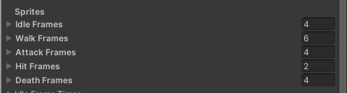

| 항목 | 현재 장수 | |
|---|---:|---|
| `Idle Frames` | 4 | **★** |
| `Walk Frames` | 6 | **★** |
| `Attack Frames` | 4 | **★** |
| `Hit Frames` | 2 | **★** |
| `Death Frames` | 4 | **★** |

### 몬스터 B (6종)

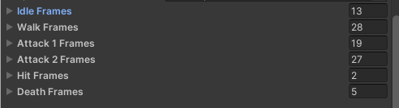

| 항목 | 현재 장수 | |
|---|---:|---|
| `Idle Frames` | 13 | **★** |
| `Walk Frames` | 28 | **★** |
| `Attack 1 Frames` | 19 | **★** |
| `Attack 2 Frames` | 27 | **★** |
| `Hit Frames` | 2 | **★** |
| `Death Frames` | 5 | **★** |

> **B는 기본 그림의 장수가 유난히 많습니다.** 여러분이 이만큼 그릴 필요는 **전혀 없습니다.** 4~6장으로 줄여도 됩니다 - **다만 줄이면 아래 판정 프레임을 반드시 같이 고쳐야 합니다**(현재 `15`로 되어 있습니다).

### 몬스터 C (7종 + 투사체)

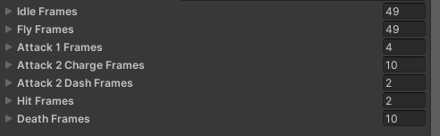

| 항목 | 현재 장수 | |
|---|---:|---|
| `Idle Frames` | 49 | **★** |
| `Fly Frames` | 49 | **★** |
| `Attack 1 Frames` | 4 | **★** |
| `Attack 2 Charge Frames` (돌진 전 모으기) | 10 | **★** |
| `Attack 2 Dash Frames` (돌진) | 2 | **★** |
| `Hit Frames` | 2 | **★** |
| `Death Frames` | 10 | **★** |
| `Projectile Frames` (**날아가는 투사체**) | 2 | **★** |

> C는 **`Walk`가 아니라 `Fly`** 입니다. 날아다니는 몬스터라 걷기 동작이 없습니다.

---

## 6. Frame Timing - 그림 한 장씩의 체류 시간

| 항목 | 설명 | |
|---|---|---|
| `Idle Frame Times` / `Walk Frame Times` / `Attack ~ Frame Times` / `Hit Frame Times` / `Death Frame Times` | 각 그림이 머무는 시간(초) | **△** |
| `Default Frames Per Second` (B·C) | 8 - **시간을 지정하지 않은 그림의 기본 속도** | **△** |
| `Reverse Walk Frame Order` (B만) | 켜짐 - 걷기 프레임을 **거꾸로 재생** | **△** |

- **비워두면 기본 속도로 재생됩니다.** 몬스터는 주인공과 달리 **비어 있는 것이 정상**입니다
- 펼치면 **`Frame Count`** 와 **`Frame 1`, `Frame 2` ...** 로 나옵니다. **여기는 1부터** 셉니다
- **`Reverse Walk Frame Order`**: B의 기본 그림이 반대 순서로 그려져 있어서 켜둔 것입니다. **내 그림으로 바꾼 뒤 걷기가 뒤로 걷는 것처럼 보이면 이 체크를 꺼보세요.**

---

## 7. ★ 판정 프레임 - 프레임 개수를 바꿨다면 반드시 확인

**이 게임에서 사고가 가장 자주 나는 곳입니다.** 주인공 편과 같은 이야기지만, **몬스터 B와 C는 특히 위험합니다.**

> ### ⚠️ 몬스터는 이 값들이 **한군데 모여 있지 않습니다**
>
> 주인공은 판정 프레임이 `Effect Placement` 묶음에 **한 덩어리로** 있습니다. **몬스터는 다릅니다** - 몬스터마다, 항목마다 **다른 묶음에 흩어져** 있습니다. 아래 표의 **"Inspector 어디에"** 칸을 보고 찾으세요.

**몬스터 A가 가장 찾기 어렵습니다.** 아래 그림의 빨간 밑줄 두 곳이 그것입니다 - 하나는 `Frame Timing` 묶음 맨 끝, 다른 하나는 `SFX` 묶음 맨 끝.

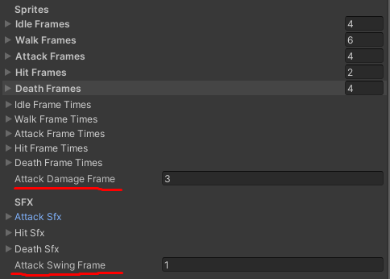

| 몬스터 | 항목 | **Inspector 어디에** | 현재값 | 해당 동작의 장수 | |
|---|---|---|---:|---:|---|
| A | `Attack Damage Frame` | **`Frame Timing`** 묶음 - `Death Frame Times` **바로 아래** | 3 | 4 | **★** |
| A | `Attack Swing Frame` | **`SFX`** 묶음 - `Death Sfx` **아래 맨 끝** | 1 | 4 | **★** |
| B | `Attack 1 Damage Frame` | **`Attack Effects`** 묶음 | **15** | 19 | **★** |
| B | `Attack 1 Effect Start Frame` | **`Attack Effects`** 묶음 | **15** | 19 | **★** |
| B | `Attack 2 Damage Frame` | **`Attack Effects`** 묶음 | **15** | 27 | **★** |
| B | `Attack 2 Effect Start Frame` | **`Attack Effects`** 묶음 | **15** | 27 | **★** |
| C | `Attack 1 Projectile Frame` | **`Attack 1 Projectile`** 묶음 | 3 | 4 | **★** |

> **A가 가장 찾기 어렵습니다.** 두 값이 **서로 다른 묶음**에 하나씩 떨어져 있고, 각 묶음의 **맨 마지막 줄**에 붙어 있어서 스크롤하다 지나치기 쉽습니다. **B와 C는 한 묶음 안에** 모여 있습니다.

> ### ⚠️ 몬스터 B를 그릴 때 가장 흔한 사고
>
> B의 공격은 **19장 / 27장**으로 되어 있고, 판정이 **15번째 그림**에서 나갑니다.
>
> 여러분이 공격을 **5장으로** 그려서 넣으면, 판정은 여전히 **"15번째 그림에서 때려라"** 로 남아 있습니다. **있지도 않은 15번째 그림**이므로 **몬스터가 주인공을 영원히 못 때립니다.**
>
> **에러는 하나도 안 뜹니다.** 공격 모션은 멀쩡히 나오고 Console도 조용합니다. "왜 안 맞지?"만 남습니다.
>
> **그림을 5장으로 줄였다면 `Attack 1 Damage Frame`도 3 정도로 같이 줄이세요.** 대략 **동작의 한가운데**, 무기가 가장 뻗은 그림 번호로 잡으면 됩니다.

> **몬스터 C도 같습니다.** `Attack 1 Projectile Frame`이 실제 장수를 넘으면 **투사체가 아예 안 나갑니다.**

---

## 8. 몬스터 B 전용 - Attack Effects

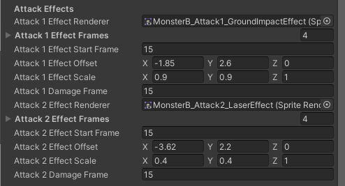

| 항목 | 현재값 | 설명 | |
|---|---|---|---|
| `Attack 1 Effect Renderer` | (오브젝트) | 이펙트를 그릴 담당 오브젝트 | **✕** |
| `Attack 1 Effect Frames` | 4장 | 1번 공격 이펙트 그림 | **★** |
| `Attack 1 Effect Offset` | (-1.85, 2.6, 0) | 이펙트가 뜨는 위치 | **△** |
| `Attack 1 Effect Scale` | (0.9, 0.9, 1) | 이펙트 크기 | **△** |
| `Attack 2 Effect Renderer` | (오브젝트) | | **✕** |
| `Attack 2 Effect Frames` | 4장 | 2번 공격 이펙트 그림 | **★** |
| `Attack 2 Effect Offset` | (-3.62, 2.2, 0) | | **△** |
| `Attack 2 Effect Scale` | (0.4, 0.4, 1) | | **△** |

**`~ Renderer` 칸을 비우면 이펙트가 아예 안 나옵니다.** 지우지 마세요.

---

## 9. 몬스터 C 전용

C는 **날아다니며 투사체를 쏘고, 가끔 돌진**합니다. 그래서 다른 둘에 없는 항목이 많습니다.

### 9-1. Attack 1 Projectile - 날리는 투사체

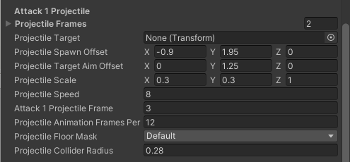

| 항목 | 현재값 | 설명 | |
|---|---|---|---|
| `Projectile Frames` | | 투사체 그림 | **★** |
| `Projectile Target` | (오브젝트) | 무엇을 향해 쏘는지 | **✕** |
| `Projectile Spawn Offset` | (-0.9, 1.95, 0) | **몸의 어디에서 발사되는지** | **△** |
| `Projectile Target Aim Offset` | (0, 1.25, 0) | 주인공의 어느 높이를 겨냥할지 | **✕** |
| `Projectile Scale` | (0.3, 0.3, 1) | **투사체 그림 크기** | **△** |
| `Projectile Speed` | 8 | 날아가는 속도 | **△** |
| `Attack 1 Projectile Frame` | 3 | **몇 번째 그림에서 발사되는가** | **★** |
| `Projectile Animation Frames Per Second` | 12 | 투사체 그림 재생 속도 | **△** |
| `Projectile Floor Mask` | | 바닥에 부딪히면 사라지게 하는 설정 | **✕** |
| `Projectile Collider Radius` | 0.28 | 투사체의 맞는 범위(반지름) | **✕** |

> **`Projectile Spawn Offset`과 `Projectile Scale`은 그림을 바꾸면 조정하게 됩니다.** 입에서 쏘는지 손에서 쏘는지에 따라 발사 위치가 달라지고, 투사체 그림 크기도 원본과 다를 수 있습니다.

### 9-2. Attack 2 Dash - 돌진

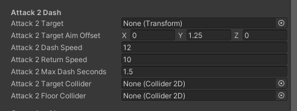

| 항목 | 현재값 | 설명 | |
|---|---|---|---|
| `Attack 2 Target` | (오브젝트) | 돌진 목표 | **✕** |
| `Attack 2 Target Aim Offset` | (0, 1.25, 0) | 겨냥 높이 | **✕** |
| `Attack 2 Dash Speed` | 12 | 돌진 속도 | **△** |
| `Attack 2 Return Speed` | 10 | 돌진 후 되돌아오는 속도 | **△** |
| `Attack 2 Max Dash Seconds` | 1.5 | 돌진 최대 지속 시간(초) | **✕** |
| `Attack 2 Target Collider` / `Attack 2 Floor Collider` | (오브젝트) | 돌진 중 부딪힘 판정 | **✕** |

### 9-3. Gameplay AI - C의 능력치와 움직임

**C는 A·B의 `Stats`에 해당하는 것이 이 묶음에 들어 있습니다.**

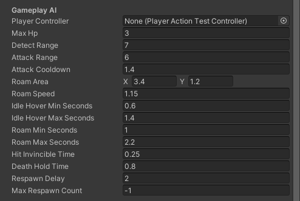

| 항목 | 현재값 | 설명 | |
|---|---:|---|---|
| `Player Controller` | (오브젝트) | 주인공 연결 | **✕** |
| `Max Hp` | 3 | 체력 (셋 중 가장 약함) | **△** |
| `Detect Range` | 7 | 주인공을 알아차리는 거리 | **△** |
| `Attack Range` | 6 | 공격 시작 거리 (원거리라 깁니다) | **✕** |
| `Attack Cooldown` | 1.4 | 공격 사이 쉬는 시간(초) | **△** |
| `Roam Area` | (3.4, 1.2) | **평소 떠다니는 범위** (가로, 세로) | **△** |
| `Roam Speed` | 1.15 | 떠다니는 속도 | **△** |
| `Idle Hover Min/Max Seconds` | 0.6 / 1.4 | 제자리에 머무는 시간 범위 | **△** |
| `Roam Min/Max Seconds` | 1.0 / 2.2 | 한 번 이동하는 시간 범위 | **△** |
| `Hit Invincible Time` | 0.25 | 맞은 뒤 무적 시간 | **✕** |
| `Death Hold Time` | 0.8 | 죽은 자세 유지 시간 | **△** |
| `Respawn Delay` | 2 | 부활까지 걸리는 시간 | **△** |
| `Max Respawn Count` | -1 | **몇 번까지 부활하는가** (위 1번의 표 참고) | **△** |

> **`Roam Area`가 C의 성격을 만듭니다.** 크게 하면 넓게 헤매고, 작게 하면 한자리에서 맴돕니다.

---

## 10. SFX - 사운드

| 항목 | 있는 몬스터 | |
|---|---|---|
| `Attack Sfx` | A | **★** |
| `Attack 1 Sfx` / `Attack 2 Sfx` | B, C | **★** |
| `Hit Sfx` | A·B·C | **★** |
| `Death Sfx` | A·B·C | **★** |
| `Attack Swing Frame` (A) | 1 - 소리가 나는 그림 번호 | **★** |

**사운드는 11주차 작업입니다.** 3주차에는 비어 있어도 정상입니다.

---

## 11. 손대지 않는 항목 (B·C)

아래 항목들이 더 보입니다. **전부 여러분이 쓸 일이 없는 것들**이라 이름만 알아두면 됩니다 (B에는 `Sprite Renderer`만, C에는 셋 다 있습니다).

| 항목 | 무엇인가 | |
|---|---|---|
| `Control Mode` (**C만**) | C가 **실제로 싸울지**(`Gameplay`) **동작만 재생할지**(`Motion Preview`) - **씬마다 이미 알맞게 되어 있음** | **✕** |
| `Preview Motion` (**C만**) | Play를 누를 때 재생될 첫 동작 - 버튼을 누르면 바로 덮어써집니다 | **✕** |
| `Sprite Renderer` (**B·C**) | 그림을 그릴 담당 부품 연결 | **✕** |

**동작을 하나씩 확인하는 것은 이 항목들이 아니라, 개별 테스트 씬에서 `Play`했을 때 화면에 뜨는 버튼**(`IDLE`, `WALK`, `ATTACK 1` ...)으로 합니다. 훨씬 편하고, 그러라고 만들어둔 것입니다.

> **`Control Mode`는 씬마다 알맞은 값이 이미 들어가 있습니다. 그대로 두세요.**
>
> | 씬 | 들어 있는 값 | 왜 |
> |---|---|---|
> | `MonsterC_ActionTest` | **`Motion Preview`** | 이 씬엔 주인공이 없으니 **동작만 재생**하면 됩니다 |
> | 실제 스테이지 (`BackgroundTest` 등) | **`Gameplay`** | 여기서는 **실제로 싸워야** 합니다 |
>
> 실제 스테이지에 놓인 C를 `Motion Preview`로 바꾸면 **그 스테이지에서 C가 싸우지 않고 동작만 반복합니다.** 반대로 `MonsterC_ActionTest`에서 바꾸는 것은 별 의미가 없습니다 - 동작은 어차피 화면 버튼으로 재생하니까요.
>
> 실수로 바꿔도 **`Apply` 버튼이 이 값을 프리팹으로 옮기지 않으므로 다른 씬에는 번지지 않습니다.** 바꾼 그 씬에서 원래대로 돌려놓으면 끝입니다.

## 12. 맨 아래 버튼 - `Apply Monster A/B/C Settings To Prefab`

**여기서 바꾼 값을 프리팹 원본에 확정 짓습니다.** 위 0번에서 설명한 그 버튼입니다.

**몬스터 작업을 끝냈으면 반드시 누르세요.** 안 누르면 다른 씬에 반영되지 않습니다.

> 회색으로 비활성화되어 눌리지 않는다면, **지금 열린 씬에서는 쓸 수 없다**는 뜻입니다. 개별 테스트 씬(`MonsterA_ActionTest` 등)을 열고 다시 해보세요.

---

## 13. 자주 나오는 문제

| 증상 | 원인 |
|---|---|
| 몬스터가 **공격 모션은 하는데 주인공이 안 맞음** | `Attack ~ Damage Frame`이 실제 장수를 벗어남. **B에서 제일 많이 납니다** |
| 몬스터 C가 **투사체를 안 쏨** | `Attack 1 Projectile Frame`이 `Attack 1 Frames` 장수를 넘음 |
| **머리 위 HP 점이 너무 높이** 떠 있음 | `Hp Display Height Override` 조정 (그림의 투명 여백 때문) |
| 몬스터가 **주인공 앞에 서서 공격을 안 함** | `Attack Range`가 `Body Stop Distance`보다 짧음 |
| 걷기가 **뒤로 걷는 것처럼** 보임 (B) | `Reverse Walk Frame Order` 체크를 꺼보세요 |
| **한 씬에서만 새 그림, 다른 씬은 옛 그림** | **`Apply ~ To Prefab` 버튼을 안 누른 것** |
| 고쳤는데 **Play하면 엉뚱한 화면**이 나옴 | **프리팹을 직접 열어놓고 Play한 것.** `Game` 탭은 열려 있는 씬을 그립니다 - `Hierarchy` 왼쪽 위 `<` 로 빠져나온 뒤, 테스트 씬을 열고 다시 하세요 |
| 몬스터가 **아예 반응이 없음** | `Detect Range` 밖에 있음. 또는 **실제 스테이지 씬에 놓인 C**의 `Control Mode`가 `Motion Preview`로 바뀐 것 |
| 몬스터가 **구덩이로 걸어 들어감** | `Ground Edge Guard` 항목을 건드린 것 |

---

## 14. 값이 꼬였을 때 되돌리는 법

1. **`Ctrl+Z`**
2. **이 문서의 "현재값"을 보고 직접 되돌리기**
3. **프리팹 파일을 통째로 되돌리기** - GitHub Desktop → `Changes`에서 그 `.prefab` 파일에 **오른쪽 클릭 → `Discard changes`**
   - ⚠️ 마지막 Commit 시점으로 돌아갑니다. 그 파일에 한 다른 작업도 함께 사라집니다

> **몬스터는 프리팹이라 "값이 꼬이면 세 씬 전부에 퍼진다"는 점이 주인공과 다릅니다.** 그래서 **Apply를 누르기 전에 Commit해두는 습관**이 특히 중요합니다. ([01-③ GitHub Desktop](../기본설명/01_시작하기3_깃허브데스크탑.md))
