# 5주차 - 배경 / 스테이지1 (러프 단계)

**이번 주 목표**: 캐릭터와 몬스터가 뛰어다닐 **실제 무대**를 만든다. 이번 주가 끝나면 "게임처럼 보이는 화면"이 처음 나옵니다.

---

## 1. 스테이지의 구성 - 세 가지 요소

스테이지 화면은 크게 세 겹으로 이루어져 있습니다.

```
        ┌──────────────────────────────────────┐
날씨 →  │  ❄   ❄       ❄        ❄     ❄       │  파티클 (눈/비/꽃잎)
        │                                      │
배경 →  │   ▲▲▲      ████       ▲▲▲            │  bg1~bg5 (5겹, 각각 다른 속도로 흐름)
        │  ╱   ╲     ████      ╱   ╲           │
        │                                      │
캐릭터→ │         (플레이어) (몬스터)           │
        │                                      │
바닥 →  │▓▓▓▓▓▓▓▓▓▓▓▓▓▓▓▓▓▓▓▓▓▓▓▓▓▓▓▓▓▓▓▓▓▓▓▓│  ground1~7 (좌우로 이어붙임)
        └──────────────────────────────────────┘
```

| 요소 | 폴더 | 역할 |
|---|---|---|
| **바닥** | `StudentReplace/StageGround` | 캐릭터가 딛고 서는 지면. 좌우로 계속 이어붙여 스테이지 길이를 만듦 |
| **배경** | `StudentReplace/StageBackground` | 5겹의 패럴렉스 레이어. 멀수록 천천히 흐름 |
| **날씨** | `StudentReplace/StageWeather` | 눈/비/꽃잎 등 파티클 |

### 패럴렉스(Parallax)란

플레이어가 오른쪽으로 이동하면, 배경 레이어들이 **각각 다른 속도로** 왼쪽으로 흐릅니다. 가까운 것은 빨리, 먼 것은 천천히 - 그래서 깊이감(공간감)이 생깁니다.

| 레이어 | 위치 | 흐르는 속도 |
|---|---|---|
| `bg1.png` | 가장 앞 (플레이어 바로 뒤) | 빠름 |
| `bg2.png` | | ↓ |
| `bg3.png` | 중간 | ↓ |
| `bg4.png` | | 느림 |
| `bg5.png` | **가장 뒤 (하늘)** | **고정 - 아예 안 움직임** |

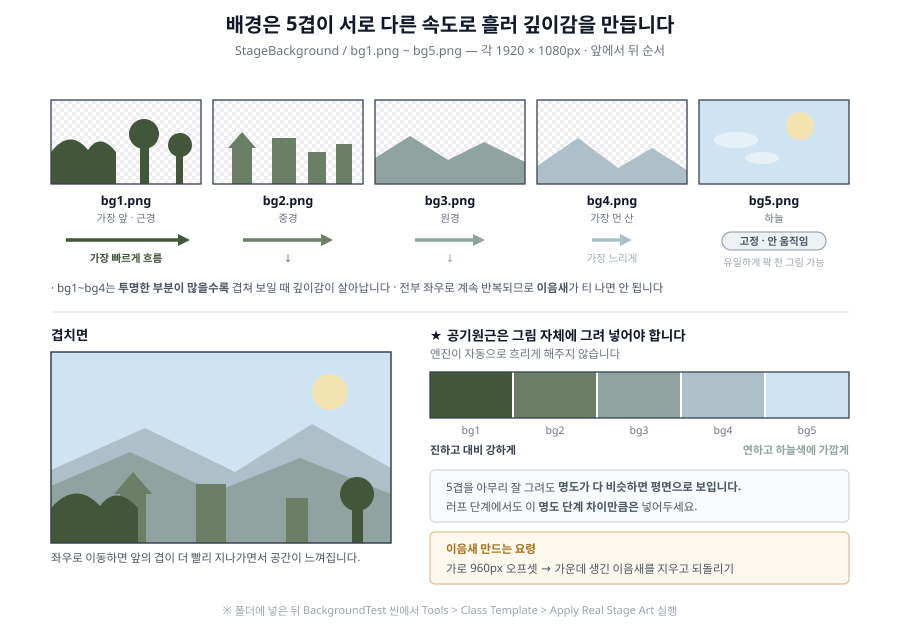

> **레이어를 어떻게 나누는가가 이번 주 디자인의 핵심입니다.** 예: `bg1` 앞쪽 수풀·기둥 → `bg2` 건물·나무 → `bg3` 언덕 → `bg4` 먼 산 → `bg5` 하늘·구름.
> 한 레이어에 너무 많은 걸 담으면 겹쳐 보일 때 지저분해집니다. **각 레이어는 비어 있는 부분이 많아도 됩니다** (투명 처리).

---

## 2. 리소스 제작 규격

### 바닥 (`StageGround`) ★ 제일 헷갈리는 부분

```
파일명: ground1.png ~ ground7.png (7장)
```

| 항목 | 규격 |
|---|---|
| 파일 형식 | PNG, **알파 채널 투명** |
| 크기 | **1920 x 1080px** (화면 전체 크기) |

> ### ★ 7장은 **모양이 서로 다릅니다**
>
> 같은 바닥을 일곱 번 반복하는 것이 아닙니다. **스테이지에 일곱 개가 왼쪽부터 차례로 이어 붙어** 있고, 각각 지형이 다릅니다 - 평평한 것, **구덩이가 뚫린 것**, **발판이 여러 개인 것**.
>
> 아래 **3번 「그림과 판은 별개입니다」** 에서 `Ground1`(평평) · `Ground5`(구덩이) · `Ground7`(발판)을 실제 화면으로 봅니다. **그림을 그리기 전에 그쪽을 먼저 읽으세요** - 어떤 자리에 무엇을 그려야 하는지가 거기서 정해집니다.
>
> **7장을 전부 바꿔야 합니다.** 4장만 바꾸면 나머지 3개가 임시 그림으로 남아, 스테이지 뒷부분만 화풍이 다른 상태가 됩니다.

> ⚠️ **바닥 그림은 "얇은 띠"가 아니라 화면 전체 크기(1920x1080) 이미지입니다.** 여기가 이번 주에 가장 많이 틀리는 부분입니다.

**완성된 폴더는 이렇게 생깁니다** - 전부 화면 전체 크기이고, 위쪽은 투명하게 비어 있습니다.

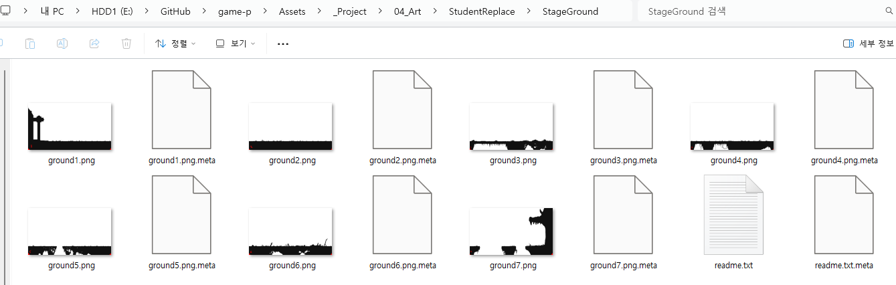

**어디에 지면을 그려야 하나:**

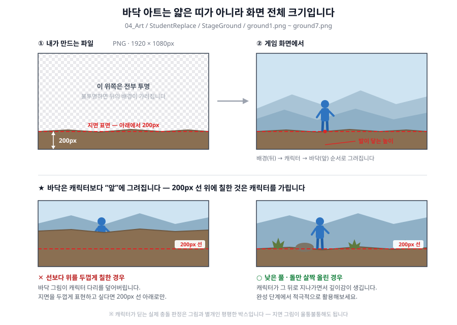

- **아래에서 200px 되는 지점이 "캐릭터가 서는 높이"** 입니다. 여기에 지면의 윗면(표면)이 오도록 그리세요.
- **그 위쪽은 전부 투명**이어야 합니다. 불투명하면 뒤에 있는 배경이 안 보입니다.
- 좌우 끝이 자연스럽게 이어지도록 (`1 → 2 → 3 → 4` 순서로 붙습니다)
- 지면 그림이 울퉁불퉁해도 상관없습니다 - 실제 충돌 판정은 그림과 별개인 **평평한 박스**로 처리됩니다

> ★ **바닥 그림은 캐릭터보다 "앞"에 그려집니다.**
> 그리기 순서가 `배경 → 캐릭터/몬스터 → 바닥` 이라서, 200px 선보다 위에 불투명하게 그린 부분은 **캐릭터를 가립니다.**
> 이걸 역이용하면 좋습니다 - 지면 앞쪽에 낮은 풀·돌·난간을 그려두면 캐릭터가 그 뒤로 지나가면서 자연스러운 깊이감이 생깁니다. 반대로 **모르고 지면을 두껍게 그리면 캐릭터 다리가 잘려 보입니다.**

전체 겹치는 순서는 다음과 같습니다.

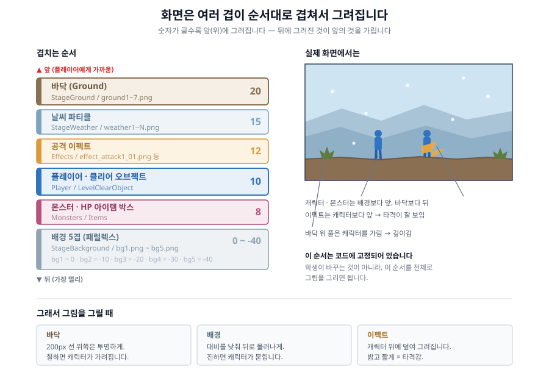

### 배경 (`StageBackground`)

```
파일명: bg1.png, bg2.png, bg3.png, bg4.png, bg5.png   (앞 → 뒤 순서)
```

| 항목 | 규격 |
|---|---|
| 파일 형식 | PNG, **알파 채널 투명** (배경 요소 바깥은 투명) |
| 크기 | **1920 x 1080px** |
| 이음새 | **좌우로 반복했을 때 티가 안 나게** 제작 (계속 반복해서 이어 붙습니다) |
| 공기원근 | **그림 자체에 표현되어 있어야 함** - 엔진이 자동으로 흐리게 해주지 않습니다 |

- `bg5`(하늘)만 예외적으로 **꽉 찬 그림**이어도 됩니다 (움직이지 않으므로)

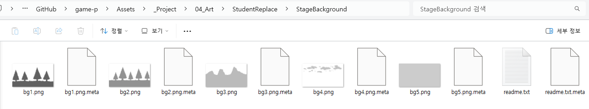
- `bg1~bg4`는 투명한 부분이 많을수록 겹쳐 보일 때 깊이감이 살아납니다
- **공기원근**: 멀리 있는 레이어일수록 대비를 낮추고, 하늘색 쪽으로 연하게 - 러프 단계에서도 **명도 차이만큼은 넣어두세요.** 이게 없으면 5겹을 그려도 평면으로 보입니다

> **이음새 만드는 요령**: 그림의 왼쪽 끝과 오른쪽 끝이 이어지도록 그립니다. 포토샵이라면 `필터 > 기타 > 오프셋`으로 가로 960px 이동시켜 중앙에 생긴 이음새를 지우고 되돌리는 방법이 편합니다.

### 날씨 (`StageWeather`)

```
파일명: weather1.png, weather2.png, weather3.png ...   (개수 자유)
```

| 항목 | 규격 |
|---|---|
| 파일 형식 | PNG, 알파 채널 투명 |
| 크기 | **작게** (예: 100x100px) - 여러 장이면 **전부 같은 크기**로 |
| 내용 | **파티클 한 개의 모양** (눈송이 하나, 빗방울 하나, 꽃잎 하나) |

- 화면을 채우는 그림이 아니라 **작은 도형 하나**입니다. 단순할수록 좋습니다
- 여러 장을 넣으면 파티클 하나가 살아있는 동안 그 프레임들이 순서대로 반복 재생됩니다 (회전하며 떨어지는 꽃잎 등)
- 파일명이 `snow`가 아니라 `weather`인 이유: 나중에 눈 → 비 → 꽃잎으로 바꿔도 **PNG만 교체하면 되도록** 하기 위함입니다
- 날씨를 안 넣어도 됩니다 (선택 사항)

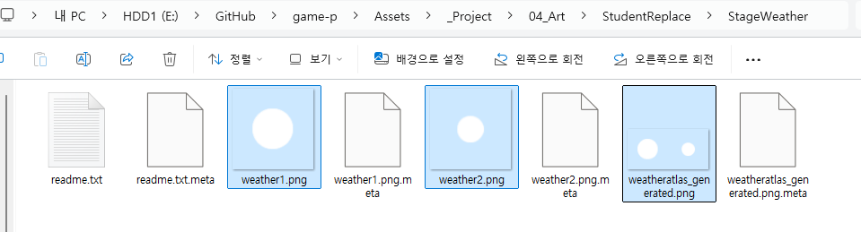

> **`weatheratlas_generated.png`는 도구가 자동으로 만드는 파일**입니다. 여러분이 넣은 그림들을 한 장으로 합쳐둔 것이니 **지우거나 고치지 마세요.**

### 러프 단계 작업 지침

- 컬러링 없이, 단 **배경 디자인 컨셉과 공간감은 담겨 있어야 함**
- **컨셉 + 패럴렉스 + 공간감에 집중** - 이번 주 평가의 핵심입니다
- 5겹의 **레이어 분리가 명확한지**가 러프의 완성도를 결정합니다
- 명암(밝고 어두움) 차이는 러프에서도 넣으세요 - 이게 공간감을 만듭니다

---

## 3. Unity에 적용하기

### 순서

**1) 그림을 폴더에 넣습니다.**

```
Assets/_Project/04_Art/StudentReplace/StageGround/       ground1~7.png
Assets/_Project/04_Art/StudentReplace/StageBackground/   bg1~5.png
Assets/_Project/04_Art/StudentReplace/StageWeather/      weather1~N.png
```

**2) `BackgroundTest` 씬을 엽니다.**

```
Assets/_Project/00_Scenes/Stages/BackgroundTest.unity
```

이 씬이 **스테이지1** 본체입니다. 앞으로 대부분의 작업이 이 씬에서 이루어집니다.

**`Scene` 탭을 처음 열면 조작 UI만 크게 보이고 스테이지는 왼쪽 아래 구석에 아주 작게 있습니다.** 고장이 아닙니다 - UI와 게임 세계가 크기를 재는 자가 서로 달라서 그렇습니다(자세한 이유는 [W02 1번 「작업할 화면」](W02_플레이어_캐릭터.md)).

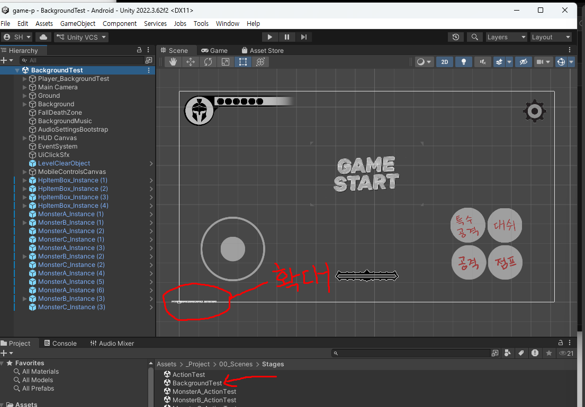

**확대해야 작업할 수 있습니다.** `Hierarchy`에서 **`Ground`를 더블클릭**하면 바닥 쪽으로 바로 확대됩니다.

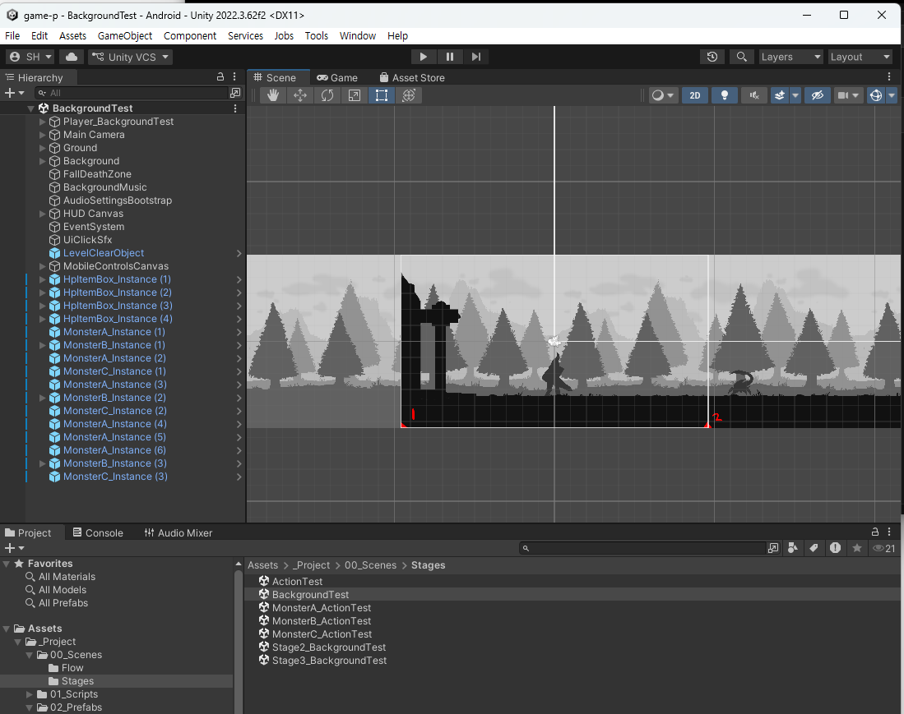

**3) 아트를 반영합니다.**

```
Tools > Class Template > Apply Real Stage Art
```

바닥·배경·날씨 세 폴더를 **한 번에** 읽어서 반영합니다. **안전하게 반복 실행 가능**합니다.

**4) 날씨 효과를 씬에 추가합니다** (날씨를 쓸 경우):

```
Tools > Class Template > Add Weather Effect To Scene
```

**5) Ctrl+S로 저장**

### 바닥을 4개보다 더 늘리고 싶다면

`ground5.png`, `ground6.png` ... 를 폴더에 넣고 `Apply Real Stage Art`를 실행하면 **프리팹까지는 자동으로 생성**됩니다.

**하지만 씬에 실제로 놓는 것은 항상 수동입니다:**

1. `Project` 창에서 `Assets/_Project/02_Prefabs/.../Ground5.prefab` 을 찾습니다
2. 그것을 **Scene 뷰로 드래그**해서 놓습니다
3. `Inspector`의 `Position X` 값을 조정해 앞 바닥과 이어 붙입니다
   - 바닥 하나의 가로 폭은 **19.2** 입니다. 즉 `Ground4`가 `X=57.6`에 있다면 `Ground5`는 `X=76.8`

> 스테이지를 길게 만들수록 플레이 시간이 늘어납니다. 목표는 **약 3분 분량**입니다.

### ★ 바닥 하나의 구조 - **그림(`Visual`)과 판(`Collision`)은 별개입니다**

**이번 주에서 제일 중요한 개념입니다.** `Hierarchy`에서 바닥 하나를 펼쳐보면 안에 두 종류가 들어 있습니다.

```
Ground1_Instance
  ├ Visual        ← 눈에 보이는 그림
  ├ Collision (1) ← 실제로 밟히는 판
  └ Collision (2) ← 판은 여러 개일 수 있습니다
```

| | `Visual` | `Collision` |
|---|---|---|
| 무엇 | **눈에 보이는 그림** | **실제로 밟히는 판** |
| 게임에서 | 보이지만 **통과합니다** | 안 보이지만 **막습니다** |
| 개수 | 바닥 하나에 **항상 1개** | **필요한 만큼 여러 개** |
| 선택하면 | 그림 테두리가 **주황색**으로 | **초록 네모**가 뜹니다 |

> **둘은 자동으로 맞춰지지 않습니다.** 그림에 구덩이를 그려도 판은 그대로고, 판을 나눠도 그림은 그대로입니다. **여러분이 두 개를 눈으로 맞추는 것**이 이번 주 작업입니다.

#### 예시 1 - 평평한 바닥 (`Ground1`)

**그림**을 선택하면 주황색 테두리로 그림의 모양이 보입니다.

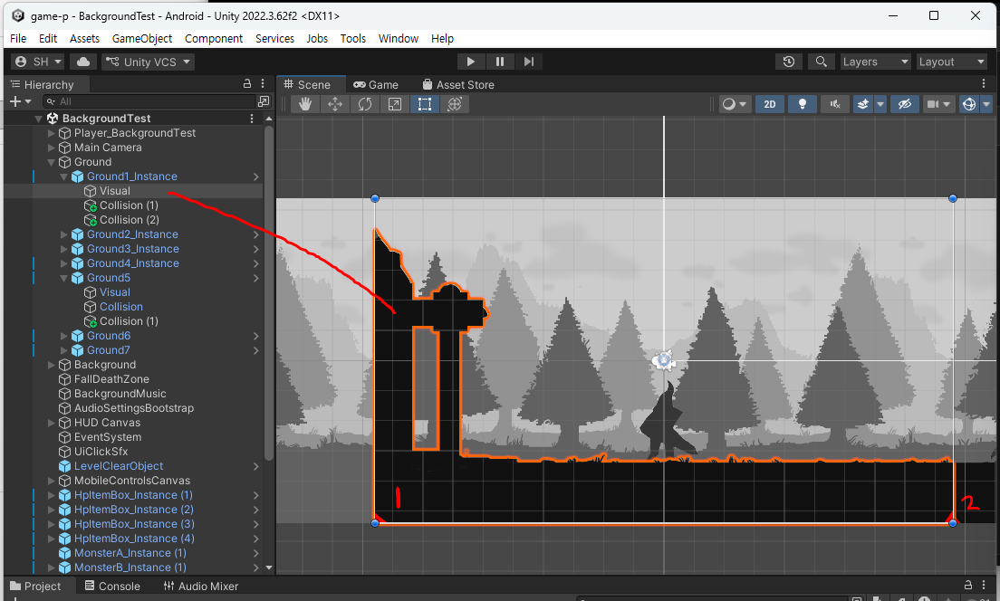

**판**을 선택하면 초록 네모가 뜨고, `Inspector`에 그 크기가 숫자로 나옵니다.

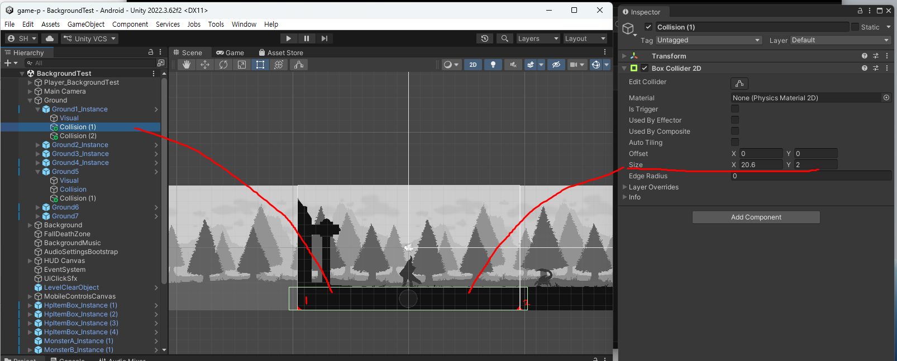

- **`Size`** = 판의 **가로 · 세로 크기**
- **`Offset`** = 판이 **어디에 놓여 있는지**
- 숫자를 바꾸면 **Scene 탭의 초록 네모가 바로 따라 움직입니다** (Play 불필요)

#### 예시 2 - 구덩이가 있는 바닥 (`Ground5`) ★

**그림에 구멍이 뚫려 있습니다.** 주황 테두리를 보면 땅이 두 덩어리로 나뉜 게 보입니다.

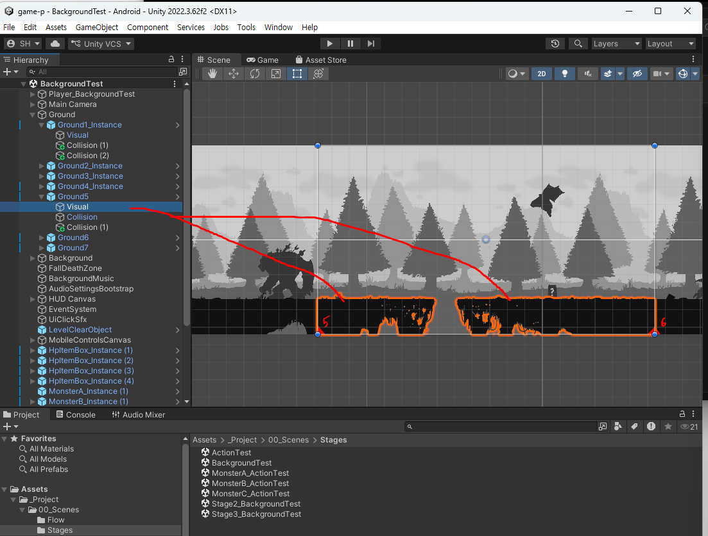

**판도 두 개로 나뉘어** 그 구멍 자리를 비워둡니다.

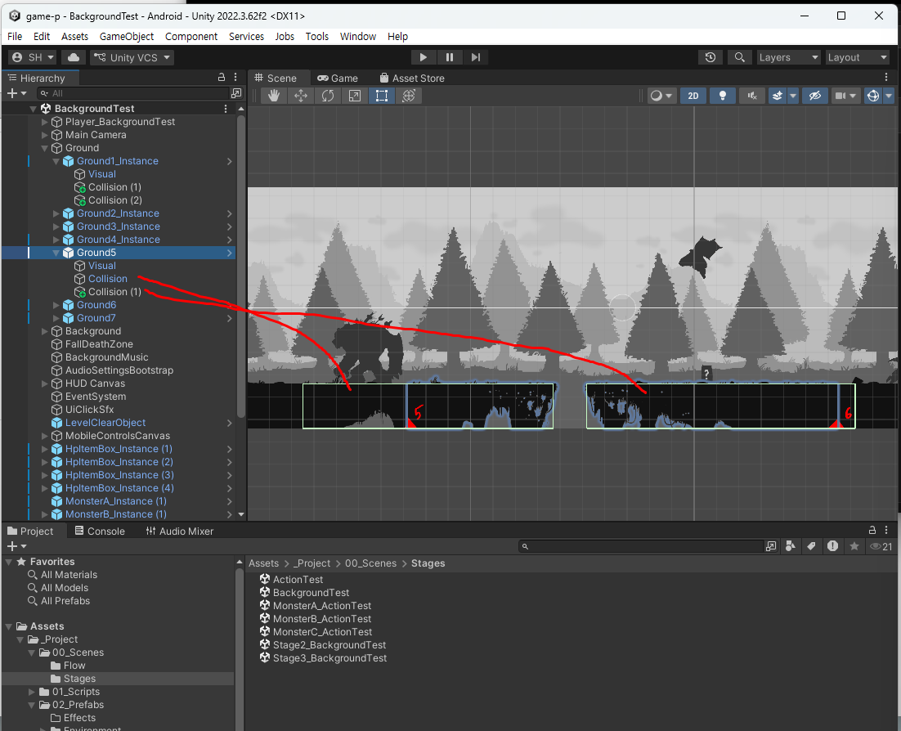

**이 둘이 맞아떨어져야 구덩이가 됩니다.**

| 그림 | 판 | 결과 |
|---|---|---|
| 구멍 O | 틈 O | ✅ **제대로 된 구덩이** |
| 구멍 O | 틈 X | 구멍처럼 보이는데 **밟고 지나감** (허공을 걷는 것처럼 보임) |
| 구멍 X | 틈 O | 땅처럼 보이는데 **갑자기 빠짐** (플레이어가 억울해함) |

#### 예시 3 - 발판이 여러 개인 바닥 (`Ground7`)

**그림에 작은 발판 세 개와 벽 하나**가 그려져 있습니다.

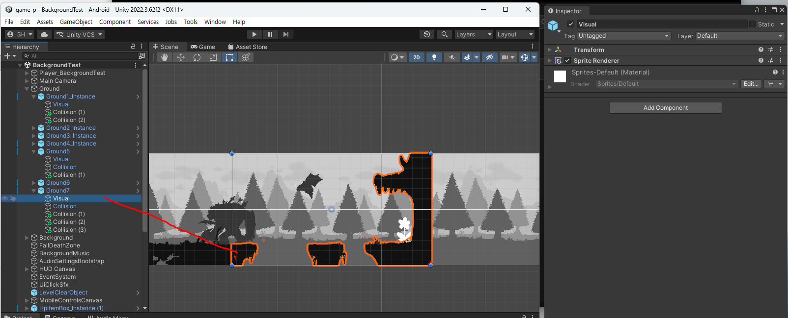

**판도 그 개수만큼** 있습니다 (`Collision` ~ `Collision (3)`, 4개).

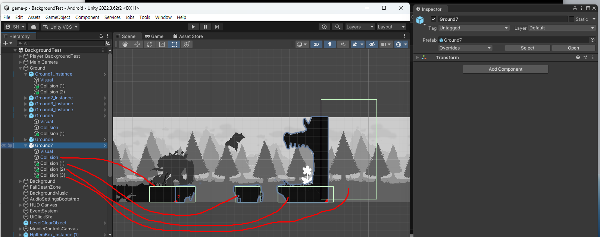

판 하나를 골라 보면 그 발판 하나만 감싸고 있는 것이 보입니다.

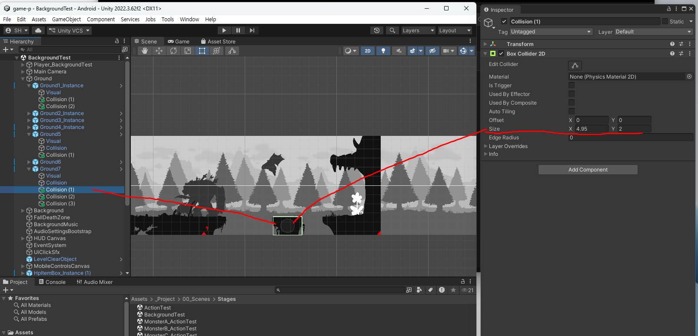

> **복잡한 지형일수록 판이 여러 개**가 됩니다. 그림을 먼저 그리고, 그 위에 판을 하나씩 얹는다고 생각하세요.

### 바닥에 구덩이(빠지는 구간) 만들기

위에서 본 `Ground5`처럼 만드는 방법입니다. **의도적으로 수동 작업**입니다.

1. `Hierarchy`에서 그 바닥 밑의 **`Collision`** 을 선택
2. **`Ctrl+D`** 로 복제 → `Collision (1)`이 생깁니다
3. 두 개의 **`Size X`(가로 길이)** 와 **`Offset X`(위치)** 를 조절해서 **사이에 틈**을 만듭니다
4. 그 틈이 곧 캐릭터가 빠지는 구덩이입니다

**Scene 탭의 초록 네모를 보면서 숫자를 조금씩 바꾸는 것**이 가장 빠릅니다. Play를 켤 필요가 없습니다.

> **그림에도 구덩이를 그려두세요.** 판만 나누면 **땅처럼 보이는데 갑자기 빠지는** 상태가 됩니다. 위 「예시 2」의 표를 참고하세요.

> 구덩이에 빠지면 사망 처리되게 하려면 `Tools > Class Template > Add Fall Death Zone To Scene`을 실행하세요.

### 카메라가 움직이는 범위 맞추기

스테이지 길이를 바꿨다면:

```
Tools > Class Template > Wire Auto Level Bounds
```

카메라가 스테이지 밖으로 넘어가지 않도록 범위를 자동으로 계산해줍니다.

### 날씨 세부 조정 (선택)

`Hierarchy`에서 `Main Camera` 밑 **`WeatherAnchor`** 를 선택하면 `Particle System` 컴포넌트가 나옵니다.

| 모듈 | 역할 |
|---|---|
| **Main - Start Color** | **흰색으로 유지할 것** (다른 색을 넣으면 그림 위에 색이 덧입혀집니다) |
| **Emission - Rate over Time** | 파티클이 얼마나 자주 생기는지. 많이 올릴 땐 **`Max Particles`도 같이 올려야** 함 (안 올리면 조용히 상한에 걸려서 더 안 늘어남) |
| **Shape** | 파티클이 생기는 영역 (Box = 화면 위쪽 넓은 영역) |
| **Velocity over Lifetime** | **Y = 떨어지는 속도**, **X = 좌우로 흔들리는 정도**. 실제로 "떨어지게" 만드는 건 Start Speed가 아니라 이 값입니다 |
| **Texture Sheet Animation** | 넣은 프레임들을 순서대로 반복 재생 |

- `WeatherAnchor` 오브젝트의 **체크를 끄면** 날씨 효과가 꺼집니다
- 너무 많이 만져서 이상해졌으면: `Tools > Class Template > Reset Weather Settings To Defaults` (그림은 그대로 두고 수치만 초기화)

---

## 4. 확인하고 수정하기

`BackgroundTest` 씬에서 Play.

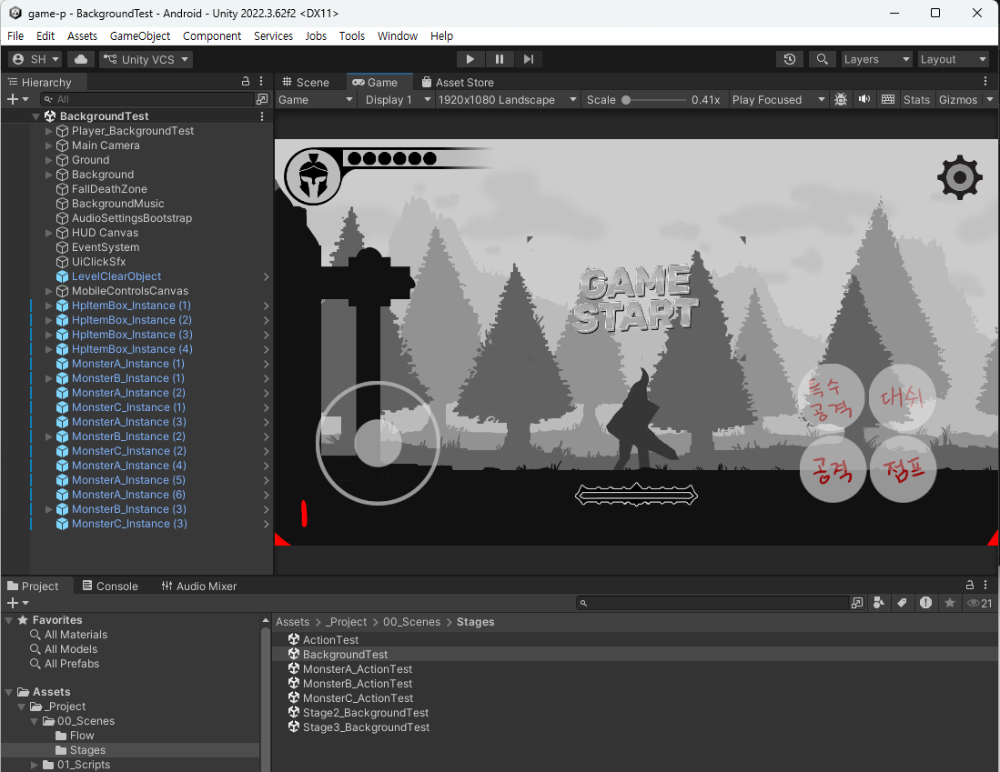

**`Scene` 탭에서 따로 놀던 UI와 게임 세계가 여기서는 딱 맞게 겹쳐 있습니다.**

| 확인 항목 | 방법 |
|---|---|
| **바닥 높이가 맞나** | 캐릭터가 지면 위에 정확히 서 있는지. 파묻히거나 떠 있으면 바닥 그림의 200px 선을 확인 |
| **패럴렉스가 작동하나** | `A` `D`로 좌우로 길게 이동 - 레이어들이 서로 다른 속도로 흐르는지 |
| **이음새가 티 나나** | 계속 한 방향으로 이동하면서 반복 지점을 관찰 |
| **바닥이 캐릭터를 가리나** | 지면 위를 걸을 때 다리가 잘려 보이지 않는지 |
| **배경이 캐릭터를 가리나** | 배경은 항상 캐릭터 뒤에 있어야 정상 |
| 날씨가 자연스러운가 | 너무 빽빽하거나 너무 빠르지 않은지 |
| 몬스터와 전투가 되나 | 3주차에 만든 몬스터들이 이 씬에도 정상 배치되어 있는지 |
| 스테이지 끝까지 갈 수 있나 | 오른쪽 끝까지 이동 - 바닥이 끊기지 않는지 |

### 잘 안 될 때

| 증상 | 원인 |
|---|---|
| 배경이 안 바뀜 | 파일명 확인 (`bg1.png`, 소문자) + `Apply Real Stage Art` 실행 여부 |
| 배경 뒤가 흰색으로 꽉 참 | PNG를 저장할 때 알파 채널이 빠졌음. 투명 배경으로 다시 저장 |
| 캐릭터가 바닥에 파묻힘/떠 있음 | 바닥 그림의 지면 표면이 아래에서 200px 지점에 없음 |
| **캐릭터 다리가 바닥에 가려짐** | 바닥 그림에서 200px 선보다 위쪽이 불투명함 |
| 배경이 캐릭터를 덮음 | 배경 폴더가 아닌 바닥 폴더에 넣었을 가능성 |
| 이동해도 배경이 안 흐름 | 배경 레이어가 하나만 들어갔거나, `bg5`만 넣었음 (bg5는 고정 레이어) |
| 날씨가 안 보임 | `Add Weather Effect To Scene` 미실행, 또는 `WeatherAnchor` 체크가 꺼져 있음 |
| 날씨에 이상한 색이 입혀짐 | `Main - Start Color`가 흰색이 아님 |
| 스테이지 끝에서 허공을 걸음 | 바닥 프리팹을 씬에 추가로 배치하지 않았음 |

---

## 5. GitHub 백업

1. Unity에서 **Ctrl+S**
2. GitHub Desktop → Summary `5주차 - 스테이지1 배경 러프` → **Commit to main** → **Push origin**

### 이번 주 특히 주의

- **1920x1080 PNG를 여러 장 올리므로 Push가 오래 걸립니다.** 중간에 끊지 마세요.
- 바닥 프리팹을 추가로 배치했다면 그 정보는 **씬 파일에만** 저장됩니다. Ctrl+S를 안 하면 배치가 통째로 날아갑니다.
- ⚠️ `Create Background Test Scene` 메뉴는 **절대 실행하지 마세요.** 씬을 처음부터 다시 만들어서, 지금까지 손으로 배치한 바닥·구덩이·몬스터 위치가 전부 사라집니다.

---

## 과제 (5주차)

### 무엇을 해오나

**스테이지1의 바닥 · 패럴렉스 배경 · 날씨를 러프(스케치) 상태로 제작하고 Unity에 적용하기**

- 완성본이 아닌 **스케치 버전의 러프** 상태 - **컨셉과 패럴렉스, 공간감에 집중**, 완성은 13주차
- 스케치지만 **배경 디자인 컨셉은 담겨 있어야 함** (컬러링 X)
- 바닥 `ground1~7` + 배경 `bg1~5` (날씨는 선택)

### 제출

네이버 카페 업로드 - 제목 `2D게임제작_05주차_123456홍길동`

- [ ] **배경 리소스** - 바닥, 근경 ~ 원경 **각각의 컷**
- [ ] **유니티 플레이 영상** - `BackgroundTest` 씬에서 플레이한 영상, **30초 내외**
  - **플레이어, 몬스터, 배경이 모두 등장**해야 함
  - 좌우로 길게 이동해서 **패럴렉스가 흐르는 모습**이 보이게 찍을 것

### 제출 전 체크리스트

- [ ] `ground1~7.png` 가 전부 **1920x1080**이고, 지면 표면이 아래에서 **200px** 지점에 있는가
- [ ] 200px 선 **위쪽이 전부 투명**한가
- [ ] `bg1~5.png` 가 1920x1080이고 좌우 이음새가 자연스러운가
- [ ] `Apply Real Stage Art` 를 실행했는가
- [ ] 캐릭터가 지면에 정확히 서 있는가
- [ ] 좌우로 이동했을 때 5겹이 서로 다른 속도로 흐르는가
- [ ] 스테이지 끝까지 이동해도 바닥이 끊기지 않는가
- [ ] Ctrl+S → Commit → **Push까지 완료**했는가

---

## 관련 문서

- `Assets/_Project/04_Art/StudentReplace/StageGround(StageBackground, StageWeather)/readme.txt`
- [W05 보조자료 - 배경/스테이지 Inspector 항목 설명](W05_배경_스테이지1_인스팩터.md) - **Inspector 항목이 뭐가 뭔지 모르겠을 때**
- [04_Unity_적용_가이드](../기본설명/04_Unity_적용_가이드.md) - "스테이지 환경 반영하기" 항목
