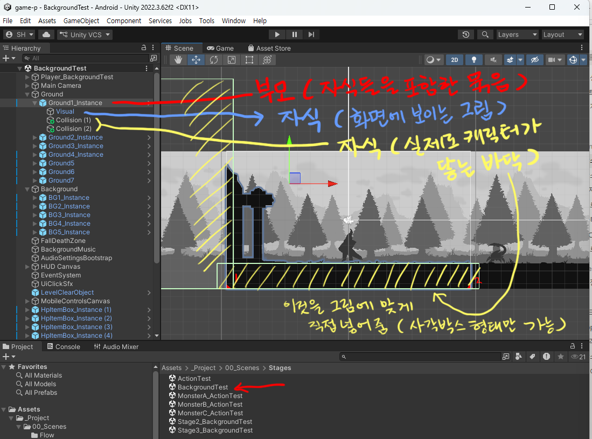
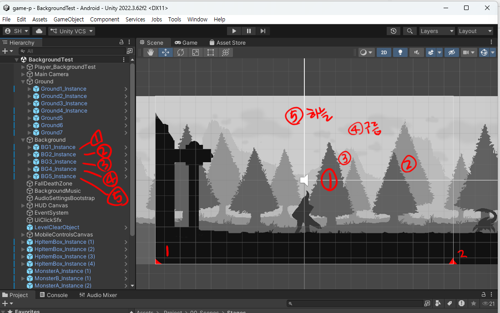
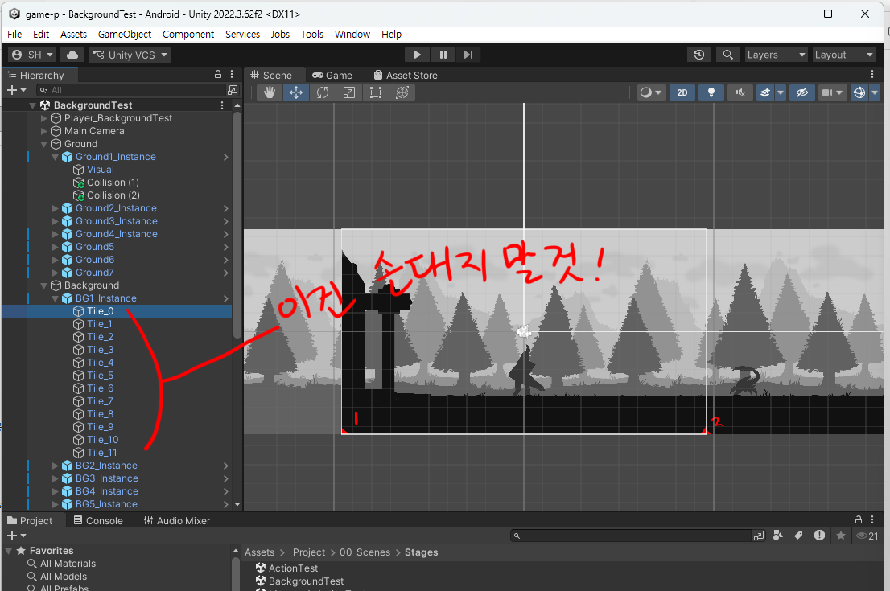
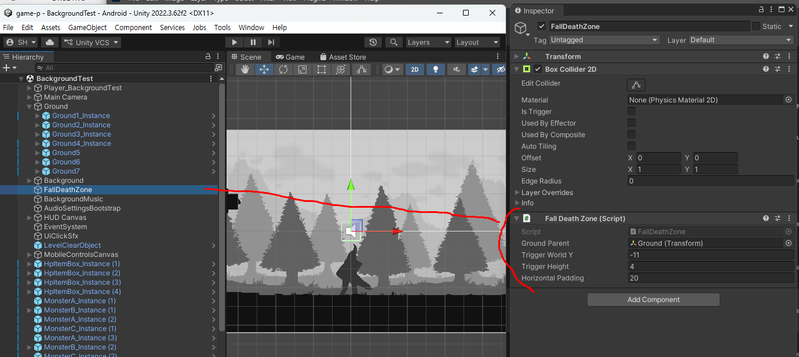
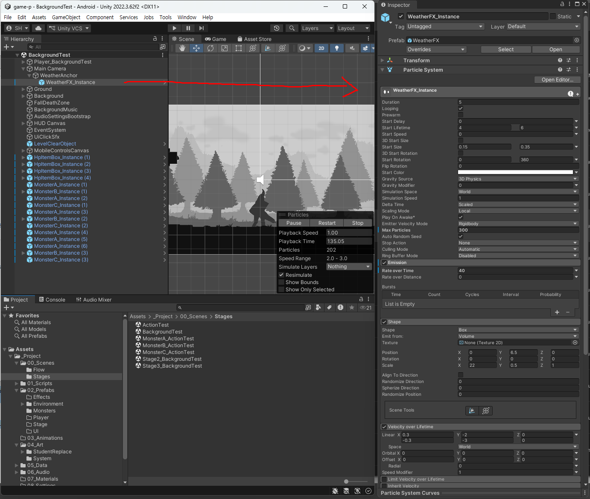
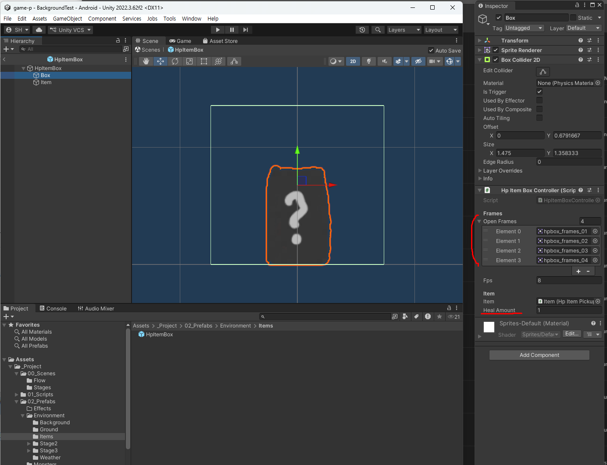
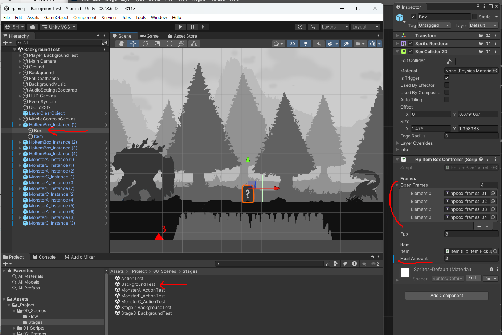
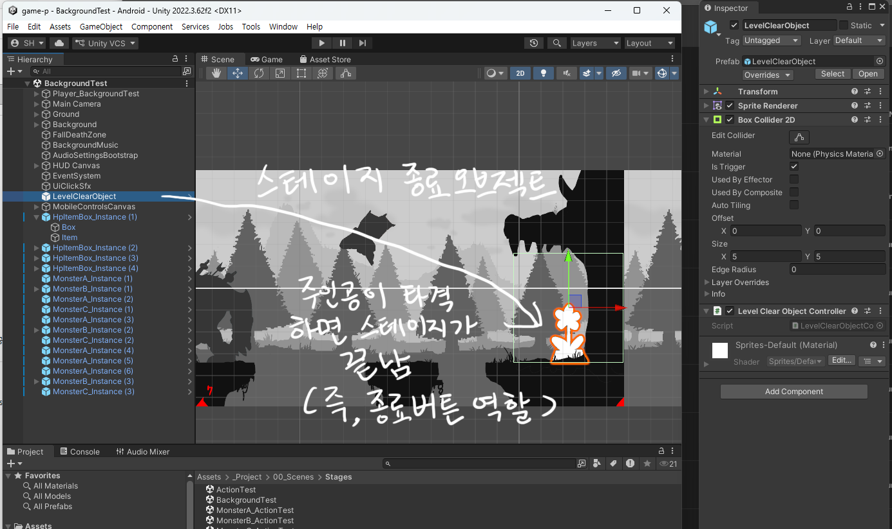

# 5주차 보조자료 - 배경/스테이지 Inspector 항목 설명

> 본 수업 문서: **[W05 배경/스테이지1](W05_배경_스테이지1.md)** · 같은 형식: [주인공 편](W02_플레이어_캐릭터_인스팩터.md) · [몬스터 편](W03_몬스터_ABC_인스팩터.md)

배경은 캐릭터와 성격이 다릅니다. **항목 수는 훨씬 적은데, 대신 "무엇이 어떤 오브젝트에 붙어 있는지"가 헷갈립니다.**

이 문서는 **Hierarchy에서 무엇을 클릭했을 때 무엇이 나오는지**부터 정리합니다.

---

## 이 문서를 보는 법

| 표시 | 뜻 |
|---|---|
| **★** | **여러분이 직접 다루는 것** |
| **△** | **필요하면 조정.** 안 건드려도 정상 작동합니다 |
| **✕** | **손대지 마세요** |

> 숫자는 **`BackgroundTest` 씬의 현재 설정값**입니다.

> **대부분의 작업은 Inspector가 아니라 `Tools > Class Template` 메뉴로 합니다.** ([W05 본문](W05_배경_스테이지1.md)의 "Unity에 적용하기") 이 문서는 **그 도구가 만들어준 것을 손으로 다듬을 때** 보는 참고서입니다.

---

## 0. Hierarchy 구조 - 무엇이 어디에 있나

`BackgroundTest` 씬을 열면 `Hierarchy`가 대략 이렇게 되어 있습니다.

```
Main Camera          ← 따라다니는 카메라 + 날씨
  └ WeatherAnchor    ← 눈·비 파티클
Ground               ← 바닥 묶음 (빈 껍데기)
  ├ Ground1
  │   ├ Visual       ← 눈에 보이는 바닥 그림
  │   └ Collision    ← 실제로 밟히는 판
  ├ Ground2 ...
Background           ← 배경 묶음 (빈 껍데기)
  ├ BG1              ← 가장 가까운 배경
  │   ├ Tile_0, Tile_1 ...   ← 자동 생성됨
  ├ BG2 ... BG5      ← BG5가 가장 먼 하늘
Player_BackgroundTest
MonsterA / B / C
FallDeathZone        ← 구덩이에 빠지면 죽는 영역
LevelClearObject     ← 스테이지 끝 지점
HpItemBox            ← HP 회복 상자
```

**`Ground`와 `Background`는 그냥 묶음(폴더 역할)입니다.** 클릭해도 `Transform`밖에 없습니다. 실제 내용은 그 **아래 자식들**에 있습니다.

---

## 1. ★ 가장 먼저 알아야 할 것 - `Sorting Order` (그리는 순서)

2D 게임은 **어느 그림이 앞에 오는지를 숫자로** 정합니다. **숫자가 클수록 앞**입니다.

| 순서 | 오브젝트 | `Sorting Order` |
|---:|---|---:|
| 맨 앞 | **바닥 `Visual`** | **20** |
| | WeatherAnchor (눈·비) | 15 |
| | **주인공 · 몬스터** | 10 |
| | **BG1** (가장 가까운 배경) | 0 |
| | BG2 | -10 |
| | BG3 | -20 |
| | BG4 | -30 |
| 맨 뒤 | **BG5** (하늘) | -40 |

**바닥 그림이 캐릭터보다 앞(20)에 있는 것이 의도입니다.** 바닥 그림 아래쪽에 풀·돌 같은 것을 그려 넣으면 **캐릭터의 발을 살짝 가려서** 깊이가 생깁니다.

> ⚠️ **이 숫자들은 건드리지 마세요.** 하나만 바꿔도 캐릭터가 배경 뒤로 숨거나 바닥이 하늘을 덮습니다. **✕**

> **캐릭터가 배경에 가려 안 보인다면** 십중팔구 배경 그림을 넣은 오브젝트의 `Sorting Order`가 잘못된 것입니다. 위 표의 숫자로 되돌리세요.

---

## 2. 바닥 (`Ground1` ~ `Ground7`)

바닥 하나는 **세 겹**입니다. 클릭하는 대상에 따라 Inspector가 달라집니다.



> ⚠️ **`Collision`은 네모(사각형)만 가능합니다.** 그림이 아무리 울퉁불퉁해도 판은 네모로만 만들 수 있으니, **네모 여러 개를 이어 붙여서** 그림 모양에 맞춰 나가는 방식입니다.

### 2-1. `Ground1` (부모)

| 항목 | 현재값 | 설명 | |
|---|---|---|---|
| `Position X` | 0, 19.2, 38.4 ... | **스테이지에서 이 바닥의 가로 위치** | **★** |
| `Position Y` / `Z` | 0 | | **✕** |
| `Scale` | (1, 1, 1) | | **✕** |

**바닥 하나의 가로 폭은 정확히 `19.2`입니다.** 그래서 이어 붙일 때는 **19.2씩 더하면** 됩니다.

```
Ground1  X = 0
Ground2  X = 19.2
Ground3  X = 38.4
Ground4  X = 57.6      ← 19.2씩 증가
```

> **바닥을 늘리는 것이 곧 스테이지를 늘리는 것입니다.** 목표는 플레이 약 3분입니다. 늘렸다면 **`Tools > Class Template > Wire Auto Level Bounds`** 로 카메라 범위도 다시 잡아주세요.

### 2-2. `Visual` (자식) - 눈에 보이는 그림

| 항목 | 현재값 | 설명 | |
|---|---|---|---|
| `Sprite` | ground1.png ... | 바닥 그림 | **★** |
| `Sorting Order` | 20 | 위 1번 참고 | **✕** |
| `Draw Mode` / `Size` | (19.2, 10.8) | 그림이 차지하는 크기 | **✕** |
| `Color` | 흰색 | **흰색으로 두세요** - 다른 색을 넣으면 그림에 색이 덧입혀집니다 | **✕** |

**그림 자체는 `Tools > Class Template > Apply Real Stage Art`가 자동으로 넣어줍니다.** 여기서 직접 갈아 끼울 일은 거의 없습니다.

> **`Size`가 19.2 x 10.8인 것은 화면 한 칸 크기**입니다. 바닥 그림이 **화면 전체 높이를 쓰는 한 장**이라는 뜻입니다. 그림 위쪽은 비워두고 아래쪽에만 바닥을 그리는 구조입니다.

### 2-3. `Collision` (자식) - 실제로 밟히는 판 ★

| 항목 | 현재값 | 설명 | |
|---|---|---|---|
| `Offset` | (0, -4.4) | **판이 놓인 높이** | **★** |
| `Size` | (19.2, 2) | **판의 가로 길이와 두께** | **★** |
| `Is Trigger` | 꺼짐 | **절대 켜지 마세요** - 켜면 바닥을 뚫고 떨어집니다 | **✕** |

**여기가 "구덩이 만들기"에서 만지는 곳입니다.**

> **그림과 판이 어떻게 짝을 이루는지는 [W05 본문](W05_배경_스테이지1.md)의 "바닥 하나의 구조 - 그림과 판은 별개입니다"에 예시 3개로 있습니다.** 평평한 바닥 / 구덩이 있는 바닥 / 발판 여러 개인 바닥 각각의 화면을 볼 수 있습니다.

1. `Collision`을 선택하고 **`Ctrl+D`로 복제**합니다
2. 두 개의 `Offset X`와 `Size X`를 조절해서 **사이에 틈**을 만듭니다
3. 그 틈이 캐릭터가 빠지는 구덩이가 됩니다

> **그림은 그대로 두고 판만 나누는 것**이라, **바닥 그림에도 구덩이가 그려져 있어야** 자연스럽습니다. 그림과 판을 따로 맞추는 작업입니다.

> **`Offset Y`를 올리면 바닥이 높아집니다.** 하지만 그림은 그대로라 캐릭터가 허공에 뜬 것처럼 보입니다. 높이를 바꾸려면 **그림도 같이 바꿔야** 합니다.

---

## 3. 배경 (`BG1` ~ `BG5`) - `Parallax Layer` ★

배경 하나를 클릭하면 **`Parallax Layer`** 라는 부품이 나옵니다. 항목은 딱 세 개입니다.

| 항목 | 현재값 | 설명 | |
|---|---|---|---|
| `Camera Transform` | Main Camera | 어느 카메라를 기준으로 움직일지 | **✕** |
| `Parallax Factor` | 아래 표 참고 | **얼마나 느리게 따라오는가** | **△** |
| `Ground Parent` | Ground | **스테이지 길이를 여기서 읽어옴** | **✕** |

### ⚠️ `Parallax Factor`는 생각과 반대입니다

**숫자가 클수록 멀리 있는 것**입니다. 보통 예상하는 것과 반대라 꼭 확인하세요.

| 값 | 뜻 |
|---:|---|
| **0** | 바닥과 **똑같이** 움직임 - 화면에서 제일 빠르게 지나감 (가장 가까움) |
| **0.5** | 절반 속도로 따라옴 |
| **1** | **화면에 붙어서 안 움직임** - 아득히 먼 하늘 |

현재 설정:

**화면에서 보면 이렇게 대응합니다.**



| 레이어 | `Parallax Factor` | 위치 |
|---|---:|---|
| **BG1** | 0.15 | 가장 **가까운** 배경 |
| BG2 | 0.35 | |
| BG3 | 0.55 | |
| BG4 | 0.75 | |
| **BG5** | 1.0 | 가장 **먼** 하늘 (거의 안 움직임) |

> **△인 이유**: 내 그림의 원근감에 맞춰 조정할 수 있습니다. 예를 들어 BG3를 "먼 산"이 아니라 "가까운 나무"로 그렸다면 값을 낮춰야 어울립니다.
>
> **다만 순서는 지키세요.** BG1 < BG2 < BG3 < BG4 < BG5 순으로 값이 커져야 합니다. 순서가 뒤집히면 **가까운 배경이 먼 배경보다 느리게 움직여서** 원근감이 무너집니다.

> **`Ground Parent`를 비우지 마세요.** 이 칸이 있어서 **스테이지를 길게 늘려도 배경이 자동으로 따라 늘어납니다.** 비우면 배경이 중간에서 끊깁니다.

### `Tile_0`, `Tile_1` ... 은 무엇인가

**게임이 시작될 때 자동으로 만들어지는 것**입니다. 배경 한 장(19.2)으로는 긴 스테이지를 못 덮으니, **같은 그림을 옆으로 반복해서 깔아줍니다.**



> **직접 만들거나 지우지 마세요.** 다만 **맨 앞의 `Tile_0` 하나는 "본보기"로 쓰이므로 반드시 있어야 합니다.** 나머지는 이것을 복사해서 만듭니다.

---

## 4. `Main Camera` - `Camera Follow 2D`

| 항목 | 현재값 | 설명 | |
|---|---|---|---|
| `Target` | 주인공 | 누구를 따라갈지 | **✕** |
| `Follow X` | 켜짐 | 좌우로 따라감 | **✕** |
| `Follow Y` | **꺼짐** | **위아래로는 안 따라감** | **△** |
| `Offset` | (0, 0) | 얼마나 치우쳐 볼지 | **△** |
| `Smooth Time` | 0.15 | 따라붙는 부드러움 (클수록 늦게 따라옴) | **△** |
| `Ground Parent` | Ground | **스테이지 길이를 여기서 읽어옴** | **✕** |
| `Clamp To Bounds` | 켜짐 | 스테이지 밖으로 안 나가게 막기 | **✕** |
| `Min X` / `Max X` | -9.6 / 163.1 | 그 범위 | **✕** |

- **`Follow Y`가 꺼져 있는 것이 의도입니다.** 점프할 때마다 화면이 출렁이면 눈이 피로합니다. 세로로 넓은 스테이지를 만든 게 아니라면 그대로 두세요
- **`Min X` / `Max X`는 직접 고치지 마세요.** 스테이지 길이를 바꿨다면 **`Tools > Class Template > Wire Auto Level Bounds`** 가 자동으로 계산해줍니다

> 카메라가 보는 화면 크기는 **`Size 5.4`** 로 고정입니다. 세로 10.8 · 가로 19.2 - 바닥 그림 한 장의 크기와 정확히 같습니다. **이 값을 바꾸면 모든 규격이 어긋나므로 절대 건드리지 마세요.** **✕**

---

## 5. `FallDeathZone` - 구덩이에 빠지면 사망



| 항목 | 현재값 | 설명 | |
|---|---|---|---|
| `Ground Parent` | Ground | 스테이지 폭을 여기서 읽어옴 | **✕** |
| `Trigger World Y` | -11 | **이 높이보다 아래로 떨어지면 사망** | **✕** |
| `Trigger Height` | 4 | 판정 영역의 두께 | **✕** |
| `Horizontal Padding` | 20 | 좌우로 넉넉히 넓힌 여유 | **✕** |

**화면 아래쪽 끝이 약 -5.4**이므로, **-11은 화면에서 완전히 사라진 뒤**입니다. 떨어지는 것이 눈에 보이고 나서 죽습니다.

> 이 오브젝트가 씬에 없으면 **구덩이에 빠져도 안 죽고 무한히 떨어집니다.** 없다면 `Tools > Class Template > Add Fall Death Zone To Scene`.

---

## 6. `WeatherAnchor` - 눈·비 파티클

`Main Camera` 아래 **`WeatherAnchor` → `WeatherFX_Instance`** 에 붙어 있습니다. **`Particle System`이라는 부품인데, 항목이 아주 많고 대부분 손댈 필요가 없습니다.**



**실제로 만지는 것은 다섯 가지뿐이며, [W05 본문의 "날씨 세부 조정"](W05_배경_스테이지1.md)에 정리되어 있습니다.**

여기서는 **주의점만** 덧붙입니다.

| 주의 | 이유 |
|---|---|
| **`Main` → `Start Color`는 흰색으로** | 다른 색을 넣으면 내 그림 위에 그 색이 덧입혀집니다 |
| **`Emission` → `Rate over Time`을 올렸으면 `Max Particles`도 같이** | 안 올리면 **조용히 상한에 걸려서** 더 안 늘어납니다. 에러도 안 뜹니다 |
| **떨어지는 속도는 `Start Speed`가 아니라 `Velocity over Lifetime`의 `Y`** | 여기가 아니면 안 떨어집니다 |
| **끄고 싶으면 오브젝트 체크박스를 끄기** | 지우지 마세요. 다시 만들기 번거롭습니다 |

> **너무 많이 만져서 이상해졌으면**: `Tools > Class Template > Reset Weather Settings To Defaults` - **그림은 그대로 두고 수치만** 초기화합니다.

> 날씨를 안 쓰는 컨셉이라면 오브젝트 체크를 꺼두면 됩니다. **필수가 아닙니다.**

---

## 7. `HpItemBox` - HP 회복 상자

| 항목 | 설명 | |
|---|---|---|
| `Open Frames` | 상자가 열리는(부서지는) 그림. 개수 자유 | **★** |
| `Fps` | 8 - 그 그림의 재생 속도 | **△** |
| `Item` | 튀어나오는 아이템 연결 | **✕** |
| `Heal Amount` | 1 - **이 상자가 채워주는 HP 칸 수** | **△** |

**항목들은 상자 안의 `Box` 오브젝트에 붙어 있습니다.** 상자를 펼쳐서 `Box`를 클릭하세요.

| 프리팹 원본 (`Heal Amount` 1) | 씬에 놓인 상자 하나 (`Heal Amount` **2**) |
|---|---|
|  |  |

**`Heal Amount`는 씬에 놓인 상자마다 따로 정할 수 있습니다.** 어려운 구간 앞에 놓는 상자는 2로 올리는 식으로 쓰세요.

> 위 두 그림이 그 예입니다 - **원본은 1인데 이 자리에 놓인 상자만 2**로 올려두었습니다. 같은 상자라도 자리마다 다르게 둘 수 있습니다.

> 상자는 **한 번 열리면 다시 생기지 않습니다.** 스테이지 어디에 몇 개를 놓을지가 곧 난이도입니다.

---

## 8. `LevelClearObject` - 스테이지 끝 지점



**스테이지를 끝내는 "종료 버튼" 역할**입니다. 설정할 항목은 없고, **위치(`Position X`)만** 정하면 됩니다. **★**

> ⚠️ **닿는 게 아니라 "공격해서 맞혀야" 끝납니다.** 콤보·점프공격·필살기 아무거나 **한 번만 맞히면** 클리어입니다. 그냥 지나가면 아무 일도 안 일어납니다.

**바닥의 맨 끝쯤에 놓으세요.** 여기까지 오는 데 걸리는 시간이 곧 스테이지 길이입니다.

> 💡 **테스트할 때는 `Ctrl+L`** 을 누르면 맞힌 것과 똑같이 처리됩니다. 스테이지 끝까지 걸어가지 않고도 클리어 화면을 확인할 수 있습니다.
>
> **이 키는 클리어 오브젝트가 있어야 동작합니다.** 키를 받는 쪽이 오브젝트 자신이라, **`LevelClearObject`를 아직 배치하지 않았거나 `ActionTest`처럼 없는 씬에서는 눌러도 아무 일도 안 일어납니다.** 안 먹으면 씬에 오브젝트가 있는지부터 확인하세요.
>
> **조합키인 이유**: 그냥 `L`이면 필살기(`K`) 바로 옆이라 **플레이 중에 실수로 눌려** 스테이지가 끝나버립니다.

---

## 9. 자주 나오는 문제

| 증상 | 원인 |
|---|---|
| 캐릭터가 **배경에 가려서 안 보임** | 배경 오브젝트의 `Sorting Order`가 10보다 큼 (위 1번 표 참고) |
| 스테이지 뒤쪽에서 **배경이 끊기고 하늘이 텅 빔** | `Parallax Layer`의 `Ground Parent`가 비었음 |
| 배경이 **어색하게 움직임** | `Parallax Factor` 순서가 뒤집힘 (BG1이 가장 작아야 함) |
| 바닥은 보이는데 **밟으면 통과함** | `Collision`의 `Is Trigger`가 켜졌거나, `Collision`이 지워짐 |
| **캐릭터가 허공에 서 있음** | `Collision`의 `Offset Y`와 바닥 그림의 높이가 안 맞음 |
| 스테이지를 늘렸는데 **카메라가 안 따라감** | `Wire Auto Level Bounds` 실행 안 함 |
| 구덩이에 빠졌는데 **안 죽고 계속 떨어짐** | `FallDeathZone`이 씬에 없음 |
| 눈·비를 **늘렸는데 더 안 늘어남** | `Max Particles` 상한에 걸림 |
| 바닥 그림이 **회색빛으로 칙칙함** | `Visual`의 `Color`가 흰색이 아님 |

---

## 10. 값이 꼬였을 때 되돌리는 법

1. **`Ctrl+Z`**
2. **이 문서의 "현재값"을 보고 직접 되돌리기**
3. **`Tools > Class Template` 도구 다시 실행** - `Apply Real Stage Art`나 `Reset Weather Settings To Defaults`는 **몇 번을 돌려도 안전**합니다. 손으로 고치기 전에 이쪽을 먼저 시도하세요
4. **씬 파일을 통째로 되돌리기** - GitHub Desktop → `Changes`에서 `.unity` 파일에 **오른쪽 클릭 → `Discard changes`**
   - ⚠️ 마지막 Commit 시점으로 돌아갑니다. 같은 씬에 한 다른 작업도 함께 사라집니다

> 배경 작업은 **바닥을 옮기고 붙이는 일이 많아 되돌릴 일도 많습니다.** 바닥을 하나 이어 붙일 때마다 Commit해두면 마음이 편합니다. ([01-③ GitHub Desktop](../기본설명/01_시작하기3_깃허브데스크탑.md))
