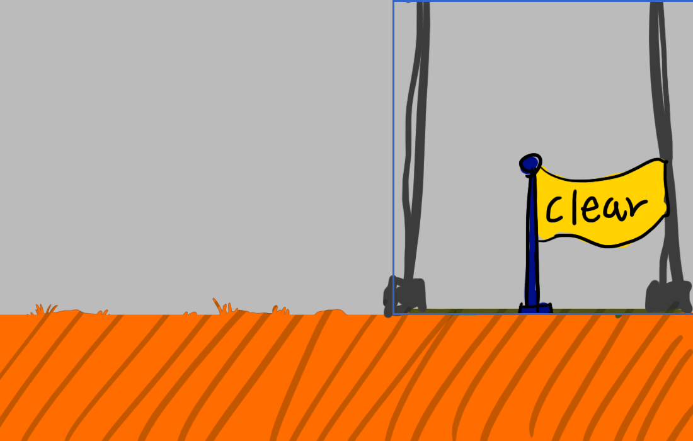

# 5주차 실습 - 샘플로 스테이지 바꿔보기

**수업 시간에 함께 따라 하는 문서입니다.** 그림은 준비해 두었으니 **바꾸는 절차를 손으로 한 번 해보는 것**이 목적입니다.

**오늘은 `BackgroundTest` 씬 하나만 건드립니다.** 다른 씬은 열지 않습니다.

**주인공 · 몬스터와 다른 점이 두 가지 있습니다.**

1. **움직이는 그림이 아닙니다.** 프레임도 판정 숫자도 없습니다. 그림만 보면 제일 쉽습니다
2. 대신 **그림과 「밟히는 판」이 따로 놉니다.** 그림에 구멍을 그려도 판은 그대로입니다. **둘을 눈으로 맞추는 것**이 이번 주의 핵심입니다

그리고 바닥이 바뀌면 **몬스터를 다시 배치**합니다. 이때 **몬스터마다 체력 · 부활 횟수를 따로** 정할 수 있습니다 - 스테이지의 난이도를 정하는 일입니다.

> **개념 설명은 [5주차 본문](<W05_배경_스테이지1(기본).md>), 항목별 설명은 [Inspector 항목 설명](<W05_배경_스테이지2(인스팩터).md>) 에 있습니다.** 이 문서는 **순서대로 따라 하는 대본**입니다.

---

## 0. 오늘 하는 것

| 순서 | 무엇을 | 새로 나오는 것 |
|---|---|---|
| 0 | **주인공 맞추기** - `ActionTest` 의 주인공을 이 씬으로 | 상단 메뉴 `Tools` > `Class Template` > `Sync Player & HUD From ActionTest` |
| 1 | **그림만 바꾸기** - 배경 5장 · 바닥 5장 · **클리어 오브젝트** | `Apply Real Stage Art` |
| 2 | ★ **무엇이 어긋났나 보기** | **그림과 판은 따로 논다** |
| 3 | ★ **판 맞추기** - 구멍 · 시작 벽 · 끝 벽 | `Size` · `Offset` · 판 추가와 삭제 |
| 4 | **몬스터 · HP 상자 배치** | 옮기기 / 새로 끌어다 놓기 |
| 5 | ★ **몬스터마다 난이도 정하기** | 체력 · 부활 횟수 · 상자 회복량 - **이 씬의 그것만** |
| 6 | Play로 확인 | |
| 7 | **자유 실습** - 수업 시간 동안 이리저리 바꿔보기 | |

**오늘 안 하는 것**

| | 왜 / 언제 |
|---|---|
| 본인이 그린 배경으로 바꾸기 | **과제** - 집에서 |
| 날씨 (`StageWeather`) | 선택 - [본문 2절](<W05_배경_스테이지1(기본).md>) |
| 바닥을 8장 이상으로 늘리기 | 과제에서 필요하면 - [본문 3절](<W05_배경_스테이지1(기본).md>) |

> **샘플 그림은 연습용입니다. 이것을 과제로 내는 것이 아닙니다.**

---

## 1. 샘플 받기

**[샘플 파일 내려받기](https://github.com/hansung-game1/game-p-docs/raw/main/%EC%A3%BC%EC%B0%A8%EB%B3%84%EC%88%98%EC%97%85/files/W05_%EC%83%98%ED%94%8C_%EB%B0%B0%EA%B2%BD.zip)** ← 누르면 바로 받아집니다 (약 1.2MB)

압축을 풀면 **`Art`** 폴더가 나옵니다.

**`Art\` → `Assets\_Project\04_Art\StudentReplace\`**

```
Art\StageBackground\bg1.png ~ bg5.png                             (5장)
Art\StageGround\ground1.png ~ ground5.png                         (5장)
Art\Environment\LevelClearObject\level_clear_object.png           (1장)
```

| 바닥 | 샘플 그림 |
|---|---|
| `ground1` | **시작** 바닥 - 왼쪽에 START 버섯집 |
| `ground2` | 일반 바닥 |
| `ground3` | **구멍 1개** |
| `ground4` | **구멍 2개** |
| `ground5` | **끝** 바닥 - 오른쪽에 GOAL 표지판 |

바닥마다 색이 다릅니다. **어디서 어디까지가 한 장인지** 알아보기 쉽게 일부러 그렇게 했습니다.

> **파일만 덮어쓰세요. 폴더를 통째로 바꿔치기하지 마세요.** 폴더 안의 `readme.txt` 와 `ground6.png` · `ground7.png` 는 **그대로 둡니다.**

---

## 2. 그림만 바꾸기

### 2-1. 테스트 씬을 엽니다

`Project` 창 → `Assets\_Project\00_Scenes\Stages\` → **`BackgroundTest`** 더블클릭

### ⚠️ 2-1+. 먼저 주인공을 이 씬에 맞춥니다 - `Sync`

**주인공은 프리팹이 없어서 씬마다 따로 있습니다.** `ActionTest` 에서 만든 주인공이 이 씬에 저절로 오지 않습니다. 맞추지 않으면 **주인공이 예전 그림으로 나오거나, 중간중간 몸이 사라집니다**(그림 장수가 다르기 때문) → [FAQ 15번](<../기본설명/08_자주_나오는_문제.md#15-backgroundtest에서-주인공이-중간중간-안-나옵니다---sync-를-안-했습니다>)

1. 상단 메뉴 **`Tools` > `Class Template` > `Sync Player & HUD From ActionTest`**
2. 잠깐 씬이 바뀌었다가 **`BackgroundTest` 로 돌아옵니다** - 끝입니다 (저장까지 알아서 합니다)
3. Play → 주인공이 **`ActionTest` 와 같은 모습 · 같은 동작**으로 나오는지 확인

> **3주차 실습 8절에서 이미 했어도 한 번 더 하세요.** 그 뒤에 주인공 그림 · 값을 고쳤다면 이 씬은 아직 옛날 상태입니다. **몇 번을 다시 해도 안전합니다.**

> **앞으로 주인공을 고칠 때는 언제나 `ActionTest` 에서 → 그다음 이 메뉴.** `BackgroundTest` 의 주인공을 직접 고치면 다음 `Sync` 때 덮어써집니다.

### 2-2. 그림 넣기

- `Art\StageBackground\bg1~5.png` → `StudentReplace\StageBackground\` 에 덮어쓰기
- `Art\StageGround\ground1~5.png` → `StudentReplace\StageGround\` 에 덮어쓰기

### 2-3. 반영

**`Tools > Class Template > Apply Real Stage Art`**

### 2-4. Play

좌우로 움직여 보세요. **배경은 겹겹이 다른 속도로** 움직입니다. 가장 뒤 그림에는 「제일 뒤 배경」이라고 적혀 있어서 어느 층인지 알아볼 수 있습니다.

**배경은 이것으로 끝입니다.** 장수가 그대로라 판도 배치도 없습니다.

### 2-5. 클리어 오브젝트 그림 - 스테이지의 끝

**스테이지 끝에 놓여서, 공격해서 맞히면 스테이지가 끝나는 물건**입니다. 스테이지 안에 실제로 놓이는 것이라 배경과 같이 바꿉니다.

샘플은 **「clear」 깃발**입니다. 5번 바닥의 GOAL 표지판 아래에 서게 됩니다.



`Art\Environment\LevelClearObject\level_clear_object.png` → `StudentReplace\Environment\LevelClearObject\` 에 **같은 이름으로 덮어쓰기** - **이것으로 끝입니다.** 도구를 누를 필요가 없습니다.

아직은 **원래 자리(스테이지 맨 끝, 허공)** 에 있어서 Play로는 안 보입니다. **5-3절에서 GOAL 아래로 옮긴 뒤** 확인합니다.

> 본인 그림으로 할 때 - 캔버스 **500 x 500 그대로**, 물건의 **밑동을 캔버스 맨 아래에 붙여** 그리세요. **캔버스 아래 선이 곧 땅**입니다(위 그림의 파란 테두리). 한가운데에 그리면 공중에 뜹니다. 깃발 · 문 · 보물상자 · 포탈 등 **때리고 싶게 생긴 물건**이면 좋습니다. → [본문 「클리어 오브젝트」](<W05_배경_스테이지1(기본).md>)

**바닥은 이제부터입니다.**

---

## 3. ★ 무엇이 어긋났나 - 그림만 바꾸면 생기는 일

**Play 한 채로 끝까지 가보세요.** 이상한 곳이 여러 군데 보입니다.

| 보이는 것 | 왜 |
|---|---|
| 뒤쪽 두 장이 **예전 바닥 그림** 그대로 | 샘플은 5장인데 스테이지는 7장입니다. 6 · 7번은 안 바뀌었습니다 |
| 구멍이 그려져 있는데 주인공이 **밟고 지나감** | 판은 옛 모양 그대로 - 그 자리에 판이 있습니다 |
| 땅이 그려져 있는데 **갑자기 빠짐** | 옛 그림의 구멍 자리에 판이 비어 있습니다 |
| **몬스터가 엉뚱한 곳에서 멈춤** / 구멍 위를 걸어다님 | 몬스터는 **그림이 아니라 판을 보고** 구멍 앞에서 멈춥니다. 판이 옛 모양이니 옛 구멍 자리에서 멈춥니다 |
| START · GOAL 옆으로 **화면 밖까지 걸어나감** | 그림에 벽을 그렸어도 **벽 판이 없으면** 통과합니다 |

**원인은 하나입니다.**

| | `Visual` (그림) | `Collision` (판) |
|---|---|---|
| 무엇 | **눈에 보이는 그림** | **실제로 밟히는 판** |
| 그림을 바꾸면 | 바뀝니다 | **안 바뀝니다** |
| 주인공 · 몬스터가 보는 것 | ✗ | ✅ |

> **캐릭터는 그림을 보지 않고 판을 봅니다.** 그래서 그림을 바꾼 뒤에는 **반드시 판을 그림에 맞춰야** 합니다. 자세한 설명은 [본문 3절 「바닥 하나의 구조」](<W05_배경_스테이지1(기본).md>) 에 있습니다.

---

## 4. ★ 판 맞추기

### 4-1. 안 쓰는 바닥 지우기 (7장 → 5장)

`Hierarchy` 의 `Ground` 밑에서 **`Ground6`** · **`Ground7`** 선택 → `Delete`

> **파일(`ground6.png` · `ground7.png`)은 지우지 않습니다.** 씬에서만 뺍니다.

> **카메라가 멈추는 곳**과 **떨어지면 죽는 영역**은 `Ground` 밑에 있는 바닥에 맞춰 **Play 할 때마다 자동으로** 다시 계산됩니다. 따로 손댈 필요 없습니다.

### 4-2. 판을 다루는 법

`Hierarchy` 에서 바닥 하나를 펼치면 `Visual` 과 `Collision` 이 보입니다. **`Collision` 을 선택하면 Scene 탭에 초록 네모**가 뜹니다.

> **`Collision` 을 선택했을 때 화면은 [본문 「바닥 하나의 구조」](<W05_배경_스테이지1(기본).md>) 의 「예시 1」에 캡처가 있습니다.** 같은 `Inspector` 에 **`Transform` (위쪽)** 과 **`Box Collider 2D` (아래쪽)** 가 함께 보입니다. **위치는 `Transform`, 판의 크기와 자리는 `Box Collider 2D`** - 이 둘을 헷갈리지 마세요.

**① 먼저 위치를 제자리로** - 모든 `Collision` 의 `Transform` 에서

| `Position` | 값 |
|---|---|
| `X` | **`0`** |
| `Y` | **`-4.4`** |

> 예전 바닥의 판 중에는 `Transform` 이 옮겨져 있는 것이 있습니다. 이걸 먼저 맞춰야 아래 표의 숫자가 그대로 통합니다.

**② 크기와 자리는 `Box Collider 2D` 에서**

| 항목 | 뜻 |
|---|---|
| **`Size`** | 판의 **가로 · 세로** 크기 |
| **`Offset`** | 판이 **어디에** 놓였나 - `X` 는 좌우, `Y` 는 위아래 |

숫자를 바꾸면 **Scene 탭의 초록 네모가 바로 따라 움직입니다.** Play 할 필요가 없습니다.

**③ 판이 모자라면 늘리고, 남으면 지웁니다**

| 하려는 것 | 방법 |
|---|---|
| **늘리기** | `Collision` 선택 → **`Ctrl + D`** → `Collision (1)` 이 생깁니다 |
| **지우기** | 필요 없는 `Collision (1)` · `(2)` … 선택 → `Delete` |

> **`Collision` 하나는 꼭 남기세요.** 판이 하나도 없으면 그 바닥 전체가 구멍이 됩니다.

> **늘릴 때는 복사(`Ctrl + D`)가 기본입니다.** 높이(`Y -4.4`)와 `Box Collider 2D` 가 **저절로 따라와서** 실수할 곳이 없습니다. 아래 「처음부터 만들기」는 복사할 판이 없을 때만 씁니다.

**(추가) 판을 모두 지워버렸을 때 - 처음부터 만들기**

실수로 판을 다 지웠거나, 복사할 판이 하나도 남지 않았을 때 씁니다. 판은 **빈 오브젝트에 `Box Collider 2D` 하나를 붙인 것**이 전부라, 처음부터 만들어도 복사한 것과 똑같이 동작합니다.

1. `Hierarchy` 에서 그 바닥(예: `Ground3_Instance`)을 **우클릭 → `Create Empty`** → 그 바닥의 **자식**으로 `GameObject` 가 생깁니다
2. 이름을 `Collision` 으로 바꿉니다 (`F2`) - 이름은 자유지만 다른 판과 맞춰두면 알아보기 쉽습니다
3. `Transform` 의 **`Position` 을 X `0` · Y `-4.4`** 로 - 새로 만들면 `0 · 0` 으로 생기므로 **꼭 맞춰야** 합니다
4. `Inspector` 맨 아래 **`Add Component`** → 맨 위 검색 칸에 **`box`** → **`Box Collider 2D`** 선택
   - 검색 대신 분류로 찾으려면 **`Physics 2D` → `Box Collider 2D`**
   - ⚠️ 바로 아래 `Physics` 에 있는 **`Box Collider`(2D 없는 것)는 3D용**이라 캐릭터가 밟지 못합니다. 이름 끝에 **`2D`** 가 있는지 확인하세요
5. 처음에는 `Size 1 x 1` 짜리 작은 네모입니다 → **4-3의 값대로 `Size` · `Offset` 입력**
6. 더 필요하면 이제 이 판을 **`Ctrl + D` 로 복사**해서 늘립니다

> 레이어는 `Default`, 태그는 `Untagged` 그대로 두면 됩니다 - 원래 판도 그렇습니다.

> 새로 만든 판에는 **초록색 `+` 표시**가 붙습니다. 「이 씬에서만 추가했다」는 뜻이라 정상입니다. 여기서 **`Overrides → Apply All` 을 누르지 마세요** - 바닥 프리팹이 바뀌어 다른 곳에도 판이 생깁니다.

### 4-3. 바닥별 판 - 샘플 기준 값

**그림을 먼저 보고 → 초록 네모를 그림에 맞춘다**는 순서를 지키세요. 아래 값은 샘플 그림에 맞춘 한 예입니다.

**`Ground1` - 시작 바닥 (판 2개: 바닥 + 왼쪽 벽)**

| 판 | `Size` X · Y | `Offset` X · Y | 무엇 |
|---|---|---|---|
| `Collision` | `19.2` · `2` | `0` · `0` | 바닥 (처음 그대로) |
| `Collision (1)` | **`9.2` · `17.58`** | **`-9.6` · `7.84`** | **버섯집 자리 벽** - 세로로 길게 |

**`Ground2` - 일반 바닥 (판 1개)**

| 판 | `Size` | `Offset` |
|---|---|---|
| `Collision` | `19.2` · `2` | `0` · `0` |

**`Ground3` - 구멍 1개 (판 2개)**

| 판 | `Size` | `Offset` | 무엇 |
|---|---|---|---|
| `Collision` | `9.45` · `2` | `-6.6` · `0` | 구멍 왼쪽 땅 |
| `Collision (1)` | `9.45` · `2` | `6.47` · `0` | 구멍 오른쪽 땅 |

**두 판 사이의 틈이 곧 구멍입니다.**

**`Ground4` - 구멍 2개 (판 3개)**

| 판 | `Size` | `Offset` | 무엇 |
|---|---|---|---|
| `Collision` | `3.56` · `2` | `-9.3` · `0` | 첫 구멍 왼쪽 (짧은 땅) |
| `Collision (1)` | `10.38` · `2` | `0.15` · `0` | 두 구멍 사이 (긴 땅) |
| `Collision (2)` | `1.81` · `2` | `9.06` · `0` | 둘째 구멍 오른쪽 (짧은 땅) |

**`Ground5` - 끝 바닥 (판 2개: 바닥 + 오른쪽 벽)**

| 판 | `Size` | `Offset` | 무엇 |
|---|---|---|---|
| `Collision` | `19.2` · `2` | `0` · `0` | 바닥 |
| `Collision (1)` | **`7.1` · `12.44`** | **`12.41` · `5.12`** | **GOAL 뒤 벽** - 세로로 길게 |

> 판이 여러 개일 때 초록 네모가 어떻게 보이는지는 [본문 「바닥 하나의 구조」](<W05_배경_스테이지1(기본).md>) 의 「예시 2 · 3」(구덩이 바닥 · 발판 바닥)에 캡처가 있습니다.

> **벽 판은 세로(`Size Y`)를 크게** 하고 **`Offset Y` 로 위로 올립니다.** 바닥에 붙은 채 위로 길게 서 있어야 합니다.

### 4-4. 확인 - 그림과 판이 맞았나

| 그림 | 판 | 결과 |
|---|---|---|
| 구멍 O | 틈 O | ✅ 제대로 된 구덩이 |
| 구멍 O | 틈 X | 구멍처럼 보이는데 **밟고 지나감** |
| 구멍 X | 틈 O | 땅처럼 보이는데 **갑자기 빠짐** |
| 벽 O | 세로 판 O | ✅ 막힘 |
| 벽 O | 세로 판 X | **벽을 뚫고 화면 밖으로** |

---

## 5. 몬스터 · HP 상자 배치

스테이지가 **7장 → 5장**으로 줄었습니다. 6 · 7번 자리에 있던 몬스터 · 상자 · 끝 지점이 **허공에 떠 있습니다.**

**방법은 두 가지입니다. 편한 쪽으로 하세요.**

### 5-1. 방법 ① 있는 몬스터를 옮기기

1. `Hierarchy` 에서 몬스터 선택
2. `Inspector` 맨 위 **`Transform` → `Position X`** 만 바꿉니다
3. **`Y` 는 그대로** 둡니다 - 몬스터 A · B는 `-3.4` 가 땅 높이입니다

> Scene 탭에서 끌어서 옮겨도 되지만, **숫자로 옮기면 높이가 흐트러지지 않습니다.**

필요 없는 몬스터는 선택하고 `Delete` 로 지웁니다.

### 5-2. 방법 ② 다 지우고 새로 깔기

몬스터가 많아서 헷갈리면 **깔끔하게 새로 까는 편**이 빠릅니다.

1. `Hierarchy` 에서 몬스터 · HP 상자를 **전부 선택 → `Delete`**
2. `Project` 창에서 **프리팹을 `Hierarchy` 빈 곳으로 끌어다 놓습니다**

| 무엇 | 프리팹 위치 |
|---|---|
| 몬스터 A · B · C | `Assets\_Project\02_Prefabs\Monsters\` → `MonsterA` · `MonsterB` · `MonsterC` |
| HP 상자 | `Assets\_Project\02_Prefabs\Environment\Items\` → `HpItemBox` |

3. 끌어다 놓은 것을 선택하고 `Position` 을 입력합니다

| 무엇 | `Y` |
|---|---|
| 몬스터 A · B | **`-3.4`** (땅 높이) |
| HP 상자 | **`-3.44`** |
| 몬스터 C | 공중 - 자유 (샘플 `-0.8`) |

> **바닥이 아니라 몬스터 · 상자는 `Hierarchy` 맨 바깥에 두면 됩니다.** (바닥만 `Ground` 밑에 들어갑니다)

**샘플 배치 예** (교수님이 해본 것)

| 무엇 | `X` | 어디 |
|---|---|---|
| 주인공 (`Player_BackgroundTest`) | `0` (그대로) | 시작 바닥 - 버섯집 오른쪽 |
| 몬스터 A | `8.3` | 시작 바닥 |
| 몬스터 B | `17.7` | 일반 바닥 |
| 몬스터 C | `28.9` (Y `-0.8`) | 공중 |
| HP 상자 | 예: `33` | 구멍 1개 바닥의 왼쪽 땅 |
| **`LevelClearObject`** | **`84.1`** | **GOAL 표지판 아래** |

### 5-3. 끝 지점 옮기기 - `LevelClearObject`

**원래 7번 바닥 끝(`122.25`)에 있습니다.** 스테이지가 줄었으니 **GOAL 표지판 아래(`84.1`)** 로 옮깁니다. `Y` 는 그대로(`-0.9`).

이걸 안 옮기면 **끝까지 가도 스테이지를 끝낼 수 없습니다.**

> ⚠️ **닿는 게 아니라 「공격해서 맞혀야」 끝납니다.** GOAL 아래까지 가서 `J` 로 한 번 때리세요. 그냥 지나가면 아무 일도 안 일어납니다.
>
> 확인만 빨리 하고 싶으면 **`Ctrl + L`** - 맞힌 것과 똑같이 처리됩니다.

### 5-4. 배치할 때 지킬 것

- **구멍 바로 위에 놓지 않기** - 발밑에 판이 없으면 시작하자마자 떨어집니다
- **벽 판 안에 묻히지 않게** - 특히 HP 상자
- 주인공 시작 위치(`X 0`)가 **시작 벽보다 오른쪽**인지
- 몬스터 C는 날아다니니 **구멍 위를 날게** 두면 좋습니다

> **몬스터 A · B는 구멍으로 떨어지지 않습니다.** 걷다가도, 맞아서 밀려도 **구멍 앞에서 멈춥니다.** 판을 보고 판단하기 때문에, 4절에서 판을 제대로 맞춰야 제자리에서 멈춥니다.

---

## 6. ★ 몬스터마다 난이도 정하기

**같은 몬스터 A라도 놓인 자리마다 다르게** 만들 수 있습니다. 처음 만나는 몬스터는 약하게, 끝 가까이는 세게 - **게임의 난이도를 조절하는 일**입니다.

몬스터 하나를 선택하면 `Inspector` 에 이 값들이 있습니다.

| 항목 | 뜻 | 예 |
|---|---|---|
| **`Max Hp`** | 체력 - 몇 대 맞으면 죽나 | 입구는 `2`, 끝은 `6` |
| **`Max Respawn Count`** | 죽은 뒤 **몇 번 다시 살아나나** | 아래 표 |
| **`Respawn Delay`** | 죽고 몇 초 뒤 다시 살아나나 | `2` |
| **`Detect Range`** | 주인공이 얼마나 가까이 와야 알아채나 | `8` |

**`Max Respawn Count` 읽는 법**

| 값 | 뜻 |
|---|---|
| **`-1`** | **무제한** - 계속 살아납니다 (처음 값) |
| **`0`** | 부활 없음 - **한 번 죽으면 끝** |
| `1` | 1번 부활 - 총 **2번** 나옵니다 |
| `2` | 2번 부활 - 총 **3번** 나옵니다 |

### HP 상자도 자리마다 다르게

HP 상자를 펼쳐서 안의 **`Box`** 를 선택하면 **`Heal Amount`** (채워주는 HP 칸 수)가 있습니다. 처음 값은 `1`.

**어려운 구간 바로 앞의 상자만 `2`** 로 올리는 식으로 씁니다. 상자는 **한 번 열리면 다시 생기지 않으므로**, 몇 개를 어디에 두느냐가 곧 난이도입니다.

### ⚠️ 이 씬에 놓은 그 몬스터만 바뀝니다 - 프리팹은 그대로

**여기서 바꾸는 것은 「이 씬의 이 자리에 놓인 몬스터 하나」입니다.** 몬스터 프리팹 자체도, 다른 씬의 몬스터도 바뀌지 않습니다. 옆에 놓인 같은 몬스터 A도 그대로입니다.

그래서 **이 씬에서는 아래 두 가지를 누르지 마세요.**

| 누르지 말 것 | 왜 |
|---|---|
| 몬스터 `Inspector` 맨 아래 **`Apply Monster ○ Settings To Prefab`** | 위 네 값은 넘어가지 않지만, **다른 값(이동 속도 · 공격 범위 등)은 프리팹으로 넘어가서 모든 씬의 그 몬스터가 바뀝니다.** 이 버튼은 3주차처럼 **몬스터 테스트 씬에서만** 씁니다 |
| `Inspector` 맨 위 **`Overrides` → `Apply All`** | 이 씬에서 바꾼 것 **전부**가 프리팹으로 넘어갑니다. **HP 상자의 `Heal Amount` 도 마찬가지**입니다 |

> **값을 바꾸면 그 줄이 굵은 글씨로 바뀝니다.** 「프리팹과 다르게, 이 자리에서만 바꿨다」는 표시입니다. 정상입니다.

---

## 7. Play로 확인

- [ ] 배경이 겹겹이 다른 속도로 움직인다
- [ ] **시작 벽**에서 왼쪽으로 못 나간다
- [ ] **구멍에 빠지면** 죽는다
- [ ] 몬스터 A · B가 **그림의 구멍 앞에서** 멈춘다 (때려서 밀어봐도)
- [ ] 허공을 딛는 곳이 없다
- [ ] **GOAL** 아래에 **새 클리어 오브젝트**가 보이고, **때리면** 스테이지가 끝난다
- [ ] **끝 벽**에서 오른쪽으로 못 나간다
- [ ] 스테이지 밖에 떠 있는 몬스터 · 상자가 없다
- [ ] 바꾼 체력 · 부활 횟수대로 몬스터가 동작한다

---

## 8. 자유 실습 - 수업 시간 동안

기본을 한 번 따라 했으면, **남은 시간은 마음대로 바꿔보세요.** 망가져도 괜찮습니다. 이것에 익숙해진 뒤 집에서 본인 그림으로 합니다.

- 구멍 폭을 넓혔다 좁혔다 해보기 - 점프로 넘을 수 있는 최대 폭은?
- 벽 판을 지워보고 어떻게 되는지 보기
- 몬스터 C를 구멍 위에 띄워보기
- 몬스터 A를 구멍 가장자리에 세워보기
- 체력 · 부활 횟수로 **쉬운 판 / 어려운 판** 만들어보기
- HP 상자를 어디에 두면 좋을지 - 어려운 구간 바로 앞?

> 망가졌으면 → GitHub Desktop의 `Changes` 에서 `BackgroundTest.unity` 를 우클릭 → **`Discard changes`** 로 처음 상태로 돌아갑니다.

---

## 9. 저장하고 올리기

`Ctrl + S` → GitHub Desktop → `Commit` → **`Push origin`**

> **매주 과제는 카페 업로드와 Push 둘 다 해야 제출입니다.** → [05. 제출 가이드](../기본설명/05_제출_가이드.md)

---

## 과제로 이어가기

**오늘 순서 그대로 본인 그림으로** 합니다.

0. **주인공 맞추기** - 상단 메뉴 `Tools` > `Class Template` > `Sync Player & HUD From ActionTest` ← **주인공을 고칠 때마다 다시**
1. 배경 · 바닥 그림 넣기 → `Apply Real Stage Art`
2. **클리어 오브젝트 그림 넣기** - 덮어쓰기만 ← **잊기 쉬움**
3. Play로 **어긋난 곳 찾기**
4. 판 맞추기 - 구멍 · 벽
5. 몬스터 · HP 상자 · 끝 지점 배치
6. 몬스터마다 체력 · 부활 횟수, 상자마다 회복량으로 난이도 정하기

| | |
|---|---|
| 바닥 장수 | 자유 - 7장보다 적으면 남는 바닥을 씬에서 지우고, 많으면 [본문 3절](<W05_배경_스테이지1(기본).md>) |
| 구멍 · 벽 | 자유 - 그림에 그린 만큼 판을 맞추면 됩니다 |
| 규격 | 1920 x 1080, 지면은 **아래에서 200px** 선 - [본문 2절](<W05_배경_스테이지1(기본).md>) |
| 클리어 오브젝트 | `level_clear_object.png` **500 x 500px 그대로**, 물건 밑동을 **캔버스 맨 아래**에 - [본문 「클리어 오브젝트」](<W05_배경_스테이지1(기본).md>) |

**제출** - 자세한 것은 [본문 「과제 (5주차)」](<W05_배경_스테이지1(기본).md>)

- 네이버 카페 - 제목 `2D게임제작_05주차_123456홍길동`
  - 배경 리소스 - 바닥, 근경 ~ 원경 **각각의 컷**, 클리어 오브젝트
  - `BackgroundTest` 플레이 영상 **30초 내외** - 주인공 · 몬스터 · 배경이 모두 나오게, 끝에서 **클리어 오브젝트를 때려 클리어**까지
- GitHub **Push** - 카페 업로드와 둘 다 해야 제출입니다

---

## 관련 문서

- [5주차 본문](<W05_배경_스테이지1(기본).md>) - 바닥 규격(200px 선), 판 구조, 패럴렉스
- [Inspector 항목 설명](<W05_배경_스테이지2(인스팩터).md>) - 바닥 · 배경 · 카메라 · 떨어짐 영역 · HP 상자 · 끝 지점
- [08. 자주 나오는 문제 6번](../기본설명/08_자주_나오는_문제.md) - 그림이 바닥 아래로 떨어져 나올 때
