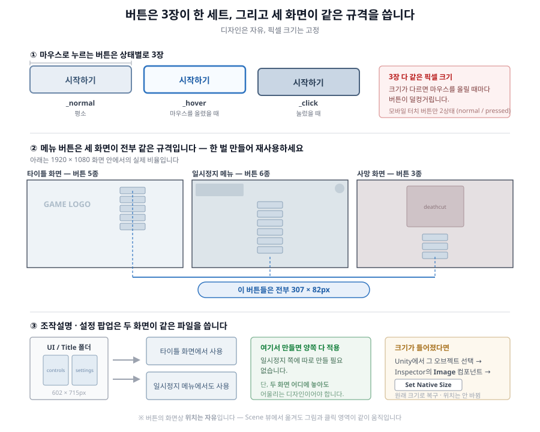

# 6주차 - 플레이 HUD · 메뉴 (러프 단계)

**이번 주 목표**: 플레이 중 화면에 뜨는 모든 UI를 만든다. 이번 주가 끝나면 **스테이지가 "게임 한 판"으로 완성**됩니다.

---

## 1. 이번 주에 만드는 것 - 플레이 중에 뜨는 UI 전부

지금까지는 캐릭터와 무대를 만들었습니다. 이번 주는 **그 위에 얹히는 화면 인터페이스**입니다. 종류가 많아 보이지만, 전부 "플레이 중에 뜨는 것"이라는 하나의 묶음입니다.

| 폴더 | 무엇 | 언제 보이나 |
|---|---|---|
| `UI/HUD` | HP 표시 · 스페셜 게이지 | **플레이 내내 항상** |
| `UI/PauseMenu` | 톱니 버튼 + 일시정지 메뉴 6개 버튼 | 톱니를 누르면 |
| `UI/DeathScreen` | 사망 화면 일러스트 + 버튼 3개 | HP가 0이 됐을 때 |
| `UI/StageStart` | "GAME START" 배너 | 스테이지 시작 직후 잠깐 |
| `UI/StageClear` | "LEVEL CLEAR" 배너 | 클리어했을 때 |
| `Environment/LevelClearObject` | **클리어를 발동시키는 오브젝트** | 스테이지 안에 실제로 놓임 |

> **`LevelClearObject`만 성격이 다릅니다.** UI(화면에 겹쳐 뜨는 것)가 아니라, **스테이지 안에 실제로 배치되는 물건**입니다. 플레이어가 여기를 **공격해서 맞히면** 스테이지 클리어가 됩니다(닿는 것만으로는 안 됩니다). 깃발, 문, 보물상자, 포탈 등 원하는 형태로 그리세요.

### 디자인 방향 - 이번 주의 핵심

UI는 **개별 그림의 예쁨보다 "전체가 하나의 세트로 보이는가"** 가 훨씬 중요합니다.

- 버튼 6개, 팝업, HP 바가 **같은 디자인 언어**(같은 테두리 두께, 같은 모서리 처리, 같은 폰트 느낌)를 공유해야 합니다
- **게임 세계관과 어울려야** 합니다. 판타지 게임에 SF UI를 붙이면 아무리 잘 그려도 튑니다
- 러프 단계에서는 **레이아웃과 형태**를 잡는 것이 목표입니다

> [06_평가기준](../기본설명/06_평가기준.md)의 "전체 분위기와 통일성" 항목이 여기서 크게 갈립니다.

---

## 2. 리소스 제작 규격

### ★ 이번 주 최우선 규칙 - 픽셀 크기를 반드시 지킬 것

캐릭터와 달리 **UI는 정해진 픽셀 크기가 있고, 그대로 지켜야 합니다.** 디자인은 자유지만 **크기는 고정**입니다.

> 작업하다 실수로 크기가 달라졌다면 고칠 수 있습니다:
> Unity에서 그 오브젝트 선택 → `Inspector`의 **`Image` 컴포넌트 → `Set Native Size`** 버튼 한 번.
> 원래 크기로 돌아가고, **위치는 바뀌지 않습니다.**

### 버튼은 3장이 한 세트 (normal / hover / click)

마우스로 조작하는 버튼은 **상태별로 3장**을 그립니다.

| 상태 | 파일 | 언제 |
|---|---|---|
| `_normal` | 평소 | 아무것도 안 할 때 |
| `_hover` | 마우스를 올렸을 때 | 살짝 밝게/커지게 |
| `_click` | 눌렀을 때 | 눌린 느낌 |

**3장 다 같은 픽셀 크기**여야 합니다. 크기가 다르면 마우스를 올릴 때마다 버튼이 덜컹거립니다.



### `UI/HUD` - HP 표시와 스페셜 게이지

| 파일 | 크기 | 설명 |
|---|---|---|
| `hp_background.png` | **591 x 155px** | HP 표시 전체 배경판 |
| `hp_dot_black.png` | **35 x 35px** | HP **1칸** (채워진 상태) |
| `hp_dot_white.png` | **35 x 35px** | HP **1칸** (빈 상태) |
| `sp_gauge_frame.png` | **326 x 66px** | 스페셜 게이지 테두리 (항상 보임) |
| `sp_gauge_full.png` | **326 x 66px** | 게이지가 찼을 때 안쪽에 채워지는 그림 |

- `hp_dot_black/white`는 **HP 칸 수만큼 옆으로 여러 개 나열**됩니다. 그림 한 장 = 칸 하나입니다
- `sp_gauge_frame`과 `sp_gauge_full`은 **정확히 겹쳐지도록** 같은 위치 기준으로 그리세요

### `UI/PauseMenu` - 일시정지

| 파일 | 크기 | 설명 |
|---|---|---|
| `pause.png` | **122 x 122px** | 플레이 중 화면에 떠 있는 톱니 버튼 (`Esc` 키로도 열립니다) |
| 메뉴 버튼 6종 × 3상태 | **각 307 x 82px** | 아래 목록 |

메뉴 버튼 6종 (각각 `_normal` / `_hover` / `_click`):

```
button_continue_normal.png / _hover.png / _click.png    계속하기
button_controls_normal.png / _hover.png / _click.png    조작설명
button_settings_normal.png / _hover.png / _click.png    설정
button_title_normal.png    / _hover.png / _click.png    포기하고 타이틀로
button_retry_normal.png    / _hover.png / _click.png    재도전
button_quit_normal.png     / _hover.png / _click.png    종료
```

> **"조작설명"/"설정" 버튼을 누르면 뜨는 팝업 배경은 이 폴더가 아닙니다.** `UI/Title` 폴더의 `popup_controls.png` / `popup_settings.png` 를 **그대로 재사용**합니다. → **7주차에 만듭니다.** 이번 주에 따로 만들 필요 없습니다.

### `UI/DeathScreen` - 사망 화면

| 파일 | 크기 | 설명 |
|---|---|---|
| `deathcut.png` | **700 x 499px** | 사망 화면 중앙 일러스트 |
| 버튼 3종 × 3상태 | **각 307 x 82px** | `button_retry` / `button_title` / `button_quit` |

버튼 규격이 일시정지 메뉴와 **완전히 같습니다(307x82).** 같은 디자인을 재사용해도 되고, 사망 화면 분위기에 맞게 다르게 만들어도 됩니다.

> `deathcut.png`는 **"죽었을 때 보여줄 한 컷"** 입니다. 이 게임에서 학생이 그리는 몇 안 되는 **일러스트**라 인상에 크게 남는 부분입니다.

### `UI/StageStart` / `UI/StageClear` - 배너

| 파일 | 크기 | 설명 |
|---|---|---|
| `UI/StageStart/game_start.png` | **580 x 330px** | 스테이지 진입 직후 잠깐 떴다 사라짐 |
| `UI/StageClear/level_clear.png` | **580 x 330px** | 클리어했을 때 뜸 |

글자를 그림 안에 직접 그려 넣습니다 (예: "GAME START", "STAGE 1"). 영문/한글/게임 고유 문구 자유입니다.

### `Environment/LevelClearObject` - 클리어 오브젝트

| 파일 | 크기 | 설명 |
|---|---|---|
| `level_clear_object.png` | **500 x 500px 권장** | **공격해서 맞히면** 클리어되는 물건 |

> ★ **기준 위치가 캐릭터와 다릅니다.** 캐릭터는 "아래쪽 가운데" 기준이지만, 이건 **"정가운데" 기준**입니다. 헷갈리기 쉬우니 주의하세요.
> 캐릭터와 비슷한 크기감으로 그리면 자연스럽습니다.

### 러프 단계 작업 지침

- 컬러링 없이, 단 **디자인 컨셉은 담겨 있어야 함**
- **픽셀 크기만은 러프 단계에서도 정확히 지키세요.** 나중에 크기를 바꾸면 레이아웃을 전부 다시 잡아야 합니다
- 버튼 3상태는 러프에서는 **같은 그림에 명도만 다르게** 해도 충분합니다

---

## 3. Unity에 적용하기

### 순서

**1) 그림을 각 폴더에 넣습니다.**

**2) `BackgroundTest` 씬을 엽니다.**

**3) HUD/시스템을 한 번에 추가합니다.**

```
Tools > Class Template > Add All HUD & Systems To Background Test Scene
```

이 하나로 **6가지가 전부** 추가/갱신됩니다:

1. HP 표시
2. 스페셜 게이지
3. 사망 화면
4. 일시정지 메뉴
5. 모바일 컨트롤 (PC 빌드엔 안 보임 - 11주차에 다룸)
6. 스테이지 시작 배너 + 레벨클리어 오브젝트 + 클리어 화면

**안전하게 반복 실행 가능**합니다. 그림을 넣기 전에 실행해도 되고(자리만 잡힘), 넣은 뒤 다시 실행해도 됩니다.

**4) 클리어 오브젝트를 스테이지에 배치합니다.**

`Hierarchy`에서 `LevelClearObject`를 찾아 선택하고, **Scene 뷰에서 드래그**해서 스테이지 끝쪽 원하는 위치에 놓습니다. 여기를 플레이어가 **공격해서 맞히면** 클리어입니다 - 지나가는 것만으로는 안 됩니다.

**5) 시작 배너와 클리어 화면의 위치를 조정합니다** (원하는 경우).

**이 둘은 `BackgroundTest`에만 있는 것**이라 여기서 조정합니다.

**6) Ctrl+S로 저장**

---

### ⚠️ 나머지 UI의 위치는 **`ActionTest` 씬에서** 조정합니다

**HP 표시·게이지·톱니 버튼·사망 화면·일시정지 메뉴·모바일 컨트롤**은 `ActionTest`에도 똑같이 들어 있습니다. **원본은 `ActionTest` 쪽**이라, `BackgroundTest`에서 옮겨두면 나중에 아래 명령 한 번에 사라집니다.

**7) `ActionTest` 씬을 엽니다.**

**8) 위치를 조정합니다.**

`Hierarchy`에서 해당 UI를 선택하고 Scene 뷰에서 드래그하거나 `Inspector`의 `Pos X` / `Pos Y` 를 조절하세요. 그림과 클릭 영역이 같이 붙어 다니므로 따로 맞출 것이 없습니다.

**평소 꺼져 있는 사망 화면·일시정지 메뉴는 아래 Preview 토글로 켜놓고** 맞추세요.

> **UI는 모든 스테이지 씬에서 `HUD Canvas` 안에 있습니다.** 이름이 같으니 씬을 옮겨도 찾는 자리는 같습니다. ([보조자료 0번](W06_플레이HUD_메뉴_인스팩터.md))

**9) 모든 스테이지 씬에 반영합니다.**

```
Tools > Class Template > Sync Player & HUD From ActionTest
```

`ActionTest`에서 맞춘 위치가 **`BackgroundTest`와 스테이지2·3에 한꺼번에** 복사됩니다.

**10) Ctrl+S로 저장**

> ### 왜 씬을 두 번 오가나
>
> **처음 만드는 도구는 `BackgroundTest` 전용**입니다(시작 배너·클리어 오브젝트가 거기에만 있으니까요). **위치를 맞추는 기준은 `ActionTest`** 입니다.
>
> | 무엇을 | 어디서 |
> |---|---|
> | 만들기 (3번) | **`BackgroundTest`** |
> | 시작 배너 · 클리어 화면 위치 | **`BackgroundTest`** |
> | 그 밖의 UI 위치 전부 | **`ActionTest`** → Sync |
>
> 자세한 이유는 [6주차 보조자료](W06_플레이HUD_메뉴_인스팩터.md)의 **0번**에 있습니다.

### 화면에 안 뜨는 UI를 편집 중에 보는 방법 (Preview 토글)

일시정지 메뉴와 클리어 화면은 평소에 꺼져 있어서 Scene 뷰에서 위치를 잡기 어렵습니다. 그래서 켜고 끄는 도구가 있습니다.

```
Tools > Class Template > Toggle Pause Menu Preview
Tools > Class Template > Toggle Stage Clear Panel Preview
```

> ⚠️ **위치를 다 맞췄으면 반드시 ① 버튼을 다시 눌러 끄고 → ② Ctrl+S 순서로 저장하세요.**
> 켜놓은 채로 저장하면, **Play를 시작하자마자 클리어 화면이 이미 떠 있는 채로 시작**해버립니다.
> (실수로 켜둔 채 저장해도 자동으로 꺼주는 안전장치가 들어 있지만, 습관을 들이는 편이 안전합니다.)

### HP 회복 아이템 박스 추가 (선택)

```
Tools > Class Template > Add HP Item Box To Scene
```

스테이지 중간에 놓을 회복 아이템 박스입니다. 그림은 `StudentReplace/Items` 폴더입니다 (`HpBox_frames` 폴더 + `hpitem.png`). 여유가 있으면 이번 주에 같이, 아니면 12주차에 해도 됩니다.

---

## 4. 확인하고 수정하기

`BackgroundTest` 씬에서 Play. **이번 주는 "게임 한 판을 끝까지" 돌려보는 것이 확인 방법입니다.**

| 확인 항목 | 방법 |
|---|---|
| 시작 배너가 뜨고 사라지나 | Play 직후 |
| HP 표시가 보이나 | 화면 확인 |
| **맞으면 HP 칸이 줄어드나** | 몬스터에게 맞아보기 |
| 스페셜 게이지가 차나 | 몬스터를 때려서 게이지 누적 확인 |
| 게이지가 다 차면 표시가 바뀌나 | `sp_gauge_full`이 나타나는지 |
| 톱니 버튼을 누르면 메뉴가 뜨나 | 톱니 클릭 (`Esc`로도 열리고, `Esc`를 다시 누르면 닫힙니다) |
| 메뉴 버튼 6개가 다 동작하나 | 계속하기 / 재도전 / 타이틀로 등 |
| 버튼에 마우스를 올리면 그림이 바뀌나 | hover / click 상태 확인 |
| **죽으면 사망 화면이 뜨나** | 일부러 맞아서 죽어보기 |
| 사망 화면 버튼 3개가 동작하나 | 재도전 / 타이틀로 / 종료 |
| **클리어 오브젝트를 때리면 클리어되나** | 스테이지 끝까지 가서 `J`로 공격 (테스트는 `Ctrl+L` 로도 가능) |
| 클리어 배너가 뜨나 | |

### 잘 안 될 때

| 증상 | 원인 |
|---|---|
| UI가 임시 그림 그대로 | 파일명 오타, 또는 `Add All HUD & Systems...` 미실행 |
| 버튼이 찌그러져 보임 | 픽셀 크기가 규격과 다름 → `Image` 컴포넌트의 **`Set Native Size`** |
| 마우스를 올려도 그림이 안 바뀜 | `_hover` / `_click` 파일이 없거나 이름이 틀림 |
| **Play하자마자 클리어 화면이 떠 있음** | `Toggle Stage Clear Panel Preview`를 켠 채로 저장했음 → 다시 눌러 끄고 Ctrl+S |
| **Play하자마자 일시정지 메뉴가 떠 있음** | 위와 같음 (`Toggle Pause Menu Preview`) |
| **맞춰놓은 UI 위치가 원래대로 돌아감** | `BackgroundTest`에서 옮긴 뒤 `Sync Player & HUD From ActionTest`를 실행함. **위치는 `ActionTest`에서** |
| 클리어가 안 됨 | `LevelClearObject`를 씬에 배치하지 않았거나, 플레이어가 닿을 수 없는 위치에 있음 |
| 클리어 오브젝트가 이상한 위치에 그려짐 | 그림을 "정가운데" 기준으로 그리지 않았음 |
| HP 칸이 이상하게 겹침 | `hp_dot` 크기가 35x35가 아님 |
| 팝업(조작설명/설정)이 임시 그림 | **정상입니다.** 팝업은 `UI/Title` 폴더 담당 - 7주차에 만듭니다 |

---

## 5. GitHub 백업

1. Unity에서 **Ctrl+S**
2. GitHub Desktop → Summary `6주차 - 플레이 HUD/메뉴 러프` → **Commit to main** → **Push origin**

### 이번 주 특히 주의

- **Push 전에 Play를 한 번 눌러보세요.** Preview 토글을 켜둔 채 저장하는 실수가 이번 주에 가장 많이 나옵니다. Play하자마자 메뉴나 클리어 화면이 떠 있으면 그 상태입니다.
- UI 파일 개수가 많습니다(버튼만 30장 이상). Commit 목록에서 빠진 게 없는지 확인하세요.

---

## 과제 (6주차)

### 무엇을 해오나

**플레이 중 화면에 뜨는 UI 전부를 러프(스케치) 상태로 제작하고 Unity에 적용하기**

- HUD (HP · 스페셜 게이지) / 일시정지 메뉴 / 사망 화면 / 시작·클리어 배너 / 클리어 오브젝트
- 완성본이 아닌 **스케치 버전의 러프** 상태
- 스케치지만 **디자인 컨셉은 담겨 있어야 함** (컬러링 X)
- **픽셀 규격은 러프에서도 정확히 지킬 것**

### 제출

네이버 카페 업로드 - 제목 `2D게임제작_06주차_123456홍길동`

- [ ] **플레이 HUD · 메뉴 리소스** (제작한 UI 이미지들)
- [ ] **유니티 플레이 영상** - `ActionTest` 또는 `BackgroundTest` 씬에서 **HUD와 메뉴가 보이는** 플레이 영상, **10초 내외**
  - HP가 깎이는 모습 + 일시정지 메뉴를 여는 모습이 들어가면 좋습니다

### 제출 전 체크리스트

- [ ] HUD 5개 파일이 규격 크기(591x155 / 35x35 / 326x66)와 일치하는가
- [ ] 버튼이 전부 **307x82px** 이고 `_normal` / `_hover` / `_click` 3장씩 있는가
- [ ] `pause.png`가 122x122, `deathcut.png`가 700x499, 배너가 580x330인가
- [ ] `level_clear_object.png`를 **정가운데 기준**으로 그렸는가
- [ ] `BackgroundTest`에서 `Add All HUD & Systems To Background Test Scene` 을 실행했는가
- [ ] UI 위치는 `ActionTest`에서 맞추고 `Sync Player & HUD From ActionTest` 를 실행했는가
- [ ] `LevelClearObject`를 스테이지에 배치했는가
- [ ] **Preview 토글을 전부 끄고 저장했는가** (Play 시작 화면이 정상인지 확인)
- [ ] 죽어보기 / 클리어하기 둘 다 실제로 되는가
- [ ] Ctrl+S → Commit → **Push까지 완료**했는가

---

## 관련 문서

- `Assets/_Project/04_Art/StudentReplace/UI/HUD(PauseMenu, DeathScreen, StageStart, StageClear)/readme.txt`
- `Assets/_Project/04_Art/StudentReplace/Environment/LevelClearObject/readme.txt`
- [04_Unity_적용_가이드](../기본설명/04_Unity_적용_가이드.md) - "HUD/시스템 한 번에 추가하기"
- [W06 보조자료 - Inspector 항목 설명](W06_플레이HUD_메뉴_인스팩터.md) - **Inspector 항목이 뭐가 뭔지 모르겠을 때**
