# 6주차 보조자료 - 플레이 HUD·메뉴 Inspector 항목 설명

> 본 수업 문서: **[W06 플레이 HUD·메뉴](W06_플레이HUD_메뉴.md)** · 같은 형식: [주인공](W02_플레이어_캐릭터_인스팩터.md) · [몬스터](W03_몬스터_ABC_인스팩터.md) · [배경](W05_배경_스테이지1_인스팩터.md)

이번 주 UI들은 **캐릭터와 성격이 완전히 다릅니다.** 항목 수는 훨씬 적은데, 대신 **"어떤 그림을 어느 칸에 연결했는가"** 가 대부분입니다.

**그래서 실수의 종류도 다릅니다.** 숫자를 잘못 넣는 게 아니라, **칸이 비어서 아무것도 안 뜨는** 쪽입니다.

---

## 이 문서를 보는 법

| 표시 | 뜻 |
|---|---|
| **★** | **여러분이 직접 다루는 것** |
| **△** | **필요하면 조정.** 안 건드려도 정상 작동합니다 |
| **✕** | **손대지 마세요.** 특히 **오브젝트 연결 칸을 비우면 그 기능이 통째로 사라집니다** |

> 숫자는 **`BackgroundTest` 씬의 현재 설정값**입니다.

> ### ⚠️ 이번 주 가장 중요한 원칙
>
> **UI는 `Tools > Class Template` 메뉴로 만드는 것이 원칙입니다.** ([W06 본문](W06_플레이HUD_메뉴.md)의 "Unity에 적용하기")
>
> 손으로 만들려 하지 마세요. 도구가 **버튼 연결, 사운드 연결, 위치, 크기까지 전부** 맞춰서 놓아줍니다. **Inspector는 그 결과를 확인하고 미세 조정할 때** 봅니다.

---

## 0. Hierarchy 구조 - 무엇이 어디 있나

플레이 중 UI는 대부분 **`HUD Canvas`** 아래에 모여 있습니다. **모든 스테이지 씬에서 이름이 같습니다.**

> **씬마다 조금씩 다른 것도 있습니다.** `ActionTest`에는 화면 오른쪽 위의 **조작 설명 글**(`Instruction Text`)이 더 있고, `BackgroundTest` 쪽에는 **시작 배너와 클리어 화면**이 더 있습니다. **HUD 다섯 가지는 양쪽이 똑같습니다.**

```
HUD Canvas
  ├ PlayerHpDisplay          ← 왼쪽 위 HP 칸
  │   ├ Background           ← HP 배경 그림
  │   └ DotGroup             ← 점들이 들어가는 자리
  │       └ Dot_0 ... Dot_N   ← Max Hp 만큼 자동 생성 (직접 만들지 않습니다)
  ├ SpecialGauge             ← 필살기 게이지
  │   ├ Frame                ← 테두리
  │   └ Fill                 ← 차오르는 부분
  ├ DeathScreenController    ← 사망 화면 "두뇌"
  │   └ DeathScreenPanel     ← 사망 화면 (평소 꺼짐)
  │       ├ Illustration         ← 사망 일러스트
  │       └ RetryButton · TitleButton · QuitButton
  ├ GameStartBanner          ← 스테이지 시작 배너   ※ BackgroundTest에만
  ├ StageClearController     ← 클리어 화면 "두뇌"   ※ BackgroundTest에만
  │   └ StageClearPanel      ← 클리어 화면 (평소 꺼짐)
  ├ PauseMenuController      ← 일시정지 "두뇌"
  │   └ PausePanel           ← 일시정지 메뉴 (평소 꺼짐)
  │       ├ Backdrop             ← 검은 배경
  │       ├ ResumeButton         ← 계속하기
  │       ├ RetryButton          ← 재도전
  │       ├ TitleButton          ← 타이틀로
  │       ├ ControlsButton       ← 조작 설명
  │       ├ SettingsButton       ← 설정
  │       ├ QuitButton           ← 종료
  │       ├ PopupModalBlocker    ← 팝업 뒤 클릭 차단막
  │       ├ ControlsPopup        ← 조작 설명 팝업 (평소 꺼짐)
  │       │   ├ Art             ← 팝업 그림
  │       │   └ CloseHitArea    ← 닫기 영역
  │       └ SettingsPopup        ← 설정 팝업 (평소 꺼짐)
  │           ├ Art             ← 팝업 그림
  │           ├ BgmSlider       ← 배경음악 볼륨
  │           ├ SfxSlider       ← 효과음 볼륨
  │           ├ SaveButton      ← 저장
  │           └ CloseHitArea    ← 닫기 영역
  ├ PauseGearButton          ← 오른쪽 위 톱니 버튼
  └ Instruction Text         ← 조작 설명 글       ※ ActionTest에만
BackgroundMusic              ← 스테이지 BGM
```

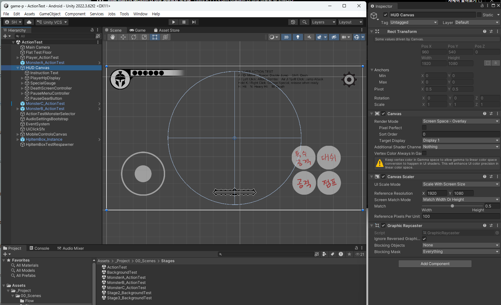

> **`HUD Canvas` 자체는 손댈 것이 없습니다.** `Screen Space - Overlay` / `1920 x 1080` / `Match 0.5` 는 **모든 화면에서 같은 크기로 보이게 하는 설정**이라 바꾸면 UI 배치가 전부 틀어집니다. **안을 열어 개별 UI만** 만지세요.

> ### `~Controller`와 `~Panel`은 짝입니다
>
> 사망·클리어·일시정지 셋 다 **`~Controller` 안에 `~Panel`이 들어 있는 2단 구조**입니다.
>
> | | 하는 일 | 평소 상태 |
> |---|---|---|
> | `~Controller` | 언제 켤지 판단하는 **두뇌** | **항상 켜짐** |
> | `~Panel` | 실제로 보이는 **화면** | **꺼짐** |
>
> **켜고 끄는 것은 언제나 안쪽의 `~Panel`입니다.** 컨트롤러를 끄면 그 화면이 **영영 안 나옵니다.**

### ⚠️ 꺼져 있는 것이 정상인 오브젝트들

`StageClearPanel`, `DeathScreenPanel`, `PausePanel`은 **평소에 체크가 꺼져 있습니다.** 필요할 때만 켜지는 화면이니까요. **Scene 탭에서 안 보이는 게 정상입니다.**

**켜는 방법이 화면마다 다릅니다.**

| 무엇을 보고 싶나 | 방법 | 어느 씬에서 |
|---|---|---|
| **일시정지 메뉴** | `Toggle Pause Menu Preview` | `ActionTest` |
| **사망 화면** | **전용 도구가 없습니다** - 체크박스를 손으로 | `ActionTest` |
| **클리어 화면** | `Toggle Stage Clear Panel Preview` | **`BackgroundTest`** |

#### ★ 메뉴가 회색이면 **씬을 잘못 연 것**입니다

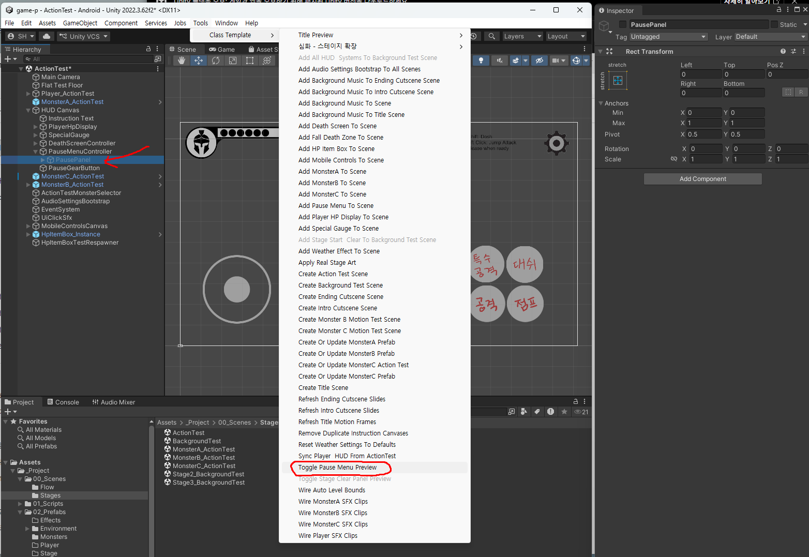

**`ActionTest`에서 연 메뉴입니다.** `Toggle Pause Menu Preview`는 쓸 수 있지만, **회색으로 죽어 있는 것이 셋** 보입니다.

| 회색인 항목 | 이유 |
|---|---|
| `Add All HUD & Systems To Background Test Scene` | **`BackgroundTest` 전용** |
| `Add Stage Start & Clear To Background Test Scene` | 〃 |
| `Toggle Stage Clear Panel Preview` | **`ActionTest`엔 클리어 화면이 없음** |

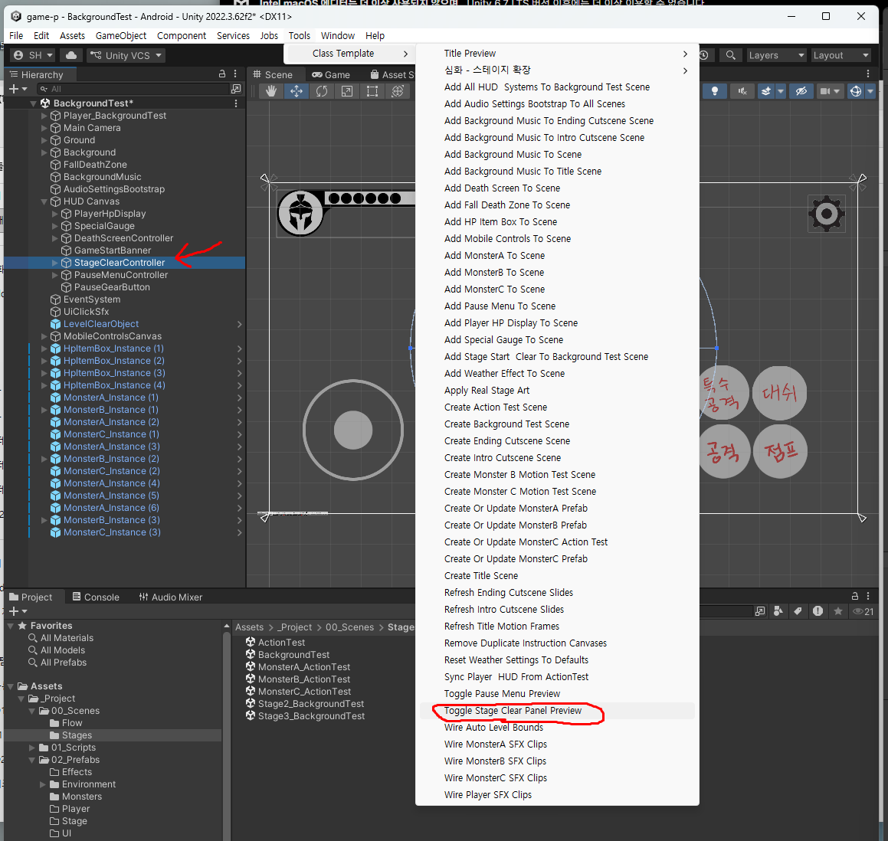

**같은 메뉴를 `BackgroundTest`에서 열면** `Toggle Stage Clear Panel Preview`가 살아납니다.

> **메뉴가 회색이라고 고장 난 것이 아닙니다.** Unity가 **"이 씬에서는 의미가 없는 명령"** 을 알아서 막아주는 것입니다. **회색이면 씬을 바꿔야 한다는 신호**로 읽으세요.

#### 사망 화면은 손으로 켭니다

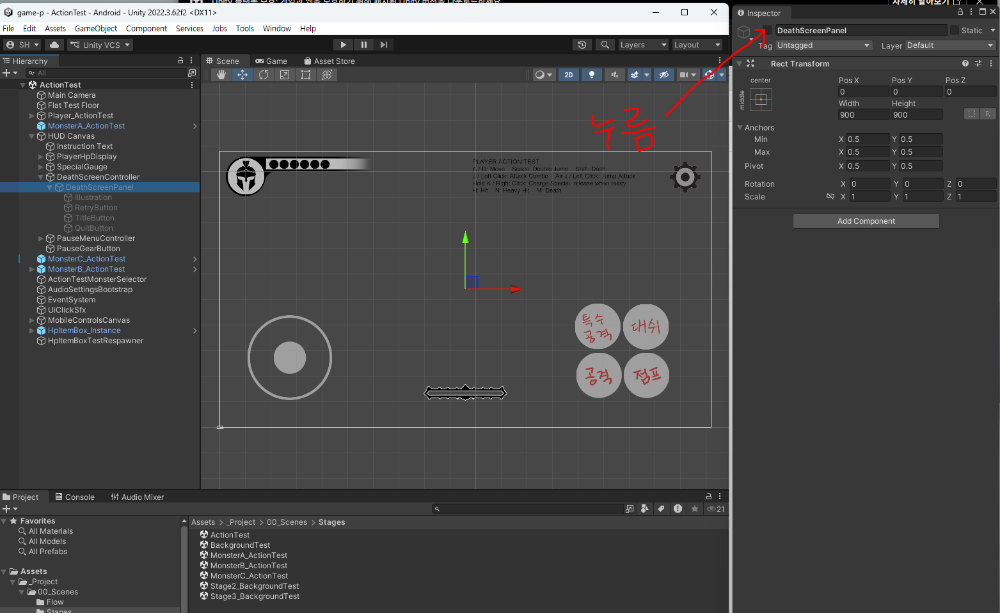

`Hierarchy`에서 **`DeathScreenController`를 펼쳐** 그 안의 **`DeathScreenPanel`을 선택** → `Inspector` **맨 위 이름 왼쪽 체크박스**를 켭니다.

**켜야 하는 것은 `~Controller`가 아니라 그 안의 `~Panel`입니다.** 컨트롤러는 원래 켜져 있습니다.

> ### ⚠️ 보고 나서 **반드시 다시 끄세요**
>
> **세 화면 다 마찬가지입니다.** 켠 채로 저장하면 **게임을 켜자마자 그 화면이 떠 있습니다.** 컨트롤러가 시작할 때 알아서 꺼주지 않습니다.
>
> 그래서 **도구가 있는 두 개(일시정지·클리어)는 도구를 쓰는 편이 안전합니다.** 다시 누르면 꺼지니 **끄는 걸 깜빡할 위험이 없습니다.** 체크박스를 직접 켜는 것은 도구가 없는 **사망 화면**에만.

> **`Hierarchy` 왼쪽의 눈 아이콘과 체크박스는 다릅니다.** 눈은 **Scene 뷰에서만 잠깐 가리는 것**(게임에는 영향 없음)이고, 위에서 말하는 것은 **체크박스**입니다. 꺼진 오브젝트는 눈을 켜도 안 보입니다.


### ★ HUD 수정은 **`ActionTest` 씬에서만** 하세요

HUD는 **`ActionTest`와 `BackgroundTest`(그리고 스테이지2·3)에 똑같이** 들어 있습니다. 양쪽에서 따로 고치면 서로 어긋납니다.

```
ActionTest 에서 고친다  →  Sync Player & HUD From ActionTest  →  나머지 씬에 반영됨
```

```
Tools > Class Template > Sync Player & HUD From ActionTest
```

**이 명령이 복사하는 것**은 아래 여섯 가지의 **위치·크기**입니다.

| 복사되는 것 |
|---|
| `PlayerHpDisplay` · `SpecialGauge` · `PauseGearButton` |
| `MobileControlsCanvas` · `DeathScreenController` · `PauseMenuController` |

> **`BackgroundTest`에서 직접 고치지 마세요.** 나중에 위 명령을 한 번이라도 실행하면 **`ActionTest` 기준으로 덮어써져서 그 작업이 사라집니다.**

### 그럼 `BackgroundTest`에서는 무엇을 하나

**두 가지는 `ActionTest`에 아예 없습니다.** 그래서 그것만 `BackgroundTest`에서 만듭니다.

| 무엇을 | 어느 씬에서 | 왜 |
|---|---|---|
| HP 칸 · 게이지 · 톱니 버튼 · 모바일 컨트롤 | **`ActionTest`** | Sync가 `ActionTest`를 원본으로 삼습니다 |
| **사망 화면** · **일시정지 메뉴** | **`ActionTest`** | 〃 (평소 꺼져 있어도 마찬가지입니다) |
| **시작 배너** · **클리어 화면** | **`BackgroundTest`** | **`ActionTest`에는 없습니다** |

**시작 배너와 클리어 화면은 "스테이지"의 물건**입니다. `ActionTest`는 동작만 시험하는 씬이라 시작도 끝도 없으니 이 둘이 존재하지 않습니다. `Add Stage Start & Clear To Scene` 메뉴도 **`ActionTest`에서는 회색으로 비활성**입니다.

> **정리하면 이렇습니다.**
>
> **`ActionTest`에도 있는 것 = `ActionTest`에서 고친다.** `BackgroundTest`에서는 **눈으로 확인만** 합니다.
> **`BackgroundTest`에만 있는 것 = 거기서 고친다.**

---

## 1. `PlayerHpDisplay` - 왼쪽 위 HP 칸

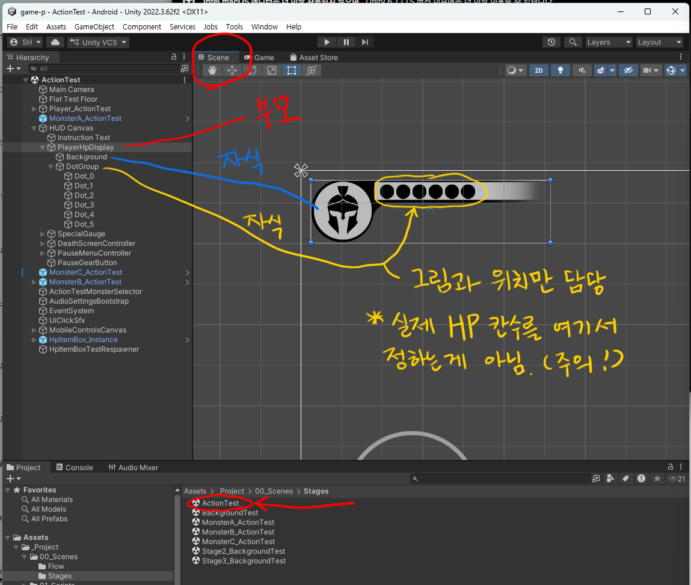

**`Background`(배경 그림)와 `DotGroup`(점들이 들어가는 자리)** 두 자식으로 되어 있습니다. **둘 다 그림과 위치만 담당합니다.**

| 항목 | 설명 | |
|---|---|---|
| `Dot Group` | 점들이 들어갈 자리(오브젝트) | **✕** |
| `Background` | HP 배경 그림 자리(오브젝트) | **✕** |
| `Dot On Sprite` | **HP가 남아 있는 칸** 그림 (`hp_dot_white.png`) | **★** |
| `Dot Off Sprite` | **깎여 나간 칸** 그림 (`hp_dot_black.png`) | **★** |
| `Player Controller` | 주인공 연결 - 여기서 HP를 읽어옴 | **✕** |

> ### 칸 수는 여기서 정하지 않습니다
>
> **HP 칸이 몇 개인지는 주인공의 `Max Hp`가 결정합니다.** ([주인공 편 9번](W02_플레이어_캐릭터_인스팩터.md)) 이 UI는 그 숫자를 읽어서 **자동으로 칸을 만듭니다.**
>
> 칸을 늘리고 싶으면 여기가 아니라 **주인공을 선택해서 `Max Hp`** 를 고치세요. **최대 10칸**까지 됩니다.

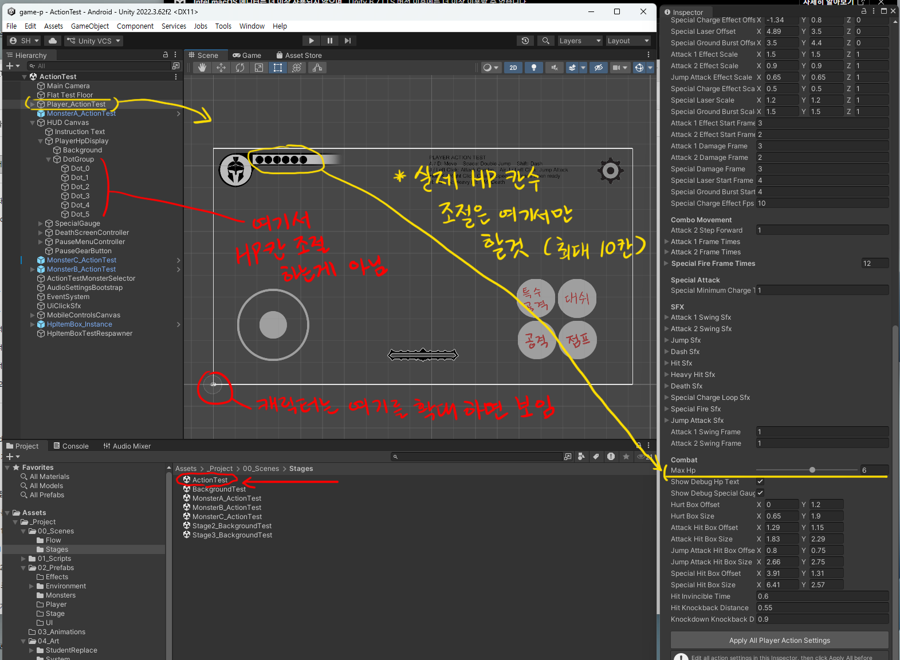

> **`Dot On` / `Dot Off` 두 장은 크기가 같아야 합니다.** 다르면 HP가 깎일 때 칸 간격이 들쭉날쭉해집니다.

> `Player Controller` 칸이 비면 **HP가 전혀 안 깎이는 것처럼 보입니다**(실제로는 깎이는데 표시만 안 됨). 씬을 새로 만들었을 때 자주 생기니, `Tools > Class Template > Sync Player & HUD From ActionTest`로 다시 연결하세요.

---

## 2. `SpecialGauge` - 필살기 게이지

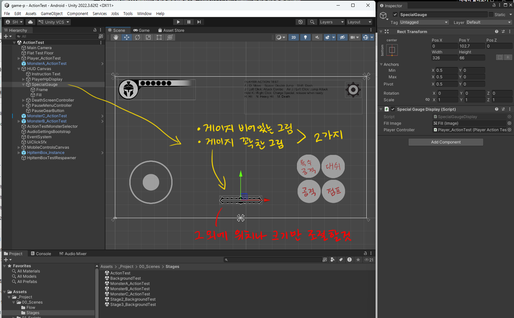

**`Frame`(게이지 비어 있는 그림)과 `Fill`(꽉 찬 그림)** 두 장으로 되어 있고, 그 밖에는 **위치와 크기만** 조절합니다.

| 항목 | 설명 | |
|---|---|---|
| `Fill Image` | **차오르는 부분** 그림 (`sp_gauge_full.png`) | **✕** |
| `Player Controller` | 주인공 연결 | **✕** |

**게이지는 그림 두 장으로 되어 있습니다** - 테두리(`sp_gauge_frame.png`)와 채워지는 부분(`sp_gauge_full.png`). 채워지는 부분이 **`Fill Image`** 로 연결되어 있고, 차징하는 동안 이 그림이 **아래에서 위로 차오릅니다.**

> **그림을 바꾸려면 `Fill Image` 칸이 아니라, `Fill`이라는 자식 오브젝트의 `Source Image`** 를 바꿉니다. 여기 칸은 "어느 오브젝트가 차오르는 부분인가"를 가리키는 것이지 그림 자체가 아닙니다.

> **차오르는 방향을 바꾸려면** `Fill` 오브젝트의 `Image` 컴포넌트에서 `Fill Method`(Horizontal/Vertical)와 `Fill Origin`을 조정합니다. **△**

---

## 3. `GameStartBanner` - 스테이지 시작 배너

> **`BackgroundTest` 씬에서 작업합니다.** `ActionTest`에는 이 오브젝트가 없습니다.

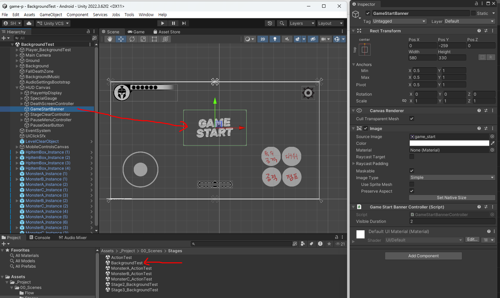

| 항목 | 현재값 | 설명 | |
|---|---:|---|---|
| `Visible Duration` | 2 | **화면에 떠 있는 시간(초)** | **★** |

가장 단순한 UI입니다. 그림(`game_start.png`) 한 장이 뜨고 2초 뒤 사라집니다.

> **글자가 많은 그림을 그렸다면 3~4초로 늘리세요.** 읽을 시간이 부족하면 배너를 그린 의미가 없습니다.

---

## 4. `StageClearPanel` - 클리어 화면 ★

> **`BackgroundTest` 씬에서 작업합니다.** `ActionTest`에는 이 오브젝트가 없고, `Toggle Stage Clear Panel Preview` 메뉴도 거기서는 회색입니다.

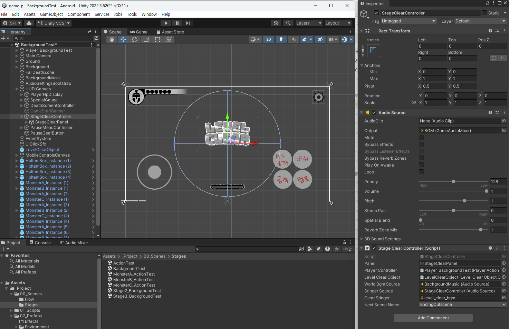

| 항목 | 현재값 | 설명 | |
|---|---|---|---|
| `Panel` | (오브젝트) | 켜고 끌 화면 자체 | **✕** |
| `Player Controller` | (오브젝트) | 주인공 연결 | **✕** |
| `Level Clear Object` | (오브젝트) | **스테이지 끝 지점** 연결 | **✕** |
| `World Bgm Source` | BackgroundMusic | 클리어 순간 **멈출 BGM** | **✕** |
| `Stinger Source` | (오브젝트) | 클리어 사운드를 재생할 자리 | **✕** |
| `Clear Stinger` | level_clear_bgm | **클리어 순간 한 번 울리는 소리** | **★** |
| `Next Scene Name` | `EndingCutscene` | **클리어 후 이동할 씬 이름** | **★** |

> ### ★ `Next Scene Name` - 스테이지를 이어 붙이는 지점
>
> **스테이지1을 깨면 어디로 갈지**를 여기서 정합니다. 기본은 `EndingCutscene`(엔딩 컷신)입니다.
>
> 15주차에 **스테이지2를 만든다면** 이 값을 `Stage2_BackgroundTest`로 바꾸면 스테이지가 이어집니다. 스테이지 연결은 **항상 손으로 하는 작업**입니다.
>
> **직접 타이핑하는 칸이 아니라 드롭다운입니다.** 눌러서 목록에서 고르면 되니 오타가 날 일이 없습니다.

---

## 5. `DeathScreenPanel` - 사망 화면

> **`ActionTest` 씬에서 작업합니다.** 평소 꺼져 있어 눈에 안 띄지만 **`ActionTest`에도 똑같이 들어 있고, Sync 대상**입니다. `BackgroundTest`에서 버튼을 옮겨두면 Sync 한 번에 사라집니다.

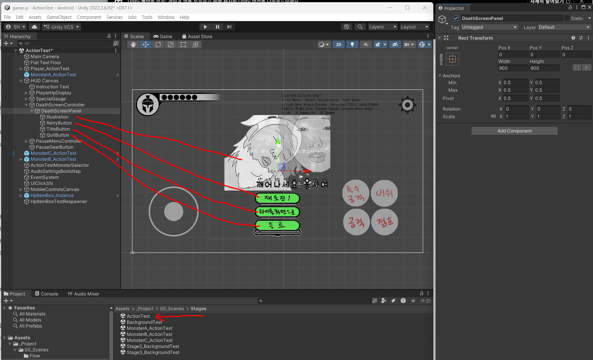

**`Illustration`(그림)과 버튼 3개**(`RetryButton` · `TitleButton` · `QuitButton`)로 되어 있습니다.

| 항목 | 현재값 | 설명 | |
|---|---|---|---|
| `Panel` | (오브젝트) | 켜고 끌 화면 자체 | **✕** |
| `Player Controller` | (오브젝트) | 주인공 연결 | **✕** |
| `Delay After Death Animation` | 1 | **사망 애니메이션이 끝난 뒤 화면이 뜨기까지 기다리는 시간(초)** | **★** |
| `Stinger Source` | (오브젝트) | 사망 사운드를 재생할 자리 | **✕** |
| `Death Screen Stinger` | deathscreen_bgm | **사망 화면이 뜨는 순간 한 번 울리는 소리** | **★** |

> **`Delay After Death Animation`은 연출의 호흡입니다.** 사망 동작이 끝나자마자 화면이 덮치면 급합니다. **죽는 모션을 길고 극적으로 그렸다면 1.5~2초로 늘려보세요.**
>
> 사망 **애니메이션 자체의 길이**는 주인공의 `Death Frames` 장수가 정합니다(초당 8장). 이 값은 **그 뒤에 추가로** 기다리는 시간입니다.

---

## 6. `PauseMenuController` - 일시정지

> **`ActionTest` 씬에서 작업합니다.** 사망 화면과 같습니다 - `ActionTest`에도 있고 Sync 대상입니다.

| 항목 | 설명 | |
|---|---|---|
| `Pause Panel` | 일시정지 메뉴 화면 | **✕** |
| `Controls Popup` | 조작설명 팝업 | **✕** |
| `Settings Popup` | 설정(볼륨) 팝업 | **✕** |
| `Popup Modal Blocker` | **팝업이 열린 동안 뒤 버튼 클릭을 막는 투명 판** | **✕** |
| `Player Controller` | 주인공 연결 | **✕** |

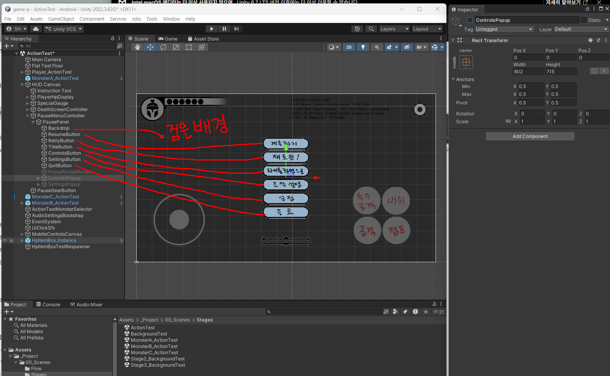

**`Backdrop`(뒤를 덮는 검은 배경)과 버튼 6개**로 되어 있습니다.

**전부 오브젝트 연결이라 손댈 것이 없습니다.** 다만 구조는 알아둘 값어치가 있습니다.

> ### ⚠️ 컨트롤러가 **패널을 품고** 있습니다 - 끄는 것은 안쪽뿐
>
> 이 부품은 "일시정지 화면을 켜고 끄는 두뇌"입니다. **두뇌(`PauseMenuController`)는 항상 켜져 있고, 그 안의 화면(`PausePanel`)만 켜졌다 꺼집니다.**
>
> **바깥쪽 `PauseMenuController`의 체크를 끄면 일시정지가 영원히 안 됩니다.** 화면을 켤 두뇌 자체가 꺼진 것이라 톱니를 눌러도 반응이 없습니다.

> **일시정지는 `Time.timeScale`로 시간을 멈춥니다.** 그래서 일시정지 중에는 애니메이션도, 몬스터도, 물리도 전부 멈춥니다. 다시 누르면 그 상태에서 이어집니다.

---

## 6-1. `PauseGearButton` - 오른쪽 위 톱니

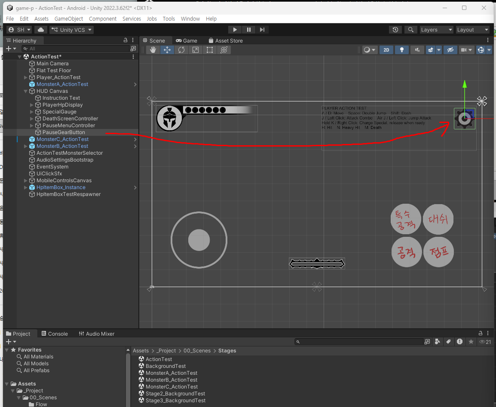

**플레이 중 화면에 계속 떠 있는 유일한 버튼**입니다. `pause.png`(122 x 122) 한 장이고, 이것을 누르면 위의 `PausePanel`이 켜집니다.

> **이 버튼만 `PausePanel` 바깥에 있습니다.** 메뉴가 닫혀 있을 때도 보여야 하니까요. 그래서 `HUD Canvas` 바로 아래에 있습니다.

---

## 6-2. 두 팝업 - `ControlsPopup` · `SettingsPopup`

**"조작 설명"과 "설정" 버튼을 누르면 뜨는 팝업**입니다. 평소에는 꺼져 있습니다.

> **타이틀 화면의 것과 같은 그림·부품을 씁니다.** 7주차에 타이틀용으로 그린 팝업(`popup_controls.png` / `popup_settings.png`)이 여기에도 그대로 쓰입니다 - **두 번 그릴 필요 없습니다.**

### `ControlsPopup` - 조작 설명

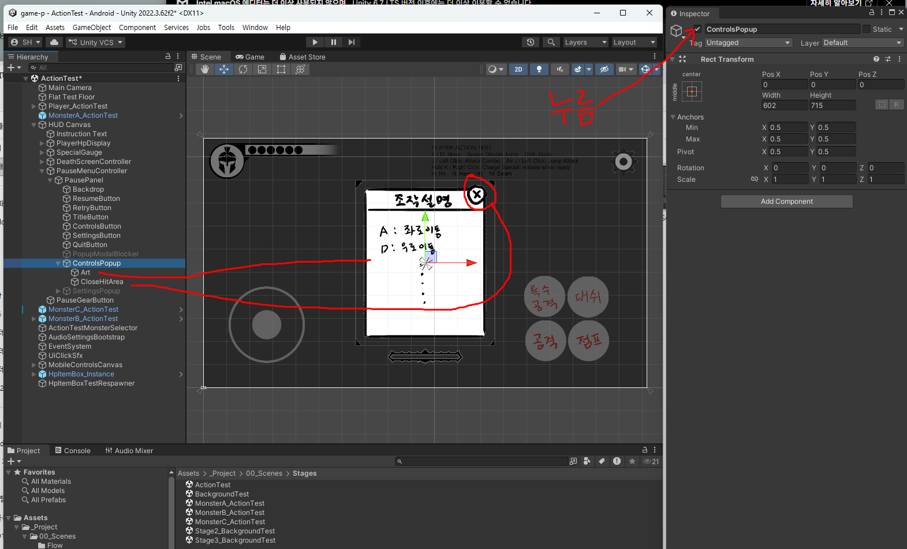

| 자식 | 하는 일 |
|---|---|
| `Art` | **여러분이 그린 팝업 그림** (조작키 설명을 그림 안에 직접 씁니다) |
| `CloseHitArea` | **닫기 버튼의 실제 눌리는 영역** |

> ### ⚠️ `✕` 그림과 **닫기 영역은 별개**입니다
>
> 위 그림에서 **오른쪽 위 `✕`는 `Art` 안에 그려진 그림**이고, **실제로 눌리는 것은 그 위에 겹쳐진 `CloseHitArea`** 입니다.
>
> **`✕`를 다른 자리에 그리면** 그림과 눌리는 자리가 어긋나서, 학생이 `✕`를 눌러도 안 닫힙니다. **`CloseHitArea`도 같이 옮기세요.**
>
> **`CloseHitArea`를 지우면 팝업을 닫을 수 없습니다.**

### `SettingsPopup` - 볼륨 설정

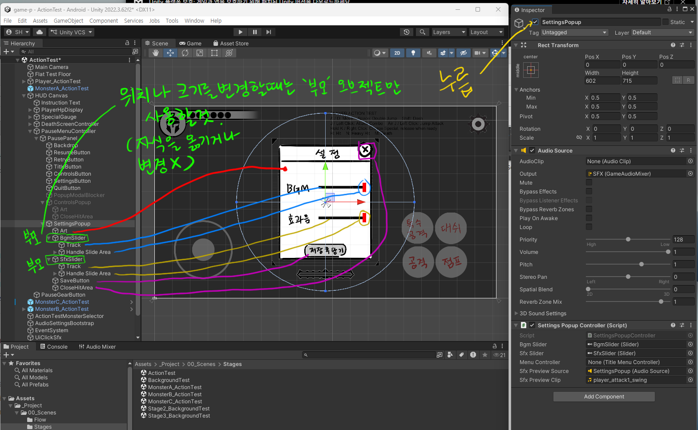

| 자식 | 하는 일 | |
|---|---|---|
| `Art` | 팝업 배경 그림 | **★** |
| `BgmSlider` | **배경음악 볼륨** 슬라이더 | **★** |
| `SfxSlider` | **효과음 볼륨** 슬라이더 | **★** |
| `SaveButton` | 저장하고 닫기 | **★** |
| `CloseHitArea` | 닫기 영역 | **✕** |

> ### ★ 슬라이더는 **부모만 옮기세요**
>
> `BgmSlider`와 `SfxSlider` 안에는 **`Track`(홈)과 `Handle Slide Area`(손잡이가 움직이는 범위)** 가 들어 있습니다.
>
> **위치나 크기를 바꿀 때는 부모인 `BgmSlider` / `SfxSlider`만** 선택해서 옮기세요. **안쪽 `Track`이나 `Handle Slide Area`를 따로 건드리면** 손잡이가 홈을 벗어나거나 볼륨 값이 엉뚱하게 잡힙니다.

> **`SettingsPopup`에는 `Audio Source`가 붙어 있습니다.** 효과음 슬라이더를 움직일 때 **미리 들려주는 소리**(`player_attack1_swing`)를 재생하는 용도입니다. 안 그러면 얼마나 줄었는지 알 수가 없으니까요.

---

## 7. 버튼들 - `Title Image Button`

일시정지·사망·클리어 화면의 버튼은 전부 같은 부품을 씁니다.

| 항목 | 현재값 | 설명 | |
|---|---|---|---|
| `Target Image` | (오브젝트) | 그림이 바뀔 자리 | **✕** |
| `Normal Sprite` | `button_..._normal.png` | **평소 모습** | **★** |
| `Hover Sprite` | `button_..._hover.png` | **마우스를 올렸을 때** | **★** |
| `Pressed Sprite` | `button_..._click.png` | **누르는 순간** | **★** |
| `Pressed Scale` | 0.95 | 누를 때 살짝 작아지는 비율 | **△** |
| `On Click` | (기능 연결) | 눌렀을 때 실행할 일 | **✕** |

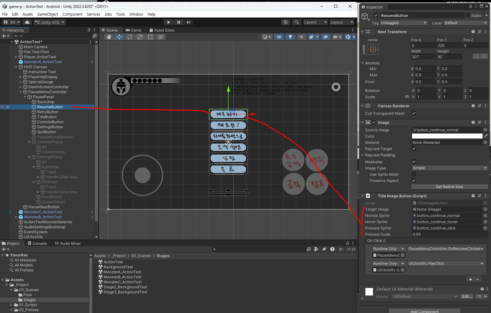

**버튼 하나에 그림 세 장이 한 세트**입니다. 파일명 규칙(`_normal` / `_hover` / `_click`)을 지키면 도구가 알아서 세 칸을 채워줍니다.

> 위 그림의 맨 아래 **`On Click`에 두 줄**이 들어 있습니다 - 하나는 **버튼의 기능**(`PauseMenuController.OnResumeClicked`), 하나는 **클릭 효과음**(`UiClickSfx.PlayClick`). **둘 다 필요합니다.**

> **`Hover`와 `Pressed`를 굳이 다르게 그리지 않아도 됩니다.** 색만 살짝 밝게/어둡게 해도 충분히 반응이 느껴집니다. 다만 **세 장 다 있어야** 자연스럽습니다.

> ⚠️ **`On Click`은 절대 건드리지 마세요.** "다시 하기", "타이틀로" 같은 **버튼의 기능 자체**가 여기 연결되어 있습니다. 지우면 버튼을 눌러도 아무 일도 안 일어납니다.

> **모바일에서는 `Hover`가 안 뜹니다.** 손가락은 "올려놓기"가 없으니까요. 그래서 `Pressed`가 더 중요합니다.

---

## 8. 자주 나오는 문제

| 증상 | 원인 |
|---|---|
| **게임을 시작하자마자 사망 화면이 떠 있음** | `DeathScreenPanel`을 켠 채로 저장한 것. 체크를 끄고 저장 |
| 사망·클리어·일시정지 화면이 **Scene 탭에 안 보임** | **정상입니다.** 평소엔 꺼져 있습니다 - 보려면 위 0번의 미리보기 방법 |
| HP가 **깎여도 화면이 그대로** | `PlayerHpDisplay`의 `Player Controller` 칸이 빔 |
| HP 칸 수를 **늘리고 싶은데 방법이 없음** | 여기가 아니라 **주인공의 `Max Hp`** |
| HP가 깎일 때 **칸 간격이 들쭉날쭉** | `Dot On`과 `Dot Off` 그림 크기가 다름 |
| **일시정지가 아예 안 됨** | `PauseMenuController` 오브젝트의 체크가 꺼짐 |
| 팝업이 열렸는데 **뒤 버튼이 눌림** | `Popup Modal Blocker` 연결이 빔 |
| 버튼을 눌러도 **아무 일도 안 일어남** | `On Click` 연결이 지워짐 → 도구로 다시 만드는 게 빠릅니다 |
| 클리어했는데 **다음 화면으로 안 넘어감** | `Next Scene Name`이 잘못 골라져 있음 |
| `BackgroundTest`에서 맞춘 **HUD 위치가 원래대로 돌아감** | `Sync Player & HUD From ActionTest`가 **`ActionTest` 기준으로 덮어쓴 것.** HUD는 `ActionTest`에서만 고치세요 |
| 시작 배너가 **너무 빨리 사라짐** | `Visible Duration` 늘리기 |

---

## 9. 값이 꼬였을 때 되돌리는 법

1. **`Ctrl+Z`**
2. **`Tools > Class Template > Add All HUD & Systems To Background Test Scene` 다시 실행** - **몇 번을 돌려도 안전합니다.** 연결이 끊긴 칸을 다시 채워줍니다. 손으로 고치기 전에 이쪽부터
3. **씬 파일 통째로 되돌리기** - GitHub Desktop → `.unity` 파일 **오른쪽 클릭 → `Discard changes`**

> UI는 **연결 칸이 많아서 하나 지우면 조용히 기능이 사라집니다.** 도구를 다시 돌리는 것이 대부분의 경우 가장 빠른 해결책입니다. ([01-③ GitHub Desktop](../기본설명/01_시작하기3_깃허브데스크탑.md))
