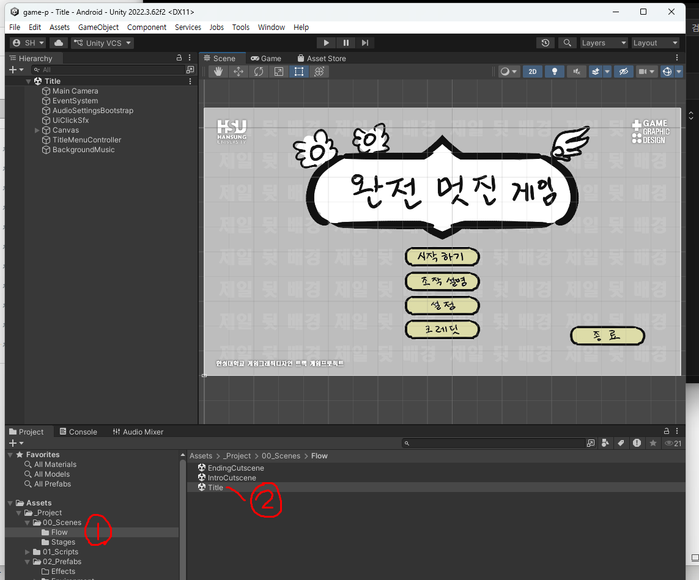
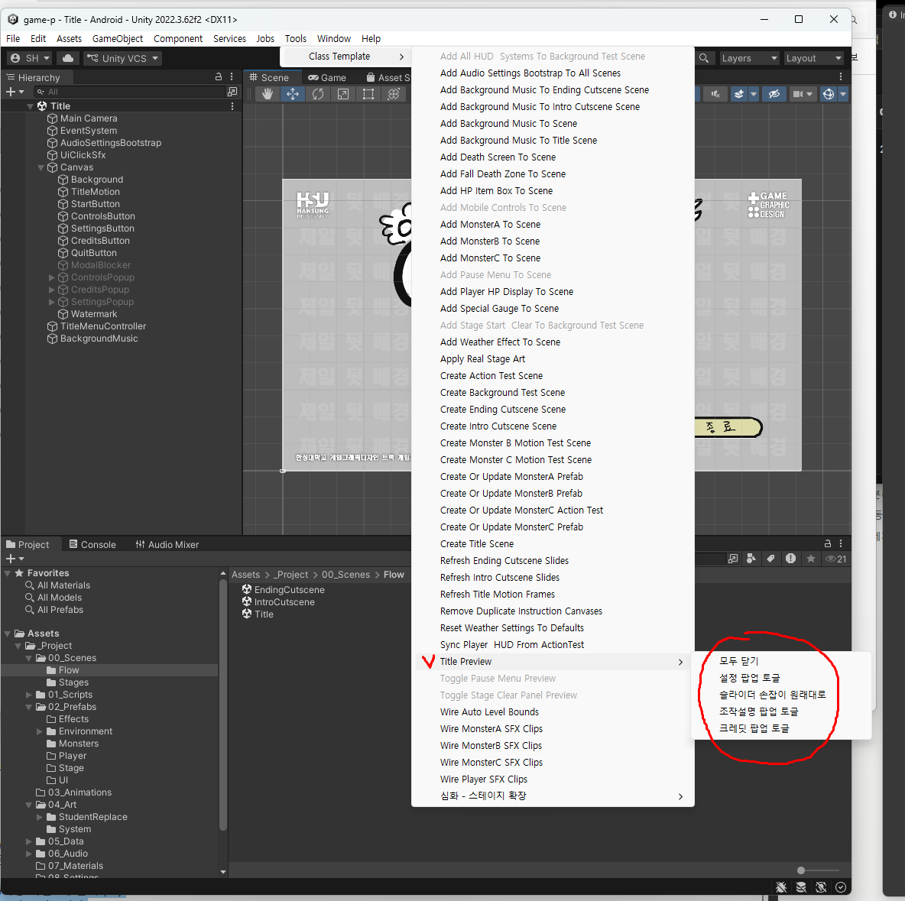
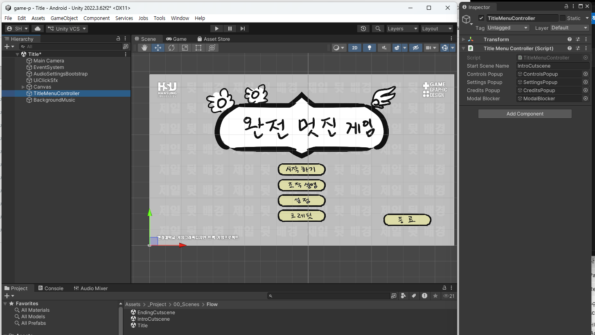
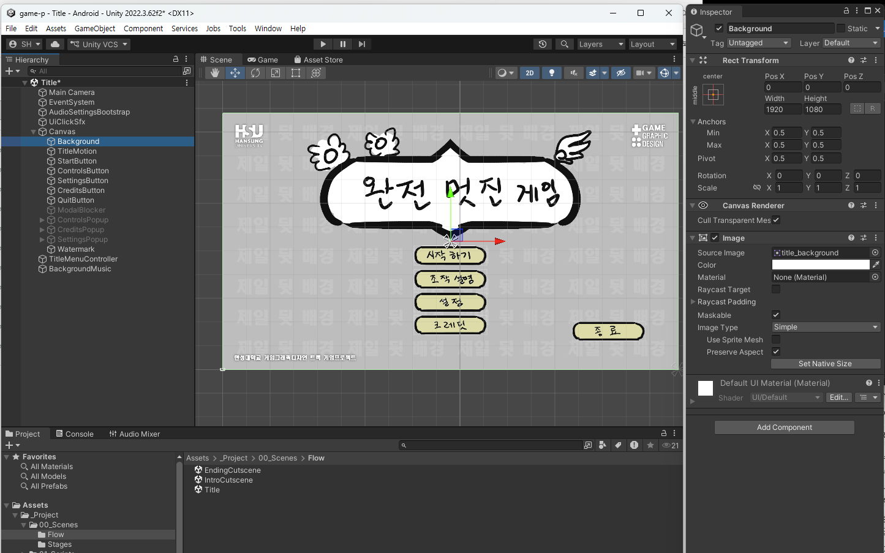
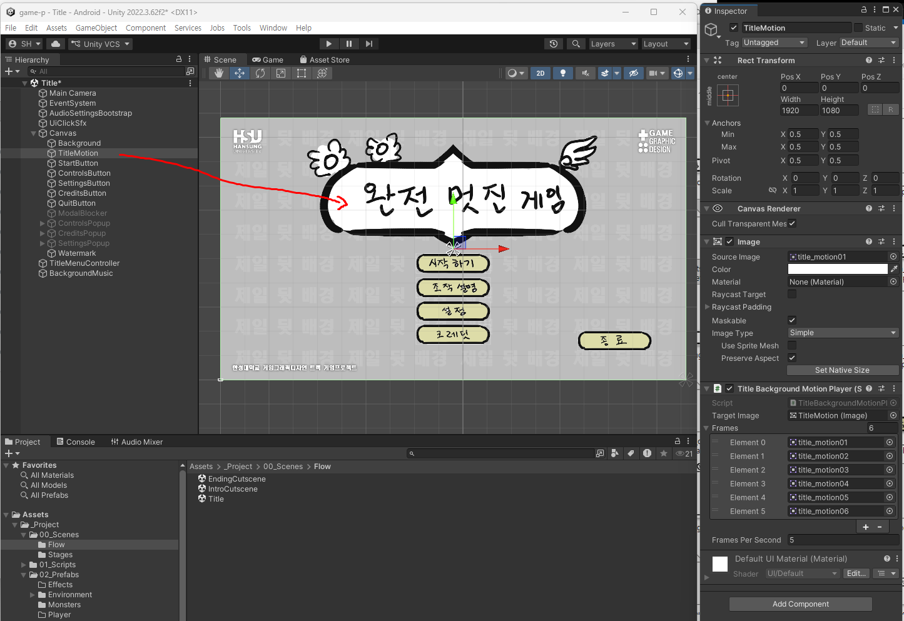
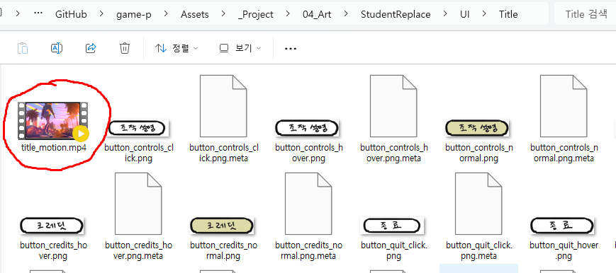
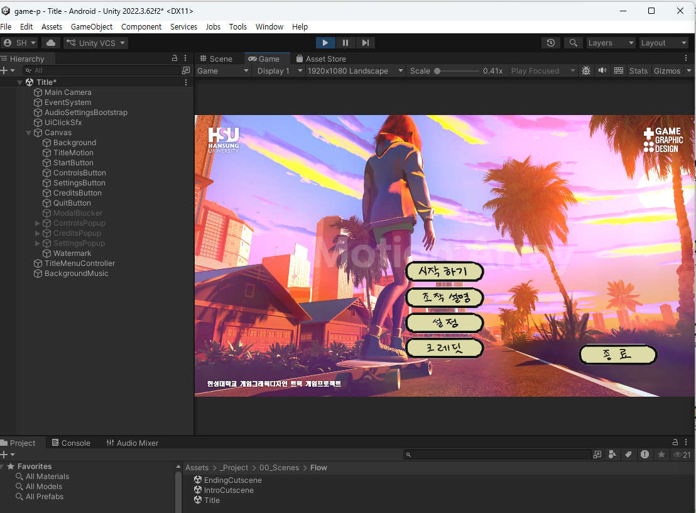
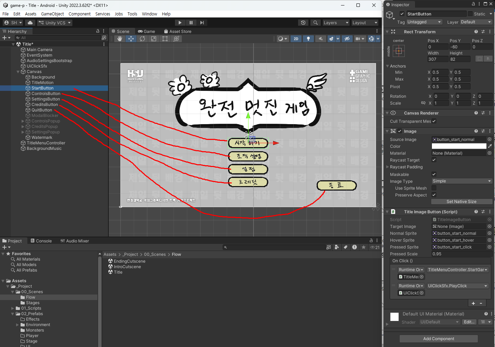
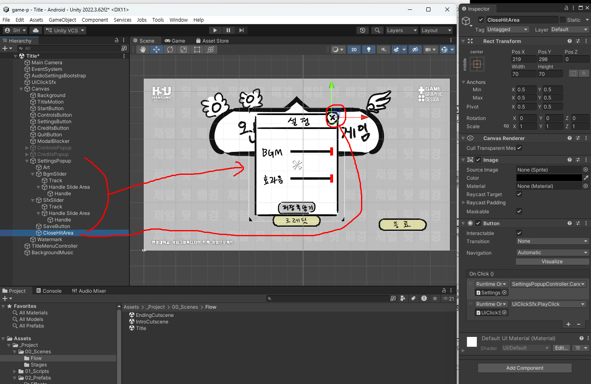
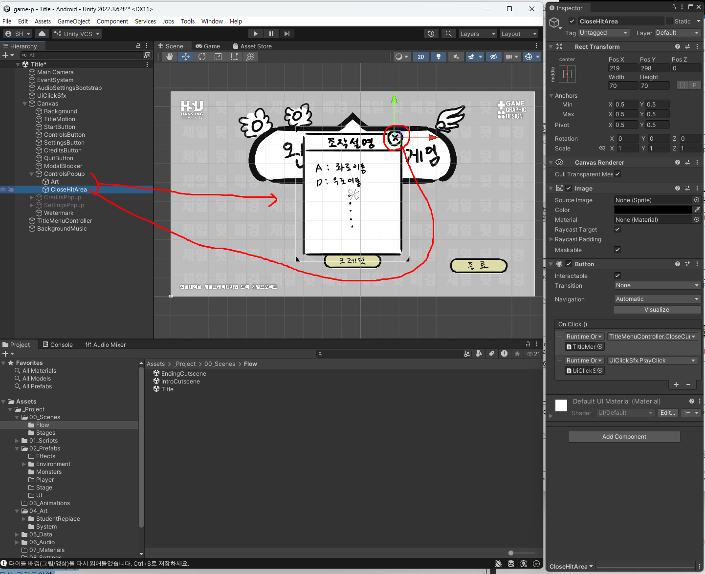

# 7주차 보조자료 - 타이틀 화면 Inspector 항목 설명

> 본 수업 문서: **[W07 타이틀 화면](W07_타이틀화면.md)** · 같은 형식: [주인공](W02_플레이어_캐릭터_인스팩터.md) · [HUD·메뉴](W06_플레이HUD_메뉴_인스팩터.md)

타이틀은 **버튼과 팝업이 많지만 설정 항목 자체는 적습니다.** 대부분 "어느 그림을 어느 칸에" 입니다.

**6주차 UI와 부품이 상당히 겹칩니다.** 버튼(`Title Image Button`)은 완전히 같고, 조작설명·설정 팝업은 **같은 것을 일시정지 메뉴가 가져다 씁니다.**

---

## 이 문서를 보는 법

| 표시 | 뜻 |
|---|---|
| **★** | **여러분이 직접 다루는 것** |
| **△** | **필요하면 조정** |
| **✕** | **손대지 마세요.** 연결 칸을 비우면 그 기능이 사라집니다 |

> ### ⚠️ 타이틀 씬에서 특히 조심할 것
>
> **`Tools > Class Template > Create Title Scene`은 타이틀 씬을 통째로 새로 만듭니다.** 손으로 옮겨둔 위치, 크기, 조정한 값이 **전부 초기화됩니다.**
>
> **이미 만들어진 타이틀을 다듬을 때는 절대 실행하지 마세요.** 그림만 새로 읽어들이려면 **`Refresh Title Motion Frames`** 를 쓰세요.

---

## 0. Hierarchy 구조

타이틀 씬은 `00_Scenes` 아래 **`Flow` 폴더**에 있습니다 - 스테이지 씬들과 다른 폴더입니다.



```
Main Camera
Canvas
  ├ Background          ← 타이틀 배경 (그림 / 연속 그림 / 영상)
  ├ StartButton         ← 시작하기
  ├ ControlsButton      ← 조작설명
  ├ SettingsButton      ← 설정
  ├ CreditsButton       ← 크레딧
  ├ QuitButton          ← 종료
  ├ ModalBlocker        ← 팝업 뒤 클릭 차단막
  ├ ControlsPopup       ← 조작설명 팝업
  ├ SettingsPopup       ← 설정(볼륨) 팝업
  ├ CreditsPopup        ← 크레딧 팝업
  └ Watermark           ← 학교/트랙 표기 (건드리지 않음)
TitleMenuController     ← 타이틀 "두뇌"
BackgroundMusic         ← 타이틀 BGM
AudioSettingsBootstrap  ← 저장된 볼륨을 불러오는 부품
```

> **팝업 3종은 평소 체크가 꺼져 있습니다.** 모양을 보려면 체크를 켜지 말고 **미리보기 도구**를 쓰세요 - 켠 채로 저장하면 게임을 켜자마자 팝업이 떠 있습니다.
>
> `Tools > Class Template > Title Preview > 조작설명 팝업 토글` / `설정 팝업 토글` / `크레딧 팝업 토글` / `모두 닫기`
>
> 

---

## 1. `TitleMenuController` - 타이틀의 두뇌



| 항목 | 현재값 | 설명 | |
|---|---|---|---|
| `Start Scene Name` | `IntroCutscene` | **"시작하기"를 눌렀을 때 갈 씬** | **★** |
| `Controls Popup` | (오브젝트) | 조작설명 팝업 연결 | **✕** |
| `Settings Popup` | (오브젝트) | 설정 팝업 연결 | **✕** |
| `Credits Popup` | (오브젝트) | 크레딧 팝업 연결 | **✕** |
| `Modal Blocker` | (오브젝트) | 팝업 뒤 클릭 차단막 | **✕** |

> **`Start Scene Name`이 게임의 출발점을 정합니다.** 지금은 `IntroCutscene`(인트로 컷신)으로 되어 있습니다.
>
> 인트로를 아직 안 만든 시점에 **바로 스테이지로 넘어가게 하고 싶다면** `BackgroundTest`로 바꿔두면 됩니다. 8주차에 인트로를 만들면 다시 `IntroCutscene`으로 돌려놓으세요.
>
> **씬 이름은 정확히 적어야 합니다.** 오타가 있으면 "시작하기"를 눌러도 아무 일도 안 일어납니다.

> `TitleMenuController`도 [일시정지 컨트롤러](W06_플레이HUD_메뉴_인스팩터.md)와 같은 이유로 **Canvas 밖에 따로** 있습니다. 자기가 켜고 끄는 팝업 안에 있으면 안 되니까요.

---

## 2. `Background` - 타이틀 배경 ★

**타이틀 배경은 세 가지 방식 중 하나로 만들 수 있습니다.** 어느 방식을 쓰느냐에 따라 붙는 부품이 다릅니다.

| 방식 | 붙는 부품 | 폴더에 넣는 것 |
|---|---|---|
| **정지 그림 한 장** | `Image`만 | `title_background.png` 한 장 |
| **연속 그림 (움직이는 타이틀)** | `Title Background Motion Player` | 번호 붙은 그림 여러 장 |
| **영상** | `Title Background Video Player` | `.mp4` 파일 |

**`Background`는 정지 그림 한 장을 담당합니다.** `Source Image`에 `title_background`가 들어 있고, 크기는 **1920 x 1080** 입니다.



> **`Background`와 `TitleMotion`은 별개 오브젝트입니다.** 정지 그림은 `Background`에, 움직이는 것(연속 그림·영상)은 `TitleMotion`에 들어갑니다.

### 2-1. `Title Background Motion Player` - 연속 그림



| 항목 | 현재값 | 설명 | |
|---|---:|---|---|
| `Target Image` | (오브젝트) | 그림이 바뀔 자리 | **✕** |
| `Frames` | | **순서대로 재생할 그림들** | **★** |
| `Frames Per Second` | 5 | **초당 몇 장** | **★** |

> **`Frames Per Second`가 5인 것은 의도입니다.** 타이틀 배경은 **느긋해야** 합니다. 빠르게 깜빡이면 메뉴를 읽기 어렵고 눈이 피로합니다. 8~10을 넘기지 마세요.

> **그림을 폴더에 추가한 뒤에는 `Tools > Class Template > Refresh Title Motion Frames`** 를 실행하세요. 폴더를 다시 훑어서 `Frames` 배열을 채워줍니다. **손으로 한 칸씩 끌어다 넣을 필요 없습니다.**

### 2-2. `Title Background Video Player` - 영상

| 항목 | 설명 | |
|---|---|---|
| `Target Image` | 영상이 표시될 자리 | **✕** |

**영상은 항목이 거의 없습니다.** `UI/Title` 폴더에 **`.mp4` 파일을 하나 넣기만** 하면 됩니다.



`Tools > Class Template > Refresh Title Motion Frames`를 실행하면 그 영상이 타이틀 배경으로 연결됩니다.



> **영상을 넣으면 연속 그림보다 우선합니다.** 둘 다 넣어둘 필요는 없습니다.

> **영상은 화면 비율이 다른 기기에서 잘리지 않도록** 자동으로 "안쪽에 맞춤"으로 표시됩니다. 태블릿처럼 비율이 다른 기기에서도 전체가 보입니다.

> **영상 파일은 용량이 큽니다.** 타이틀용은 **10~20초 정도로 짧게, 반복해도 어색하지 않게** 만드세요.

---

## 3. 버튼 5개 - `Title Image Button`



**[6주차 편의 버튼 항목](W06_플레이HUD_메뉴_인스팩터.md)과 완전히 같습니다.**

| 항목 | 현재값 | 설명 | |
|---|---|---|---|
| `Target Image` | (오브젝트) | 그림이 바뀔 자리 | **✕** |
| `Normal Sprite` | `button_..._normal.png` | 평소 모습 | **★** |
| `Hover Sprite` | `button_..._hover.png` | 마우스를 올렸을 때 | **★** |
| `Pressed Sprite` | `button_..._click.png` | 누르는 순간 | **★** |
| `Pressed Scale` | 0.95 | 누를 때 작아지는 비율 | **△** |
| `On Click` | (기능 연결) | **✕ 절대 건드리지 말 것** | **✕** |

**버튼 위치와 크기는 `Rect Transform`에서 조정합니다.** 타이틀은 디자인이 자유로운 화면이라, 도구가 놓아준 위치에서 옮겨도 됩니다. **★**

> ⚠️ **위치를 옮겼다면 `Create Title Scene`을 다시 돌리지 마세요.** 옮긴 것이 전부 초기화됩니다.

> **버튼 그림에 글자를 그려 넣는 방식입니다.** 별도 텍스트를 얹지 않으니, 폰트도 여러분이 그림 안에서 정하면 됩니다.

---

## 4. `SettingsPopup` - 설정(볼륨) 팝업



| 항목 | 설명 | |
|---|---|---|
| `Bgm Slider` | 배경음 슬라이더 연결 | **✕** |
| `Sfx Slider` | 효과음 슬라이더 연결 | **✕** |
| `Menu Controller` | 타이틀 두뇌 연결 | **✕** |
| `Sfx Preview Source` | 미리듣기 소리를 낼 자리 | **✕** |
| `Sfx Preview Clip` | **효과음 슬라이더를 움직일 때 들리는 미리듣기 소리** | **★** |

**효과음 슬라이더를 움직이면 소리가 한 번 나서, 지금 크기가 어느 정도인지 바로 들립니다.** 그 소리를 `Sfx Preview Clip`에서 정합니다. 짧고 분명한 소리(버튼 클릭음 등)가 좋습니다.

> **슬라이더 손잡이 그림을 바꿨는데 이상해졌다면**: `Tools > Class Template > Title Preview > 슬라이더 손잡이 원래대로`

> **여기서 조절한 볼륨은 게임 전체에 적용되고, 껐다 켜도 유지됩니다.** 스테이지·컷신의 소리까지 전부 이 두 슬라이더를 따릅니다. 자세한 것은 [11주차 편](W11_모바일UI_사운드_인스팩터.md)에 있습니다.

---

## 5. `ControlsPopup` / `CreditsPopup`

**설정할 항목이 없습니다.** `Art`(그림) 한 장을 띄우는 팝업입니다.



| 팝업 | 내용 | |
|---|---|---|
| `ControlsPopup` | 조작키 설명 그림 | **★** |
| `CreditsPopup` | 만든 사람 / 사용한 리소스 출처 | **★** |

### `CloseHitArea` - 팝업을 닫는 투명 버튼

**세 팝업 모두 `CloseHitArea`라는 자식이 있습니다.** 그림의 **`✕` 표시 위에 얹힌 투명한 네모**로, 여기를 누르면 팝업이 닫힙니다.

**`✕` 자체는 그림입니다.** 그림에 그린 `✕`와 실제로 눌리는 영역은 **별개**라, 여러분이 `✕`를 다른 자리에 그렸다면 **`CloseHitArea`의 `Pos X` / `Pos Y`도 그 자리로 옮겨야** 합니다.

> ⚠️ **`CloseHitArea`를 지우지 마세요.** 팝업을 닫을 방법이 없어집니다.

> **크기도 확인하세요.** 기본은 `70 x 70`입니다. 너무 작으면 누르기 어렵고, 너무 크면 옆의 다른 곳을 눌러도 닫힙니다.

> **조작설명 팝업은 일시정지 메뉴에서도 그대로 쓰입니다.** 여기 한 번만 그리면 됩니다.

> ⚠️ **크레딧에는 사용한 무료 리소스의 출처를 반드시 적으세요.** 특히 폰트와 사운드는 출처 표기가 조건인 경우가 많습니다.

---

## 6. `AudioSettingsBootstrap` - 저장된 볼륨 불러오기

**설정 항목이 없습니다.** 씬이 시작될 때 **저장해둔 볼륨을 적용**하는 역할만 합니다.

> **모든 씬에 하나씩 있어야 합니다.** 없는 씬에서는 볼륨 설정이 적용되지 않아 그 화면만 소리가 큽니다.
>
> 씬을 새로 만들었다면 `Tools > Class Template > Add Audio Settings Bootstrap To All Scenes`를 한 번 실행하세요.

---

## 7. 자주 나오는 문제

| 증상 | 원인 |
|---|---|
| **게임을 켜자마자 팝업이 떠 있음** | 팝업을 켠 채로 저장한 것. 미리보기 도구를 쓰세요 |
| **"시작하기"를 눌러도 아무 일 없음** | `Start Scene Name` 오타, 또는 그 씬이 Build Settings에 없음 |
| **애써 맞춘 버튼 위치가 전부 초기화됨** | `Create Title Scene`을 다시 실행한 것 |
| 배경 그림을 추가했는데 **안 나옴** | `Refresh Title Motion Frames` 실행 안 함 |
| 배경이 **너무 정신없이 깜빡임** | `Frames Per Second`를 낮추세요 (5 권장) |
| 팝업이 열렸는데 **뒤 버튼이 눌림** | `Modal Blocker` 연결이 빔 |
| 버튼을 눌러도 **반응 없음** | `On Click` 연결이 지워짐 → 도구로 다시 만드는 게 빠릅니다 |
| 팝업이 **안 닫힘** | `CloseHitArea`가 지워졌거나, 그림의 `✕`와 위치가 어긋남 |
| 타이틀만 **소리가 유난히 큼** | `AudioSettingsBootstrap`이 이 씬에 없음 |
| 영상이 **다른 기기에서 잘림** | 이미 처리되어 있습니다. 그래도 잘리면 영상 자체의 비율을 확인하세요 |

---

## 8. 값이 꼬였을 때 되돌리는 법

1. **`Ctrl+Z`**
2. **`Refresh Title Motion Frames`** - 그림만 다시 읽습니다. **위치·크기는 그대로 두므로 안전합니다**
3. **씬 파일 통째로 되돌리기** - GitHub Desktop → `Title.unity` **오른쪽 클릭 → `Discard changes`**
4. **`Create Title Scene`** - **최후의 수단.** 처음부터 다시 만듭니다. 위치·크기 조정이 전부 사라집니다

> **타이틀은 위치를 손으로 많이 옮기는 화면이라 되돌릴 일도 많습니다.** 배치가 마음에 들면 **그 시점에 Commit**해두세요. ([01-③ GitHub Desktop](../기본설명/01_시작하기3_깃허브데스크탑.md))
