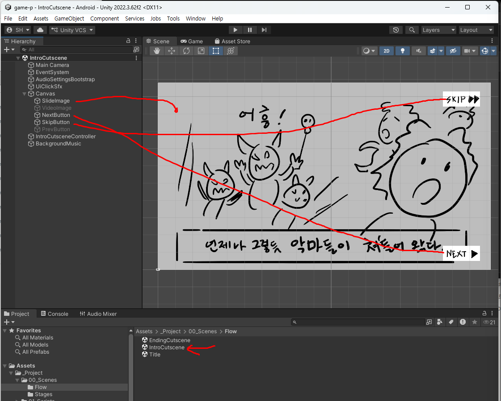
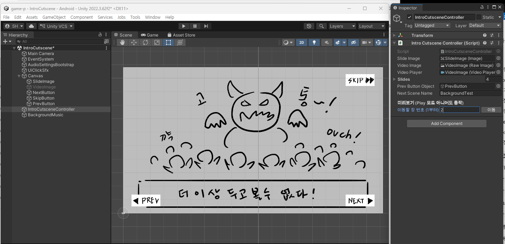

# 8주차 보조자료 - 인트로 컷신 Inspector 항목 설명

> 본 수업 문서: **[W08 인트로 컷신](W08_인트로_컷신.md)** · 같은 형식: [주인공](W02_플레이어_캐릭터_인스팩터.md) · [HUD·메뉴](W06_플레이HUD_메뉴_인스팩터.md) · [타이틀](W07_타이틀화면_인스팩터.md)

**컷신은 이 프로젝트에서 Inspector 항목이 가장 적습니다.** 부품 하나에 항목 여섯 개가 전부입니다.

**대신 "슬라이드 배열"이라는 구조 하나만 이해하면 됩니다.** 그림이든 영상이든 여기 순서대로 들어가고, 그 순서가 곧 이야기의 순서입니다.

---

## 이 문서를 보는 법

| 표시 | 뜻 |
|---|---|
| **★** | **여러분이 직접 다루는 것** |
| **△** | **필요하면 조정** |
| **✕** | **손대지 마세요** |

> ### ⚠️ 컷신 씬에서 특히 조심할 것
>
> **`Tools > Class Template > Create Intro Cutscene Scene`은 씬을 통째로 새로 만듭니다.** 조정한 것이 전부 초기화됩니다.
>
> **그림을 추가/교체했을 때는 `Refresh Intro Cutscene Slides`** 를 쓰세요. 폴더를 다시 훑어서 슬라이드 목록만 갱신하고, 나머지는 건드리지 않습니다.

---

## 0. Hierarchy 구조

```
Main Camera
Canvas
  ├ SlideImage          ← 그림 슬라이드가 표시되는 자리
  ├ VideoImage          ← 영상 슬라이드가 표시되는 자리
  ├ PrevButton          ← 이전
  ├ NextButton          ← 다음
  └ SkipButton          ← 건너뛰기
IntroCutsceneController ← 컷신 "두뇌"
VideoPlayer             ← 영상 재생 부품
BackgroundMusic         ← 컷신 BGM
AudioSettingsBootstrap
```



**`SlideImage`와 `VideoImage`는 둘 다 있고, 슬라이드 종류에 따라 하나만 켜집니다.** 그림 슬라이드면 `SlideImage`가, 영상 슬라이드면 `VideoImage`가 나옵니다. **자동으로 바뀌니 신경 쓰지 않아도 됩니다.**

> 위 그림에서 **`VideoImage`와 `PrevButton`이 회색**입니다. 영상 슬라이드가 아니고, **첫 장이라 "이전" 버튼이 필요 없기 때문**입니다. 둘 다 정상입니다.

---

## 1. `IntroCutsceneController` - 컷신의 전부

| 항목 | 현재값 | 설명 | |
|---|---|---|---|
| `Slide Image` | (오브젝트) | 그림이 표시될 자리 | **✕** |
| `Video Image` | (오브젝트) | 영상이 표시될 자리 | **✕** |
| `Video Player` | (오브젝트) | 영상 재생 부품 | **✕** |
| `Slides` | **4장** | **★ 컷신의 내용 전부** | **★** |
| `Prev Button Object` | (오브젝트) | "이전" 버튼 연결 | **✕** |
| `Next Scene Name` | `BackgroundTest` | **컷신이 끝나면 갈 씬** | **★** |

### ★ 미리보기 - **Play 없이 장을 넘겨볼 수 있습니다**

Inspector 맨 아래에 **`미리보기 (Play 모드 아니어도 동작)`** 이 있습니다.



```
이동할 장 번호 (1부터)  [ 2 ]  [이동]
```

**숫자를 넣고 `이동`을 누르면 그 장이 바로 화면에 뜹니다.** Play를 누를 필요가 없습니다.

- **장 번호는 1부터** 셉니다 (`Slides` 배열의 `Element`는 0부터인 것과 다릅니다)
- **그림이 제대로 들어갔는지 한 장씩 확인**할 때 가장 빠른 방법입니다
- 위 그림처럼 2장으로 이동하면 **`PrevButton`이 켜지는 것**도 확인할 수 있습니다

> **Play로 확인하지 않는 편이 낫습니다.** Play 중에 위치나 크기를 고치면 **Play를 끄는 순간 사라집니다.** 이 미리보기는 편집 상태 그대로라 안전합니다.

---

## 2. ★ `Slides` - 슬라이드 배열

**컷신의 내용이 전부 여기 들어 있습니다.** 펼치면 이렇게 생겼습니다.

```
Slides
  (장수) 4
  Element 0
    Image: cutscene01
    Video: (없음)
  Element 1
    Image: cutscene02
    Video: (없음)
  ...
  Element 3
    Image: (없음)
    Video: cutscene04       ← 영상 슬라이드
```

### 슬라이드 하나에는 칸이 두 개 있습니다

| 칸 | 넣는 것 |
|---|---|
| `Image` | 그림(`.png`) 한 장 |
| `Video` | 영상(`.mp4`) 한 개 |

> ### ⚠️ **둘 중 하나만 채웁니다.** 둘 다 채우면 영상이 이깁니다.
>
> `Video` 칸이 채워져 있으면 그 슬라이드는 **영상 슬라이드**가 됩니다. 그림만 넣고 싶은데 영상이 나온다면 `Video` 칸을 비우세요.

### 순서는 파일명이 정합니다

**`cutscene01`, `cutscene02`, `cutscene03` ...** 처럼 **뒤에 붙은 번호 순서대로** 배열에 들어갑니다.

- **그림과 영상을 자유롭게 섞어도 됩니다.** `cutscene01.png` → `cutscene02.mp4` → `cutscene03.png` 도 잘 동작합니다
- 확장자(`.png` / `.mp4`)를 보고 **어느 칸에 넣을지 자동으로 결정**됩니다
- **번호를 건너뛰지 마세요.** `01, 02, 04`처럼 비면 순서가 헷갈립니다

> **장수를 늘리려면 폴더에 파일을 넣고 `Tools > Class Template > Refresh Intro Cutscene Slides`** 를 실행하세요. 배열 숫자를 손으로 늘려 한 칸씩 채우는 것보다 훨씬 빠르고 실수가 없습니다.
>
> 폴더: `Assets/_Project/04_Art/StudentReplace/Story/IntroCutscene/`

---

## 3. `Next Scene Name` - 컷신이 끝나면 어디로

| 현재값 | 뜻 |
|---|---|
| `BackgroundTest` | 인트로가 끝나면 **스테이지1로** 들어갑니다 |

**마지막 장에서 "다음"을 누르거나, 아무 데서나 "건너뛰기"를 누르면 이 씬으로 넘어갑니다.**

> **씬 이름을 정확히 적어야 합니다.** 오타가 있으면 컷신 마지막에서 아무 일도 안 일어나고 멈춥니다.

> 흐름 전체는 이렇게 연결되어 있습니다:
> **타이틀**(`Start Scene Name`) → **인트로**(`Next Scene Name`) → **스테이지**(`Next Scene Name`) → **엔딩**(`Next Scene Name`) → **타이틀**
>
> 각 씬의 이 칸 하나씩이 게임 전체의 흐름을 만듭니다. 어디선가 끊기면 **그 씬의 `Next Scene Name`부터** 확인하세요.

---

## 4. 버튼 3개

**[6주차 편의 버튼 항목](W06_플레이HUD_메뉴_인스팩터.md)과 같은 부품(`Title Image Button`)입니다.** `Normal` / `Hover` / `Pressed` 세 장 세트. **★**

| 버튼 | 하는 일 |
|---|---|
| `PrevButton` | 앞 슬라이드로 |
| `NextButton` | 다음 슬라이드로 (마지막에서는 다음 씬으로) |
| `SkipButton` | 바로 다음 씬으로 |

> **`PrevButton`은 첫 장에서 자동으로 숨겨집니다.** 돌아갈 곳이 없으니까요. 그래서 컨트롤러에 `Prev Button Object` 칸이 따로 있습니다. **위 0번과 1번의 두 그림을 비교해보면** 1장에서는 `PREV`가 없고 2장에서는 나타나는 것이 보입니다.

> ⚠️ **`SkipButton`을 지우지 마세요.** 컷신을 몇 번씩 다시 보는 사람에게는 필수입니다. **교수님이 채점할 때도 씁니다.**

---

## 5. 영상 슬라이드를 쓸 때

| 확인할 것 | 내용 |
|---|---|
| **길이** | 슬라이드 하나에 **10~20초** 정도. 길면 건너뛰게 됩니다 |
| **용량** | 영상은 무겁습니다. 컷신 전체가 몇십 MB를 넘지 않게 |
| **소리** | 영상에 소리가 들어 있으면 **BGM과 겹칩니다.** 둘 중 하나만 |
| **비율** | 16:9로 만드세요. 다른 비율이면 위아래에 검은 띠가 생깁니다 |

> **영상이 끝나도 자동으로 넘어가지 않습니다.** "다음"을 눌러야 넘어갑니다. 영상 마지막 장면이 잠깐 멈춰 있는 것은 정상입니다.

---

## 6. 자주 나오는 문제

| 증상 | 원인 |
|---|---|
| 그림을 추가했는데 **컷신에 안 나옴** | `Refresh Intro Cutscene Slides` 실행 안 함 |
| **순서가 뒤죽박죽** | 파일명 번호를 확인하세요 (`01`, `02` ... 두 자리로) |
| 그림을 넣었는데 **영상이 나옴** | 그 슬라이드의 `Video` 칸이 안 비워짐 |
| 마지막 장에서 **아무 일도 안 일어남** | `Next Scene Name` 오타, 또는 그 씬이 Build Settings에 없음 |
| **"이전" 버튼이 안 보임** | 첫 장에서는 정상입니다 |
| 그림을 한 장씩 **확인하기 번거로움** | Inspector 맨 아래 **미리보기**로 장 번호를 넣고 `이동` (Play 불필요) |
| 영상 소리와 **BGM이 겹쳐서 시끄러움** | 영상에서 소리를 빼거나, 컷신 BGM을 끄세요 |
| **애써 배치한 것이 초기화됨** | `Create Intro Cutscene Scene`을 다시 실행한 것 |
| 컷신만 **소리가 유난히 큼** | `AudioSettingsBootstrap`이 이 씬에 없음 |

---

## 7. 값이 꼬였을 때 되돌리는 법

1. **`Ctrl+Z`**
2. **`Refresh Intro Cutscene Slides`** - 슬라이드 목록만 다시 읽습니다. **안전합니다**
3. **씬 파일 통째로 되돌리기** - GitHub Desktop → `IntroCutscene.unity` **오른쪽 클릭 → `Discard changes`**
4. **`Create Intro Cutscene Scene`** - **최후의 수단.** 처음부터 다시 만듭니다

> **엔딩 컷신도 구조가 완전히 같습니다.** 여기를 이해했으면 [9주차 편](W09_엔딩_컷신_인스팩터.md)은 금방입니다.
