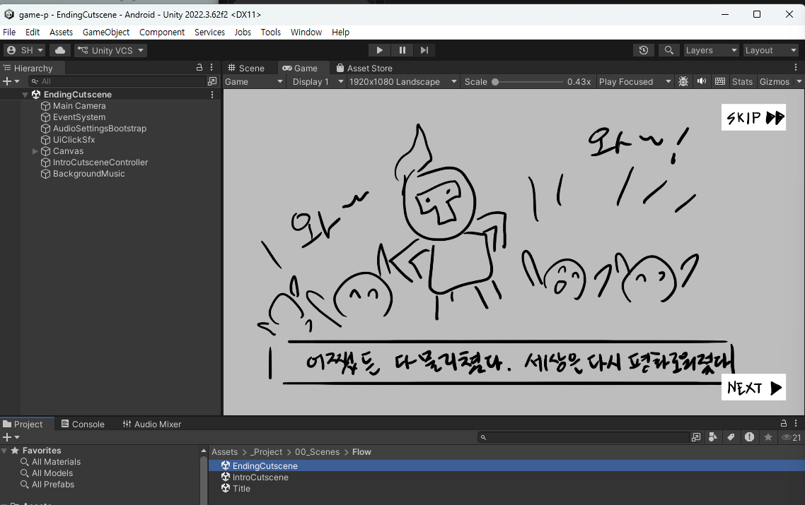

# 9주차 - 엔딩 컷신 (러프 단계)

**이번 주 목표**: 게임의 마지막 장면을 만든다. **이번 주가 끝나면 타이틀부터 엔딩까지 게임 한 바퀴가 완성됩니다.**

---

## 0. 완성되면 이런 화면입니다



**인트로와 조작이 똑같습니다.** `NEXT`로 넘기고, `SKIP`으로 건너뜁니다. 오른쪽 아래에 `NEXT`, 오른쪽 위에 `SKIP` - 8주차에 만든 그대로입니다.


**마지막 장을 크레딧으로 쓴 예시입니다.** 학번·이름·지도교수와 만들면서 느낀 점을 적었습니다. **꼭 이렇게 할 필요는 없지만**, 발표와 제출을 생각하면 **마지막 한 장에 만든 사람 이름을 남기는 것**은 값어치가 있습니다.

> 위 그림의 Inspector에서 이번 주에 확인할 것 두 가지가 보입니다 - **`Slides`가 5장**, 그리고 **`Next Scene Name`이 `Title`**. 이 둘은 [보조자료](W09_엔딩_컷신_인스팩터.md)에서 설명합니다.

> **부품 이름이 `Intro Cutscene Controller`인 것이 맞습니다.** 엔딩 씬인데 "Intro"라고 적혀 있어 헷갈리지만, **인트로와 엔딩이 같은 부품을 쓰기 때문**입니다. 고장이 아닙니다.

---

## 1. 엔딩 컷신의 특징

### 게임 흐름에서의 위치

```
타이틀 → 인트로 컷신 → 스테이지(전투) → 스테이지 클리어 화면 → [ 엔딩 컷신 ] → 타이틀로 복귀
```

- 스테이지를 클리어하면 "LEVEL CLEAR" 배너가 뜨고, 그 다음 **자동으로** 이 화면으로 넘어옵니다
- 엔딩 컷신이 끝나면 **자동으로 타이틀 화면으로 돌아갑니다** (게임이 종료되지 않고 처음으로 순환)

### 인트로와 다른 점

구조와 규격은 인트로와 거의 같습니다. **다른 것은 "역할"입니다.**

| | 인트로 | 엔딩 |
|---|---|---|
| 역할 | 이야기를 **열기** | 이야기를 **닫기** |
| 플레이어 상태 | 아직 게임을 안 해봄 | **방금 한 판을 클리어함** (성취감) |
| 목적 | 궁금하게 만들기 | **보상해주기** |
| 파일 접두사 | `cutscene` | **`ending`** |

> **엔딩은 플레이어에 대한 보상입니다.** 클리어를 해낸 사람이 보는 화면이므로, 인트로보다 **더 공들인 한 컷**을 넣어주는 게 좋습니다. 인트로에서 던진 문제(빼앗긴 것, 위협)가 해결되는 모습을 보여주면 이야기가 닫힙니다.

### 구성

**3~5장 정도**를 권장합니다.

> **구성 예시 (4장)**
> 1. 전투 직후 - 쓰러진 적, 숨을 고르는 주인공
> 2. 문제 해결 - 되찾은 것, 구해낸 사람
> 3. 돌아가는 길 / 평화를 되찾은 풍경
> 4. **엔딩 일러스트** - 게임 전체를 대표하는 한 장 ("THE END", "TO BE CONTINUED" 등)

> **마지막 장을 가장 공들여 그리세요.** 발표 때 게임을 대표하는 이미지로 쓰기에 가장 좋은 그림이 됩니다. 타이틀 화면과 함께 여러분의 포트폴리오 대표 컷이 될 가능성이 높습니다.

---

## 2. 리소스 제작 규격

폴더: `Assets/_Project/04_Art/StudentReplace/Story/EndingCutscene/`

### 장면 이미지

```
ending01.png, ending02.png, ending03.png ...
```

| 항목 | 규격 |
|---|---|
| 파일 형식 | **PNG** |
| 크기 | **1920 x 1080px** |
| 알파 채널 | 필요 없음 (화면을 꽉 채우는 그림) |
| 번호 | **두 자리** (01, 02 ...) |
| 장 수 | 자유 |

> ⚠️ **접두사가 `cutscene`이 아니라 `ending` 입니다.** 인트로 파일을 복사해서 쓸 때 이름 바꾸는 걸 잊으면 **조용히 인식이 안 됩니다.** 에러가 안 뜨니 주의하세요.

### 버튼 3종 - 각 214 x 87px

```
button_next.png    다음
button_prev.png    이전
button_skip.png    건너뛰기
```

**8주차 인트로에서 만든 버튼과 규격이 완전히 같습니다.** 같은 파일을 이 폴더에 복사해 넣으면 됩니다 (폴더가 분리되어 있어서 각 폴더에 각각 있어야 합니다).

### 동영상 대체 (선택)

같은 번호 자리에 확장자만 `.mp4` 로:

```
ending01.png
ending02.png
ending03.mp4   ← 이 장면만 영상
```

| 항목 | 권장 규격 |
|---|---|
| 코덱 | **H.264** |
| 해상도 | **1920 x 1080** |

- 파일명이 정확히 **`ending`** 으로 시작해야 인식됩니다
- 영상 자체에 소리가 없으면 무음으로 재생됩니다

### 러프 단계 작업 지침

- 컬러링 없이, 단 **디자인 컨셉은 담겨 있어야 함**
- **AI 사용을 허용합니다**
- **인트로와 같은 그림체/구도 언어**를 유지하세요. 인트로와 엔딩이 따로 노는 게임이 의외로 많습니다

---

## 3. Unity에 적용하기

### 순서

**1) 그림을 `Story/EndingCutscene` 폴더에 넣습니다.**

**2) 엔딩 컷신 씬을 엽니다.**

```
Assets/_Project/00_Scenes/Flow/EndingCutscene.unity
```

**3) 반영합니다.**

- 파일명/개수를 그대로 두고 덮어쓴 경우: 자동 반영
- **장면 수를 바꾼 경우**:
  ```
  Tools > Class Template > Refresh Ending Cutscene Slides
  ```

**4) Ctrl+S로 저장**

> ⚠️ `Create Ending Cutscene Scene` 은 실행하지 마세요.

### BGM 넣기 (선택, 11주차에 본격적으로 다룸)

`Assets/_Project/06_Audio/BGM/EndingCutscene/` 폴더에 음원 파일 하나를 넣고:

```
Tools > Class Template > Add Background Music To Ending Cutscene Scene
```

---

## 4. 확인하고 수정하기 - ★ 이번 주는 "전체 한 바퀴"를 확인합니다

엔딩까지 만들었으므로, 이번 주부터는 **처음부터 끝까지 통째로** 돌려볼 수 있습니다.

### (1) 엔딩 씬만 확인

`EndingCutscene` 씬에서 Play → 장면이 다 넘어가는지, 마지막에 **타이틀로 돌아가는지**.

### (2) ★ 전체 흐름 통합 확인 (이번 주의 핵심)

`Title` 씬을 열고 Play → **끝까지 플레이**합니다.

```
타이틀 → 시작하기 → 인트로 컷신 → 스테이지 → 몬스터 처치 →
클리어 오브젝트 공격 → LEVEL CLEAR → 엔딩 컷신 → 타이틀 복귀
```

| 확인 항목 | 체크 |
|---|---|
| 타이틀 → 인트로로 넘어가나 | |
| 인트로 → 스테이지로 넘어가나 | |
| 스테이지에서 클리어가 되나 | |
| 클리어 화면 → **엔딩으로 넘어가나** | |
| 엔딩 → **타이틀로 돌아오나** | |
| 죽었을 때 사망 화면이 뜨고, 재도전이 되나 | |
| **중간에 어디서도 끊기지 않나** | |

> **이 한 바퀴가 끊김 없이 돌아가면, 여러분은 이미 "완성된 게임"을 하나 가지고 있는 것입니다.** 다음 주(10주차)에 이것을 실제 실행 파일로 만듭니다.

### 씬과 씬은 어떻게 이어지나 (참고 - 10주차에 자세히)

각 화면의 **컨트롤러**가 "다음에 어느 씬으로 갈지"를 이름으로 지정하고 있습니다. 예를 들어 스테이지의 `StageClearController`에는 `Next Scene Name`이라는 항목이 있고, 기본값이 `EndingCutscene` 입니다.

지금은 건드릴 필요가 없지만, **어딘가에서 안 넘어간다면 이 부분이 원인**입니다. 10주차에 Build Settings와 함께 자세히 다룹니다.

### 잘 안 될 때

| 증상 | 원인 |
|---|---|
| 새로 넣은 장면이 안 보임 | **`Refresh Ending Cutscene Slides` 미실행** |
| 아무 장면도 안 나옴 | 파일명 접두사가 `cutscene`으로 되어 있음 → **`ending`** 으로 |
| 특정 장면만 안 나옴 | 번호가 한 자리(`ending1.png`)이거나 번호를 건너뜀 |
| 엔딩 후 타이틀로 안 돌아감 | `IntroCutsceneController`의 **`Next Scene Name`이 `Title`**인지 확인 ([보조자료 다른 점 ②](W09_엔딩_컷신_인스팩터.md)) |
| 클리어했는데 엔딩이 안 나옴 | `StageClearController`의 `Next Scene Name` 확인 |
| 그림이 잘리거나 늘어남 | 1920x1080이 아님 |

---

## 5. GitHub 백업

1. Unity에서 **Ctrl+S**
2. GitHub Desktop → Summary `9주차 - 엔딩 컷신 러프 / 전체 흐름 완성` → **Commit to main** → **Push origin**

### 이번 주 특히 주의

**다음 주에 빌드를 만듭니다. 이번 주 백업이 그 출발점입니다.**

- Push가 정상적으로 끝났는지 **브라우저에서 내 GitHub 저장소를 열어 확인**하세요
- Console에 빨간 에러가 없는 상태로 백업하세요. **에러가 있으면 빌드 자체가 실패합니다**

---

## 과제 (9주차)

### 무엇을 해오나

**엔딩 컷신을 러프(스케치) 상태로 제작하고 Unity에 적용하기**

- 완성본이 아닌 **스케치 버전의 러프** 상태
- 스케치지만 **디자인 컨셉은 담겨 있어야 함** (컬러링 X)
- **AI 사용을 허용합니다**
- 권장 분량: **3~5장**

### 제출

네이버 카페 업로드 - 제목 `2D게임제작_09주차_123456홍길동`

- [ ] **엔딩 컷신 리소스** (장면 이미지 + 버튼)
- [ ] **유니티 플레이 영상** - `EndingCutscene` 씬에서 작동하는 영상, **10~20초**

### 제출 전 체크리스트

- [ ] 장면 이미지가 전부 1920x1080인가
- [ ] 파일명이 **`ending01.png`** 형식인가 (`cutscene`이 아님)
- [ ] 버튼 3종(214x87)이 이 폴더에도 들어 있는가
- [ ] **`Refresh Ending Cutscene Slides` 를 실행했는가**
- [ ] 엔딩이 끝나면 타이틀로 돌아가는가
- [ ] ★ **`Title` 씬에서 시작해 엔딩까지 한 바퀴가 끊김 없이 돌아가는가**
- [ ] Console에 빨간 에러가 없는가
- [ ] Ctrl+S → Commit → **Push까지 완료**했는가

---

## 다음 주 예고 - 10주차는 빌드입니다

다음 주에는 **지금까지 만든 것으로 실제 실행 파일(빌드)을 만듭니다.**

### 미리 준비할 것 ★

**Unity Hub에서 Android Build Support 모듈이 설치되어 있는지 지금 확인하세요.**

1. Unity Hub → **Installs** 탭
2. `2022.3.62f2` 항목의 **톱니(⚙) → Add modules**
3. 아래 항목들이 **체크되어 있는지** 확인 (안 되어 있으면 지금 설치)
   - **Windows Build Support (IL2CPP)**
   - **Android Build Support**
     - **Android SDK & NDK Tools**
     - **OpenJDK**

용량이 크고 설치가 **30분 이상** 걸릴 수 있습니다. **수업 시간에 시작하면 그날 빌드를 못 만듭니다.** 반드시 미리 설치해오세요.

---

## 관련 문서

- `Assets/_Project/04_Art/StudentReplace/Story/EndingCutscene/readme.txt`
- [W08_인트로_컷신](W08_인트로_컷신.md) - 규격이 거의 같습니다
- [W10_1차_빌드](W10_1차_빌드.md) - 다음 주
- [W09 보조자료 - Inspector 항목 설명](W09_엔딩_컷신_인스팩터.md) - **Inspector 항목이 뭐가 뭔지 모르겠을 때**
