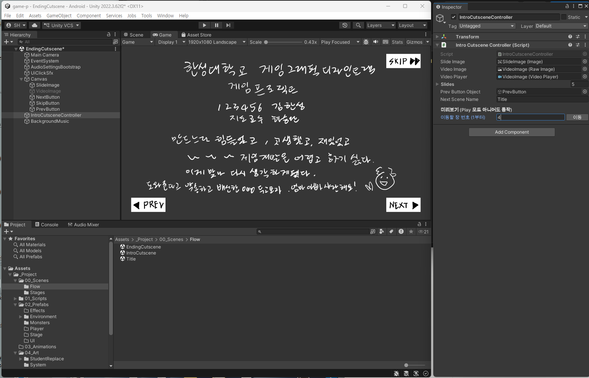

# 9주차 보조자료 - 엔딩 컷신 Inspector 항목 설명

> 본 수업 문서: **[W09 엔딩 컷신](W09_엔딩_컷신.md)** · **[8주차 인트로 편](W08_인트로_컷신_인스팩터.md)을 먼저 읽으세요**

**엔딩 컷신은 인트로 컷신과 부품이 완전히 같습니다.** 같은 `Intro Cutscene Controller`가 붙어 있고, 항목도 똑같습니다.



**엔딩 씬인데 부품 이름이 `Intro Cutscene Controller`입니다.** 헷갈리지만 **정상**입니다 - 두 컷신이 같은 부품을 쓰기 때문입니다.

**그래서 이 문서는 짧습니다.** [8주차 편](W08_인트로_컷신_인스팩터.md)을 읽고 오면, 여기서는 **다른 점 세 가지**만 확인하면 됩니다.

---

## 다른 점 ① 폴더가 다릅니다

| | 인트로 | 엔딩 |
|---|---|---|
| 폴더 | `Story/IntroCutscene/` | **`Story/EndingCutscene/`** |
| 파일명 | `cutscene01.png` ... | **`ending01.png`** ... |
| 갱신 도구 | `Refresh Intro Cutscene Slides` | **`Refresh Ending Cutscene Slides`** |
| 씬 파일 | `Flow/IntroCutscene.unity` | **`Flow/EndingCutscene.unity`** |

> ⚠️ **인트로용 도구를 엔딩 씬에서 돌리지 마세요.** 이름이 비슷해서 자주 헷갈립니다. **`Ending`이 들어간 것**을 고르세요.

---

## 다른 점 ② `Next Scene Name`이 `Title`입니다

| 씬 | `Next Scene Name` | 뜻 |
|---|---|---|
| 인트로 | `BackgroundTest` | 컷신 → 스테이지 |
| **엔딩** | **`Title`** | **컷신 → 타이틀 (한 바퀴 완성)** |

**여기가 게임의 고리를 닫는 지점입니다.** 엔딩이 끝나면 타이틀로 돌아가서, 다시 시작할 수 있게 됩니다.

```
타이틀 → 인트로 → 스테이지 → 클리어 → 엔딩 → 타이틀 (처음으로)
```

> **엔딩에서 `Next Scene Name`을 비우거나 오타를 내면** 게임을 끝까지 깼는데 **마지막 화면에서 멈춥니다.** 9주차 확인 작업에서 반드시 한 바퀴 돌려보세요.

---

## 다른 점 ③ 슬라이드가 5장입니다

| | 인트로 | 엔딩 |
|---|---:|---:|
| 기본 슬라이드 수 | 4 | **5** |

**정해진 개수가 아닙니다.** 여러분이 원하는 만큼 넣으면 됩니다. 폴더에 파일을 넣고 `Refresh Ending Cutscene Slides`를 돌리면 자동으로 맞춰집니다.

> **엔딩은 인트로보다 한두 장 길어도 괜찮습니다.** 끝까지 깬 사람에게 주는 보상이니까요. 다만 **너무 길면 늘어집니다.**

---

## 그 밖에는 전부 같습니다

아래 항목은 [8주차 편](W08_인트로_컷신_인스팩터.md)의 설명이 그대로 적용됩니다.

| 항목 | 8주차 편의 해당 절 |
|---|---|
| `Slides` 배열 (그림 칸 / 영상 칸) | **2. `Slides` - 슬라이드 배열** |
| 파일명 번호가 순서를 정한다 | **2. 순서는 파일명이 정합니다** |
| 그림과 영상을 섞어 쓰기 | 〃 |
| **미리보기** - Play 없이 장 넘겨보기 | **1. 미리보기** |
| `Prev` / `Next` / `Skip` 버튼 | **4. 버튼 3개** |
| 영상 슬라이드 주의사항 (길이·용량·소리·비율) | **5. 영상 슬라이드를 쓸 때** |
| 되돌리는 법 | **7. 값이 꼬였을 때** |

---

## 9주차만의 확인 사항 - 한 바퀴 돌려보기

**9주차는 마지막 조각이 끼워지는 주입니다.** 이번 주에 처음으로 **게임 전체가 끊김 없이 이어집니다.**

`Title` 씬에서 Play를 눌러 **끝까지 한 번** 가보세요. 각 지점에서 멈춘다면 그 씬의 연결 칸을 확인합니다.

| 어디서 멈추나 | 확인할 곳 |
|---|---|
| 타이틀에서 시작이 안 됨 | `TitleMenuController`의 **`Start Scene Name`** |
| 인트로 마지막에서 멈춤 | 인트로의 **`Next Scene Name`** |
| 스테이지를 깼는데 안 넘어감 | `StageClearPanel`의 **`Next Scene Name`** |
| **엔딩 마지막에서 멈춤** | **엔딩의 `Next Scene Name`** ← 이번 주에 만든 것 |

> **씬 이름이 맞는데도 안 넘어간다면**, 그 씬이 **Build Settings에 등록되지 않은 것**입니다. 10주차 빌드 때 다루지만, 지금 확인해두면 편합니다. ([05_제출_가이드](../기본설명/05_제출_가이드.md))

> **연결이 전부 맞으면 이번 주에 "처음부터 끝까지 돌아가는 게임"이 완성됩니다.** 그림이 아직 러프여도 게임으로서는 완성된 상태입니다.
