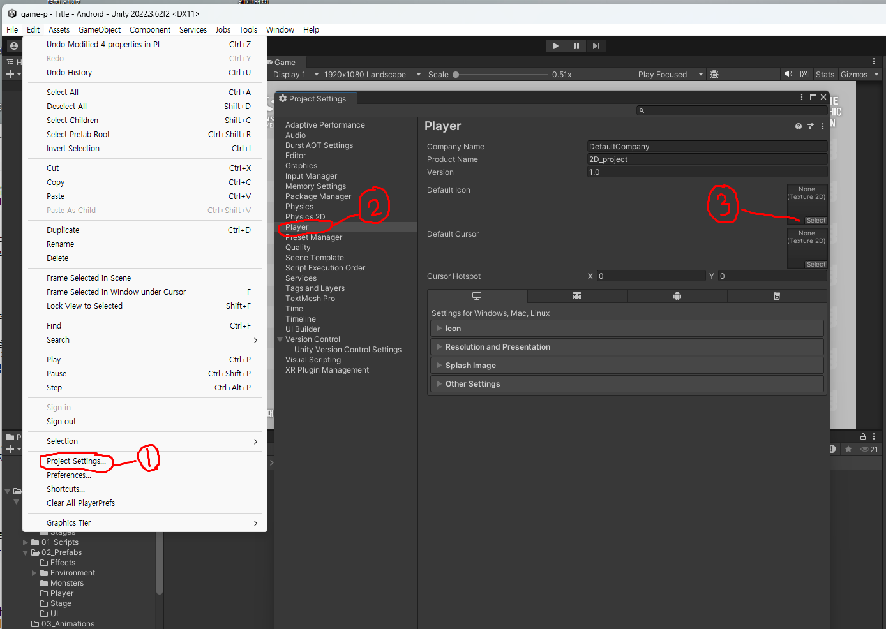
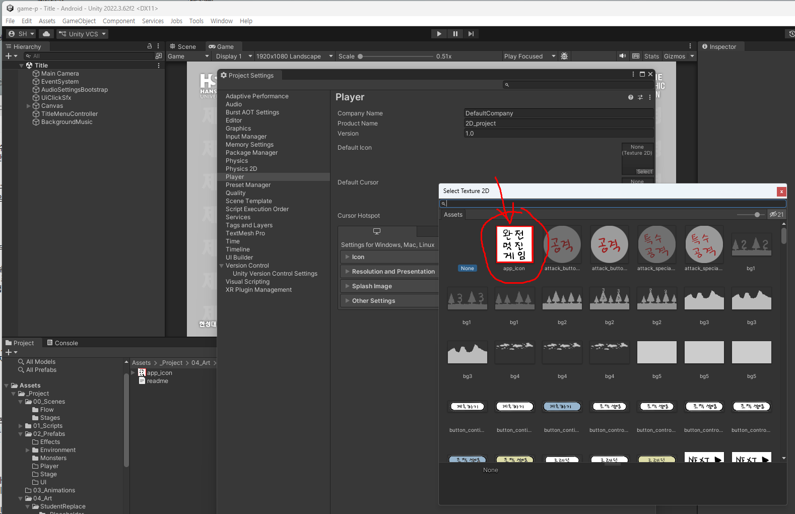
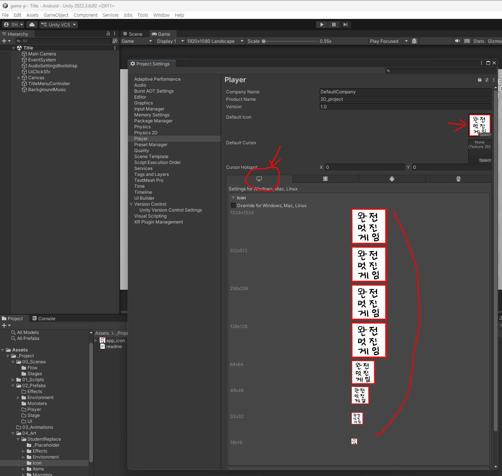
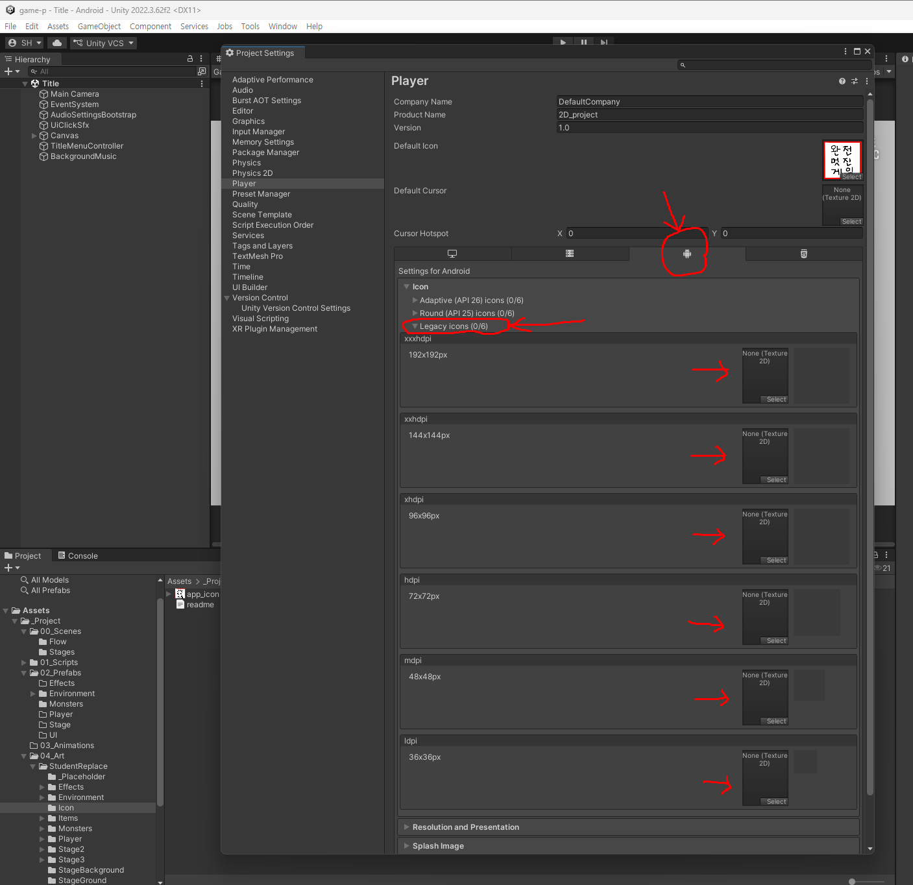
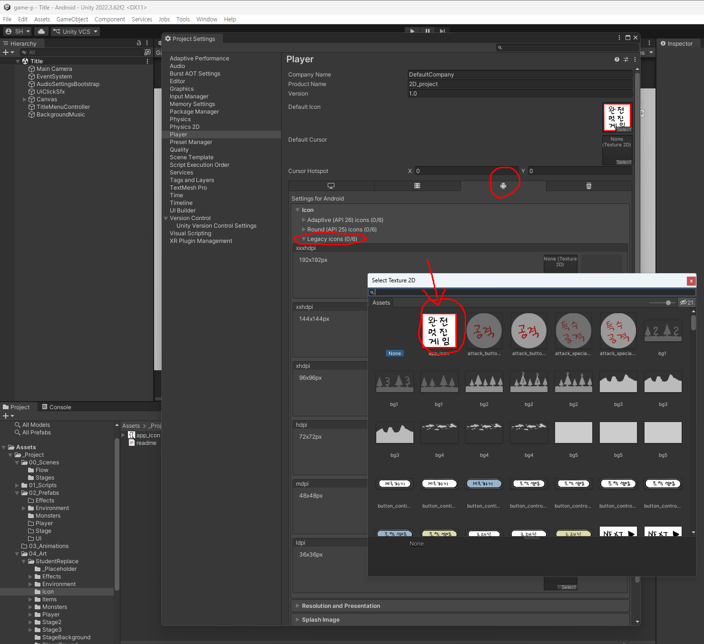
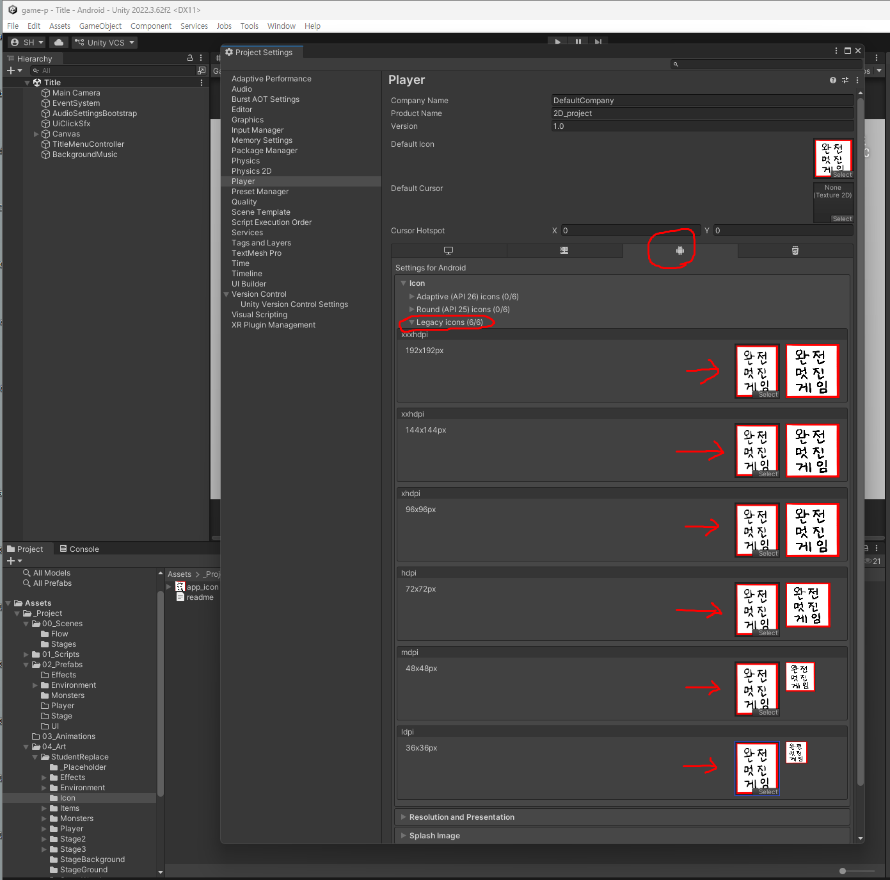

# 10주차 - 앱 아이콘 적용

**게임을 빌드하면 아이콘이 붙습니다.** 아무것도 안 하면 **유니티 기본 아이콘이 그대로 나갑니다** - PC의 `.exe`도, 휴대폰 홈 화면도 마찬가지입니다.

**이 문서는 수업 시간에 같이 따라 하는 내용입니다.** 그림은 준비해 두었으니 **넣는 방법을 손으로 한 번 해보는 것**이 목적입니다. 본인 아이콘은 나중에 만들어 바꾸면 됩니다.

> **빌드하는 방법은 [W10 1차 빌드 (PC·모바일)](<W10_1차_빌드(PC,모바일).md>) 에 있습니다.** 아이콘은 **빌드하기 전에** 넣어야 결과물에 반영됩니다.

---

## 1. 연습용 아이콘 받기

**수업용 아이콘입니다. 이 그림을 받아서 쓰세요.**


**위 그림을 오른쪽 클릭 → `이미지를 다른 이름으로 저장`** 하면 됩니다.

- **파일 이름은 `app_icon.png` 그대로** 두세요. 이름이 다르면 뒤 단계에서 못 찾습니다
- **작게 보이지만 저장되는 것은 1024×1024 원본**입니다. 문서에서 보기 편하라고 줄여 놓은 것뿐입니다

> **이 그림은 연습용입니다.** 손글씨로 「완전 멋진 게임」이라고 적혀 있는데, **아이콘이 바뀌었는지 한눈에 보이라고 일부러 눈에 띄게 만든 것**입니다. 본인 것으로 바꾸는 방법은 이 문서 맨 아래에 있습니다.

---

## 2. 아이콘 넣기

**먼저 이 폴더가 있는지 확인하세요.**

```
Assets/_Project/04_Art/StudentReplace/Icon/
```

### A. 안에 `app_icon.png` 가 이미 있는 경우 - 덮어쓰기로 끝납니다

탐색기에서 그 폴더를 열고 **같은 이름으로 저장**해 기존 파일을 덮어쓰세요. **Unity에서 따로 할 일이 없습니다.**

> ⚠️ **Unity 안에서 지우고 새로 넣지 마세요.** 파일과 함께 `.meta`가 사라지면서 연결이 끊어집니다. 그러면 아래 B를 처음부터 해야 합니다.

### B. 폴더가 없는 경우 - Player Settings에서 지정합니다

**1) 폴더를 만들고 그림을 넣습니다**

`Project` 창에서 `Assets/_Project/04_Art/StudentReplace` 우클릭 → `Create > Folder` → 이름을 **`Icon`** 으로. 그 안에 **`app_icon.png`** 를 넣습니다.

**2) `Edit > Project Settings > Player` 를 엽니다**



`File > Build Settings` 왼쪽 아래의 **`Player Settings...`** 버튼으로 열어도 같습니다.

**3) 맨 위 `Default Icon` 에 그림을 지정합니다** ← PC 담당

> ★ **드래그로는 안 들어갑니다.** 슬롯의 **`Select`** 를 눌러 목록에서 `app_icon` 을 고르세요. **2D 프로젝트라 그림이 `Sprite`로 읽히는데 이 슬롯은 `Texture 2D`를 받기 때문입니다. 고장이 아닙니다.**



들어가면 이렇게 됩니다. 슬롯 자체는 `None`이지만 오른쪽 크기별 미리보기가 전부 채워집니다 - **Unity가 1024 한 장에서 나머지 크기를 만들어 쓴다는 뜻**입니다. `Override for Windows, Mac, Linux` 는 **체크하지 마세요.**



**4) 플랫폼 탭에서 `Android`(로봇 모양)를 고릅니다** ← 여기부터 모바일 담당

**5) `Icon` 을 펼치고, 그 안의 `Legacy icons` 를 펼칩니다**



**6) 6칸을 전부 같은 그림으로 채웁니다**

각 칸의 `Select` 를 눌러 `app_icon` 을 고릅니다. **6칸 모두 같은 그림이면 됩니다** - Unity가 각 크기(192·144·96·72·48·36)로 알아서 줄입니다. 다 채우면 제목이 **`Legacy icons (6/6)`** 으로 바뀝니다.



> **PC는 `Default Icon` 한 번으로 모든 크기가 자동으로 채워졌지만, 안드로이드는 여섯 칸을 하나씩 골라줘야 합니다.** 같은 그림을 여섯 번 고르는 것이라 단순 반복이니, 빠뜨린 칸이 없는지만 확인하세요.

> **`Adaptive` 와 `Round` 는 건드리지 마세요.** 배경·전경 **두 장짜리** 구조라 한 장으로는 안 맞습니다. **비워두면 안드로이드가 `Legacy` 를 대신 씁니다.**



**7) `File > Save Project`**

**`Ctrl+S`는 씬 저장이라 다릅니다.** 이걸 눌러야 설정이 파일에 기록됩니다.

## 3. 확인하는 법

빌드가 끝난 뒤 **`.exe` 파일의 아이콘**을 보면 됩니다. 모바일은 apk를 설치하고 홈 화면에서 확인합니다.

---

## 4. 본인 아이콘으로 바꾸기

연습이 끝나면 **본인이 만든 아이콘으로 바꾸세요.**

| | |
|---|---|
| 크기 | **1024 × 1024** 정사각형 |
| 형식 | PNG |
| 배경 | **꽉 채울 것** - 다른 리소스와 반대입니다. 투명 배경은 기기마다 다르게 보입니다 |
| 파일명 | **`app_icon.png`** 그대로 |

**큰 것 하나만 있으면 Unity가 작은 크기들을 자동으로 만듭니다.** 반대로 작은 그림을 키우는 것은 안 되니 처음부터 1024로 만드세요.

**바꾸는 방법은 위 A와 같습니다** - 탐색기에서 같은 이름으로 덮어쓰기. **한 번 지정해 두었으면 `Player Settings`를 다시 만질 일이 없습니다.**

자세한 규격은 [03. 학생 리소스 제작 규격](../기본설명/03_학생_리소스_제작규격.md) 의 「앱 아이콘」 참고.

## 관련 문서

- [W10 1차 빌드 (PC·모바일)](<W10_1차_빌드(PC,모바일).md>) - 빌드 절차. **아이콘을 넣은 뒤에** 진행합니다
- [03. 학생 리소스 제작 규격](../기본설명/03_학생_리소스_제작규격.md) - 아이콘을 포함한 모든 리소스 규격
