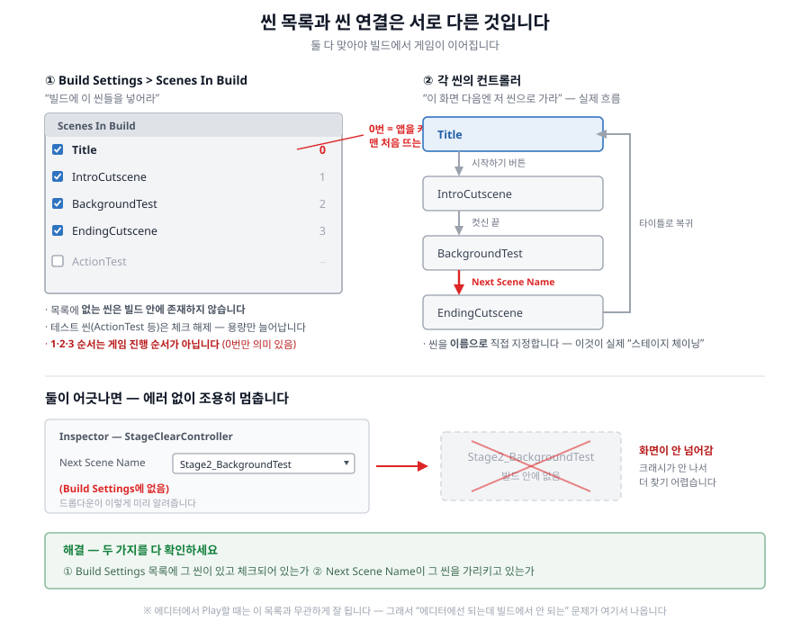

# 10주차 - 1차 빌드 (PC + 모바일)

**이번 주 목표**: 지금까지 만든 것을 **실제로 실행되는 게임 파일**로 만든다. Unity 없이도 실행되는, 남에게 보내줄 수 있는 진짜 결과물.

---

## 1. 빌드란 무엇인가

### 에디터에서 Play하는 것 ≠ 게임

지금까지는 Unity 에디터 안에서 **Play(▶)** 버튼으로 확인했습니다. 하지만 그건 **개발 중인 상태를 미리 보는 것**이지 게임이 아닙니다.

**빌드(Build)** = 프로젝트를 **혼자 실행되는 프로그램 파일**로 변환하는 작업입니다.

| | 에디터 Play | 빌드 |
|---|---|---|
| 실행에 필요한 것 | Unity 설치 + 프로젝트 폴더 전체 | **파일만 있으면 됨** |
| 용량 | 수 GB | 수십~수백 MB |
| 다른 사람에게 | 못 줌 | **줄 수 있음** |
| 결과물 | 없음 | `.exe`(PC) / `.apk`(Android) |

### 에디터와 빌드가 다른 점 두 가지

**1) `09_Editor` 폴더의 도구들은 빌드에 아예 안 들어갑니다.**

`Tools > Class Template` 메뉴는 **개발·편집용 도구**입니다. 빌드된 게임을 실행한 사람은 이 메뉴를 볼 수도 없고 볼 필요도 없습니다. 그래서 빌드 용량에도 포함되지 않습니다.

**2) ★ Build Settings의 씬 목록에 없는 씬은 빌드에서 존재하지 않습니다.**

이게 이번 주에 가장 중요한 개념입니다.

---

## 2. ★ Build Settings 씬 목록 - 반드시 이해해야 하는 것

**상단 메뉴 `File > Build Settings`** 를 열면 위쪽에 **`Scenes In Build`** 라는 목록이 있습니다.


```
Scenes In Build
 ☑ _Project/00_Scenes/Flow/Title                 0
 ☑ _Project/00_Scenes/Flow/IntroCutscene         1
 ☑ _Project/00_Scenes/Stages/BackgroundTest      2
 ☑ _Project/00_Scenes/Flow/EndingCutscene        3
 ☐ _Project/00_Scenes/Stages/Stage2_BackgroundTest
 ☐ _Project/00_Scenes/Stages/Stage3_BackgroundTest
```

> **체크가 꺼진 줄(`Stage2` / `Stage3`)도 보입니다.** 목록에 있어도 **체크를 꺼두면 빌드에 안 들어갑니다.** 15주차에 스테이지를 늘리면 그때 켜면 됩니다.

### 이 목록이 하는 일

**"실제 빌드에 어떤 씬을 포함시킬지" 정하는 목록입니다.**

- **목록에 없는 씬은 빌드된 게임 안에 아예 존재하지 않습니다.** 그 씬으로 넘어가려고 하면 **콘솔에 에러만 찍히고 조용히 멈춥니다.** 크래시가 나지 않아서 더 찾기 어렵습니다
- 에디터에서 Play로 테스트할 땐 **이 목록과 무관하게 잘 됩니다.** 그래서 "에디터에서는 되는데 빌드에서 안 되는" 문제의 90%가 여기서 나옵니다

### ★ 오해하기 쉬운 것 두 가지

**오해 1: "목록의 순서(0, 1, 2, 3)가 게임 진행 순서다"**

**아닙니다.** 순서가 갖는 의미는 딱 하나입니다:

> **0번 = 앱을 실행했을 때 맨 처음 뜨는 씬**

그 외의 순서(1번, 2번, 3번...)는 아무 의미가 없습니다. 목록에서 `EndingCutscene`이 `BackgroundTest`보다 위에 있어도 게임 진행에는 아무 영향이 없습니다.

**오해 2: "목록에 올려두면 씬들이 알아서 이어진다"**

**아닙니다.** 목록은 "이 씬들을 빌드에 넣어달라"는 것뿐입니다.

### 그럼 씬은 무엇으로 이어지나 - `Next Scene Name`

**각 화면에 배치된 컨트롤러가 "다음에 갈 씬 이름"을 직접 지정합니다.** 이게 실제 게임 흐름의 정체입니다.

| 화면 | 컨트롤러 | 다음 씬을 정하는 항목 |
|---|---|---|
| 스테이지 | `StageClearController` | **`Next Scene Name`** (기본값 `EndingCutscene`) |
| 인트로 컷신 | 인트로 컨트롤러 | 다음 씬 이름 |
| 엔딩 컷신 | 엔딩 컨트롤러 | 다음 씬 이름 (타이틀) |

`Next Scene Name`은 **드롭다운(목록에서 고르는 방식)** 으로 되어 있습니다. 이 목록은 **Build Settings에 등록된 씬들**로 만들어집니다. 그래서:

> **두 개념이 어긋나면 드롭다운이 미리 알려줍니다.** 지정된 이름이 Build Settings에 없으면 **"(Build Settings에 없음)"** 이라고 표시됩니다. 이게 보이면 그 씬을 목록에 추가하세요.

### 정리



```
Build Settings 목록  =  "빌드에 이 씬들을 넣어라"  (0번 = 시작 씬)
Next Scene Name      =  "이 화면 다음엔 저 씬으로 가라"  (실제 흐름)

둘 다 맞아야 게임이 이어집니다.
```

### 확인할 것

기본 과제(스테이지 1개)에서는 다음 **4개**가 체크되어 있으면 됩니다:

- [ ] `Title` ← **0번(맨 위)** 이어야 함
- [ ] `IntroCutscene`
- [ ] `BackgroundTest` (= 스테이지1)
- [ ] `EndingCutscene`

> `MonsterA/B/C_ActionTest`, `ActionTest`, `Stage2/3_BackgroundTest` 같은 테스트/심화 씬은 **체크를 꺼두세요.** 빌드 용량만 늘어나고 필요 없습니다. (심화로 스테이지2를 직접 만들었다면 그때 체크합니다.)

---

## 3. PC(Windows) 빌드 만들기

### 순서

**1) 빌드 전 점검**

- [ ] 모든 씬을 **Ctrl+S**로 저장했는가
- [ ] Console에 **빨간 에러(Error)가 없는가** ← 에러가 있으면 빌드가 실패합니다
- [ ] `Title` 씬에서 Play → 엔딩까지 한 바퀴가 정상인가

**2) `File > Build Settings` 열기**

**3) Scenes In Build 확인** (위의 4개)

**4) Platform 목록에서 `Windows, Mac, Linux` 선택 → `Switch Platform`**

이미 선택되어 있으면(옆에 Unity 아이콘 표시) 생략합니다.

**5) 오른쪽 아래 `Build` 클릭**

> ⚠️ **`Build And Run`이 아니라 `Build`를 누르세요.** `Build And Run`은 빌드 후 곧바로 실행까지 시도하는데, 저장 위치를 물어보는 단계에서 헷갈리기 쉽습니다.

**6) 저장 위치 지정**

```
Assets/_Project/10_Builds/Windows/
```

이 폴더(또는 그 안에 원하는 이름의 하위 폴더)를 지정합니다.

**7) 빌드 완료를 기다립니다** (첫 빌드는 **10~30분** 걸릴 수 있습니다)

**8) 만들어진 `.exe` 파일을 더블클릭해서 실행**

에디터가 아니라 **빌드 파일 자체로** 타이틀부터 끝까지 확인합니다.

### PC 빌드 확인 체크리스트

- [ ] `.exe`가 실제로 실행되는가
- [ ] 1920x1080 전체화면으로 뜨는가
- [ ] 타이틀 → 인트로 → 스테이지 → 클리어 → 엔딩까지 **끊기지 않는가**
- [ ] 죽었을 때 사망 화면 → 재도전이 되는가
- [ ] 그림이 깨지거나(투명이 흰색으로 나오는 등) 잘려 보이지 않는가
- [ ] 일시정지 메뉴가 열리고 버튼이 다 동작하는가
- [ ] 종료 버튼으로 정상 종료되는가

### 빌드 결과물을 압축할 때 ★

`.exe` 파일 **하나만** 보내면 실행되지 않습니다. 같이 만들어진 **폴더 전체**가 필요합니다.

```
Windows/
 ├─ 2D_project.exe          ← 실행 파일
 ├─ 2D_project_Data/        ← ★ 이게 없으면 실행 안 됨
 ├─ UnityPlayer.dll         ← ★
 └─ MonoBleedingEdge/       ← ★
```

**폴더 전체를 통째로 압축**해서 제출하세요.

---

## 4. Android(모바일) 빌드 만들기

### 먼저 - 모듈이 설치되어 있어야 합니다

Unity Hub → **Installs** → `2022.3.62f2`의 **톱니(⚙) → Add modules** 에서:

- [ ] **Android Build Support**
- [ ] **Android SDK & NDK Tools**
- [ ] **OpenJDK**

설치에 **30분 이상** 걸릴 수 있습니다. 9주차 예고대로 미리 설치해두셨어야 합니다.

### 순서

**1) `File > Build Settings` → Platform에서 `Android` 선택 → `Switch Platform`**

> ⏰ **플랫폼 전환은 시간이 오래 걸립니다(10~40분).** 모든 텍스처를 Android용으로 다시 압축하기 때문입니다. 중간에 끄지 마세요.

**2) `Player Settings` 확인** (Build Settings 창 왼쪽 아래 버튼)

이 프로젝트는 이미 설정되어 있습니다. **확인만** 하세요:

| 항목 | 값 |
|---|---|
| Package Name | `com.gamep.actionclass` |
| Minimum API Level | **22** (Android 5.1) |
| Scripting Backend | **IL2CPP** |
| Target Architectures | **ARM64** |

> Package Name은 **기기에서 앱을 구분하는 고유 이름**입니다. 친구와 같은 이름이면 서로 덮어쓰게 되니, 원한다면 `com.gamep.본인학번` 처럼 바꿔도 됩니다.

**3) `Build` 클릭 → 저장 위치와 파일명 지정**

```
Assets/_Project/10_Builds/Android/  →  파일명: M_1차빌드_123456김한성.apk
```

**4) 빌드 완료를 기다립니다** (Android 첫 빌드는 **20~60분**, IL2CPP 변환 때문에 PC보다 훨씬 깁니다)

**5) 만들어진 `.apk`를 안드로이드 기기로 옮겨서 설치**

- USB 케이블, 카카오톡 "나에게 보내기", 구글 드라이브 등 편한 방법으로
- 설치할 때 **"출처를 알 수 없는 앱 허용"** 을 켜야 합니다 (설정 → 보안, 또는 설치 시 뜨는 안내를 따라가면 됩니다)

### 모바일에서 확인할 것

- [ ] 앱이 실행되는가
- [ ] **터치 컨트롤(조이스틱/버튼)이 화면에 나오는가** - PC 빌드엔 안 보이고 모바일에서만 나옵니다
- [ ] 터치로 이동/점프/공격이 되는가
- [ ] UI가 화면 밖으로 잘리지 않는가 (기기마다 화면 비율이 다릅니다)
- [ ] 타이틀부터 엔딩까지 진행되는가

> **모바일 UI가 아직 임시 그림이어도 정상입니다.** 다음 주(11주차)에 직접 만듭니다. 이번 주는 "모바일에서도 실행된다"는 것을 확인하는 게 목적입니다.

### Android 빌드에서 자주 나오는 에러

| 에러 메시지 | 원인 / 해결 |
|---|---|
| `Android SDK Build-tools component is not found` | SDK가 제대로 설치되지 않았습니다. Unity Hub에서 Android SDK & NDK Tools를 재설치하세요. (설치는 됐는데 이 에러가 난다면, SDK 폴더 안 `build-tools/` 밑의 폴더 이름이 **버전 숫자**(`34.0.0` 같은)여야 합니다 - 다른 이름이면 인식하지 못합니다) |
| `Android NDK not found or invalid` | NDK 폴더 구조 문제입니다. `NDK/` 폴더를 열었을 때 **바로 안에** `source.properties`, `toolchains` 등이 보여야 합니다. 안쪽에 폴더가 한 겹 더 있으면(`NDK/android-ndk-r23b/...`) 인식하지 못합니다 |
| `Gradle build failed` | Console 전체 로그를 캡처해서 질문하세요. 원인이 여러 가지입니다 |
| `Unable to install` (기기에서) | "출처를 알 수 없는 앱 허용" 확인. 또는 같은 Package Name의 앱이 이미 깔려 있으면 먼저 삭제 |
| 빌드는 됐는데 앱이 켜지자마자 꺼짐 | Target Architectures가 ARM64인지, Minimum API Level이 기기 버전보다 낮은지 확인 |

> 이 문제들은 **프로젝트가 아니라 컴퓨터의 Unity 설치 상태** 문제인 경우가 대부분입니다. 학교 컴퓨터에서 안 되면 집 컴퓨터에서, 또는 그 반대로 시도해보세요.

### iOS(아이폰) 빌드를 하지 않는 이유

궁금해할 학생들을 위한 설명입니다. **수업 범위에서 제외한 이유:**

1. **Mac이 필수입니다.** iOS 빌드는 Xcode(Mac 전용 프로그램)를 거쳐야만 만들 수 있습니다. Windows에서는 어떤 방법으로도 불가능합니다
2. **Apple Developer Program 등록이 필요합니다** - 연 $99(약 14만원)
3. **실기기 설치에 서명(signing)이 필요합니다.** 무료 계정으로는 7일마다 다시 설치해야 합니다
4. **심사 절차**가 있어서 배포까지의 과정이 훨씬 깁니다

Android는 **APK 파일만 있으면 바로 설치**가 되기 때문에, 수업에서 "내 폰에서 내 게임을 돌려본다"는 경험을 하기에 훨씬 적합합니다.

> 나중에 실제로 iOS로 내고 싶다면, **지금 만든 프로젝트 그대로** Mac에서 플랫폼만 바꿔 빌드하면 됩니다. 리소스를 다시 만들 필요는 없습니다.

---

## 5. GitHub 백업

1. Unity에서 **Ctrl+S**
2. GitHub Desktop → Summary `10주차 - 1차 빌드` → **Commit to main** → **Push origin**

### 이번 주 특히 주의 ★

- **빌드 결과물(`.exe`, `.apk`, `10_Builds` 폴더)은 GitHub에 올리지 마세요.** 용량이 매우 크고, 소스로부터 언제든 다시 만들 수 있는 파일입니다. 변경 목록에 뜨면 체크를 해제하세요
- 빌드 파일은 **구글 드라이브**로 제출합니다 (아래 참고)
- **플랫폼을 Android로 바꾼 상태로 두면** 다음에 PC 빌드할 때 다시 전환하느라 오래 걸립니다. 작업이 끝나면 **Windows로 되돌려 두는 것**을 권장합니다

---

## 과제 (10주차)

### 무엇을 해오나

**현재까지 작업된 결과물로 PC 빌드와 모바일 빌드를 각각 만들고, 실제로 실행 확인하기**

### 제출

네이버 카페 업로드 - 제목 `2D게임제작_10주차_123456김한성`

- [ ] **플레이 영상 30초 내외**
  - **빌드된 실행 파일을** 화면 녹화한 영상 (에디터 화면이 아니라)
- [ ] **각자의 구글 드라이브 링크로 빌드 파일 제출**
  - ⚠️ **다운로드 공유 권한을 반드시 확인할 것** (링크가 있는 모든 사용자 → 뷰어)
  - PC 버전 압축 파일명: **`PC_1차빌드_123456김한성`**
  - 모바일 버전 압축 파일명: **`M_1차빌드_123456김한성`**

> **구글 드라이브 공유 설정 방법**: 파일 우클릭 → 공유 → "일반 액세스"를 **"링크가 있는 모든 사용자"** 로 변경 → 링크 복사.
> **제출 전에 시크릿 모드(로그아웃 상태)로 링크를 열어서 다운로드가 되는지 직접 확인하세요.** 매년 권한 문제로 확인이 안 되는 경우가 나옵니다.

### 제출 전 체크리스트

- [ ] Build Settings에 4개 씬(`Title`, `IntroCutscene`, `BackgroundTest`, `EndingCutscene`)이 체크되어 있고 **`Title`이 0번**인가
- [ ] PC `.exe`가 **에디터 없이** 실행되는가
- [ ] PC 압축 파일에 `.exe` **+ `_Data` 폴더 + `.dll` 등 전체**가 들어 있는가
- [ ] `.apk`가 실제 안드로이드 기기에 설치되고 실행되는가
- [ ] 빌드 파일에서 타이틀 → 엔딩까지 한 바퀴가 끊기지 않는가
- [ ] 구글 드라이브 링크의 **다운로드 권한**을 로그아웃 상태로 확인했는가
- [ ] 압축 파일명이 규칙(`PC_1차빌드_...`, `M_1차빌드_...`)과 정확히 일치하는가

---

## 관련 문서

- [05_제출_가이드](../기본설명/05_제출_가이드.md) - 빌드 만들기 상세
- [04_Unity_적용_가이드](../기본설명/04_Unity_적용_가이드.md) - "에디터에서 되는 것 ≠ 실제 빌드에서 되는 것"
- [W11_모바일UI_사운드](W11_모바일UI_사운드.md) - 다음 주
