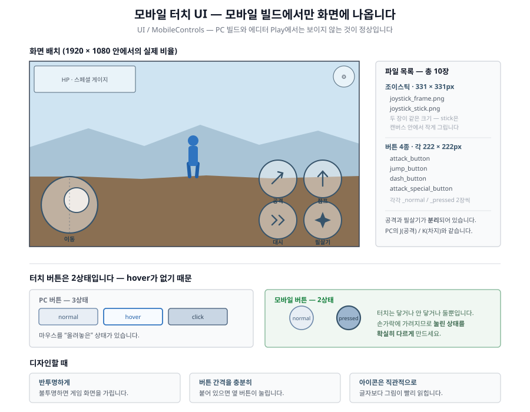

# 11주차 - 모바일 UI + 사운드

**이번 주 목표**: 모바일에서 조작할 터치 UI를 만들고, **소리를 넣는다**. 소리가 들어가는 순간 게임의 완성도가 체감상 가장 크게 올라갑니다.

이번 주는 **두 가지 작업**을 함께 합니다.

---

# 파트 A. 모바일 UI

## A-1. 모바일 UI의 특징

10주차에 만든 `.apk`를 폰에 설치했을 때, 화면 아래쪽에 나왔던 조이스틱과 버튼들입니다. 지금은 임시 그림이니 이번 주에 직접 만듭니다.

### 화면 배치



### PC UI와 결정적으로 다른 점

| | PC | 모바일 |
|---|---|---|
| 버튼 상태 | **3가지** (normal / hover / click) | **2가지** (normal / pressed) |
| 왜? | 마우스를 "올려놓는" 상태가 있음 | **터치는 hover가 없음** - 닿거나 안 닿거나 |
| 크기 | 작아도 됨 | **손가락 크기 이상이어야 함** |
| 보이는 곳 | PC 빌드 | **모바일 빌드에서만** (PC에서는 안 보임) |

### 디자인 지침

- **반투명하게 만드세요.** 버튼이 불투명하면 게임 화면을 가립니다. 알파 50~70% 정도가 적당합니다
- **아이콘이 직관적이어야 합니다.** 점프=화살표 위, 공격=검/주먹, 대시=이중 화살표, 필살기=특별한 표시
- **normal / pressed 차이를 확실히.** 터치는 손가락에 가려서 잘 안 보이므로, 눌린 상태가 명확해야 플레이어가 인지합니다
- 게임 전체 UI 톤과 통일

## A-2. 리소스 제작 규격

폴더: `Assets/_Project/04_Art/StudentReplace/UI/MobileControls/`

### 조이스틱 - 각 331 x 331px

| 파일 | 설명 |
|---|---|
| `joystick_frame.png` | 바깥 테두리 (고정) |
| `joystick_stick.png` | 손가락으로 미는 안쪽 손잡이 (움직임) |

두 파일이 **같은 크기(331x331)** 입니다. `stick`은 그 캔버스 안에서 **가운데에 작게** 그리세요 (테두리 안에서 움직일 여유가 있어야 합니다).

### 버튼 4종 - 각 222 x 222px, 상태 2장씩

```
jump_button_normal.png            / jump_button_pressed.png             점프
attack_button_normal.png          / attack_button_pressed.png           공격
dash_button_normal.png            / dash_button_pressed.png             대시
attack_special_button_normal.png  / attack_special_button_pressed.png   필살기
```

**총 8장.**

> **공격 버튼과 필살기 버튼이 분리되어 있습니다.** PC에서는 `J`(공격)와 `K`(필살기 차지)가 따로였듯이, 모바일도 **탭하면 공격 / 길게 누르면 차지**가 서로 다른 버튼으로 나뉘어 있습니다.

### 공통 규칙

- PNG, **알파 채널 투명**
- 크기는 위 규격 유지 (달라졌으면 `Image` 컴포넌트의 **`Set Native Size`**)

## A-3. Unity에 적용하기

**1) 그림을 `UI/MobileControls` 폴더에 넣습니다.**

**2) `ActionTest` 씬을 엽니다.**

> ### ⚠️ 모바일 UI도 **`ActionTest` 씬에서 고칩니다**
>
> **6주차 HUD와 완전히 같은 규칙입니다.** 모바일 조작 버튼은 `MobileControlsCanvas` 하나에 전부 들어 있고, **`ActionTest`에 있는 것이 원본**입니다.
>
> **`BackgroundTest`에서 위치를 고치면, 아래 5)를 한 번이라도 실행하는 순간 `ActionTest`의 위치로 덮어써집니다.** 애써 맞춘 것이 사라집니다.

**3) 반영:**

```
Tools > Class Template > Add Mobile Controls To Scene
```

**이미 들어 있는 씬이면 위치는 건드리지 않고 연결만 다시 잡습니다.** 여러 번 실행해도 안전합니다.

**4) 위치 조정** - `Hierarchy`의 `MobileControlsCanvas` 밑에서 각 버튼을 선택해 옮깁니다. **여기까지가 `ActionTest`에서 하는 일입니다.**

**5) 다른 씬에 반영:**

```
Tools > Class Template > Sync Player & HUD From ActionTest
```

`ActionTest`에서 맞춘 위치가 **`BackgroundTest`와 스테이지2·3에 한꺼번에** 복사됩니다. 씬을 하나씩 열어 똑같이 맞출 필요가 없습니다.

**6) Ctrl+S로 저장**

> **`BackgroundTest`에 모바일 UI가 아예 없다면** 그 씬을 열고 6주차의 `Add All HUD & Systems To Background Test Scene`을 한 번 실행해 만들어 두세요(이 명령 안에 모바일 컨트롤도 들어 있습니다). **만든 다음, 위치는 다시 `ActionTest`에서 맞춥니다.**

## A-4. 확인하기

**PC 에디터에서 Play하면 모바일 UI는 안 보이는 것이 정상입니다.** 확인하려면:

- Scene 뷰에서 위치와 크기를 눈으로 확인 (제출용 스크린샷은 여기서)
- 또는 다시 Android로 빌드해서 실제 기기에서 확인 (권장)

| 확인 항목 | |
|---|---|
| 버튼이 화면 밖으로 나가지 않았나 | 기기 화면 비율이 다양합니다 |
| 버튼끼리 너무 붙어 있지 않나 | 손가락으로 누르면 옆 버튼이 눌립니다 |
| 게임 화면을 너무 가리지 않나 | 반투명 확인 |
| 조이스틱 손잡이가 테두리 안에서 움직이나 | |

---

# 파트 B. 사운드 (BGM + 효과음)

## B-1. 사운드 구조 - 두 종류

| | BGM (배경음악) | SFX (효과음) |
|---|---|---|
| 폴더 | `06_Audio/BGM/` | `06_Audio/SFX/` |
| 나뉜 기준 | **화면(씬)별** | **캐릭터별** |
| 길이 | 길게, 반복 재생 | 짧게, 1회 재생 |
| 파일명 규칙 | **대부분 자유** (폴더에 하나만) | **정확히 지켜야 함** |

파일 형식은 **MP3 / WAV / OGG 모두 가능**합니다.

## B-2. BGM - 화면별로 폴더에 하나씩

```
Assets/_Project/06_Audio/BGM/
 ├─ (BGM 폴더 바로 아래)   ← 스테이지1(BackgroundTest) 배경음악
 ├─ Title/                 ← 타이틀 화면
 ├─ IntroCutscene/         ← 인트로 컷신
 ├─ EndingCutscene/        ← 엔딩 컷신
 ├─ LevelClear/            ← 스테이지 클리어 화면
 └─ DeathScreen/           ← 사망 화면
```

### 규칙

- **각 폴더에 음원 파일을 하나만** 넣습니다. 파일명은 자유(mp3/wav/ogg 무관)
- 파일이 여러 개면 알파벳순 첫 번째만 쓰이고 경고가 뜹니다

> ⚠️ **`DeathScreen` 폴더만 예외입니다.** 파일명이 반드시 **`deathscreen_bgm`으로 시작**해야 합니다 (`deathscreen_bgm.mp3` 등). 다른 이름이면 자동으로 못 찾습니다.

> **스테이지1 BGM은 하위 폴더가 아니라 `BGM` 폴더 바로 아래**에 넣습니다. 헷갈리기 쉬우니 주의하세요.

### 적용 명령

| 폴더 | 실행할 명령 | 어느 씬을 열고? |
|---|---|---|
| `BGM/` (루트) | `Add Background Music To Scene` | `BackgroundTest` |
| `BGM/Title/` | `Add Background Music To Title Scene` | 아무 씬 |
| `BGM/IntroCutscene/` | `Add Background Music To Intro Cutscene Scene` | 아무 씬 |
| `BGM/EndingCutscene/` | `Add Background Music To Ending Cutscene Scene` | 아무 씬 |
| `BGM/LevelClear/`, `BGM/DeathScreen/` | `Add All HUD & Systems To Background Test Scene` | `BackgroundTest` |

전부 `Tools > Class Template >` 아래 있고, **안전하게 반복 실행 가능**합니다.

### 각 BGM의 성격

| 화면 | 어떤 음악이 어울리나 |
|---|---|
| 타이틀 | 게임의 얼굴. 짧게 반복돼도 안 질리는 곡. **이 게임을 대표하는 테마** |
| 인트로 컷신 | 이야기 분위기. 조용하고 서사적으로 |
| **스테이지** | 가장 오래 듣습니다. **반복 이음새가 자연스러운지** 꼭 확인 |
| 클리어 | 짧고 밝게. 성취감 |
| 사망 | 짧고 무겁게. **반복 안 되고 1번만 재생됩니다** |
| 엔딩 | 마무리. 여운 |

## B-3. SFX(효과음) - 파일명을 정확히 맞춰야 합니다

BGM과 달리 **파일명이 정해져 있습니다.** 이름이 틀리면 에러 없이 조용히 안 납니다.

### 플레이어 - `06_Audio/SFX/Player/`

| 파일명 | 언제 |
|---|---|
| `player_attack1_swing` | 공격 1타 휘두를 때 |
| `player_attack2_swing` | 공격 2타 |
| `player_jump_attack` | 공중 공격 |
| `player_jump` | 점프 |
| `player_dash` | 대시 |
| `player_special_charge_loop` | 필살기 차지 중 (**반복 재생됩니다** - 이어붙였을 때 자연스럽게) |
| `player_special_fire` | 필살기 발동 |
| `player_hit` | 맞았을 때 |
| `player_heavy_hit` | 크게 맞아 넘어질 때 |
| `player_death` | 사망 |

### 몬스터

| 폴더 | 파일명 |
|---|---|
| `SFX/MonsterA/` | `monstera_attack`, `monstera_hit`, `monstera_death` |
| `SFX/MonsterB/` | `monsterb_attack1`, `monsterb_attack2`, `monsterb_hit`, `monsterb_death` |
| `SFX/MonsterC/` | `monsterc_attack1`, `monsterc_attack2`, `monsterc_hit`, `monsterc_death` |

### 아이템

| 폴더 | 파일명 |
|---|---|
| `SFX/Items/` | `hpitem` (HP 회복 아이템 획득) |

> **확장자는 자유입니다** (`player_jump.wav`, `player_jump.mp3`, `player_jump.ogg` 다 됨). **이름 부분만 정확히** 맞추면 됩니다.

### 적용 명령

```
Tools > Class Template > Wire Player SFX Clips
Tools > Class Template > Wire MonsterA SFX Clips
Tools > Class Template > Wire MonsterB SFX Clips
Tools > Class Template > Wire MonsterC SFX Clips
```

> **몬스터 효과음을 연결한 뒤에는 반드시** 그 몬스터를 선택하고 `Inspector` 맨 아래 **`Apply Monster ○ Settings To Prefab`** 을 눌러야 다른 씬에도 반영됩니다 (3주차와 같은 원리).

> **이 명령은 파일명이 새로 생기거나 바뀔 때만 실행하면 됩니다.** 같은 이름으로 파일만 덮어쓰는 거라면 자동 반영됩니다.

## B-4. 사운드는 어디서 구하나

### 1) 직접 제작

목소리, 손뼉, 종이 구기는 소리 등을 녹음해서 가공하면 의외로 좋은 효과음이 나옵니다. **Audacity**(무료)로 편집 가능합니다.

### 2) 무료 사운드 사이트 ★ 라이선스 확인 필수

| 사이트 | 특징 |
|---|---|
| freesound.org | 효과음. **라이선스가 파일마다 다름 - 반드시 확인** |
| pixabay.com/sound-effects | BGM + 효과음, 대부분 상업적 이용 가능 |
| incompetech.com | BGM, 저작자 표시(크레딧) 조건 |
| opengameart.org | 게임용 소스 |

> ⚠️ **반드시 라이선스를 확인하고, 출처를 `popup_credits.png`(크레딧 팝업)에 적으세요.**
> **유튜브에서 다운받은 음악, 상업 게임/애니메이션의 음원은 절대 사용 금지입니다.** 저작권 침해입니다.

### 3) AI 활용 (허용)

AI 음악/효과음 생성 도구 사용을 허용합니다. 이 경우에도 어떤 도구를 썼는지 크레딧에 적어주세요.

## B-5. 볼륨 조절

- **개별 조절**: `Hierarchy`에서 `BackgroundMusic` 오브젝트 선택 → `Inspector`의 `AudioSource` → `Volume`
- **게임 내 설정**: 설정 팝업의 BGM/효과음 슬라이더로 플레이어가 직접 조절합니다

> **BGM은 생각보다 작게 넣는 게 좋습니다.** 효과음이 묻히면 타격감이 사라집니다. BGM을 낮추고 효과음을 살리는 방향으로 균형을 맞추세요.

---

## 확인하고 수정하기

### 전체 흐름을 소리와 함께

`Title` 씬에서 Play → 엔딩까지.

| 확인 항목 | |
|---|---|
| 타이틀 BGM이 나오나 | |
| 화면이 바뀔 때 BGM도 바뀌나 | 타이틀 → 인트로 → 스테이지 |
| 스테이지 BGM이 **자연스럽게 반복**되나 | 이음새에서 뚝 끊기지 않는지 |
| 공격 효과음이 나오나 | `J` 연타 |
| 점프/대시 효과음 | |
| **맞았을 때 효과음** | 몬스터에게 맞아보기 |
| **몬스터 3종 다 효과음이 나오나** | A/B/C 각각 |
| 필살기 차지음이 반복되고, 발동음이 나오나 | `K` 길게 |
| 사망 화면 사운드 | 죽어보기 |
| 클리어 사운드 | 클리어해보기 |
| **BGM과 효과음 균형이 맞나** | 효과음이 묻히지 않는지 |

### 잘 안 될 때

| 증상 | 원인 |
|---|---|
| 특정 효과음만 안 남 | **파일명 오타** (`player_attack1_swing` 처럼 정확히) |
| 효과음이 하나도 안 남 | `Wire ○ SFX Clips` 미실행 |
| ActionTest에선 나는데 다른 씬에선 안 남 | 몬스터: `Apply Monster ○ Settings To Prefab` 미실행 |
| BGM이 안 나옴 | 폴더 위치 확인 (스테이지1은 `BGM/` **바로 아래**) + `Add Background Music To Scene` 실행 |
| 사망 화면 사운드만 안 남 | 파일명이 **`deathscreen_bgm`** 으로 시작하는지 |
| BGM이 여러 개 겹쳐서 나옴 | 한 폴더에 파일이 2개 이상 들어 있음 |
| 소리가 너무 큼/작음 | `AudioSource`의 `Volume` 조절 |
| 모바일 UI가 PC에서 안 보임 | **정상입니다** |

---

## GitHub 백업

1. Unity에서 **Ctrl+S**
2. GitHub Desktop → Summary `11주차 - 모바일 UI + 사운드` → **Commit to main** → **Push origin**

### 이번 주 특히 주의

- **오디오 파일은 용량이 큽니다.** BGM 6곡이면 수십 MB가 될 수 있습니다. Push가 오래 걸려도 끊지 마세요
- **GitHub는 파일 하나가 100MB를 넘으면 거부합니다.** BGM은 MP3로 압축해서 넣으세요 (WAV 원본은 매우 큽니다)
- 몬스터 SFX를 연결했다면 **프리팹 파일도 변경 목록에 떠야 정상**입니다. 안 뜨면 Apply를 안 누른 것입니다

---

## 과제 (11주차)

### 무엇을 해오나

**모바일 UI 제작 + 사운드(BGM/효과음) 제작·적용**

- 모바일 UI: 조이스틱 2장 + 버튼 4종 × 2상태 = **10장**
- 사운드: BGM 6종 + 효과음(플레이어 10 + 몬스터 11 + 아이템 1)
  - 직접 제작 또는 **무료 사운드를 컨셉에 맞게 활용**
  - **AI 활용을 허용합니다**
  - 전부 다 채우기 어렵다면 **우선순위**: 스테이지 BGM → 플레이어 공격/피격 → 타이틀 BGM → 몬스터 → 나머지

### 제출

네이버 카페 업로드 - 제목 `2D게임제작_11주차_123456김한성`

- [ ] **모바일 UI 스크린샷**
- [ ] **사운드 포함 플레이 영상 30초 내외**
  - **타이틀 테스트 씬에서부터 전투 플레이까지**, **모바일 UI가 켜진 상태로**
  - ⚠️ **소리가 녹음되도록 설정하고 녹화하세요.** 화면만 녹화되고 소리가 없는 제출물이 매년 나옵니다. 녹화 후 반드시 재생해서 소리를 확인할 것

### 제출 전 체크리스트

- [ ] 조이스틱 2장이 331x331, 버튼 8장이 222x222인가
- [ ] `ActionTest` 씬에서 `Add Mobile Controls To Scene` 실행하고 **버튼 위치까지 맞췄는가**
- [ ] `Sync Player & HUD From ActionTest` 로 다른 스테이지 씬에 반영했는가
- [ ] BGM 폴더마다 파일이 **하나씩만** 들어 있는가
- [ ] 사망 화면 사운드 파일명이 **`deathscreen_bgm`** 으로 시작하는가
- [ ] 효과음 파일명이 규칙과 정확히 일치하는가
- [ ] `Wire Player/MonsterA/B/C SFX Clips` 를 **4개 다** 실행했는가
- [ ] 몬스터 3종에 **`Apply Monster ○ Settings To Prefab`** 을 눌렀는가
- [ ] 사운드 출처(라이선스)를 확인하고 크레딧에 적었는가
- [ ] **제출 영상에 소리가 들어 있는가**
- [ ] Ctrl+S → Commit → **Push까지 완료**했는가

---

## 관련 문서

- `Assets/_Project/04_Art/StudentReplace/UI/MobileControls/readme.txt`
- `Assets/_Project/06_Audio/BGM/*/readme.txt`
- [04_Unity_적용_가이드](../기본설명/04_Unity_적용_가이드.md) - "사운드 연결하기"
- [W11 보조자료 - Inspector 항목 설명](W11_모바일UI_사운드_인스팩터.md) - **Inspector 항목이 뭐가 뭔지 모르겠을 때**
