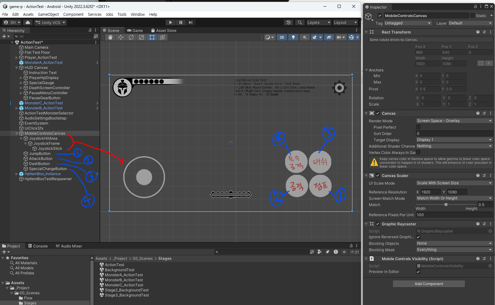
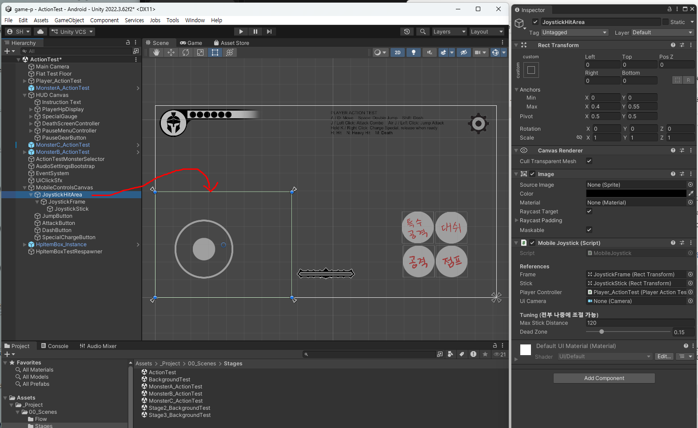
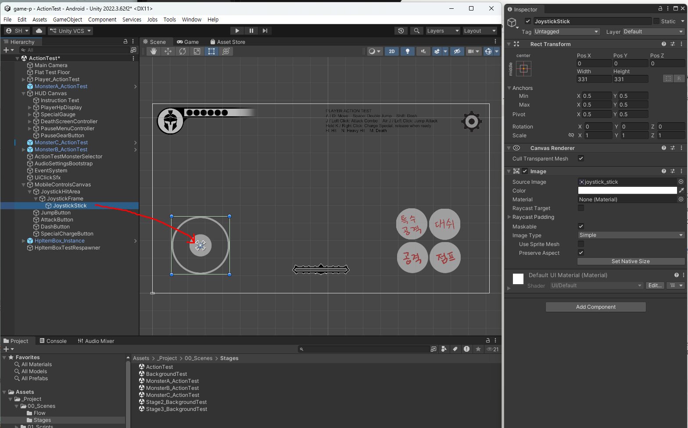

# 11주차 보조자료 - 모바일 UI·사운드 Inspector 항목 설명

> 본 수업 문서: **[W11 모바일 UI·사운드](W11_모바일UI_사운드.md)** · 같은 형식: [주인공](W02_플레이어_캐릭터_인스팩터.md) · [HUD·메뉴](W06_플레이HUD_메뉴_인스팩터.md)

이번 주는 성격이 다른 두 가지를 다룹니다.

- **A. 모바일 터치 컨트롤** - 화면에 뜨는 조이스틱과 버튼들
- **B. 사운드** - BGM과 효과음이 Inspector에서 어떻게 연결되는가

---

## 이 문서를 보는 법

| 표시 | 뜻 |
|---|---|
| **★** | **여러분이 직접 다루는 것** |
| **△** | **필요하면 조정** |
| **✕** | **손대지 마세요** |

---

# A. 모바일 터치 컨트롤

## A-0. Hierarchy 구조

```
MobileControlsCanvas         ← 터치 UI 묶음 (Mobile Controls Visibility)
  ├ JoystickHitArea          ← 손가락을 인식하는 넓은 영역 (안 보임, Mobile Joystick)
  │   └ JoystickFrame        ← 조이스틱 바깥 테두리 (눈에 보이는 그림)
  │       └ JoystickStick    ← 움직이는 손잡이
  ├ JumpButton
  ├ AttackButton
  ├ DashButton
  └ SpecialChargeButton
Main Camera
  └ (Aspect Ratio Letterbox) ← 화면 비율 맞추기
```



**Hierarchy의 버튼 순서가 곧 화면 배치는 아닙니다.** 위 그림의 번호가 짝입니다.

| Hierarchy | 화면 위치 |
|---|---|
| **①** `JumpButton` | 오른쪽 아래 **바깥쪽** |
| **②** `AttackButton` | 오른쪽 아래 **안쪽** |
| **③** `DashButton` | 오른쪽 위 **바깥쪽** |
| **④** `SpecialChargeButton` | 오른쪽 위 **안쪽** |

**엄지가 가장 편하게 닿는 자리(오른쪽 아래 바깥쪽)에 점프와 공격**이 있고, 덜 급한 대시·필살기가 위쪽에 있습니다. **위치를 바꿔도 되지만 이 원칙은 지키세요.**

> ### 위 그림에서 확인할 것 - 조이스틱은 **Game 뷰에 안 보이는 부모** 아래에 있습니다
>
> 빨간 화살표가 가리키는 것이 `JoystickHitArea`입니다. **화면에는 동그란 조이스틱 하나만 보이지만, Hierarchy에는 세 겹**입니다. 아래 A-2에서 설명합니다.

> ### ★ 가장 먼저 알아둘 것 - 터치 UI는 **PC 빌드에서 자동으로 사라집니다**
>
> 안드로이드에서만 나오고 PC에서는 안 나옵니다. **여러분이 껐다 켜는 것이 아니라 자동입니다.**
>
> 그래서 에디터에서 볼 수 있게 하는 스위치가 따로 있습니다(아래 `Preview In Editor`).

> ### ⚠️ 모바일 UI는 **`ActionTest` 씬에서 고칩니다**
>
> **[6주차 HUD](W06_플레이HUD_메뉴_인스팩터.md)와 완전히 같은 규칙입니다.** `MobileControlsCanvas`는 `ActionTest` · `BackgroundTest` · 스테이지2 · 스테이지3에 **각각 하나씩** 들어 있고(프리팹이 아닙니다), **원본은 `ActionTest`의 것**입니다.
>
> `Tools > Class Template > Sync Player & HUD From ActionTest`를 실행하면 **`ActionTest`의 버튼 위치·크기가 나머지 스테이지 씬 전부에 복사**됩니다. 그러니 **`BackgroundTest`에서 위치를 고쳐두면 그 명령 한 번에 사라집니다.**

---

## A-1. `MobileControlsCanvas` - `Mobile Controls Visibility`

| 항목 | 현재값 | 설명 | |
|---|---|---|---|
| `Preview In Editor` | 켜짐 | **에디터에서 터치 UI를 보이게 함** | **△** |

- **켜두면** Unity 에디터에서 Play할 때 터치 버튼이 보입니다. **위치를 잡을 때 필요합니다**
- **끄면** 에디터에서도 안 보입니다. PC 화면을 깨끗하게 확인하고 싶을 때
- **어느 쪽으로 두든 빌드에는 영향이 없습니다.** 안드로이드 빌드에서는 항상 나오고, PC 빌드에서는 항상 안 나옵니다

> **이 오브젝트 전체의 체크를 끄지 마세요.** 끄면 안드로이드 빌드에서도 조작이 안 나와서 **게임을 아예 할 수 없게 됩니다.**

---

## A-2. 조이스틱은 **세 겹**입니다

**화면에는 동그라미 하나로 보이지만, 오브젝트는 셋입니다.** 각각 하는 일이 다릅니다.

| 오브젝트 | 하는 일 | 보이나 | `Raycast Target` |
|---|---|---|---|
| `JoystickHitArea` | **손가락을 인식** | **안 보임** (투명) | **켜짐** |
| `JoystickFrame` | 바깥 테두리 **그림** | 보임 | 꺼짐 |
| `JoystickStick` | 손잡이 **그림** (움직임) | 보임 | 꺼짐 |

**`Raycast Target`이 켜진 것 하나만 손가락을 받습니다.** 그림 두 장은 **보여주기만** 하고 터치를 받지 않습니다. 그래서 **테두리 밖을 짚어도** 조이스틱이 잡히는 것입니다.

---

### A-2-1. `JoystickHitArea` - `Mobile Joystick` ★



**위 그림의 초록색 사각형이 손가락 인식 범위입니다.** 조이스틱 그림보다 훨씬 넓습니다. **이 범위 안이면 어디를 짚어도 조이스틱이 잡힙니다.**

> **`Source Image`가 `None`이고 `Color`의 투명도가 0입니다.** 그림이 없는 투명한 판이라 Game 뷰에서는 아무것도 안 보입니다. **비어 있는 것이 정상입니다.**

**`Anchors`의 `Max`가 `X 0.4 / Y 0.55`** 로 되어 있습니다. **화면 왼쪽 아래 40% × 55%** 라는 뜻입니다. **비율이라서 폰 화면이 크든 작든 알아서 비례**합니다.

| 항목 | 현재값 | 설명 | |
|---|---:|---|---|
| `Frame` | (오브젝트) | 바깥 테두리 | **✕** |
| `Stick` | (오브젝트) | 움직이는 손잡이 | **✕** |
| `Player Controller` | (오브젝트) | 주인공 연결 | **✕** |
| `Ui Camera` | (비어 있음) | **비어 있는 것이 정상입니다** | **✕** |
| `Max Stick Distance` | 120 | **손잡이가 중심에서 최대로 벗어나는 거리(px)** | **★** |
| `Dead Zone` | 0.15 | **이보다 살짝 기울인 것은 무시** | **★** |

#### `Max Stick Distance` - 조이스틱의 크기 감각

**1920x1080 기준 픽셀 값**입니다. 조이스틱 그림을 크게 그렸다면 이 값도 키워야 손잡이가 테두리 안에서 자연스럽게 움직입니다.

- **너무 작으면**: 손가락을 조금만 움직여도 손잡이가 끝까지 가버립니다
- **너무 크면**: 손잡이가 테두리 밖으로 튀어나갑니다

> **조이스틱 그림을 바꿨다면 여기를 반드시 확인하세요.** 그림 크기와 이 숫자가 맞아야 합니다.

#### `Dead Zone` - 손 떨림 무시하기

**0.15는 "15% 미만으로 기울인 것은 안 움직인 것으로 친다"** 는 뜻입니다.

- **값을 0으로 하면**: 손가락을 얹기만 해도 캐릭터가 살살 움직입니다
- **너무 크게(0.5 등) 하면**: 한참 기울여야 겨우 움직여서 답답합니다

> **0.1~0.2 사이를 벗어나지 마세요.** 조작감에 바로 영향이 갑니다.

---

### A-2-2. `JoystickFrame` - 바깥 테두리 **그림** ★


| 항목 | 현재값 | 설명 | |
|---|---:|---|---|
| `Source Image` | `joystick_frame` | **여러분이 그린 테두리 그림** | **★** |
| `Width` / `Height` | 331 / 331 | 그림 규격 | **△** |
| `Pos X` / `Pos Y` | 274 / 272.1 | **화면에서의 위치** | **★** |
| `Raycast Target` | **꺼짐** | 손가락 인식은 부모가 담당 | **✕** |
| `Preserve Aspect` | 켜짐 | 비율이 찌그러지지 않게 | **✕** |

> ### ★ **조이스틱을 옮길 때는 이 오브젝트를 옮깁니다**
>
> `JoystickHitArea`를 옮기면 **그림은 그대로인데 손가락 인식 범위만 딴 데로** 갑니다. 조이스틱이 보이는 자리와 잡히는 자리가 어긋나서 **아주 찾기 어려운 문제**가 됩니다.

---

### A-2-3. `JoystickStick` - 움직이는 손잡이 ★



| 항목 | 현재값 | 설명 | |
|---|---:|---|---|
| `Source Image` | `joystick_stick` | **여러분이 그린 손잡이 그림** | **★** |
| `Width` / `Height` | 331 / 331 | **테두리와 같은 331** | **✕** |
| `Pos X` / `Pos Y` | **0 / 0** | **테두리 정중앙** | **✕** |

> ### 위치가 `0, 0`인 것이 정상입니다
>
> 손잡이는 **테두리의 자식**이라 `0, 0`이 곧 테두리 한가운데입니다. **게임 중에 손가락을 따라 움직이는 것은 프로그램이 하는 일**이라, 여기서 옮겨둘 필요가 없습니다.

> ### ⚠️ 손잡이도 **331 × 331** 입니다 - 작게 그리는 것은 캔버스 안에서
>
> 테두리와 **똑같은 331 × 331 캔버스**에, **손잡이 동그라미만 가운데 작게** 그립니다. 331 캔버스를 꽉 채워 그리면 **손잡이가 테두리와 같은 크기**가 되어버립니다.
>
> 위 그림에서 파란 선택 테두리(331)는 테두리 그림과 같은 크기인데, **안에 보이는 회색 동그라미는 훨씬 작습니다.** 이렇게 그리세요.

---

## A-3. 버튼 4개 - 점프 / 공격 / 대시 / 필살기

**네 버튼 모두 항목이 같습니다.**

| 항목 | 설명 | |
|---|---|---|
| `Normal Sprite` | **평소 모습** | **★** |
| `Pressed Sprite` | **누르고 있는 동안의 모습** | **★** |
| `Target Image` | 그림이 바뀔 자리 | **✕** |
| `Player Controller` | 주인공 연결 | **✕** |

> ### PC 버튼과 다른 점 - **`Hover`가 없습니다**
>
> 손가락은 "올려놓기"가 없으니 그림이 **두 장**입니다. 그래서 **`Pressed`가 훨씬 중요합니다** - 눌린 게 눈에 안 보이면 눌렸는지 알 수가 없습니다. **색을 확실히 다르게** 하세요.

### 버튼별로 성격이 다릅니다

| 버튼 | 동작 방식 |
|---|---|
| **점프** | 누르는 순간 발동 |
| **공격** | 누르는 순간 발동 (연타하면 콤보) |
| **대시** | 누르는 순간 발동 |
| **필살기** | **누르고 있는 동안 차징 → 떼면 발동** |

> **필살기 버튼만 "떼는 순간"이 중요합니다.** 최소 1초를 눌러야 나갑니다(주인공의 `Special Minimum Charge Time`). 학생들이 "필살기가 안 나가요"라고 하는 경우, 대부분 **너무 빨리 뗀 것**입니다.

### 위치와 크기

**`Rect Transform`에서 조정합니다. ★** 어느 버튼이 화면 어디에 있는지는 **[A-0의 그림](#a-0-hierarchy-구조)** 의 번호를 보세요.

> **버튼은 조이스틱과 달리 `Raycast Target`이 켜져 있습니다.** 그림 자체가 손가락을 받으므로, **버튼은 그림을 옮기면 눌리는 자리도 같이 따라옵니다.** 조이스틱처럼 감지 영역이 따로 있지 않습니다.

> ### 실제 기기에서 반드시 확인하세요
>
> **에디터 화면에서 적당해 보이는 크기가 실제 손가락에는 작습니다.** 그리고 **버튼끼리 너무 붙어 있으면 오조작**이 납니다.
>
> - 오른손 엄지가 닿는 곳에 공격·점프
> - 왼손 엄지 자리에 조이스틱
> - 버튼 사이에 손가락 하나 들어갈 간격
>
> 이 조정은 **PC 화면만 보고는 절대 맞출 수 없습니다.** APK를 뽑아 실제 폰에서 해보세요.

---

## A-4. `Main Camera` - `Aspect Ratio Letterbox`

| 항목 | 현재값 | 설명 | |
|---|---:|---|---|
| `Target Aspect` | 1.7777778 (= 16:9) | **맞출 화면 비율** | **✕** |

**폰마다 화면 비율이 제각각**입니다. 이 부품이 **위아래(또는 좌우)에 검은 띠를 넣어서** 항상 16:9로 보이게 맞춰줍니다.

**그래서 어떤 폰에서도 화면이 잘리지 않습니다.** 검은 띠가 보이는 것은 고장이 아니라 의도입니다.

> **`Target Aspect`를 바꾸지 마세요.** 모든 그림 규격(1920x1080, 바닥 19.2x10.8)이 16:9 기준으로 맞춰져 있습니다.

---

# B. 사운드

## B-0. 사운드는 두 갈래로 들어갑니다

| 종류 | 어디에 붙나 | Inspector에서 |
|---|---|---|
| **BGM** (배경음) | 씬마다 **`BackgroundMusic` 오브젝트** | `Audio Source`의 `Clip` |
| **SFX** (효과음) | **캐릭터의 `SFX` 항목** | `Sfx Cue` |

**이 둘은 볼륨도 따로 조절됩니다.** 설정 팝업의 슬라이더 두 개가 각각 이 둘을 담당합니다.

---

## B-1. `BackgroundMusic` - 씬마다 하나씩

`Audio Source`라는 부품이 붙어 있습니다. **항목이 많지만 볼 것은 넷뿐입니다.**

| 항목 | 현재값 | 설명 | |
|---|---|---|---|
| `Audio Clip` | 그 씬의 BGM 파일 | **재생할 음악** | **★** |
| `Play On Awake` | 켜짐 | 씬이 시작되면 자동 재생 | **✕** |
| `Loop` | 켜짐 | **끝나면 처음부터 반복** | **✕** |
| `Output` | BGM 그룹 | **볼륨 슬라이더가 여기를 조절합니다** | **✕** |

> ### ⚠️ `Output`을 비우면 볼륨 조절이 안 먹습니다
>
> 이 칸이 **BGM 그룹**으로 연결되어 있어야 설정의 BGM 슬라이더가 이 소리를 줄입니다. 비어 있으면 **슬라이더를 0으로 내려도 그 음악만 계속 크게 납니다.**
>
> 씬을 새로 만들었다면 `Tools > Class Template > Add Background Music To Scene`(또는 Title/Intro/Ending용 각각의 도구)을 쓰세요. 연결까지 맞춰줍니다.

> **`Loop`를 끄면 음악이 한 번 나오고 조용해집니다.** 스테이지처럼 오래 머무는 화면에서는 켜두세요.

> **BGM은 화면마다 하나씩** 넣습니다 - 타이틀, 인트로, 스테이지, 엔딩. 사망 화면과 클리어 화면은 **한 번만 울리는 소리**라 BGM이 아니라 [6주차 편](W06_플레이HUD_메뉴_인스팩터.md)의 `Stinger` 항목입니다.

---

## B-2. `Sfx Cue` - 캐릭터의 효과음 칸

주인공과 몬스터의 `SFX` 항목을 펼치면 **칸이 세 개씩** 나옵니다.

| 항목 | 기본값 | 설명 | |
|---|---:|---|---|
| `Clip` | | **재생할 소리 파일** | **★** |
| `Volume` | 1 | **0~1 사이 크기** | **△** |
| `Pitch Variance` | 0.05 | **재생할 때마다 음높이를 조금씩 다르게** | **△** |

### `Pitch Variance` - 반복되는 소리가 지겹지 않게

**같은 소리가 계속 나오면 기계적으로 들립니다.** 이 값이 `0.05`면 **매번 ±5% 범위에서 음높이가 무작위로 달라져서**, 같은 파일인데도 매번 조금씩 다르게 들립니다.

- **공격음처럼 자주 나는 소리**: 0.05~0.1 권장
- **사망음처럼 한 번만 나는 소리**: 0으로 둬도 괜찮습니다
- **0.3에 가깝게 올리면** 음높이가 너무 요동쳐서 어색합니다

> **`Volume`은 다른 소리와의 균형**을 맞추는 용도입니다. 효과음 전체 크기는 설정 슬라이더가 담당하니, 여기서는 **"공격음이 발소리보다 크게"** 같은 상대적 조절만 하세요.

> **소리가 몇 번째 그림에서 나는지**는 별도 항목입니다 - `Attack 1 Swing Frame` 등. [주인공 편 8번](W02_플레이어_캐릭터_인스팩터.md) 참고. **프레임 개수를 바꿨다면 이 숫자도 확인하세요.**

---

## B-3. `AudioSettingsBootstrap` - 볼륨 기억하기

**설정 항목이 없습니다.** 씬이 시작될 때 **저장해둔 볼륨을 불러와 적용**합니다.

> **모든 씬에 하나씩 있어야 합니다.** 없는 씬은 볼륨 설정을 무시해서 **그 화면만 소리가 큽니다.**
>
> `Tools > Class Template > Add Audio Settings Bootstrap To All Scenes`를 한 번 실행하면 전부 채워집니다.

> 볼륨은 **게임을 껐다 켜도 유지됩니다.** 설정 팝업에서 저장하면 컴퓨터에 기록됩니다.

---

## 자주 나오는 문제

### 모바일

| 증상 | 원인 |
|---|---|
| **PC에서 터치 버튼이 안 보임** | 정상입니다. 보려면 `Preview In Editor`를 켜세요 |
| **안드로이드에서 조작이 안 나옴** | `MobileControlsCanvas` 오브젝트 체크가 꺼짐 |
| 손잡이가 **테두리 밖으로 튀어나감** | `Max Stick Distance`가 그림 크기보다 큼 |
| 손가락을 **얹기만 해도 움직임** | `Dead Zone`이 너무 작음 |
| **조이스틱이 잘 안 잡힘** | `JoystickHitArea`가 지워졌거나 너무 작음 |
| **필살기가 안 나감** | 1초 이상 누르고 떼야 합니다 |
| 실제 폰에서 **버튼이 너무 작음** | 에디터에서만 확인한 것. **실기기에서 조정하세요** |
| 화면 **위아래에 검은 띠** | 정상입니다 (비율 맞추기) |
| **맞춰놓은 버튼 위치가 원래대로 돌아감** | `BackgroundTest`에서 고친 뒤 `Sync Player & HUD From ActionTest`를 실행함. **위치는 `ActionTest`에서** |
| 조이스틱 **그림은 그대로인데 엉뚱한 데를 짚어야 잡힘** | `JoystickFrame` 대신 `JoystickHitArea`를 옮김 |

### 사운드

| 증상 | 원인 |
|---|---|
| 볼륨을 **0으로 내려도 소리가 남** | 그 `Audio Source`의 `Output`이 비었음 |
| BGM이 **한 번 나오고 조용해짐** | `Loop`가 꺼짐 |
| **한 화면만 소리가 큼** | 그 씬에 `AudioSettingsBootstrap`이 없음 |
| 공격음이 **기계적으로 들림** | `Pitch Variance`를 0.05~0.1로 |
| 소리가 **엉뚱한 타이밍**에 남 | `Attack ~ Swing Frame` 숫자 확인 |
| 효과음이 **아예 안 남** | `Clip` 칸이 비었거나, 파일명이 규칙과 다름 → `Wire Player SFX Clips` |

---

## 값이 꼬였을 때 되돌리는 법

1. **`Ctrl+Z`**
2. **도구 다시 실행** - 안전하고 빠릅니다
   - 터치 컨트롤: `Tools > Class Template > Add Mobile Controls To Scene`
   - 효과음 연결: `Wire Player SFX Clips` / `Wire MonsterA(B,C) SFX Clips`
   - 볼륨 부품: `Add Audio Settings Bootstrap To All Scenes`
3. **씬 파일 통째로 되돌리기** - GitHub Desktop → `.unity` **오른쪽 클릭 → `Discard changes`**

> **터치 버튼 위치는 실기기에서 여러 번 고치게 됩니다.** 마음에 드는 배치가 나오면 **바로 Commit**해두세요. 다음에 만지다 망가져도 그 시점으로 돌아올 수 있습니다. ([01-③ GitHub Desktop](../기본설명/01_시작하기3_깃허브데스크탑.md))
