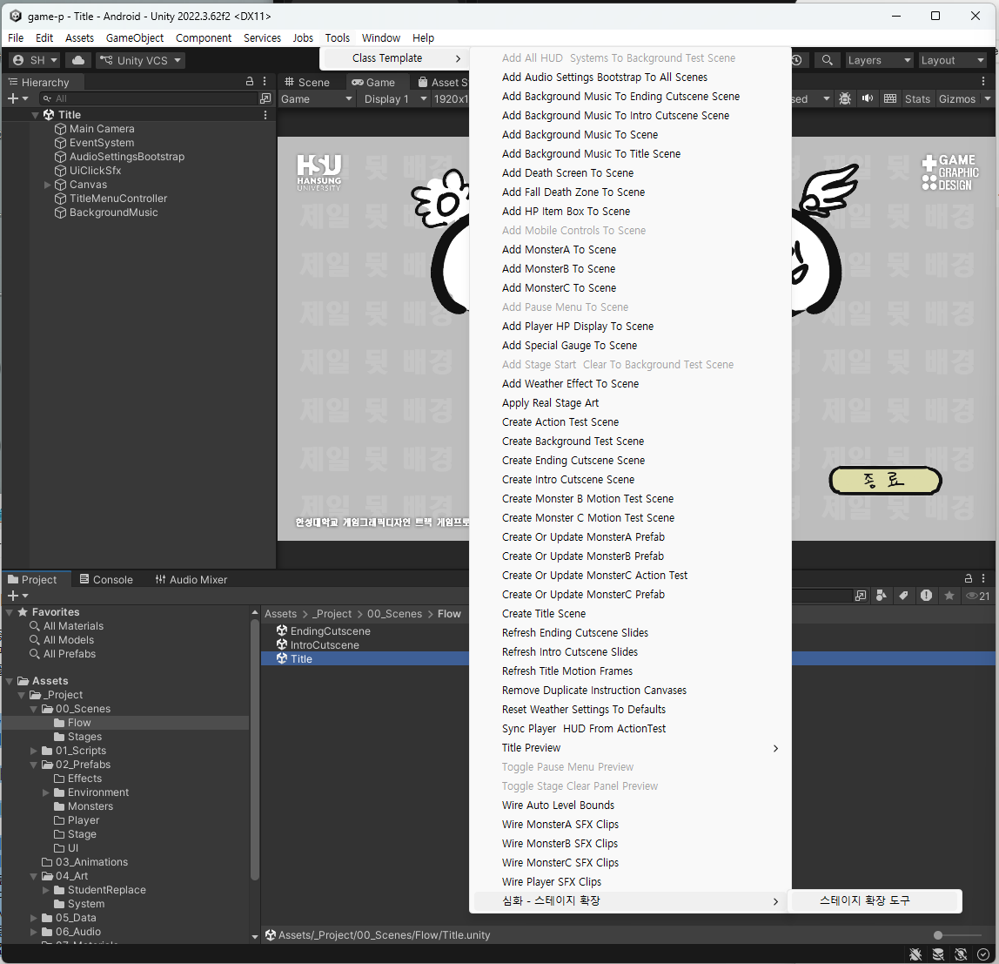
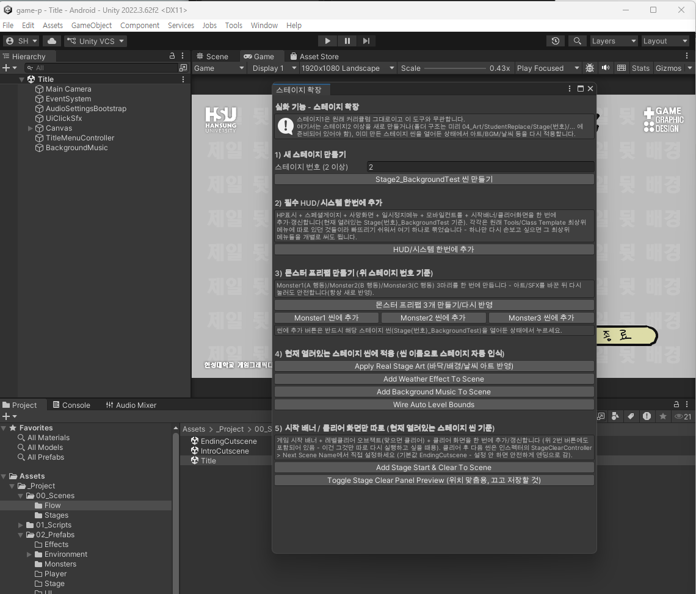
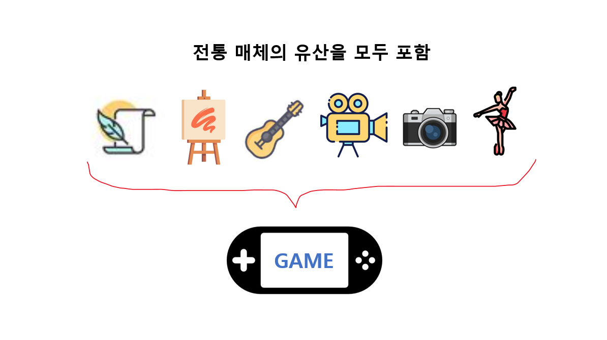
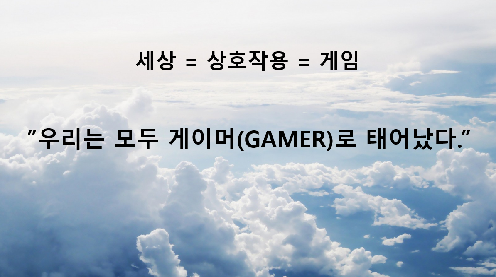

# 15주차 - 최종 발표 · 심화(스테이지 확장)

**이번 주**: 한 학기 결과물을 발표하고, **더 만들고 싶은 사람을 위한 확장 방법**을 안내합니다.

---

# 파트 A. 최종 발표

## A-1. 발표 진행

| 항목 | 내용 |
|---|---|
| 발표 자료 | 종합결과 보고 PPT (14주차 제출본) |
| 함께 재생 | 전체 플레이 영상 (1~2분 내외) |
| 형식 | 발표 → 질의응답 |

> 발표 자료와 영상은 **14주차에 제출한 것을 그대로 사용**합니다. 이번 주에 새로 만들 필요는 없습니다.

## A-2. 발표에서 말하면 좋은 것

슬라이드에 이미 있는 내용을 그대로 읽지 마세요. **슬라이드는 보여주고, 말은 그 뒤의 이야기를 하는 것**입니다.

| 슬라이드 | 말로 덧붙일 것 |
|---|---|
| 컨셉 | **왜 이 컨셉을 골랐는지** |
| 캐릭터 | 어떤 실루엣/성격을 노렸는지, 어떻게 바뀌어갔는지 |
| 몬스터 | 3종을 어떻게 구분되게 만들었는지 |
| 배경 | **패럴렉스 5겹을 어떤 기준으로 나눴는지** |
| 러프 → 완성 비교 | 무엇을 고쳤고 **왜** 고쳤는지 |
| 소감 | **가장 막혔던 지점과 어떻게 풀었는지** |

> **"어려웠는데 재밌었습니다"로 끝내지 마세요.** 구체적으로 무엇이 어려웠고 어떻게 해결했는지가 이 수업에서 실제로 배운 것입니다. 그게 나중에 포트폴리오와 면접에서 쓸 수 있는 이야기가 됩니다.

## A-3. 다른 사람 발표를 볼 때

같은 시스템, 같은 규격에서 출발했는데 **결과물이 전부 다릅니다.** 이게 이 수업의 가장 중요한 부분입니다.

- 같은 500x500 캔버스에서 어떤 캐릭터가 나왔는가
- 같은 패럴렉스 5겹으로 어떤 공간을 만들었는가
- 같은 307x82 버튼으로 어떤 UI 톤을 만들었는가

**"규격은 제약이 아니라 출발점"** 이라는 것을 실제로 확인하는 자리입니다. 실무에서 여러분이 받게 될 것도 정확히 이런 형태의 규격서입니다.

## A-4. 이 결과물을 앞으로 어떻게 쓰나

| 용도 | 무엇을 쓰나 |
|---|---|
| **포트폴리오** | 타이틀 화면, 엔딩 일러스트, 스프라이트 시트, 패럴렉스 레이어 분해 이미지 |
| **동영상 포트폴리오** | 전체 플레이 영상 |
| **"실제로 돌아가는 결과물"** | 빌드 파일 (`.exe`, `.apk`) - 그래픽 전공자 중 이걸 가진 사람은 많지 않습니다 |
| **작업 이력 증명** | GitHub 저장소 (커밋 기록이 15주간의 작업 과정을 그대로 보여줍니다) |

> **GitHub 저장소를 지우지 마세요.** 커밋 기록 자체가 "이 사람이 꾸준히 작업했다"는 증거입니다. 실무에서 GitHub 링크를 요구하는 경우도 늘고 있습니다.

---

# 파트 B. 심화 - 스테이지 확장

**여기서부터는 선택 사항입니다.** 수업이 끝난 뒤에도 더 만들고 싶은 사람을 위한 안내입니다.

## B-1. 무엇을 할 수 있나

**두 가지입니다.**

| | 무엇 | 난이도 |
|---|---|---|
| **첫째** | **이미 들어 있는 스테이지2·3을 이어붙이기** | **10분** |
| 둘째 | 스테이지4 이상을 **새로 만들기** | 그림을 새로 그려야 함 |

**템플릿에는 스테이지2와 스테이지3이 이미 완성된 채로 들어 있습니다.** 씬도, 바닥·배경·몬스터 그림도, BGM과 효과음도 전부 들어 있습니다. **다만 스테이지1에서 그리로 넘어가지 않게 꺼져 있을 뿐**입니다.

```
지금:  타이틀 → 인트로 → 스테이지1 →                    엔딩 → 타이틀
                                    ↑ 여기서 바로 끝남

연결 후: 타이틀 → 인트로 → 스테이지1 → 스테이지2 → 스테이지3 → 엔딩 → 타이틀
```

**그래서 B-2를 먼저 하세요.** 그림을 한 장도 안 그려도 **3스테이지짜리 게임**이 됩니다. 새로 만드는 것(B-3 이후)은 그 다음입니다.

### 규칙

| 항목 | 내용 |
|---|---|
| 스테이지1 | **전혀 건드리지 않습니다.** 확장은 순수하게 추가 기능입니다 |
| 몬스터 | **항상 정확히 3마리**, A/B/C의 **행동(스크립트)을 그대로 재사용** |
| 새로 만드는 것 | **그림과 사운드만** |
| 지원 안 하는 것 | 새로운 몬스터 행동 패턴, 새로운 게임 시스템 |
| 스테이지 연결 | **항상 수동** (인스펙터에서 다음 씬 이름을 직접 지정) |

> **"몬스터 행동은 재사용, 그림만 교체"** 가 핵심입니다. 스테이지2의 몬스터1은 몬스터A와 똑같이 움직이지만 완전히 다른 생물로 보일 수 있습니다. 실제 상용 게임에서도 흔히 쓰는 방식입니다.

---

## B-2. ★ 먼저 - 스테이지 1 → 2 → 3 이어붙이기

**할 일은 두 가지, 10분이면 끝납니다.** 스테이지2 → 스테이지3 → 엔딩은 **이미 연결되어 있습니다.** 끊겨 있는 곳은 **스테이지1 다음 한 군데**뿐입니다.

### (1) Build Settings에서 스테이지2·3을 **체크**합니다

`File > Build Settings` → **Scenes In Build**

**목록에는 이미 들어 있는데 체크가 꺼져 있습니다.** 두 줄의 **체크박스를 켜세요.**

```
☑ Title
☑ IntroCutscene
☑ BackgroundTest          ← 스테이지1
☑ EndingCutscene
☐ Stage2_BackgroundTest   ← 켜기
☐ Stage3_BackgroundTest   ← 켜기
```

> **체크가 꺼져 있으면 빌드에 그 씬이 안 들어갑니다.** 에디터에서는 넘어가는데 **빌드한 게임에서만 안 넘어가는** 현상이 이것 때문입니다.

### (2) 스테이지1의 `Next Scene Name`을 바꿉니다

`BackgroundTest` 씬을 열고 → `Hierarchy`에서 **`StageClearController`** 선택 → `Inspector`의 **`Next Scene Name`** 드롭다운

| | 지금 | 바꿀 값 |
|---|---|---|
| **스테이지1**(`BackgroundTest`) | `EndingCutscene` | **`Stage2_BackgroundTest`** |
| 스테이지2 | `Stage3_BackgroundTest` | 그대로 |
| 스테이지3 | `EndingCutscene` | 그대로 |

**Ctrl+S로 저장하면 끝입니다.**

> **드롭다운이라 오타가 날 수 없습니다.** 목록은 **Build Settings에 등록된 씬**으로 만들어지므로, `Stage2_BackgroundTest`가 목록에 안 보이면 **(1)을 안 한 것**입니다.

### 확인

`Title` 씬에서 Play → 스테이지1을 클리어하면 **엔딩이 아니라 스테이지2로** 넘어가야 합니다.

> ### 되돌리고 싶으면 (2)만 원래대로
>
> 스테이지1의 `Next Scene Name`을 다시 `EndingCutscene`으로 바꾸면 **원래의 1스테이지 게임**으로 돌아갑니다. **제출한 빌드를 건드리는 것이 아니니 마음 놓고 해보세요.**

> ⚠️ **최종 제출 이후에 하세요.** 14주차 제출용 빌드를 만든 뒤에 손대는 것이 안전합니다.

---

## B-3. 새 스테이지를 만들려면 - 폴더 준비

**여기서부터는 스테이지4 이상을 새로 만들거나, 스테이지2·3의 그림을 여러분 것으로 바꾸고 싶을 때** 봅니다. 스테이지2·3을 그대로 쓸 거라면 **B-2**에서 끝난 것입니다.

스테이지 N을 만들기 전에 **폴더 구조가 준비되어 있어야 합니다.** 아래는 **스테이지2에 이미 들어 있는 구조**이고, 스테이지4 이상을 만들 때 이대로 복사하면 됩니다.

### 그림 - `04_Art/StudentReplace/Stage{번호}/`

```
Stage2/
 ├─ StageGround/          ground1.png ~ (1920x1080, 지면 표면 아래에서 200px)
 ├─ StageBackground/      bg1.png ~ bg5.png (1920x1080)
 ├─ StageWeather/         weather1.png ~
 ├─ Monsters/
 │   ├─ Monster1/         ← A와 같은 행동 (5개 폴더)
 │   ├─ Monster2/         ← B와 같은 행동 (8개 폴더)
 │   └─ Monster3/         ← C와 같은 행동 (7개 폴더 + Effects/Projectile)
 ├─ Environment/LevelClearObject/   level_clear_object.png
 └─ UI/
     ├─ StageStart/       game_start.png
     └─ StageClear/       level_clear.png
```

> **몬스터 파일명은 스테이지1과 똑같습니다** (`monstera_idle_01.png`, `monsterb_attack1_01.png`, `monsterc_fly_01.png`). 행동을 그대로 재사용하기 때문입니다. 폴더가 이미 `Stage2/Monsters/Monster1` 로 구분되어 있으니 헷갈릴 일은 없습니다.

### 사운드

```
06_Audio/BGM/Stage2/              스테이지2 배경음악 (파일 하나)
06_Audio/BGM/Stage2LevelClear/    스테이지2 클리어 음악 (파일 하나)
06_Audio/SFX/Stage2Monster1/      attack.wav / hit.wav / death.wav
06_Audio/SFX/Stage2Monster2/      attack1 / attack2 / hit / death
06_Audio/SFX/Stage2Monster3/      attack1 / attack2 / hit / death
```

> **효과음 파일명이 스테이지1과 다릅니다.** 스테이지1은 `monstera_attack.wav` 처럼 접두사가 붙지만, 확장 스테이지는 폴더 이름(`Stage2Monster1`)이 이미 구분해주므로 **`attack.wav` 처럼 단순하게** 씁니다.

### 스테이지4 이상을 만들려면

`Stage4` 폴더와 `BGM/Stage4`, `BGM/Stage4LevelClear`, `SFX/Stage4Monster1~3` 폴더를 **Stage2 폴더 구조를 복사해서** 직접 만드세요.
※ 복사할 때 **프리팹 폴더는 제외**하세요 - 도구가 자동으로 생성합니다.

## B-4. 도구 사용법

메뉴에서 전용 창을 엽니다:

```
Tools > Class Template > 심화 - 스테이지 확장 > 스테이지 확장 도구
```



**메뉴 맨 아래**에 있습니다. 지금까지 쓰던 명령들과 **떨어뜨려 놓은 이유**는, 이 도구가 **원래 커리큘럼과 무관한 심화 기능**이기 때문입니다.

> 위 그림에서 **회색으로 죽어 있는 항목이 여럿** 보이는 것은 지금 **`Title` 씬을 열어둔 상태**여서입니다. 스테이지 씬을 열면 살아납니다. ([6주차 편](W06_플레이HUD_메뉴_인스팩터.md)의 "메뉴가 회색이면 씬을 잘못 연 것")



**창 안의 번호 순서대로** 버튼을 누르면 됩니다. **아래 1)~5)가 창의 번호와 그대로 짝**입니다.

> 창 맨 위 안내문이 말하듯, **이 도구는 지금까지 만든 것을 건드리지 않습니다.** 스테이지2 이상을 새로 만들거나, 이미 만든 스테이지 씬에 아트·BGM·날씨를 다시 적용할 뿐입니다.
>
> **여기 있는 버튼 대부분은 `Tools > Class Template` 최상위 메뉴에도 그대로 있습니다.** 스테이지 확장을 할 때는 이 창 하나만 열어두면 왔다 갔다 하지 않아도 되어서 모아둔 것입니다.

### 1) 새 스테이지 만들기

- **스테이지 번호**를 입력 (2 이상)
- **`Stage{번호}_BackgroundTest 씬 만들기`** 클릭
- 바닥·배경·날씨·카메라·BGM이 있는 새 씬이 만들어집니다

### 2) 필수 HUD/시스템 한번에 추가

방금 만든 씬을 연 상태에서 **`HUD/시스템 한번에 추가`** 클릭.

HP표시 + 스페셜게이지 + 사망화면 + 일시정지메뉴 + 모바일컨트롤 + 시작배너/클리어화면이 한 번에 들어갑니다.

### 3) 몬스터 프리팹 만들기

- **`몬스터 프리팹 3개 만들기/다시 반영`** 클릭
  - 스테이지1의 몬스터 프리팹을 복제한 뒤 그림/사운드만 교체합니다. **HP·공격판정·투사체 속도 등 밸런스 값이 전부 자동으로 상속**됩니다
  - 아트/SFX를 바꾼 뒤 다시 눌러도 안전합니다
- **`Monster1 씬에 추가`** / `Monster2` / `Monster3` 클릭
  - ⚠️ **반드시 해당 스테이지 씬을 열어둔 상태에서** 누르세요
- Scene 뷰에서 몬스터를 원하는 위치로 드래그

### 4) 현재 열려 있는 스테이지 씬에 적용

| 버튼 | 하는 일 |
|---|---|
| `Apply Real Stage Art` | 바닥/배경/날씨 그림 반영 |
| `Add Weather Effect To Scene` | 날씨 오브젝트 추가 |
| `Add Background Music To Scene` | BGM 연결 |
| `Wire Auto Level Bounds` | 카메라 이동 범위 자동 계산 |

> 스테이지 번호는 **열려 있는 씬 이름으로 자동 인식**됩니다. 번호 입력 칸은 "1) 새로 만들기"에서만 씁니다.

### 5) 시작 배너 / 클리어 화면만 따로

- `Add Stage Start & Clear To Scene` - 시작 배너 + 레벨클리어 오브젝트 + 클리어 화면
- `Toggle Stage Clear Panel Preview` - 클리어 일러스트 위치 맞춤용

## B-5. 새로 만든 스테이지를 연결하기

**새 씬을 만들었다고 게임이 알아서 이어지지 않습니다.** **B-2**에서 한 것과 **똑같은 두 가지**를 새 스테이지에도 해야 합니다.

| | 무엇 |
|---|---|
| **(1)** | `File > Build Settings`의 **Scenes In Build에 등록 + 체크** |
| **(2)** | **앞 스테이지**의 `StageClearController` → `Next Scene Name`을 새 씬으로 |

**끝 스테이지 하나를 더 붙이는 경우**를 예로 들면 이렇습니다.

| 씬 | 바꾸기 전 | 바꾼 뒤 |
|---|---|---|
| 스테이지3 | `EndingCutscene` | **`Stage4_BackgroundTest`** |
| **스테이지4**(새로 만든 것) | — | **`EndingCutscene`** |

> **마지막 스테이지는 항상 `EndingCutscene`을 가리켜야 합니다.** 여기를 빠뜨리면 **마지막 스테이지를 깼는데 아무 일도 안 일어납니다.**

> 씬 생성 도구가 Build Settings에 자동으로 등록해주지만, **체크 여부는 직접 확인하세요.** 드롭다운에 새 씬이 안 보이면 등록이 안 됐거나 체크가 꺼진 것입니다.

## B-6. 함정 - 미리 알아두면 좋은 것

| 함정 | 설명 |
|---|---|
| **`Toggle Stage Clear Panel Preview`를 켠 채로 저장** | Play를 시작하자마자 클리어 화면이 떠 있는 채로 시작합니다. **위치를 맞춘 뒤엔 ① 버튼을 다시 눌러 끄기 → ② Ctrl+S** 순서를 지키세요 |
| **Play 모드 중에 도구 실행** | 씬이 꼬이고 에러가 납니다. 도구는 **항상 Play를 끈 상태**에서 |
| **바닥 5개 이상은 씬 배치가 수동** | 프리팹은 자동 생성되지만 Scene 뷰로 직접 드래그해야 합니다 |
| **프레임 수와 판정 프레임 불일치** | 스테이지1에서와 같습니다. 프레임을 바꿨으면 판정 프레임 숫자를 확인하세요 (Console에 경고가 뜹니다) |
| **BGM 폴더에 파일이 없는 상태에서 도구 실행** | 나중에 파일을 넣고 도구를 다시 실행하면 채워집니다 (반복 실행 안전) |

## B-7. 여기서 더 나아가고 싶다면

이 프로젝트를 끝까지 해낸 시점에서, 여러분은 이미 다음을 할 줄 압니다:

- 게임 리소스를 **규격에 맞춰** 제작하고 폴더 구조에 맞게 관리하기
- Unity에서 리소스를 **실제로 게임에 반영**하기
- 스프라이트 애니메이션의 **프레임과 판정 타이밍**을 이해하고 조정하기
- **패럴렉스**와 화면 레이어 구조 이해하기
- **UI 규격**과 상태(normal/hover/click) 시스템 이해하기
- GitHub로 **작업 이력을 관리**하기
- **PC와 모바일 빌드**를 만들어 배포 가능한 결과물 내놓기

이 목록은 그대로 **게임 그래픽 디자이너 채용 공고의 요구사항**과 겹칩니다.

### 다음 단계로 해볼 만한 것

| 방향 | 무엇을 |
|---|---|
| **깊게** | 지금 게임의 완성도를 계속 올리기 - 이펙트 추가, 애니메이션 프레임 늘리기, 스테이지 확장 |
| **넓게** | Unity의 다른 기능 배워보기 - Animator, Tilemap, Timeline |
| **협업으로** | 프로그래머와 팀을 짜서 직접 기획한 게임 만들기 (이제 "그래픽을 게임에 넣는 과정"을 알기 때문에 대화가 통합니다) |
| **인디 게임** | Steam, itch.io 같은 플랫폼에 실제로 출시해보기 |

> **이번 학기에 만든 것은 "완성된 게임"입니다.** 스테이지 1개짜리 짧은 게임이지만, 타이틀부터 엔딩까지 있고, 빌드가 나오고, 남에게 보내서 플레이하게 할 수 있는 진짜 게임입니다. 이걸 해본 사람과 안 해본 사람의 차이는 생각보다 큽니다.

---

## 관련 문서

- [00_수업개요](../기본설명/00_수업개요.md) - "더 해보고 싶다면 (심화)"
- [W10_1차_빌드](W10_1차_빌드.md) - Build Settings와 씬 연결 개념
- [W14_최종빌드_발표준비](W14_최종빌드_발표준비.md) - 발표 자료 구성

---

# 마치며



**게임은 앞선 매체들이 쌓아온 것을 전부 물려받은 매체입니다.** 이야기, 그림, 음악, 영상, 사진, 몸의 움직임 - 이번 학기에 여러분이 다룬 것을 떠올려보세요. **컨셉과 이야기**를 정하고, **그림**을 그리고, **소리**를 넣고, **컷신**을 만들고, **캐릭터의 움직임**을 프레임으로 쪼갰습니다. 여섯 가지를 전부 건드린 셈입니다.

**게임에만 있는 것이 하나 더 있습니다.**



**보는 사람이 아니라 하는 사람이 있다는 것.** 여러분이 그린 공격 모션은 누군가 버튼을 눌러야 비로소 나오고, 판정 프레임을 한 칸 옮긴 결정이 그 사람의 손끝에 전해집니다. **"몇 번째 프레임에서 맞는가"를 고민한 것이 바로 그 일**이었습니다.

**그래서 한 학기 동안 만든 것은 그림 묶음이 아니라 경험입니다.**

> **여러분은 이미 게임을 하나 완성했습니다.** 여기서 멈춰도 남고, 더 가도 됩니다. 어느 쪽이든 **이 결과물은 여러분의 것**입니다.
>
> **수고 많았습니다.**
